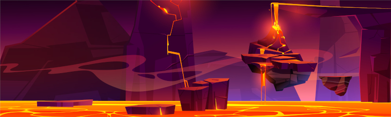

\sinc

# La ira de la diosa

\conc

La diosa Pele que vive en el volcán está enfadada con los habitantes de la isla porque olvidaron poner un tocado de plumas en su última ofrenda.

Pronto recibirá a su hermana Poliʻahu y quiere lucir sus mejores galas durante la estancia de su hermana.

Como diosa del volcán es colérica e irascible y ha decidido mandar sus nieblas a la playa para castigar a sus fieles adoradores de la playa por su altura imperdonable fallo.

\sinc

&nbsp;

## Problemas en Kaona Iole

\conc

Tus riokes estarán en su día a día trabajando según dicte su trasfondo, recolectando cocos, pescando, bailando hula, etc.

Sin previo aviso, el pututu de las mareas sonará con el tono de alerta. Desde el volcán desciende la niebla de Pele y parece mucho más grande que otras veces.

Tus aventureros/as pueden ayudar a evacuar el pueblo, traslado ancianos, reuniendo al ganado o recogiendo equipo y víveres para un par días.

Deberían acabar dentro de la niebla y sufrir sus efectos para que empiecen a probar lo que les espera. Si no entran heroicamente a salvar a alguien de los gases tóxicos, quizás se vean atrapados al tratar de salvar su pellejo.

### La decisión de les kahunas

Los riokes se reunirán en la atalaya que quedará por encima de las nieblas. Tras los primeros instantes de desconcierto, matai Mahuru se reunirá con sus consejeres, les 3 kahunas. Tras varias horas de deliberaciones, Mahuru se acercará a su pueblo y les dirá solemnemente:

```
He consultado a los kahunas y hemos deducido que hemos enfadado a la diosa con nuestros actos. Creemos que debemos buscar y consultar a la añeja Lamor para que nos diga que debemos hacer para recuperar el favor de la diosa. Aquellos y aquellas que sean lo suficientemente valientes para intentar esta gesta que den un paso al frente.
```

Matai Mahuru pedirá voluntarios para cumplir esta gran misión. Si no llega al cupo de 4, uno de les 3 kahunas lanzarán sus caracolas de adivinación y elegirá al resto de tus riokes.

\sp

\sinc

[](https://www.freepik.com/free-vector/sea-deep-light-underwater-surface-cartoon-vector_50076492.htm "Sea deep light underwater surface cartoon vector by upklyak")

&nbsp;

## Buscando a la añeja Lamor

\conc

Tu grupo de riokes deberá prepararse para el viaje. Les darán víveres para ir y volver al cabo este. Les dirán que la añeja Lamor estará en alguna cala, pero no pueden estar seguro de en cuál.

Deberán explorar cada casilla de playa (amarillas) y arrecifes e islotes (azules) a ver si está Lamor en ellas. Necesitarán tablas de surf para las azules, quizás los surfistas se las dejen o tengan que construirse algo.

La ubicación la añeja Lamor no es fija y tus roedores deberán explorar las playas y calas del cabo este de la isla para encontrarla. Deberán llegar hasta una zona de playa y allí explorar esas zonas y tirar en la tabla de encuentros.

|1d6|Encuentro la añeja Lamor|
|---|---|
|1|Algas comestibles (tarjeta de raciones)|
|2|1d4 cangrejos de especies aleatoria|
|3|Un grupo de kiores surfistas que pueden saber algo, la próxima tirada de encuentro pueden repetirla.|
|4|Almejas de excelente calidad (50 ca)|
|5|Halcón marina se lanza sobre ellos|
|6|La añeja Lamor|

\sc

### La añeja Lamor

La añeja Lamor es una gigantesca tortuga laúd de más de 200 años. Ha vivido muchas cosas y sabe muchas cosas, incluso se dice que ya era vieja en tiempos de los ancestros.

Como tortuga ya habla y reacciona muy lentamente, pero es que además está ya muy mayor y cuando se habla con ella habla todavía más lento hasta ser desesperante.

```
Ohhh pequeños riokes, no es la primera ni la última vez que enfadaréis a la diosa Pele y por el cambio de estación creo saber que la ha hecho enfadar. Todos los años entre el kau (verano) y el hooilo (invierno) hacéis una ofrenda a la diosa. Seguramente esa ofrenda la ha ofendido de alguna manera. Seguramente el tocado de plumas no ha sido de su gusto. Deberéis y rápido ascender a su volcán, pedirle perdón y ofrecerle alguna satisfacción.
```

Tras lo cual se sumergerá de nuevo en el agua para seguir con sus cosas de tortugas.

\sp

\sinc

## Camino al volcán

\conc

El camino al volcán desde el cabo este supone atravesar la espesa selva que separa la playa de la falda del volcán. Hay un riachuelo que viene de la montaña y empieza en una cascada. 

Las casillas vacías (sin número) puedes si quieres rellenarlas con las tablas de puntos de interés y las tablas de encuentros, sabiendo que toda esta zona es selva.

Tus riokes **empezarán en la casilla 14** y deberían llegar hasta la **casilla 8 que es la falda del volcán**.

### El Moʻo del río

La selva es recorrida por un riachuelo que empieza en una cascada de las faldas del volcan. Esa cascada y un remanso más adelante del riachuelo lo frecuenta une Moʻo llamada Iaolone que suele hacerse pasar por une belle rioke que se baña desnude en sus aguas.

Gusta de atraer y seducir a riokes a sus aguas y hacerles perder el tiempo. No tiene malas intenciones, pero es muy vanidose y le gusta tener a roedores alagándole y deleitarles con sus encantos.

Si se la encuentran, no les dejará abandonar la casilla donde se encontraron. Deberán **pasar una tirada enfrentada de VOL para salir**. Si fallan la tirada, se quedarán junto a Iaolone. Deberán elaborar algún plan para distraerla o alejarla y poder volver a tirar VOL y escapar.

\sinc

&nbsp;

[](https://www.freepik.com/free-vector/set-turtle-cartoon_20424112.htm "Hell landscape with lava for fantasy game vector by upklyak")

&nbsp;

## El suelo es lava

\conc

El volcán está en plena actividad, el calor el sofocante y mientras estén en el volcán tendrá el estado Cansado a pesar de los descansos. Este descanso se puede acumular a otros descansos provocados por no descansar lo suficientemente bien.

En las zonas grises del mapa puedes usar la tabla de encuentros en el volcán del capítulo de exploración y en las de grieta con lava del centro esta tabla:

\sc

|1d6|Encuentro en la casa de Pele|
|---|---|
|1|Piedras de obsidiana que al tallarse están superafiladas (200 ca)|
|2|Empieza a llover cenizas y no se ve nada|
|3|Un géiser de lava surge delante vuestros, salvación de DES o 1d8 de daño|
|4|El suelo está lleno de agujas de basalto que no permiten correr|
|5|Del suelo sale varios chorros de gas tóxico y corrosivo|
|6|1d4 kupuas rezando a una estatua de un dios desconocido|

\sp

\sinc

## La diosa airada

\conc

La diosa Pele les esperará con un grupo de sirvientes kupuas sentada en un trono de lava incandescente. Al verlos se levantará claramente airada y atronará:

```
Bien, veo que habéis entendido el mensaje y habéis venido a pedir perdón. ¿Vosotros pensáis que este cutre tocado de plumas es digno de mí, vuestra diosa? ¿Acaso queréis convertirme en el hazmerreír de mi familia?
```

Cogerá el tocado que los kiores le ofrecieron con sus manos y en segundos arderá y se convertirá en cenizas. Continuará con su discurso:

```
Si queréis que os perdone, debéis traerme algo que me fue sustraído hace siglos, mi llama, mi joya más preciada. Ese maldito Mausi me la robo para dársela a vuestros antepasados y ahora quiero recuperarla. Y sabed que si no me lo traéis, mi lava convertirá en cenizas vuestro pueblo y ¡¡¡toda la isla!!!
```

Tras esto, un río de lava desbordará el cráter y empezará a bajar el volcán camino a la playa. Puedes darles a entender que tienen un tiempo límite antes de que la lava arrase Kaona Iole, si quieres meter más presión al grupo.

Si intentan discutirle algo solo conseguirán que todo tiemble por su rabia y que les lance una bola de fuego de 1d6 de daño.

Está claro que si desean calmar a la diosa deberán buscar su fuego y devolvérselo.

### La llama de Pele

Mausi robó la llama de Pele y se la dio a los primeros riokes y estos la escondieron en las cuevas de los ancestros. Los ancestros lo consideraban un don y sus espectros harán lo que sea para protegerla, así que no será una tarea fácil.

Toca, pues, descender del volcán y poner rumbo a cabo oeste a las cuevas de los ancestros. Si desean podrán pasar por el campamento temporal a reponer víveres e informar de cómo va todo. La niebla tóxica sigue sin abandonar su pueblo y no han podido volver a sus hogares.

\sinc

&nbsp;

## Buscando la llama

\conc

El cabo oeste es un entorno conocido por tus aventureros, así que viajar hasta allí será fácil.

### Adentrándose en la cueva de los ancestros

Los primeros niveles de las cuevas también son conocidos, allí se refugian cuando pasan tifones por el islote, pero nadie se adentran en las cuevas.

Tus riokes deberán sacar sus antorchas y adentrarse en las cavernas interiores donde un mundo de maravillas les esperan.

Las cuevas de los ancestros están en ruinas, pero aun así siguen siendo impresionantes y hay todavía ciertas cosas que funcionan como parte de la iluminación bioluminiscente por hongos o algunos elementos como elevadores con contrapesos.

\sp

Imagina que las ruinas de los ancestros tienen un estilo a como te imaginarías los restos de la Atlántida, altos edificios con un cierto toque entre extraterrestre y griego clásico.

En la fogata del último descanso, se les aparecerá Pele para avisarles de que seguramente su llama esté dentro de la tumba de Mausi o alguno de sus descendientes. Deberían buscar la Cripta de los héroes y heroínas, el lugar donde los ancestros enteraban a personajes importantes.

### La Cripta de los héroes y heroínas

XXX

Se puede acceder y escapar de la Cripta de los héroes y heroínas desde dos entradas (7).

#### 1 Sala principal

XXX

#### 2 Capilla

XXX

#### 3 Receptorio

XXX

#### 4 Nichos y túmulos

XXX

#### 5 Nichos y túmulos

XXX

#### 6 Nichos y túmulos

XXX

#### 7 Accesos a las cuevas

XXX

\sp

\sinc

## De vuelta al volcán

\conc

La ira de Pele ha ido aumentando y con ello la orografía del volcán ha tenido unos cambios drásticos. Si quieres alargar la aventura puedes usar el mapa de la cima del volcán y tirar nuevos puntos de interés en todas las casillas. 

Lo único que no cambiará será el punto de entrada y la casilla donde está la diosa Pele

Si no te interesa puede pasar directamente al siguiente apartado. Como otras veces, pueden pasar por el campamento provisional y aprovisionarse de víveres y dar parte de sus avances. También puede reclutar ayuda, hay riokes jóvenes deseosos de aventuras.

\sinc

&nbsp;

## Apaciguando a la diosa

\conc

El final se acerca, solo queda un último paso, entregar la llama a Pele y podrán volver a su pueblo con su familia y amistades.

### ¡Emboscada!

Antes de llegar ante la diosa Pele, un grupo de kupua del Fuego Purificador que quiere ver la isla destruida y convertida en un infierno tenderán una emboscada final a tu grupo de riokes.

Tantos Kupuas como riokes en tu grupo, 

### Los dones de la diosa

Tras recuperar su fuego y ver qué sus adoradores la respetan y temen y harían lo que sea por satisfacerla, se calmará y volverá a ser una diosa racional y tranquila. Se colocará la llama como un colgante y se sentará elegantemente sobre su trono de lava líquida.

La diosa ofrecerá a tus riokes una serie de tesoros por devolverle la llama. Para generar el tesoro deberás tirar un d20 por cada rioke que haya participado en la aventura. Uno de los d20 debes cambiarlo por un 1 directo, de forma que el tesoro tenga un don divino mínimo. Si al tirar el d6 del don divino, sale un 6 (Llama de Pele) vuelve a tirar.

Justo cuando vaya a irse verán como la temperatura baja drásticamente y del cielo descenderá lentamente como la nieve la diosa de las nieves, Poliʻahu.

\sinc

&nbsp;

## Recibimiento como héroes y heroínas

\conc

Tus riokes serán recibidos como si fueran el propio Mausi, con collares eli, con ricos manjares, con agua de coco y con bailes de bienvenida hula en los que deberán participar.

Los cuentacuentos estarán ansiosos de escuchar su epopeya para poder añadirlas en su repertorio, añadiendo más épica y magia a los relatos, ya de por sí increíbles.

Puede darles **títulos específicos según sus hazañas** en la aventura, como «mataserpientes» o «buscatesoros», si lo consideras apropiado.

\sp

Si lo deseas, podrían otorgarles algún tipo de **licencia para montar su choza de aventureros** donde vivir y guardar su equipo, tanto en la playa como en cualquier de las otras localizaciones de la isla, incluso el cabo oeste, desde donde podrían explorar las cuevas de los ancestros.

\sc

> Tus riokes han explotado la parte sur de la isla (la playa y la selva hasta la falda del volcán), el cabo este y el cabo oeste y la cara sur y la cima del volcán. Pero todavía queda la zona norte con su parte del volcán, de la selva y sus acantilados y calas. Además, también tiene el misterioso islote de Hāʻupu que solo visitan les 3 kahunas.
