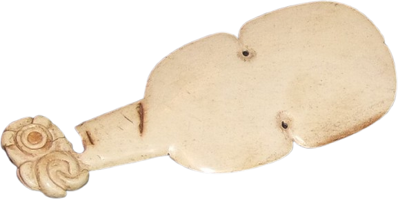
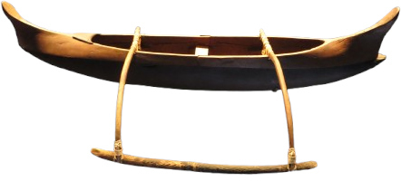

# Equipo

Te presentamos toda una serie de nuevos objetos para usar en tus partidas en _Hua Tarakona_. Con este equipo tus _hauka_ podrá emprender sus viajes y enfrentarse a todos los problemas y desafíos que como DJ les pongas por delante. 

\sinc

&nbsp;

## Materiales

\conc

Un punto importante del equipo es que el **metal es conocido** por las gentes de las islas, pero **es escaso y no son hábiles forjando** el metal. Sin embargo, sí son buenos trabajando la madera y trenzando las hojas de palma.

La **madera es un elemento fundamental** en la vida de las islas, es abundante, fácil de trabajar, duradera, resistente y flota. Por eso encontrarás bastantes artesanos especializados en el trabajo de la madera, no deberías de hablar de carpinteros en general, sino de ebanistas, carpinteros navales, constructores de chozas, tallistas, etc.

Lo mismo pasa con la **hoja de palma**, que también encontramos en varias artesanías, como cesteros, techadores, fabricantes de velas, etc. que la transforman en diferentes elementos como cestas, velas de barco, sombreros, cuerdas y correas, etc.

El equipo típico de metal, como una cantimplora, tendrá su contrapartida en madera y productos naturales, por ejemplo, una calabaza vaciada, secada y pulida con un corcho puede ser un perfecto recipiente para el agua.  

Debido a la intensa actividad volcánica de las islas, los materiales como la obsidiana o el basalto son muy abundantes y los artesanos isleños también son diestros en su manufactura en forma de utensilios y armas.

La **lana es desconocida**, sin embargo, las **prendas de plumas son muy comunes** y normalmente asociadas a personas de alto standing y poder adquisitivo. Los gorros y las capas de tejidas con vistosos colores de plumas de aves selváticas son un signo de distinción entre los isleños.

Por último, los metales como el **Oricalco** y el **Mythril** (ambas cualidades) **no pueden usarse** en esta ambientación. Quizas puedas usar materiales parecidos como «hueso de ancestros» o «de ballena». Los huesos de ancestros, como el anzuelo de Maui, tienen propiedades mágicas y los objetos hechos con este material pueden hacer cosas fabulosas.

Lo mismo pasa con los productos de la ballena, salvo que en este caso y por la veneración hacia las ballenas, suelen ser regalos que estas hacen a los humanos.

\sp
 
\sinc

## Tecnología

\conc

El nivel tecnológico que tu mesa puede esperar en esta ambientación es mucho menor que la podrían encontrar en el manual básico. No hay brújulas, metalurgia, el cristal y la óptica, la moneda, alquimia avanzada, etc.

Puede parecer que estamos hablando de una cultura que está en la Edad de piedra, aunque realmente no lo está. Son pueblos perfectamente adaptados a su entorno, que no han necesitado, por ejemplo, desarrollar la metalurgia, pero que son grandísimos navegantes que recorren miles y miles de millas por el vasto océano, mientras otras culturas no sabían qué había al otro lado de su pequeño mar.

XXX

Estas diferencias tecnológicas pueden ser una ventaja interesante para ti como DJ, ya que puedes sacar de manera sencilla objetos más avanzados tecnológicamente y ofrecerlos como objetos mágicos. Una brújula es un elemento desconocido en las islas, pero algún kahuna podría haber inventado y regalárselo a tus _hauka_. En juego no es una gran ventaja, pero seguramente que podría ser un buen _macguffin_ sobre el que basara una aventura.

De todas formas, si no quieres complicarte, puedes dejar el equipo normal de juegos de fantasía medieval y darle una estética más natural hechos de madera, hojas de palma, coco, barro cocido, huesos de animales, pieles, etc.

\sp

\sinc

## Armas

\conc

Tus _hauka_ disponen de una gran variedad de lanzas de todos los tamaños (pequeñas, medidas y pesadas) y tanto de cuerpo a cuerpo como a distancia.

Las armas, sobre todo las grandes de madera, están profusamente decoradas con motivos geométricos y marítimos, convirtiéndolas muchas veces en auténticas obras de arte. También es normal que tengan elementos decorativos como, penachos de plumas u hojas trenzadas de vivos colores.

### Hojas cortas

Las armas de filo cortas como cuchillos o dagas no son muy comunes. En su lugar, tenemos pequeños garrotes de maderas duras como la koa con pinchos o dientes de tiburón. También son comunes armas de madera en forma de nudilleras con diferentes accesorios como grandes puntas afiladas o dientes de escualo dispuestos como una sierra.

Otra opción, son los huesos de ballena tallados que permiten crear hojas ligeras y bastante afiladas para usarla en el día a día y en combate.

\sc

### Hojas

**Remo:** Estas contundentes herramientas de madera tienen lados afilados en la parte de la pala y buenos mangos para asirlos bien y dar golpes contundentes, así que son unos utensilios muy útiles tanto para navegar como para combatir.

**Kotiate:** Es una maza corta normalmente hueso de ballena. Parece una especie de evolución del remo al que se le hicieron modificaciones para ser más mortal.

### Armas de Asta

**_Tao_:** Lanza de madera normalmente con una punta hecha del pincho de un pez espada o de los afilados huesos de la cola de una raya.

\sp

**Horca:** Este utensilio perfecto para la pesca de peces y crustáceos puede usarse como una eficaz arma de combate.

### Hachas

**_Leiomano_:** Esta arma similar a una pala de jugar a pelota tiene el borde lleno de pequeños dientes de tiburón insertados.

### Arcos y ondas

Los isleños son diestros arqueros y honderos. Como dato importante diremos que la onda (Maʻa) es usada como arma de guerra, mientras que el arco y las flechas se reservan normalmente para la caza.

A nivel de juego, tanto el arco como la honda son exactamente, solo son diferentes a nivel estético.

\sinc

&nbsp;

## Armaduras y escudos

\conc

Los combatientes en _Hua Tarakona_ no llegan pesadas armaduras de metal. Como ya sabemos no son duchos en la forja del metal, pero además las armaduras son un lastre tremendo en el mar y el calor hace que no se puedan llevar mucho tiempo seguido sin acabar extenuado.

Aun así, como buenos tejedores de **hojas de palma**, saben hacer buenas **protecciones frescas y ligeras**, que les dan cierta protección en el combate.

Tradicionalmente, los combatientes **no han usado escudos**, aun así tus _hauka_ bien podrían hacer algún escudo ligero de madera y hojas de palma trenzadas.

### Protecciones de palma trenzada (ligera)

Estas protecciones están hechas de varias capas de hojas de palma trenzadas. Se crean protecciones para diferentes partes del cuerpo. No son especialmente resistentes, pero son baratas, fáciles de fabricar, ligeras y flexibles

> En esta ambientación, salvo situaciones excepcionales, tus _hauka_ no deberían poseer armaduras media y pesadas y escudos pesados.

\sp

\sinc

## Plantas medicinales

\conc

Los _kahunas_ de cada asentamiento dominan la búsqueda de plantas medicinales y su uso curativo. Pueden hacer infusiones, emplastos y cataplasmas, cremas o prepararlas para su consumo.

La selva es el lugar donde se encuentran la mayoría de las hierbas medicinales, pero también recorren las playas y acantilados en busca de algas con propiedades medicinales.

### Kava

La _kava_ es una planta de la que se saca una bebida con efectos psicoactivos. Produce relajación muscular, somnolencia y ganas de hablar. Se ha utilizado tradicionalmente para tratar para aliviar infecciones, dolores, estrés e insomnio. La raíz se muele con un trozo de coral y se le añade agua fría para poder beberla.

\sinc

&nbsp;

## Objetos comunes

\conc

Los artesanos isleños son capaces de crear desde toscas y sencillas herramientas y útiles cotidianos a bellas y artísticas obras de arte. Muchas de estas piezas se caracterizan por tener diseños orgánicos aprovechando la forma de los materiales con que se han construido (madera, piedra, fibras vegetales) y se suelen decorar con diseños geométricos o figuras tribales de animales, personas, dioses y monstruos.

### Konane

El _konane_ es una juego de mesa, muy parecido a las damas o el go. El _konane_ se juega utilizando pequeños trozos de coral blanco y lava negra sobre una gran roca tallada y o un tablón de madera que funcionaba como tablero y mesa. Se considera un juego de roedores inteligentes y las competiciones son de muy alto nivel.

De normal, un _konane_ de viaje tiene tamaño 3, pero de normal los que se tienen en las casas y son de mejor calidad ocupan tamaño 5.

### Herramientas de tatuaje

Las herramientas de tatuaje consisten en un peine con dientes de hueso o concha de tortuga unidos a un mango de madera. Los dientes estaban empapados en tinta a base de carbón diluido en aceite o agua. El peine se golpean con un palo de madera para pinchar la piel continuamente y meter la tinta en su interior.

\sp

Las herramientas de tatuaje ni se compran ni se venden, se pasan de maestro a aprendiz y se aprende a fabricarlas como parte del entrenamiento de tatuador.

### Tambor de calabaza Ipu

Este tambor hecho con calabazas vaciadas, secadas y juntadas con una cuerda de fibras de coco, sirve para marcar el ritmo de los bailes _hula_. La superficie se pule con arena y como es muy frágil no se graba nada en su superficie. En su lugar se cubren con una red y se decora la red con coloridos elementos florales.

\sinc

&nbsp;

## Embarcaciones

\conc

Los isleños son increíbles navegantes. Llevan el mar en la sangre y este no tiene secretos para ellos. Con ellas pueden viajar cientos de kilómetros familias enteras con todas sus pertenencias y animales de granja para establecerse en una nueva isla.

Sus embarcaciones pueden parecer frágiles y arcaicas, pero están perfectamente adaptadas a su mar y su meteorología. Poe ejemplo, tras una terrible tormenta, es muy fácil la tripulación parar en alguna pequeña isla y con unas herramientas mínimas hacer las reparaciones necesarias para poder continuar su travesía. Naves mucho más modernas y complejas tendrían que estar semanas carenando y en diques secos para hacer las reparaciones.

Otra característica importante es que estas embarcaciones no viajan solas, suelen hacerlo en convoyes donde se ayudan entre ellas en todo lo que pueden. Si una tiene problema el resto pueden prestar ayuda y si alguna está a punto de hundirse, sus tripulantes se pueden trasladarse a otras embarcaciones y continuar el viaje.

### Canoa

Esta embarcación tallada del tronco de un árbol, permite una tripulación de 3 _hauka_, dos remando más un tercer pasajero.

Puedes ser muy simples o estar profusamente decoradas con motivos vegetales, animales, geométricos o mitológicos. Es el medio de transporte principal y sirve tanto en el mar como en los ríos.

### Catamarán y canoa multicasco

Estos navíos se caracterizan por tener dos o más cascos paralelos y de la misma longitud. Los cascos están unidos por troncos que también soporta el palo del velamen. 

\sp

La cubierta se crea con redes y tablas sobre los cascos y los troncos.

Es el navío perfecto para viajes largos entre islas y para pesca de altura, ya que son rápidos, estables y de poco calado para evitar los arrecifes de corral. Además, tienen una gran cantidad de espacio habitable donde pueden estar sus tripulantes y su carga.

Según el tamaño, podría permitir desde 4 a 20 personas con su equipaje y agua y comida para un largo viaje. De hecho, son los navíos con los que los humanos han ido explorando todas las islas del Pacífico.

### Tabla de surf

Estas tablas de madera pulida se deslizan usando la fuerza motriz de su tripulante o la fuerza de las olas. No son fáciles de maniobrar y se necesitan años de práctica poder usarlas y hacer las acrobacias que algunos consiguen hacer. Permite una tripulación de 1 _hauka_.

\sinc

&nbsp;

## Ropas y calzado

\conc

Las ropas en las islas son ligeras, frescas y muy coloridas con motivos florales, tribales y geométricos. Los motivos suelen ser típicos de una comunidad o isla y puedes reconocerla a la gente por sus vestimentas, pero a no es una ciencia exacta y hay modas que viajan por todas las islas.

Las ropas de abrigo son muy poco comunes, recuerda que las temperaturas nunca bajan de 20 °C, salvo en los picos nevados de algunas montañas. Pero la ropa contra el viento y la lluvia es bastante común.

Todo el calzado se reduce a sandalias y chanclas, normalmente de hoja de palma trenzada. No hay necesidad de calzado que proteja del frío y el agua. Además, en ambientes marinos y metiéndose mucho en el agua, el calzado ligero y barato es mucho más práctico.

\sinc

&nbsp;

## Útiles de pesca

\conc

En las islas de archipiélago la pesca es una de las formas más comunes de conseguir alimento, pero es algo más, para mucha gente es una parte importante de su vida.

Las técnicas de pesca son primitivas, pero consiguen el suficiente alimento para alimentar a las comunidades sin agotar los bancos de peces.

### Redes

Hechas de cuerdas de fibra de coco, son capaces de cubrir varios metros cuadrados y de soportar bastantes kilos de pesca antes de romperse.

\sp

La técnica más común de pesca es usando redes y recogiéndolas, bien desde la orilla o desde canoas. se pesca mucho, pero sin control y a veces puedes sacar del agua problemas en vez de peces.

El principal problema es que son bastante frágiles y exigen reparaciones constantes. No es raro encontrarse a gente en las playas remendando los agujeros que los peces han hecho en sus redes.

### Aparejos

Los aparejos constan de varios elementos, anzuelos de hueso, boyas de madera y cuerda resistente tejida con fibra de coco y un invento con el soltar o recoger el sedal. No es tan eficaz como las redes, pero permite capturar mayores piezas que de otra manera romperían la red y escaparían. 

Como con la red, se puede usar desde la orilla o desde una embarcación y en cada sitio se obtienen piezas diferentes.

Mucha gente se toma esta forma de pesca como una especie de meditación y descanso sin que les importe realmente las capturas y otras, en el otro extremo, lo han convertido en una competición por ver quien coge la pieza más grande y preciada.

### Tridente y lanza

Esta sencilla herramienta permite cazar peces y pequeños crustáceos en las orillas del mar de una forma bastante eficaz, pero no sirve de nada dentro del agua o sumergido.

En caso de necesidad se podría usar de arma, pero no está pensada para ser utilizada en combate, sino para pescar, por lo que no debería ni ser muy útil, ni hace mucho daño, ni tener mucha resistencia.

\sinc

&nbsp;

## Moneda y trueque

\conc

En _Hua Tarakona_ no existen ni las monedas, ni los billetes de curso legal, ni tampoco letras de cambio, pagarés y otras figuras similares. Tampoco son abundantes los metales y las piedras preciosas. Así que **el trueque impera en todo el archipiélago**. 

Cada comunidad tiene ya establecidas unas tasas de cambio de manera que, por ejemplo, lo normal es conseguir 1 docena de huevos por 3 kilos de cocos.

Estas tasas son más o menos universales. Igual en una zona con muchas palmeras cocoteras tengas que dar 3 kilos y medio o durante la anidación de las aves tengas que poner 1 docena y media de huevos. Pero en general, es una diferencia despreciable de la que no deberías preocuparte.

\sp

Todo esto supone que tus _hauka_ viajar con sus mochilas y bolsas llenas de objetos de artesanía y materias primas para intercambiar. 

Puede haber eventos que echen a perder los materiales que van a intercambiar, como que se moje una mochila y se eche a perder el grano de arroz que llevaban para trocar. Pero este tipo de cosas no deberían ser normales, solo deberían ser motores de aventura. Quizás sus posesiones se han podrido al estar muchos días perdidos en un húmedo pantano y tengan que aceptar algún trabajo para conseguir el dinero perdido.

A nivel de juego el dinero va a funcionar igual que en el manual básico salvo por dos excepciones. Primero, **el dinero va a suponer peso extra** que tus _hauka_ van a tener que tener en cuenta al calcular su carga.

**Cada 1.000 mo va a suponer 1 de tamaño** que deberás descomponer en objetos de tamaño 1, 3 o 5. De forma que si tienen 14.000 mo, deberán cargar, por ejemplo, con dos objetos grandes, (tamaño 5), uno mediano (tamaño 3) y uno pequeño (tamaño 1).

Los objetos para trocar solo cuentan como objetos cargados, nunca, salvo excepciones como joyas y abalorios caros, podrían tomarse como objetos equipados. Por ejemplo, las perlas sí son cómodas de transportar y aceptadas en todas partes. Podrían llevarse un par de miles de monedas de oro en un colgante y tomarse como un objeto equipado.

En caso de llevarlo como objetos cargados, el peso cambia de manera que ocupan 1 de tamaño por cada 5.000 mo. Quizás puedan aligerar el peso bastante, cambiando sus posesiones por perlas, pero, por ejemplo, no podrán comprar con ellas cosas baratas como unas raciones de viaje o un sombrero de palma.

La otra excepción a las reglas básicas que puedes aplicar es que **los objetos al venderse no pierden la mitad de su valor**. Es normal intercambiar objetos de segunda mano mientras estén en buenas condiciones, así que no tienen pérdida de valor al venderlas.

### Tabla de precios especiales

|Objeto|Precio|
|---|---|
|Konane|500|
|Herramientas de tatuaje|1.500|
|Tambor de calabaza Ipu|400|
|Red de pesca|200|
|Aparejo|30|
|Tridente de pesca|100|
|Canoa|3.000|
|Tabla de surf|500|
|Canoa multicasco|5.000|
|Catamarán|90.000|

\sp

&nbsp;