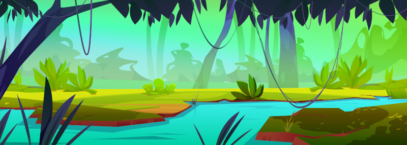

# Viajar

Viajar es el _leitmotiv_ de las aventuras de Ryuutama y también lo es el de esta ambientación. Pero en «Makai Mauka» a ser un mundo que es un gigantesco archipiélago el viajar se complica, ya que exigirá muchas veces trayectos por mar. Este tipo de viajes no están reflejados en las reglas del manual básico y es por ello que se han creado reglas específicas para estas situaciones. 

\sinc

&nbsp;

## Animales acompañantes

\conc

La presencia de grandes masas de agua en _Hua Tarakona_ hace que, en el caso de los animales acompañantes, debemos dividirlos en animales terrestres y acuáticos a la hora de establecer como se alimentan y viajan o qué tipos de animales pueden llevar tus _hauka_.

### Terrestres

No existen grandes animales herbívoros que sirvan de carga o de monta como caballos, burros o alpacas. Pero si hay grandes **cerdos salvajes** domesticados a los que pueden ponerse alforjas para transportar equipo y mercancías.

Con los siglos, se han seleccionado y domesticado las **iguanas de mayor tamaño** por su carne y sus huevos. Hoy en día las iguanas gigantes llegan a medir a 2 metros y también se usan como animales de carga, aunque no pueden ser utilizados para montar.

Un proceso muy parecido lo tuvieron las **tortugas terrestres** (y también marinas). Se empezaron a domesticar por su carne, sus huevos y su caparazón y hoy en día se han convertido en animales de carga que permiten con una especie de silla de madera que se ajusta a su caparazón transportar cargas pesadas. No son los animales más rápidos, pero son fuertes, dóciles, resistentes y no escapan ante depredadores, solo se refugian en sus caparazones.

Se sabe que en islas recónditas del archipiélago sus habitantes usan **cangrejos rojos gigantes** para transportar carga, pero no es un sistema muy eficiente de las zonas donde habitan los cangrejos rojos. 

Reglas para los animales en entornos marinos:

* Los __animales terrestres gastan 1 de comida y agua al día en terrenos acuáticos__ como lo hacen en Desiertos o Alta Montaña.
* Saben nadar, pero no pueden hacerlo durante mucho tiempo, quizas lo suficiente para atravesar un río llegar desde la playa a un islote cercano. Por ello, como tus _hauka_, solo podrán __viajar por mar en embarcaciones__.

### Acuáticos

Dentro de los animales acuáticos que pueden acompañarte tenemos:

\sp

* **Delfines.** Bastante inteligentes y rápidos, pero no siempre dispuestos a trabajar, prefieren jugar y holgazanear.
* **Tortugas marinas.** Debido a su longevidad hay tortugas que han sido acompañantes de varias generaciones de isleños.
* **Tiburones «herbívoros».** Hablamos de grandes tiburones no agresivos. No se alimentan cazando otros peces, sino que comen plancton y otros pequeños crustáceos.   

Reglas para los animales acuáticos

* Estos animales **no pueden ser montados**, pero puedes agarrarte a ellos para que te lleven en trayectos cortos.
* Pueden **tirar de una embarcación** como canoas y catamaranes permitiendo llevar más carga o ir más rápido, incluso cuando hay «calma chicha».
* Dentro del agua los animales acuáticos **no generan gastos de comida y agua**. Si acaso, en situaciones especiales como mares muertos podrían suponer un gasto en comida.

Aunque algunos de los animales anteriores son anfibios, normalmente tendrán un ambiente al que estarán mejor adaptados. Por ejemplo, las tortugas marinas salen a la playa a desovar, pero no es su medio natural, por lo que son lentas y torpes.

\sinc

&nbsp;

## Terrenos

\conc

Las islas de _Hua Tarakona_ suponen nuevos tipos de terrenos como playas o volcanes, pero teniendo en cuenta que los viajes también se hacen por mar, tenemos nuevos terrenos acuáticos o masas de aguas con algunas reglas especiales. 

Hay una serie de terrenos que no deberían entrar en tus aventuras, pero eres libre de meterlos si lo deseas. Ten en cuenta que hay miles de islas en _Hua Tarakona_ y puede haber todo de tipo de terrenos.

* **Desiertos, pedregales y yermos:** Todos son sustituidos por terrenos muy parecidos, los campos de lava y los volcanes.
* **Bosques, bosques primarios y junglas:** Son sustituidos por selvas y selvas vírgenes.
* **Montañas:** Las montañas, por su origen volcánico, son muy peligrosas y no son fáciles de atravesar. 
* **Alta montaña:** No hay grandes montañas ni cordilleras, y aunque algunas montañas son altas y pueden tener nieve, lo normal es rodear las islas por la costa.  

Las praderas, las colinas y los pantanos se quedan como están.

\sp

\sinc

\conc

### Acantilados litorales

Las zonas de la costa que no son playas suelen ser acantilados poblados de aves marinas con las olas chocando violentamente contra ellos. 

Con las mareas bajas suelen descubrirse cuevas y zonas con charcas donde pescar y recolectar crustáceos y bivalvos en las charcas que quedan al retirarse la marea.

Pero hay que tener cuidado y vigilar las mareas o puedes quedarte encerrado o incluso ahogarte porque ha subido la marea y las olas te empujen a las afiladas rocas del acantilado.

### Campos de lava

Estos terrenos son lugares en los que hace años, si no siglos o milenios, paso una lengua de lava y cuando se solidificó se convirtió en un extraño lugar con estructuras de formas insólitas. Las figuras que ha dejado la lava pueden crear enrevesados laberintos de piedra, dunas de roca, etc.

Con los años la naturaleza ha ido tomando el lugar. Ya se empieza a ver flora y fauna, aunque normalmente han tomado exóticas vías de evolución para adaptarse a este terreno.

### Riachuelos

Debido a la orografía de las islas, los riachuelos son la manera más rápida de llegar desde la costa hasta las montañas. Seguir el cauce de los riachuelos es una senda fácil y normalmente recta.

El único problema es salvar los saltos de agua. Mientras más cerca se está de la cima de las montañas más grandes suelen ser. Esos saltos de agua son peligroso tanto al bajarlos como al subirlos.

\sp

\sinc

\conc

### Montaña

No hay grandes montañas en las islas de _Hua Tarakona_, pero aun así son sitios peligrosos debido a su origen volcánico. Puede haber abruptos precipicios y estrechos pasos originados por temblores, muros de lava solidificada o laderas llenas de puntiagudas piedras basálticas.

En los más altos puede haber incluso nieve en abundancia en invierno y neveros el resto del año. No son extrañas historias de valientes _hauka_ que emprender un viaje para conocer la nieve y ganarse la gracia de Poliʻahu, la diosa de las cimas nieves.

### Playa

Las playas de las islas son una maravilla para la vista. Largas y de arena fina con palmeras cocoteras donde las que conseguir alimento y bebida es bastante fácil, pero también otros materiales como hojas de palma para hacer tejidos, algas para medicinas o espinas y dientes de tiburón para hacer armas y anzuelos.

La mayoría de las comunidades (poblados, pueblos e incluso ciudades) se encuentran cerca de la playa, especialmente si están guarecidas de las corrientes y el oleaje.  

### Selva/Selva virgen

Los interiores de la mayoría de las islas de _Hua Tarakona_ son selvas, áreas boscosas llenas de altos árboles y mucha vegetación por debajo de estos. Se pueden sacar importantes recursos de todo tipo de las selvas, pero hay que ser cuidadosos porque siempre hay algún peligro.

En las zonas interiores, los árboles son tan frondosos que la luz del sol casi no entra. Estas partes no suelen ser visitadas por los isleños, incluso hay partes en las que los humanos no han pisado. Estas selvas vírgenes pueden suponer grandes peligros en forma de bestias salvajes, trampas y enfermedades, pero esconden también recompensas en forma de tesoros escondidos en templos perdidos cubiertos de vegetación.

\sp

### Volcán/Volcán activo

La inmensa mayoría de las islas de _Hua Tarakona_ son de origen volcánico y bastantes de ellas tienen un volcán, pero muy pocas de ellas tienen un volcán activo. 

Moverse en una zona volcánica es muy complicado, no hay casi recursos y los pocos que puedas encontrar pueden ser peligrosos, pero se vuelve mucho peor cuando el volcán está activo. 

Activo supone que un volcán puede expulsar gases nocivos, hay temblores y corrimientos de tierras e incluso alguna pequeña grieta llena de borboteante lava. Si el volcán está expulsando ríos de lava, gases sulfúricos y piroclastos es imposible viajar a través de él y seguramente acabarás muerto si intentas moverte por esa zona.

### Tabla de nuevos terrenos

|Terreno|Dificultad|
|---|---|
|Cauce de un río, Playa|6|
|Selva, Acantilados litorales|8|
|Montaña, Selva profunda|10|
|Volcán|12|
|Volcán activo|14|

\sinc

&nbsp;

## Masas de agua

\conc

El mar siempre debería estar presente en las aventuras. Es una fuente interesante de aventuras tanto por peligroso e inexplorado como por las cosas que puede dejar la marea en la playa. Además, es un entorno cambiante y lo que ayer estaba en un lugar puede haber desaparecido la siguiente vez.

Viajar por el mar es algo que el manual Básico no se ve reflejado, pero en un gran archipiélago como el de _Hua Tarakona_ los viajes a en barco bordeando las islas o en abierto para moverte de grupo de islas en grupo de islas son muy comunes. Es por ello que tenemos nuevos terrenos, en realidad masas de agua, para estos tipos de viajes.

### Arrecifes

Los arrecifes son rocas, bancos de arena, o cualquier otro elemento que yace a pocos metros de la superficie o incluso sobre la superficie del agua durante marea baja. Los arrecifes son un gran peligro para las embarcaciones, ya que pueden encallar o destrozarlas, pero también son una buena defensa natural contra intrusos que lleguen por mar.

Cuando hablamos de arrecifes no nos referimos a una masa de arrecifes sino a zonas grandes del mar donde hay gran cantidad de arrecifes.

\sp

\sinc

\conc

Los arrecifes suelen estar cerca de la costa, ya que en mar abierto la profundidad es demasiada para que las rocas del fondo sean un problema. No es raro encontrarse zonas de arrecifes que rodean total o parcialmente una isla o islote.

### Mar abierto

Una vez dejas de ver tierra firme entras en la gran nada que significa el mar abierto, solo hay agua a tu alrededor y eso será lo único que verás en día. Aquí tus _hauka_ están solos a merced del agua y del viento. No hay ayuda posible y los encuentros con otras embarcaciones pueden ser peligrosas. 

Las cosas pueden cambiar drásticamente en mar abierto pasando de estar el agua como plato sin pizca de aire a vientos fuertísimos, lluvia torrencial y olas terribles. 

No querrás estar en mar abierto una noche de tormenta, porque normalmente

La gente del mar de _Hua Tarakona_ no suelen adentrarse en mar abierto, prefieren ir de isla en isla, ya que aunque sea más lento es mucho más seguro.

### Costa

Mientras veas tierra podemos hablar de que estás en la costa y en caso de peligro podrás refugiarte en tierra firme.

La costa puede ser abierta con lo que todo el oleaje del mar os den de lleno y los lance contra las rocas de la costa o de costa cubierta, zonas protegidas del oleaje donde poder fondear durante la tormenta de forma segura.

### Río navegable

En las islas más grandes hay ríos navegables que los locales han aprendido a surcar con sus canoas. Estos ríos suelen ser tranquilos y fáciles de navegar. 

Las comunidades del interior suelen crecer alrededor de estos ríos tanto por los recursos que ofrecen, como por las posibilidades de transporte y comunicación que ofrecen.

Cuando el río deja de ser navegable, es porque se ha convertido en riachuelos, un terreno muy distintos en el que tus canoas no valen para nada.

\sp

### Eventos durante el viaje en el mar

En el mar pueden pasar de muchas cosas que escapan al control de los _hauka_. Desde días sin viento que exigen sacar los remos y ponerse a remar a caídas y golpes al moverse por la embarcación. 

La siguiente tabla muestra situaciones y condiciones que como DJ puedes usar en las travesías para darles variedad y emoción.

|Evento|Condiciones|
|---|---|
|Golpes contra los aparejos o el mástil|Herido (４)|
|Oleaje|Mareado (４)|
|Comida o bebida en mal estado|Envenenado (４)|
|Insolación|Enfermo (４)|
|Viento de frente que hace más difícil la navegación|Cansado (４)|
|Caída desde mástil o el velamen|Herido (6)|
|Gran oleaje|Mareado (6)|
|Picadura venenosa de medusa o mantarraya|Envenenado (6)|
|Bebida en mal estado|Enfermo (6)|
|Corrientes fuertes en contra|Cansado (6)|

\sc

### Tabla de masas de agua

|Masa de agua|Dificultad|
|---|---|
|Río navegable|6|
|Costa cubierta|8|
|Costa expuesta|10|
|Arrecifes|12|
|Mar abierto|14|

### Reglas para los viajes

Los viajes por mar son muy diferentes a los viajes por tierra que propone el manual básico. Es por ello que tenemos reglas especiales que puedes aplicar en tus aventuras en _Hua Tarakona_ o en tus propias aventuras cuando viajes por mar.

#### Labores en el barco (Marcha)

La tirada de Marcha se convierte en la tirada de Labores del barco. Hablamos desde pilotar y soltar y recoger vela, a achicar agua o limpiar la cubierta. 

Una pifia por parte de alguno de los tripulantes supone problemas que se va a arrastrar la embarcación. Es por ello que **una pifia en esta tirada supone un -1 a la tirada de Fondear**.

Esta tirada **solo tienen que hacerlas las personas que hagan alguna labor en el barco**, los pasajeros no tienen que hacerla, ya que no están haciendo un esfuerzo real para mantener el barco a flote y en movimiento. 

\sp

#### Fondear (Acampar)

La tirada de Acampar se convierte en la tirada de Fondear. No es lo mismo fondear en una playa protegido del oleaje (Costa cubierta) a hacerlo en alta mar a merced de las olas y el viento. La tirada de Fondear deben hacerla por lo menos dos tripulantes y pueden ayudarles otros dos.

El resultado final es la media de las dos tiradas, pero si hay una pifia o un crítico se lo quedan directamente. En caso de salir un crítico y una pifia, gana el crítico.

Pasar muchos días en el mar sin acercarse a la costa complica la navegación, asi que cada 3 días en mar abierto la tirada de Fondear obtiene un -1. Si vuelven a tocar la costa el penalizador desaparece. Por ejemplo, si se tiran 7 días en alta más el séptimo día tendrán un -2, que desaparecerá al acercarse a tierra.

#### Atracar y desembarcar

El paso del mar a la tierra solo se puede hacer por zonas de playa. Hacerlo por zonas de acantilado exigirá unas buenas tiradas de navegación y/o escalada. 

#### Volver sobre tus pasos en el mar

La opción de volver sobre tus pasos no sirve en mar abierto. Las travesías marítimas no siguen senderos, ni caminos, de hecho, no hay una ruta precisa prefijada. La tripulación se guía por el sol y las estrellas para seguir una ruta marítima más o menos amplia. Sin embargo en el resto de masas de aguas esta opción es perfectamente posible.

#### Movimiento

Sobre las velocidades, **en un día de buen tiempo** y con viento un catamarán podría **recorrer 60 km, es decir 2 casillas**, pero si no hay buen tiempo, solo 30 km. En casos de que **no haya viento, no avanzará nada** a no ser que se saquen los **remos con lo que avanzarán 30 km (1 casilla)**, con lo que al día siguiente estarán bastante **cansados (4)**.

En caso de **tormenta no podrán avanzar nada**, tendrán suficiente con mantenerse a flote y pasar la tormenta. 

Pasar un día entero luchando contra la tormenta, mojado y sin poder descansar ni comer supone un gran esfuerzo, por lo que tras la tormenta estarán tremendamente **cansados (6)**.

En las zonas de **arrecifes deberán recoger la velas y ponerse a remar** para tener más control de la navegación y no encallar en las rocas. En un día solo se podrá atravesar una casilla de arrecifes y además se acabará **cansado (4)**.

### Precios de trayectos en barco

Tus _hauka_ no necesitan siempre comprar un barco y lanzarse al mar con él, también puedo contratar a un capitán con barco y tripulación y hacer un viaje por el mar, pero tiene un precio y no es barato. Los precios son por casilla recorrida por tripulante.

\sp

* **Viaje siguiendo la costa (80 mo):** XXX
* **Viaje entre islas del mismo archipiélago (100 mo):** XXX
* **Viaje entre archipiélagos atravesando mar abierto (150 mo):** XXX
* **Viaje a lo desconocido:** Estas grandes aventuras no tienen un precio fijo y quedan a discreción del DJ. Quizas tengan un patrón que sufraga los gastos o tus _hauka_ con sus familias y amigos tengan que abandonar su isla por una erupción volcánica y lanzarse al mar. 

\sinc

&nbsp;

## Clima

\conc

En la mayoría de las islas del Pacífico solo existen dos estaciones, verano (_kau_) e invierno (_hooilo_). Las temperaturas no varían muchos entre estaciones (de 25 a 30 °C). La única diferencia entre ellas es la cantidad de lluvia.

Las únicas zonas donde las temperaturas son bajas, incluso puede haber nieve, son en las cimas de las montañas donde la temperatura puede bajar a casi 0 °C.

XXX

Los ciclones no son eventos que deberían aparecer aleatoriamente, sino que deberían ser parte de la aventura y deberías tener claro que va a pasar y a que deben enfrentarse tus _hauka_ para superarlo. Veamos algunas ideas que puedes aplicar:

* En principio, si son buenos marinos podrían tratar de sobrevivir al ciclón, pero si lo has metido en partida, no creo que sea para que se libren de él simplemente navegando habilidosamente. Por muy bien que lo hagan, la embarcación debería empezar a desmoronarse ante los embates de las olas y los furiosos vientos.
* Puede que tengan algún objeto mágico o les deba un favor algún favor alguna criatura o divinidad marina. Este sería un buen momento para cobrárselo. XXX
* Si tratan de salvar a otros tripulantes, XXX
* Quizás quieran salvar algo importante que lleven a bordo. En ese caso XXX
* Puede que traten de montar algo que flote XXX
* Si están cerca de la costa tendrán que tratar de evitar los acantilados a los que las olas les están llevando. XXX

Un ciclón puede terminar en el naufragio de la embarcación de tus _hauka_. El naufragio no debería ser el fin de un viaje, solo una etapa inesperada. En caso de naufragio puedes aplicar como quieras estas ideas:

\sp

* Aparecerán en una playa desierta donde no parece que haya civilización cerca. Estarán cansados (6) y desorientados y deshidratados (enfermos 4)
* Pierden todo el equipo que no llevarán encima a excepción de un objeto de tamaño 2 que pudieron rescatar en el último momento y que aparecerá a su lado cuando despierten.
* Llegarán a la playa objetos de todos (o que pudiera haber en la embarcación) tus _hauka_ por un tamaño máximo de 4, es decir uno 3 y otro de 1, 2 de tamaño 2, etc.

Si no quieres meter la típica tormenta y quieres algo dramático recuerda que un tsunami podría tener los mismos efectos. _Hua Tarakona_ es una zona de gran actividad sísmica y volcánica y tus _hauka_ no deberían extrañarse si tremendas erupciones volcánicas o gigantescos tsunamis hunden su barco.

\sinc

&nbsp;

## Tecnología

\conc

La tecnología que van a poder tus _hauka_ en esta ambientación es bastante diferente a la que podrían tener en el manual básico, es por ello que debes tener algunos puntos claros a la hora de decidir a qué objetos pueden acceder y a cuáles no. Aquí tienes algunas sugerencias importantes a la hora de viajar.

**La rueda no está desarrollada**. Los isleños hacen rodar troncos para mover objetos pesados como canoas y catamaranes, pero no lo han aplicado en la creación de carros, en parte debido a la falta de fuertes animales de tiro.

La **brújula**, tan útil en la navegación, **es una desconocida** para los isleños. Aun así son excelentes navegantes que saben leer y guiarse por las estrellas. También han desarrollado importantes conocimientos meteorológicos que les permiten predecir con exactitud el tiempo.

Las **embarcaciones son totalmente de madera**, ya que como ya hemos dicho en capítulos anteriores, el hierro es escaso y se sabe poco de su forja.

Han convertido el tejido de las hojas de palma en un arte que les permite crear todo tipo de objetos de tela, desde resistentes velas de barco a cómoda ropa, pasando por fuertes cestas y mochilas.

Por último, las herramientas de **óptica tampoco está disponibles**. No hay ni catalejos, ni lupas y tampoco espejos para hacer señales. Podrían usarse rocas brillantes como cuarzo para hacer señales.

