# Makai y mauka

# El mundo

«Makai Mauka» es una ambientación para el juego de rol Ryuutama basado en los mitos y leyendas de las islas de la polinesia.

XXX

## Hua Tarakona
XXX

### Un gran archipiélago

XXX[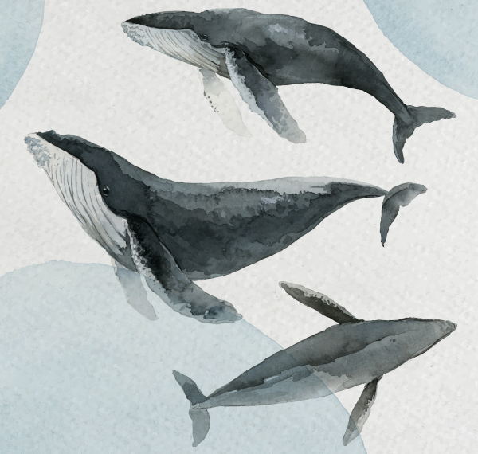](https://www.freepik.com/free-vector/humpback-whale-watercolor-painting-watercolor-banner-vector_17433815.htm "Humpback whale watercolor painting in watercolor banner vector by rawpixel.com")

## Las ballenas
Según las leyendas, dos grandes ballenas, Batú y Mautu, crearon todas las islas de _Hua Tarakona_. XXX 

Sus respiraciones crean las mareas. La exhalación de Batú crea la pleamar de noche y su inhalación la bajamar de día. Al exhalar Mautu crea la pleamar de día y al inhalar se genera la bajamar de noche.

XXX## Cultura y sociedad
XXX

### Tatuajes
Los habitantes de las islas tienden a hacerse tatuajes por todo el cuerpo, incluso en la cara. Estos tienen formas geométricas y diseños tribales muy simples de diferentes animales cuyas virtudes posee la persona tatuada.

Hacer tatuajes es una profesión muy respetada y sus secretos pasan de maestro a aprendiz. Normalmente, cada comunidad tiene un maestro y un aprendiz, pero cuando termina su entrenamiento, los aprendices se lanzan a viajar durante un tiempo ofreciendo sus servicios en aquellos lugares donde no hay tatuadores establecidos, hasta encontrar un sitio donde establecerse.

No cualquiera es tatuado, ese honor solo sé reserva a las personas que han hecho cosas importantes para la comunidad donde viven. Es por ello que en situaciones sociales o de combate la gente con tatuajes trata de enseñarlos lo máximo posible, bien como forma de mostrar su importancia y valor o como forma de intimidación. Una buena cantidad de tatuajes podría dar ventaja a la hora de intimidar o impresionar a humanos y monstruos de las islas.

### Surf

_Tangaloa_ enseñó a construir tablas de surf y a usarlas para surcar las olas y por eso se le venera. Sin el surf nuestras vidas estarían vacías y sin _hopupu_.

El surf es el deporte más practicado por los habitantes de _Hua Tarakona_. Es tan importante que los y las mejores surfistas son tratados como estrellas y viven simplemente de hacer surf.

Las competiciones son eventos importantes y los premios que se ofrecen pueden permitir a un buen surfista sobrevivir todo el año. Es por ello que no es raro encontrarse grupo de surfistas que viajan de asentamiento en asentamiento participando en diferentes pruebas y competiciones para ganarse la vida y poder seguir viajando practicando su deporte favorito.

No es extrañar llegar a una cala perdida y encontrarse con un círculo de tablas de surf clavadas en la arena y en su interior a surfistas descansando junto al fuego.

### Māhū

_Māhū_ se usa para denominar a las personas pertenecientes a un tercer género. Se considera que encarnan tanto el espíritu masculino como el femenino.

Les māhū son particularmente respetados como maestres, generalmente de danza hula y canto. Les _māhū_ también son valorades como guardianes de tradiciones culturales, como la transmisión genealógica. Tradicionalmente, los padres les pedían a les māhū que les pusieran nombre a sus hijos.## Razones para viajar
En viaje forma parte del espíritu de todo habitante de _Hua Tarakona_. Sus gentes llevan navegando y colonizando nuevas islas desde época de las ballenas primigenias.

Para empezar, el viaje es algo intrínseco para los humanos del gran archipiélago. Llegaron desde tierras lejanas, ayudados por las ballenas creadoras, y colonizaron una a una las principales islas. No es raro que un isleño se quede mirando al mar preguntándose qué habrá más allá del horizonte y qué aventuras le esperan allí.

Cuando un individuo **no está a gusto en su comunidad** coge sus cosas y empieza un viaje en búsqueda de una nueva comunidad en la que establecerse. No se ve mal que alguien de fuera se acerque a una comunidad, es algo normal. Si los tabús de tu antigua comunidad te asfixian, búscate otra donde puedas ser como tú quieras.

También es algo normal lanzarse a viajar **en busca de fortuna y mejores oportunidades**. Y como en el caso anterior tampoco se ve mal. XXX

XXX

## Tabú
XXX

## Aumakuas, kupuas y semidioses
XXX## Términos
XXX

### Hauka

_Hauka_ se refiere tanto a la persona como al grupo que está realizando un viaje. XXX

### Hopupu

XXX

### Makai y mauka

_Makai_ y _mauka_ son unas de las palabras más útiles que puedes aprender. Estos términos direccionales te ayudarán a orientarte en las islas. _Makai_ te dirige «hacia el mar», mientras que _mauka_ te envía «hacia las montañas», un sistema perfecto para la vida en la isla. Nunca tendrás que preocuparte por dónde está el norte cuando tengas estos puntos de referencia naturales como guía.

### Pono

_Pono_ es el equilibrio perfecto entre hacer lo correcto y vivir en armonía con todo lo que te rodea. Esta palabra engloba moralidad, rectitud, y vida ética, todo a la vez. Cuando se describe algo como _pono_, están diciendo que es correcto en todos los niveles.
## Nuevas clases, profesiones y arquetipos
XXX

### Tatuador

XXX

### Surfista

XXX

***

# Equipo

Te presentamos toda una serie de nuevos objetos para usar en tus partidas en _Hua Tarakona_. Con este equipo tus _hauka_ podrá empreder sus viajes y enfrentarse a todos los problemas y desafios que como DJ les pongas por delante. 

## Materiales
Un punto importante del equipo es que el **metal es conocido** por las gentes de las islas, pero **es escaso y no son hábiles forjando** el metal. Sin embargo, sí son buenos trabajando la madera y trenzando las hojas de palma.

La **madera es un elemento fundamental** en la vida de las islas, es abundante, fácil de trabajar, duradera, resistente y flota. Por eso encontrarás bastantes artesanos especializados en el trabajo de la madera, no deberías de hablar de carpinteros en general, sino de ebanistas, carpinteros navales, constructores de chozas, tallistas, etc.

Lo mismo pasa con la **hoja de palma**, que también encontramos en varias artesanías, como cesteros, techadores, fabricantes de velas, etc. que la transforman en diferentes elementos como cestas, velas de barco, sombreros, cuerdas y correas, etc.

El equipo típico de metal, como una cantimplora, tendrá su contrapartida en madera y productos naturales, por ejemplo, una calabaza vaciada, secada y pulida con un corcho puede ser un perfecto recipiente para el agua.  

Debido a la intensa actividad volcánica de las islas, los materiales como la obsidiana o el basalto son muy abundantes y los artesanos isleños también son diestros en su manufactura en forma de utensilios y armas.

La **lana es desconocida**, sin embargo, las **prendas de plumas son muy comunes** y normalmente asociadas a personas de alto standing y poder adquisitivo. Los gorros y las capas de tejidas con vistosos colores de plumas de aves selváticas son un signo de distinción entre los isleños.

Por último, los metales como el **Oricalco** y el **Mythril** (ambas cualidades) **no pueden usarse** en esta ambientación.
 
## Tecnología
XXX
Si no quieres complicarte, puedes dejar el equipo normal de juego de fantasía medieval y darle una estética más natural hechos de madera, hojas de palma, coco, barro cocido, huesos de animales, pieles, etc.

## Armas
Tus _hauka_ disponen de una gran variedad de lanzas de todos los tamaños (pequeñas, medidas y pesadas) y tanto de cuerpo a cuerpo como a distancia.

Las armas, sobre todo las grandes de madera, están profusamente decoradas con motivos geométricos y marítimos, convirtiéndolas muchas veces en auténticas obras de arte. También es normal que tengan elementos decorativos como, penachos de plumas u hojas trenzadas de vivos colores.

### Hojas cortas

Las armas de filo cortas como cuchillos o dagas no son muy comunes. En su lugar, tenemos pequeños garrotes de maderas duras como la _koa_ con pinchos o dientes de tiburón. También son comunes armas de madera en forma de nudilleras con diferentes accesorios como grandes puntas afiladas o dientes de escualo en como si fuera una sierra.

Otra opción, son los huesos de ballena tallados que permiten crear hojas ligeras y bastante afiladas para usarla en el día a día y en combate.

### Hojas

[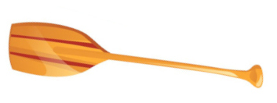](https://www.freepik.com/free-vector/kayak-canoe-design-illustration-set_18274734.htm "Kayak canoe design illustration set by pikisuperstar")

**Remo:** Estas contundentes herramientas de madera tienen lados afilados en la parte de la pala y buenos mangos para asirlos bien y dar golpes contundentes, así que son unos utensilios muy útiles tanto para navegar como para combatir.

[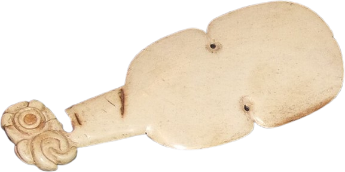](https://en.wikipedia.org/wiki/Kotiate#/media/File:Kotiate_11a.jpg "Two kotiate made of whalebone by Rudolph89")

**Kotiate:** Es una maza corta normalmente hueso de ballena. Parece una especie de evolución del remo al que se le hicieron modificaciones para ser más mortal.

### Armas de Asta

[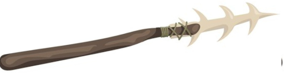](https://www.freepik.com/free-vector/neanderthal-primitive-rock-weapon-flat-set_12291204.htm "Neanderthal primitive rock weapon flat set by pch.vector")

**_Tao_:** Lanza de madera normalmente con una punta hecha del pincho de un pez espada o de los afilados huesos de la cola de una raya.
[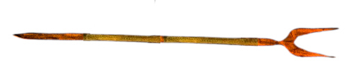](https://www.freepik.com/free-vector/neanderthal-primitive-rock-weapon-flat-set_12291204.htm "Neanderthal primitive rock weapon flat set by pch.vector")

**Horca:** Este utensilio perfecto para la pesca de peces y crustáceos puede usarse como una eficaz arma de combate.

### Hachas

[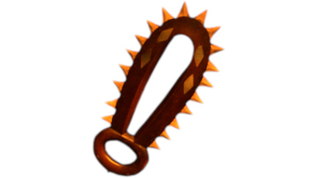](https://commons.wikimedia.org/wiki/File:Leiomano.jpg "Leiomano by Jen")

**_Leiomano_:** Esta arma similar a una pala de jugar a pelota tiene el borde lleno de pequeños dientes de tiburón insertados.

### Arcos y ondas

Los isleños son diestros arqueros y honderos. Como dato importante diremos que la onda (Maʻa) es usada como arma de guerra, mientras que el arco y las flechas se reservan normalmente para la caza.

A nivel de juego, tanto el arco como la honda son exactamente, solo son diferentes a nivel estético.

## Armaduras y escudos
Los combatientes en _Hua Tarakona_ no llegan pesadas armaduras de metal. Como ya sabemos no son duchos en la forja del metal, pero además las armaduras son un lastre tremendo en el mar y el calor hace que no se puedan llevar mucho tiempo seguido sin acabar extenuado.

Aun así, como buenos tejedores de **hojas de palma**, saben hacer buenas **protecciones frescas y ligeras**, que les dan cierta protección en el combate.

Tradicionalmente, los combatientes **no han usado escudos**, aun así tus _hauka_ bien podrían hacer algún escudo ligero de madera y hojas de palma trenzadas.

### Protecciones de palma trenzada (ligera)

Estas protecciones están hechas de varias capas de hojas de palma trenzadas. Se crean protecciones para diferentes partes del cuerpo. No son especialmente resistentes, pero son baratas, fáciles de fabricar, ligeras y flexibles

> En esta ambientación, salvo situaciones excepcionales, tus _hauka_ no deberían poseer armaduras media y pesadas y escudos pesados.## Plantas medicinales
Los _kahunas_ de cada asentamiento dominan la búsqueda de plantas medicinales y su uso curativo. Pueden hacer infusiones, emplastos y cataplasmas, cremas o prepararlas para su consumo.

La selva es el lugar donde se encuentran la mayoría de las hierbas medicinales, pero también recorren las playas y acantilados en busca de algas con propiedades medicinales.

### Kava

La _kava_ es una planta de la que se saca una bebida con efectos psicoactivos. Produce relajación muscular, somnolencia y ganas de hablar. Se ha utilizado tradicionalmente para tratar para aliviar infecciones, dolores, estrés e insomnio. La raíz se muele con un trozo de coral y se le añade agua fría para poder beberla.

## Objetos comunes
Los artesanos isleños son capaces de crear desde toscas y sencillas herramientas y útiles cotidianos a bellas y artísticas obras de arte. Muchas de estas piezas se caracterizan por tener diseños orgánicos aprovechando la forma de los materiales con que se han construido (madera, piedra, fibras vegetales) y se suelen decorar con diseño geométricos o figuras tribuales de animales, personas, dioses y monstruos.

[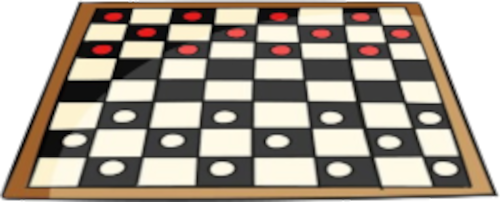](https://www.freepik.com/free-vector/board-game-collection_10115170.htm "Board game collection by freepik")

### Konane

El _konane_ es una juego de mesa, muy parecido a las damas o el go. El _konane_ se juega utilizando pequeños trozos de coral blanco y lava negra sobre una gran roca tallada y o un tablón de madera que funcionaba como tablero y mesa. Se considera un juego de roedores inteligentes y las competiciones son de muy alto nivel.

De normal, un _konane_ de viaje tiene tamaño 3, pero de normal los que se tienen en las casas y son de mejor calidad ocupan tamaño 5.

### Herramientas de tatuaje

Las herramientas de tatuaje consisten en un peine con dientes de hueso o concha de tortuga unidos a un mango de madera. Los dientes estaban empapados en tinta a base de carbón diluido en aceite o agua. El peine se golpean con un palo de madera para pinchar la piel continuamente y meter la tinta en su interior.
Las herramientas de tatuaje ni se compran ni se venden, se pasan de maestro a aprendiz y se aprende a fabricarlas como parte del entrenamiento de tatuador.

### Tambor de calabaza Ipu

Este tambor hecho con calabazas vaciadas, secadas y juntadas con una cuerda de fibras de coco, sirve para marcar el ritmo de los bailes _hula_. La superficie se pule con arena y como es muy frágil no se graba nada en su superficie. En su lugar se cubren con una red y se decora la red con coloridos elementos florales.

[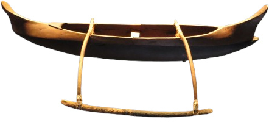](https://www.flickr.com/photos/40295335@N00/10010587593 "Model of outrigger canoe from Hawai‘i by Joel Abroad")

## Embarcaciones
Los isleños son increíbles navegantes. Llevan el mar en la sangre y este no tiene secretos para ellos. Con ellas pueden viajar cientos de kilómetros familias enteras con todas sus pertenencias y animales de granja para establecerse en una nueva isla.

Sus embarcaciones pueden parecer frágiles y arcaicas, pero están perfectamente adaptadas a su mar y su meteorología. Poe ejemplo, tras una terrible tormenta, es muy fácil la tripulación parar en alguna pequeña isla y con unas herramientas mínimas hacer las reparaciones necesarias para poder continuar su travesía. Naves mucho más modernas y complejas tendrían que estar semanas carenando y en diques secos para hacer las reparaciones.

Otra característica importante es que estas embarcaciones no viajan solas, suelen hacerlo en convoyes donde se ayudan entre ellas en todo lo que pueden. si una tiene problema el resto pueden prestar ayuda y si alguna está a punto de hundirse, sus tripulantes se pueden trasladarse a otras embarcaciones y continuar el viaje.
### Tabla de surf

Estas tablas de madera pulida se deslizan usando la fuerza motriz de su tripulante o la fuerza de las olas. No son fáciles de maniobrar y se necesitan años de práctica poder usarlas y hacer las acrobacias que algunos consiguen hacer. Permite una tripulación de 1 _hauka_.

### Canoa

Esta embarcación tallada del tronco de un árbol, permite una tripulación de 3 _hauka_, dos remando más un tercer pasajero.

Puedes ser muy simples o estar profusamente decoradas con motivos vegetales, animales, geométricos o mitológicos. Es el medio de transporte principal y sirve tanto en el mar como en los ríos.

### Catamarán y canoa multicasco

Estos navíos se caracterizan por tener dos o más cascos paralelos y de la misma longitud. Los cascos están unidos por troncos que también soporta el palo del velamen. La cubierta se crea con redes y tablas sobre los cascos y los troncos.

Es el navío perfecto para viajes largos entre islas y para pesca de altura, ya que son rápidos, estables y de poco calado para evitar los arrecifes de corral. Además, tienen una gran cantidad de espacio habitable donde pueden estar sus tripulantes y su carga.

Según el tamaño, podría permitir desde 4 a 20 personas con su equipaje y agua y comida para un largo viaje. De hecho, son los navíos con los que los humanos han ido explorando todas las islas del Pacífico.

## Ropas y calzado
Las ropas de abrigo son muy poco comunes, recuerda que las temperaturas nunca bajan de 20 °C, salvo en los picos nevados de algunas montañas. Pero la ropa contra el viento y la lluvia es bastante común.

Todo el calzado se reduce a sandalias y chanclas, normalmente de hoja de palma trenzada. No hay necesidad de calzado que proteja del frío y el agua. Además en ambientes marinos y metiéndose mucho en el agua, el calzado ligero y barato es mucho más práctico.## Moneda y trueque
En _Hua Tarakona_ no existen ni las monedas, ni los billetes de curso legal, ni tampoco letras de cambio, pagarés y otras figuras similares. Tampoco son abundantes los metales y las piedras preciosas. Así que **el trueque impera en todo el archipiélago**. 

Cada comunidad tiene ya establecidas unas tasas de cambio de manera que, por ejemplo, lo normal es conseguir 1 docena de huevos por 3 kilos de cocos.

Estas tasas son más o menos universales. Igual en una zona con muchas palmeras cocoteras tengas que dar 3 kilos y medio o durante la anidación de las aves tengas que poner 1 docena y media de huevos. Pero en general, es una diferencia despreciable de la que no deberías preocuparte.

Todo esto supone que tus _hauka_ viajar con sus mochilas y bolsas llenas de objetos de artesanía y materias primas para intercambiar. 

Puede haber eventos que echen a perder los materiales que van a intercambiar, como que se moje una mochila y se eche a perder el grano de arroz que llevaban para trocar. Pero este tipo de cosas no deberían ser normales, solo deberían ser motores de aventura. Quizás sus posesiones se han podrido al estar muchos días perdidos en un húmedo pantano y tengan que aceptar algún trabajo para conseguir el dinero perdido.

A nivel de juego el dinero va a funcionar igual que en el manual básico salvo por dos excepciones. Primero, **el dinero va a suponer peso extra** que tus _hauka_ van a tener que tener en cuenta al calcular su carga.

**Cada 1.000 mo va a suponer 1 de tamaño** que deberás descomponer en objetos de tamaño 1, 3 o 5. De forma que si tienen 14.000 mo, deberán cargar, por ejemplo, con dos objetos grandes, (tamaño 5), uno mediano (tamaño 3) y uno pequeño (tamaño 1).

Los objetos para trocar solo cuentan como objetos cargados, nunca, salvo excepciones como joyas y abalorios caros, podrían tomarse como objetos equipados. Por ejemplo, las perlas sí son cómodas de transportar y aceptadas en todas partes. Podrían llevarse un par de miles de monedas de oro en un colgante y tomarse como un objeto equipado.

En caso de llevarlo como objetos cargados, el peso cambia de manera que ocupan 1 de tamaño por cada 5.000 mo. Quizás puedan aligerar el peso bastante, cambiando sus posesiones por perlas, pero, por ejemplo, no podrán comprar con ellas cosas baratas como unas raciones de viaje o un sombrero de palma.
La otra excepción a las reglas básicas que puedes aplicar es que **los objetos al venderse no pierden la mitad de su valor**. Es normal intercambiar objetos de segunda mano mientras estén en buenas condiciones, así que no tienen pérdida de valor al venderlas.

### Tabla de precios especiales

|Objeto|Precio|
|---|---|
|Konane|500|
|Herramientas de tatuaje|1500|
|Tambor de calabaza Ipu|400|
|Canoa|3000|
|Tabla de surf|500|
|Canoa multicasco|5000|
|Catamarán|90000|

***

# Magia

XXX
## Magia de las mareas (Estacional)
XXX

### Bajamar diurna (primavera)

XXX

### Pleamar diurna (verano)

XXX

### Bajamar nocturna (otoño)

XXX

### Pleamar nocturna (invierno)

XXX## Objetos mágicos
A diferencia de otros mundos, los objetos mágicos de esta ambientación no son legendarias armas, orbes de adivinación, ni anillos de poder. Suelen ser más objetos más cotidianos con capacidades mágicas que ayudan a su propietario a hacer la tarea que le ha encomendado el destino. Vamos desde anzuelos que pescan lo que quieres, incluso islas, hasta calabazas que atrapan ciclones.

### Anzuelo de Maui

Este anzuelo tallado de un hueso, atrapa cualquier cosa que esté en el fondo del mar a distancia de tu sedal. Es lanzarlo y atrapa lo que busques. Otra cuestión es si tienes la fuerza suficiente para tirar de él, porque si no puedes sacar el objeto deseado, este no se desenganchará y tendrás que cortar el sedal.

### Figura de la canoa de Hilo

_Hilo_ es una semidivinidad que construyó la primera canoa. Esta figurilla, que te cabe en la mano (tamaño 1), se convierte es una canoa con remos cuando se echa al agua y vuelve a su tamaño original cuando se saca del agua.

### Calabaza de Maui

Esta calabaza fue usada por _Maui_ para encerrar a los vientos. Permite encerrar una tormenta o un tifón. Si la calabaza está llena, tendrá que vaciarse antes liberando la tormenta o el tifón para poder volver a meter dentro otra tormenta. Se cuenta que _Maui_ atrapó un tifón que amenazaba su poblado y luego lo libero sobre una flota de invasores.

### Azuela de Ratʻa

Esta azuela de carpintero, que perteneció al mítico rey _Ratʻa_, permite construir estructuras de 25m por mañana o tarde de trabajo y siempre que haya madera cerca.

Puedes crear refugios, puentes, escaleras, presas, etc. son construcciones muy básicas pero bien hechas y resistentes. Tras terminar de trabajar, estarás cansado (4).

### Sal de Kane

El dios creador _Kane_, salo el mal para purificarlo y la sal que le quedo la guardo en una bolsa de hojas de palmas. La bolsa nunca se queda sin sal y donde se esparce la sal no puede entrar o pasar kupuas y otros espíritus demoniacos. La protección dura 1 día hasta la misma marea que ahora.

### Llama de Pele

Esta llama eterna no se puede apagar, te mantiene caliente incluso en la nieve de las montañas y prende cualquier cosa inflamable en una ronda. Si se le pone un mango de algo que no prenda como piedra o metal puede usarse como arma muy eficaz.
### Objetos mágicos menores

* Hacha de piedra que te permite corta madera sin cansarte
* Trozo de lava que no se enfría. Sirve como calefactor o para calentar líquidos
* _Tiputa_ (camiseta de hojas de palma trenzada) que te hace flotar en el agua
* Calabaza vaciada que siempre tiene aire dentro que respirar
* Vela dentro de cuenco de cáscara de coco que revela la verdadera apariencia de un cambiaformas bajo su luz***

# Viajar

Viajar es el _leitmotiv_ de las aventuras de Ryuutama y también lo es el de esta ambientación. Pero en «Makai Mauka» a ser un mundo que es un gigantesco archipiélago el viajar se complica, ya que exigirá muchas veces trayectos por mar. Este tipo de viajes no están reflejados en las reglas del manual básico y es por ello que se han creado reglas específicas para estas situaciones. 

## Animales acompañantes
La presencia de grandes masas de agua en _Hua Tarakona_ hace que, en el caso de los animales acompañantes, debemos dividirlos en animales terrestres y acuáticos a la hora de establecer como se alimentan y viajan o qué tipos de animales pueden llevar tus _hauka_.

### Terrestres

No existen grandes animales herbívoros que sirvan de carga o de monta como caballos, burros o alpacas. Pero si hay grandes **cerdos salvajes** domesticados a los que pueden ponerse alforjas para transportar equipo y mercancías.

Con los siglos, se han seleccionado y domesticado las **iguanas de mayor tamaño** por su carne y sus huevos. Hoy en día las iguanas gigantes llegan a medir a 2 metros y también se usan como animales de carga, aunque no pueden ser utilizados para montar.

Un proceso muy parecido lo tuvieron las **tortugas terrestres** (y también marinas). Se empezaron a domesticar por su carne, sus huevos y su caparazón y hoy en día se han convertido en animales de carga que permiten con una especie de silla de madera que se ajusta a su caparazón transportar cargas pesadas. No son los animales más rápidos, pero son fuertes, dóciles, resistentes y no escapan ante depredadores, solo se refugian en sus caparazones.

Se sabe que en islas recónditas del archipiélago sus habitantes usan **cangrejos rojos gigantes** para transportar carga, pero no es un sistema muy eficiente de las zonas donde habitan los cangrejos rojos. 

Reglas para los animales en entornos marinos:

* Los __animales terrestres gastan 1 de comida y agua al día en terrenos acuáticos__ como lo hacen en Desiertos o Alta Montaña.
* Saben nadar, pero no pueden hacerlo durante mucho tiempo, quizas lo suficiente para atravesar un río llegar desde la playa a un islote cercano. Por ello, como tus _hauka_, solo podrán __viajar por mar en embarcaciones__.

### Acuáticos

Dentro de los animales acuáticos que pueden acompañarte tenemos:
* **Delfines.** Bastante inteligentes y rápidos, pero no siempre dispuestos a trabajar, prefieren jugar y holgazanear.
* **Tortugas marinas.** Debido a su longevidad hay tortugas que han sido acompañantes de varias generaciones de isleños.
* **Tiburones «herbívoros».** Hablamos de grandes tiburones no agresivos. No se alimentan cazando otros peces, sino que comen plancton y otros pequeños crustáceos.   

Reglas para los animales acuáticos

* Estos animales **no pueden ser montados**, pero puedes agarrarte a ellos para que te lleven en trayectos cortos.
* Pueden **tirar de una embarcación** como canoas y catamaranes permitiendo llevar más carga o ir más rápido, incluso cuando hay «calma chicha».
* Dentro del agua los animales acuáticos **no generan gastos de comida y agua**. Si acaso, en situaciones especiales como mares muertos podrían suponer un gasto en comida.

Aunque algunos de los animales anteriores son anfibios, normalmente tendrán un ambiente al que estarán mejor adaptados. Por ejemplo, las tortugas marinas salen a la playa a desovar, pero no es su medio natural, por lo que son lentas y torpes.

## Terrenos
Las islas de _Hua Tarakona_ suponen nuevos tipos de terrenos como playas o volcanes, pero teniendo en cuenta que los viajes también se hacen por mar, tenemos nuevos terrenos acuáticos o masas de aguas con algunas reglas especiales. 

Hay una serie de terrenos que no deberían entrar en tus aventuras, pero eres libre de meterlos si lo deseas. Ten en cuenta que hay miles de islas en _Hua Tarakona_ y puede haber todo de tipo de terrenos.

* **Desiertos, pedregales y yermos:** Todos son sustituidos por terrenos muy parecidos, los campos de lava y los volcanes.
* **Bosques, bosques primarios y junglas:** Son sustituidos por selvas y selvas vírgenes.
* **Montañas:** Las montañas, por su origen volcánico, son muy peligrosas y no son fáciles de atravesar. 
* **Alta montaña:** No hay grandes montañas ni cordilleras, y aunque algunas montañas son altas y pueden tener nieve, lo normal es rodear las islas por la costa.  

Las praderas, las colinas y los pantanos se quedan como están.[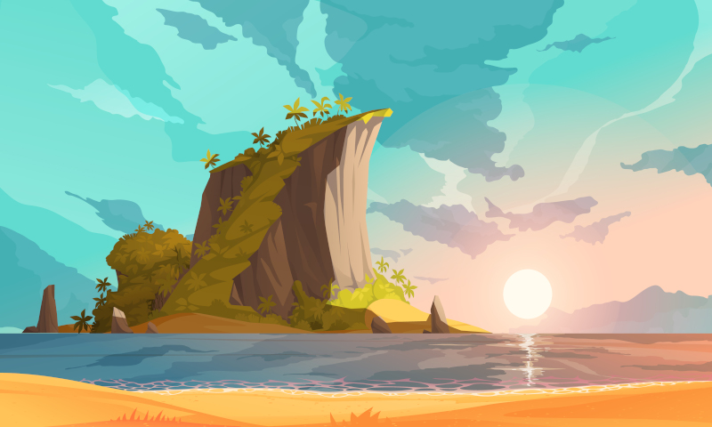](https://www.freepik.com/free-vector/tropical-island-cartoon-poster-with-rising-sun-sea-vector-illustration_37366207.htm "Tropical island cartoon poster with rising sun above sea vector illustration by macrovector")
### Acantilados litorales

Las zonas de la costa que no son playas suelen ser acantilados poblados de aves marinas con las olas chocando violentamente contra ellos. 

Con las mareas bajas suelen descubrirse cuevas y zonas con charcas donde pescar y recolectar crustáceos y bivalvos en las charcas que quedan al retirarse la marea.

Pero hay que tener cuidado y vigilar las mareas o puedes quedarte encerrado o incluso ahogarte porque ha subido la marea y las olas te empujen a las afiladas rocas del acantilado.

### Campos de lava

Estos terrenos son lugares en los que hace años, si no siglos o milenios, paso una lengua de lava y cuando se solidificó se convirtió en un extraño lugar con estructuras de formas insólitas. Las figuras que ha dejado la lava pueden crear enrevesados laberintos de piedra, dunas de roca, etc.

Con los años la naturaleza ha ido tomando el lugar. Ya se empieza a ver flora y fauna, aunque normalmente han tomado exóticas vías de evolución para adaptarse a este terreno.

### Riachuelos

Debido a la orografía de las islas, los riachuelos son la manera más rápida de llegar desde la costa hasta las montañas. Seguir el cauce de los riachuelos es una senda fácil y normalmente recta.

El único problema es salvar los saltos de agua. Mientras más cerca se está de la cima de las montañas más grandes suelen ser. Esos saltos de agua son peligroso tanto al bajarlos como al subirlos.[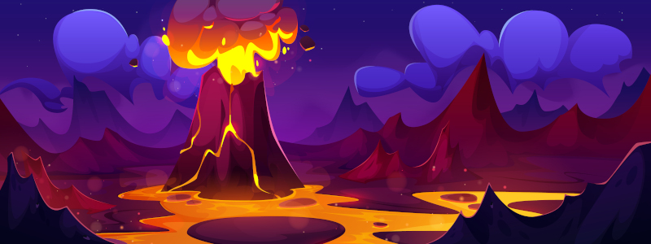](https://www.freepik.com/free-vector/volcanic-lava-erupt-landscape-prehistoric-volcano_375731237.htm "Volcanic lava erupt landscape prehistoric volcano by upklyak")
### Montaña

No hay grandes montañas en las islas de _Hua Tarakona_, pero aun así son sitios peligrosos debido a su origen volcánico. Puede haber abruptos precipicios y estrechos pasos originados por temblores, muros de lava solidificada o laderas llenas de puntiagudas piedras basálticas.

En los más altos puede haber incluso nieve en abundancia en invierno y neveros el resto del año. No son extrañas historias de valientes _hauka_ que emprender un viaje para conocer la nieve y ganarse la gracia de Poliʻahu, la diosa de las cimas nieves.

### Playa

Las playas de las islas son una maravilla para la vista. Largas y de arena fina con palmeras cocoteras donde las que conseguir alimento y bebida es bastante fácil, pero también otros materiales como hojas de palma para hacer tejidos, algas para medicinas o espinas y dientes de tiburón para hacer armas y anzuelos.

La mayoría de las comunidades (poblados, pueblos e incluso ciudades) se encuentran cerca de la playa, especialmente si están guarecidas de las corrientes y el oleaje.  

### Selva/Selva virgen

Los interiores de la mayoría de las islas de _Hua Tarakona_ son selvas, áreas boscosas llenas de altos árboles y mucha vegetación por debajo de estos. Se pueden sacar importantes recursos de todo tipo de las selvas, pero hay que ser cuidadosos porque siempre hay algún peligro.

En las zonas interiores, los árboles son tan frondosos que la luz del sol casi no entra. Estas partes no suelen ser visitadas por los isleños, incluso hay partes en las que los humanos no han pisado. Estas selvas vírgenes pueden suponer grandes peligros en forma de bestias salvajes, trampas y enfermedades, pero esconden también recompensas en forma de tesoros escondidos en templos perdidos cubiertos de vegetación.
### Volcán/Volcán activo

La inmensa mayoría de las islas de _Hua Tarakona_ son de origen volcánico y bastantes de ellas tienen un volcán, pero muy pocas de ellas tienen un volcán activo. 

Moverse en una zona volcánica es muy complicado, no hay casi recursos y los pocos que puedas encontrar pueden ser peligrosos, pero se vuelve mucho peor cuando el volcán está activo. 

Activo supone que un volcán puede expulsar gases nocivos, hay temblores y corrimientos de tierras e incluso alguna pequeña grieta llena de borboteante lava. Si el volcán está expulsando ríos de lava, gases sulfúricos y piroclastos es imposible viajar a través de él y seguramente acabarás muerto si intentas moverte por esa zona.

### Tabla de nuevos terrenos

|Terreno|Dificultad|
|---|---|
|Cauce de un río, Playa|6|
|Selva, Acantilados litorales|8|
|Montaña, Selva profunda|10|
|Volcán|12|
|Volcán activo|14|

## Masas de agua
El mar siempre debería estar presente en las aventuras. Es una fuente interesante de aventuras tanto por peligroso e inexplorado como por las cosas que puede dejar la marea en la playa. Además, es un entorno cambiante y lo que ayer estaba en un lugar puede haber desaparecido la siguiente vez.

Viajar por el mar es algo que el manual Básico no se ve reflejado, pero en un gran archipiélago como el de _Hua Tarakona_ los viajes a en barco bordeando las islas o en abierto para moverte de grupo de islas en grupo de islas son muy comunes. Es por ello que tenemos nuevos terrenos, en realidad masas de agua, para estos tipos de viajes.

### Arrecifes

Los arrecifes son rocas, bancos de arena, o cualquier otro elemento que yace a pocos metros de la superficie o incluso sobre la superficie del agua durante marea baja. Los arrecifes son un gran peligro para las embarcaciones, ya que pueden encallar o destrozarlas, pero también son una buena defensa natural contra intrusos que lleguen por mar.

Cuando hablamos de arrecifes no nos referimos a una masa de arrecifes sino a zonas grandes del mar donde hay gran cantidad de arrecifes.[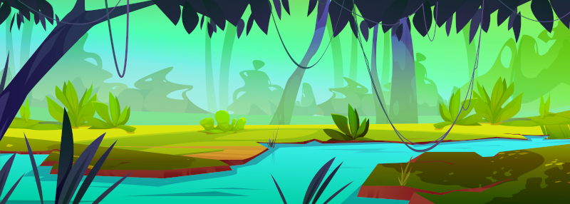](https://www.freepik.com/free-vector/river-jungle-forest-vector-tropical-landscape-background-lake-water-cartoon-nature-illustration-with-grass-creeper-wild-amazon-scenery-rainforest-game-scene-design-with-beautiful-valley_61914186.htm "River in jungle forest vector tropical landscape background lake water cartoon nature illustration with grass creeper and wild amazon scenery rainforest game scene design with beautiful valley by upklyak")
Los arrecifes suelen estar cerca de la costa, ya que en mar abierto la profundidad es demasiada para que las rocas del fondo sean un problema. No es raro encontrarse zonas de arrecifes que rodean total o parcialmente una isla o islote.

### Mar abierto

Una vez dejas de ver tierra firme entras en la gran nada que significa el mar abierto, solo hay agua a tu alrededor y eso será lo único que verás en día. Aquí tus _hauka_ están solos a merced del agua y del viento. No hay ayuda posible y los encuentros con otras embarcaciones pueden ser peligrosas. 

Las cosas pueden cambiar drásticamente en mar abierto pasando de estar el agua como plato sin pizca de aire a vientos fuertísimos, lluvia torrencial y olas terribles. 

No querrás estar en mar abierto una noche de tormenta, porque normalmente

La gente del mar de _Hua Tarakona_ no suelen adentrarse en mar abierto, prefieren ir de isla en isla, ya que aunque sea más lento es mucho más seguro.

### Costa

Mientras veas tierra podemos hablar de que estás en la costa y en caso de peligro podrás refugiarte en tierra firme.

La costa puede ser abierta con lo que todo el oleaje del mar os den de lleno y los lance contra las rocas de la costa o de costa cubierta, zonas protegidas del oleaje donde poder fondear durante la tormenta de forma segura.

### Río navegable

En las islas más grandes hay ríos navegables que los locales han aprendido a surcar con sus canoas. Estos ríos suelen ser tranquilos y fáciles de navegar. 

Las comunidades del interior suelen crecer alrededor de estos ríos tanto por los recursos que ofrecen, como por las posibilidades de transporte y comunicación que ofrecen.

Cuando el río deja de ser navegable, es porque se ha convertido en riachuelos, un terreno muy distintos en el que tus canoas no valen para nada.
### Eventos durante el viaje en el mar

En el mar pueden pasar de muchas cosas que escapan al control de los _hauka_. Desde días sin viento que exigen sacar los remos y ponerse a remar a caídas y golpes al moverse por la embarcación. 

La siguiente tabla muestra situaciones y condiciones que como DJ puedes usar en las travesías para darles variedad y emoción.

|Evento|Condiciones|
|---|---|
|Golpes contra los aparejos o el mástil|Herido (４)|
|Oleaje|Mareado (４)|
|Comida o bebida en mal estado|Envenenado (４)|
|Insolación|Enfermo (４)|
|Viento de frente que hace más difícil la navegación|Cansado (４)|
|Caída desde mástil o el velamen|Herido (6)|
|Gran oleaje|Mareado (6)|
|Picadura venenosa de medusa o mantarraya|Envenenado (6)|
|Bebida en mal estado|Enfermo (6)|
|Corrientes fuertes en contra|Cansado (6)|
### Tabla de masas de agua

|Masa de agua|Dificultad|
|---|---|
|Río navegable|6|
|Costa cubierta|8|
|Costa expuesta|10|
|Arrecifes|12|
|Mar abierto|14|

### Reglas para los viajes

Los viajes por mar son muy diferentes a los viajes por tierra que propone el manual básico. Es por ello que tenemos reglas especiales que puedes aplicar en tus aventuras en _Hua Tarakona_ o en tus propias aventuras cuando viajes por mar.

#### Labores en el barco (Marcha)

La tirada de Marcha se convierte en la tirada de Labores del barco. Hablamos desde pilotar y soltar y recoger vela, a achicar agua o limpiar la cubierta. 

Una pifia por parte de alguno de los tripulantes supone problemas que se va a arrastrar la embarcación. Es por ello que **una pifia en esta tirada supone un -1 a la tirada de Fondear**.

Esta tirada **solo tienen que hacerlas las personas que hagan alguna labor en el barco**, los pasajeros no tienen que hacerla, ya que no están haciendo un esfuerzo real para mantener el barco a flote y en movimiento. 
#### Fondear (Acampar)

La tirada de Acampar se convierte en la tirada de Fondear. No es lo mismo fondear en una playa protegido del oleaje (Costa cubierta) a hacerlo en alta mar a merced de las olas y el viento. La tirada de Fondear deben hacerla por lo menos dos tripulantes y pueden ayudarles otros dos.

El resultado final es la media de las dos tiradas, pero si hay una pifia o un crítico se lo quedan directamente. En caso de salir un crítico y una pifia, gana el crítico.

Pasar muchos días en el mar sin acercarse a la costa complica la navegación, así que cada 3 días en mar abierto la tirada de Fondear obtiene un -1. Si vuelven a tocar la costa el penalizador desaparece. Por ejemplo, si se tiran 7 días en alta más el séptimo día tendrán un -2, que desaparecerá al acercarse a tierra.

#### Atracar y desembarcar

El paso del mar a la tierra solo se puede hacer por zonas de playa. Hacerlo por zonas de acantilado exigirá unas buenas tiradas de navegación y/o escalada. 

#### Volver sobre tus pasos en el mar

La opción de volver sobre tus pasos no sirve en mar abierto. Las travesías marítimas no siguen senderos, ni caminos, de hecho, no hay una ruta precisa prefijada. La tripulación se guía por el sol y las estrellas para seguir una ruta marítima más o menos amplia. Sin embargo, en el resto de masas de aguas esta opción es perfectamente posible.

#### Conseguir comida y agua

Durante un viaje por mar se puede conseguir comida pescando igual que se hace en tierra, pero no agua dulce. La única fuente de agua es la lluvia. Si tus _hauka_ tienen la precaución de recoger agua los días de lluvia podrías darles algunas raciones de agua extra.

#### Movimiento

Sobre las velocidades, **en un día de buen tiempo** y con viento un catamarán podría **recorrer 60 km, es decir 2 casillas**, pero si no hay buen tiempo, solo 30 km. En casos de que **no haya viento, no avanzará nada** a no ser que se saquen los **remos con lo que avanzarán 30 km (1 casilla)**, con lo que al día siguiente estarán bastante **cansados (4)**.

En caso de **tormenta no podrán avanzar nada**, tendrán suficiente con mantenerse a flote y pasar la tormenta. 

Pasar un día entero luchando contra la tormenta, mojado y sin poder descansar ni comer supone un gran esfuerzo, por lo que tras la tormenta estarán tremendamente **cansados (6)**.

En las zonas de **arrecifes deberán recoger la velas y ponerse a remar** para tener más control de la navegación y no encallar en las rocas. En un día solo se podrá atravesar una casilla de arrecifes y además se acabará **cansado (4)**.[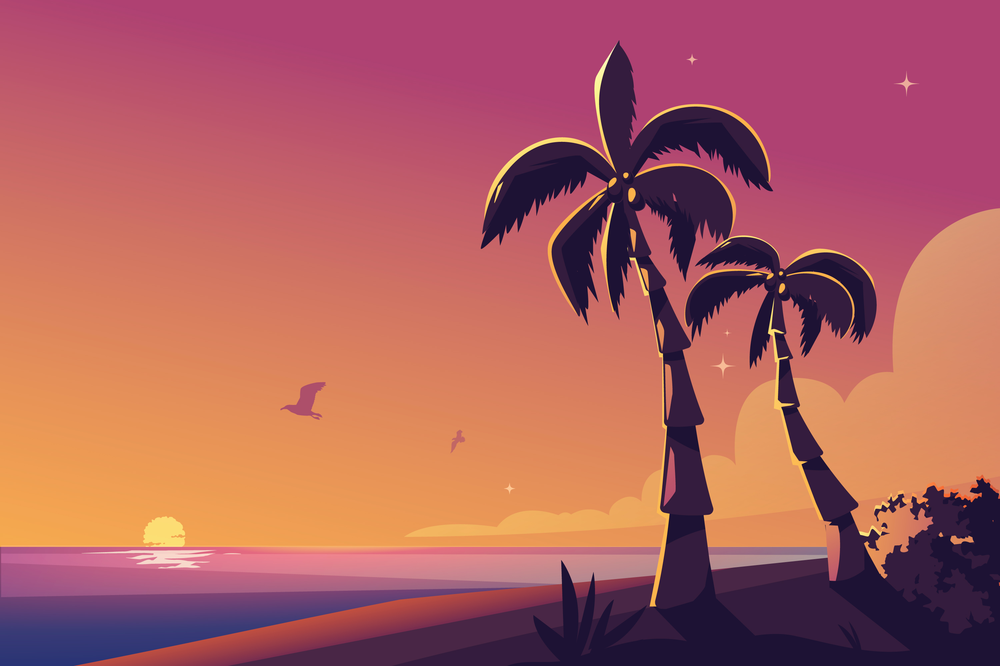](https://www.freepik.com/free-vector/hand-drawn-tropical-sunset-background_58569823.htm "Hand drawn tropical sunset background by freepik")

### Precios de trayectos en barco

Tus _hauka_ no necesitan siempre comprar un barco y lanzarse al mar con él, también puedo contratar a un capitán con barco y tripulación y hacer un viaje por el mar, pero tiene un precio y no es barato. Los precios son por casilla recorrida por tripulante.

* **Viaje corto (20 mo):** Cortísimo viajes para cruzar la bahía, llegar a un islote cercano, cruzar un río, no debería ser más allá de una hora. Seguramente hay un servicio que hace el trayecto con frecuencia o se puede pagar a un pescador local para hacerlo.
* **Viaje siguiendo la costa (80 mo):** A veces la manera más sencilla de ir de una punta a otra de una isla es rodearla en barco, sobre todo si en el centro hay una gran cordillera sin pasos de montaña. Son viajes rápidos (1 casilla o dos) y baratos que siguen la costa y salvo arrecifes no suelen tener problemas. 
* **Viaje entre islas del mismo archipiélago (100 mo):** Los diferentes mini archipiélagos que forman el gran archipiélago de _Hua Tarakona_ están formados de islas, normalmente, muy cercanas entre sí. Moverse por el cada conjunto de islas es muy fácil y sencillo si se va de isla en isla. Son viajes algo más largos (3 o 4 casillas), pero raramente se adentran en mar abierto.
* **Viaje entre archipiélagos atravesando mar abierto (150 mo):** Las distancias se acrecentan, ya que abandonamos un archipiélago para llegar a otro. Estos viajes tienen ya sus riesgos y no todo el mundo puede afrontarlos. Suponen una mayor preparación y mejores embarcaciones al estar varios días en alta mar.
* **Viaje a lo desconocido:** Estas grandes aventuras no tienen un precio fijo y quedan a discreción del DJ. Quizas tengan un patrón que sufraga los gastos o tus _hauka_ con sus familias y amigos tengan que abandonar su isla por una erupción volcánica y lanzarse al mar. 

## Clima
En la mayoría de las islas del Pacífico solo existen dos estaciones, verano (_kau_) e invierno (_hooilo_). Las temperaturas no varían muchos entre estaciones (de 25 a 30 °C). La única diferencia entre ellas es la cantidad de lluvia.

Las únicas zonas donde las temperaturas son bajas, incluso puede haber nieve, son en las cimas de las montañas donde la temperatura puede bajar a casi 0 °C.

XXX

### Ciclones

Los ciclones no son eventos que deberían aparecer aleatoriamente, sino que deberían ser parte de la aventura y deberías tener claro que va a pasar y a que deben enfrentarse tus _hauka_ para superarlo. Veamos algunas ideas que puedes aplicar:

* En principio, si son buenos marinos podrían tratar de sobrevivir al ciclón, pero si lo has metido en partida, no creo que sea para que se libren de él simplemente navegando habilidosamente. Por muy bien que lo hagan, la embarcación debería empezar a desmoronarse ante los embates de las olas y los furiosos vientos.
* Si tratan de **salvar a otros tripulantes que haya caído al agua** y se estén ahogando con una tirada de FUE+DES. Si tuvieran que sumergirse para sacarlos a flote podría ser una de FUE+ESP. Se puede ayudar si se lanza al agua.
* Puede que tengan **algún objeto mágico** o les deba un **favor algún favor alguna criatura o divinidad marina**. Este sería un buen momento para cobrárselo. La tirada la marcará la manera de usar el objeto mágico o de invocar al ser marino.[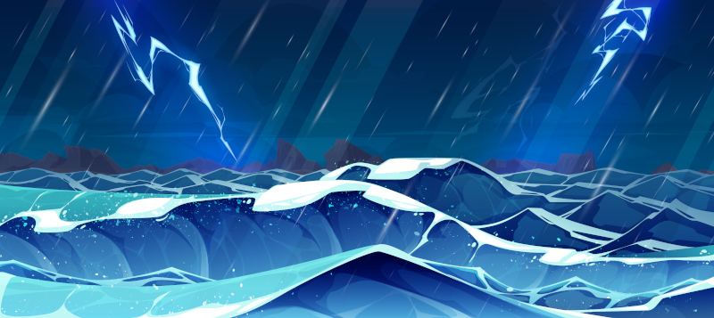](https://www.freepik.com/free-vector/cartoon-stormy-seascape-rainfall-lightning_45244395.htm "Cartoon stormy seascape rainfall and lightning by upklyak")

* Quizás quieran **salvar algo importante** que lleven a bordo. En ese caso puedes pedir una tirada FUE+DES para moverse en un barco hundiéndose mientras arrecia el temporal. Puedes meter penalizadores si es muy grande y exigirles que busquen algún método de hacer que flote o se irá al fondo del mar.
* Si están cerca de la costa, tendrán que tratar de **evitar los acantilados** a los que las olas les están llevando. Necesitarán FUE+ESP para poder nadar a pesar del cansancio sorteándolos y llegando sanos y salvos a la playa. Si van en la misma embarcación o en restos de ella se podrá ayudar, pero si nadan es muy difícil que alguien pueda ayudarte, ya tienen suficiente con mantenerse a flote. Eso sí, pueden intentar rescatarte.
* Puede tratar de **montar algo que flote** a base de restos de la nave con una tirada de FUE+INT con un penalizador de -1 por cada pasajero por encima de 2 _(Aquí Jack sí que cabe en la tabla)_. En este caso se puede también ayudar. 

Un ciclón puede terminar en el naufragio de la embarcación de tus _hauka_. El naufragio no debería ser el fin de un viaje, solo una etapa inesperada. En caso de naufragio puedes aplicar como quieras estas ideas:

* Aparecerán en una playa desierta donde no parece que haya civilización cerca. Estarán cansados (6) y desorientados y deshidratados (enfermos 4).
* Pierden todo el equipo que no llevarán encima a excepción de un objeto de tamaño 2 que pudieron rescatar en el último momento y que aparecerá a su lado cuando despierten.
* Llegarán a la playa objetos de todos (o que pudiera haber en la embarcación) tus _hauka_ por un tamaño máximo de 4, es decir uno 3 y otro de 1, 2 de tamaño 2, etc.
Si no quieres meter la típica tormenta y quieres algo dramático recuerda que un tsunami podría tener los mismos efectos. _Hua Tarakona_ es una zona de gran actividad sísmica y volcánica y tus _hauka_ no deberían extrañarse si tremendas erupciones volcánicas o gigantescos tsunamis hunden su barco.

## Tecnología
La tecnología que van a poder tus _hauka_ en esta ambientación es bastante diferente a la que podrían tener en el manual básico, es por ello que debes tener algunos puntos claros a la hora de decidir a qué objetos pueden acceder y a cuáles no. Aquí tienes algunas sugerencias importantes a la hora de viajar.

**La rueda no está desarrollada**. Los isleños hacen rodar troncos para mover objetos pesados como canoas y catamaranes, pero no lo han aplicado en la creación de carros, en parte debido a la falta de fuertes animales de tiro.

La **brújula**, tan útil en la navegación, **es una desconocida** para los isleños. Aun así son excelentes navegantes que saben leer y guiarse por las estrellas. También han desarrollado importantes conocimientos meteorológicos que les permiten predecir con exactitud el tiempo.

Las **embarcaciones son totalmente de madera**, ya que como ya hemos dicho en capítulos anteriores, el hierro es escaso y se sabe poco de su forja.

Han convertido el tejido de las hojas de palma en un arte que les permite crear todo tipo de objetos de tela, desde resistentes velas de barco a cómoda ropa, pasando por fuertes cestas y mochilas.

Por último, las herramientas de **óptica tampoco están disponibles**. No hay ni catalejos, ni lupas y tampoco espejos para hacer señales. Podrían usarse rocas brillantes como cuarzo para hacer señales.

***

# Bestiario

El mundo de _Hua Tarakona_ es un mundo peligroso plagado de seres extraños, poderosos y a veces peligrosos y agresivos.

Los monstruos terrestres de esta ambientación no tienen una estación predilecta, ya que casi no hay cambios entre _kau_ (verano) y _hooilo_ (invierno), en su lugar XXX.

Los monstruos marinos se ven afectados por las mareas, en vez de por XXX, siendo más activos en su marea y obteniendo los beneficios que obtendría un monstruo en su estación.

Los monstruos de esta ambientación pueden ser terrestres, acuáticos o anfibios. Este dato viene marcado por su tipo.

## Kupua, espíritus diabólicos y vengativos
Los kupuas son espíritus normalmente diabólicos y vengativos con poderes de cambiaformas. No son grandes espíritus, sino menores con aspecto y ciertas capacidades mágicas relacionadas con su forma alternativa. 

Hay kupuas de todo tipo, desde animales como perros o jabalíes a plantas o incluso nubes y rocas. Si se transforma en ave puede volar y tiene garras terribles, si se transforma en tiburón puede nadar como un pez y tiene terribles dientes.

Suelen ser más embaucadores y tramposos que agresivos y beligerantes, pero si tienen que atacar lo harán sin dudar.

### Kupua de agua

Suelen transformarse en animales marinos como tiburones o mantarrayas. Suelen estropear las redes y aparejos de pesca de los pescadores y jugarles malas pasadas a los bañistas y surferos. Se dice que no pueden abandonar el agua y por lo menos una de sus extremidades tiene que estar en contacto con el agua.

* **Nivel/Tipo:** XXX / Acuáticos
* **Botín:** XXX
* **PM/PG:** X / X
* **Iniciativa:** XXX
* **Salud:** XXX
* **FUE/DES/INT/ESP:** X / X / X / X
* **Impactar/Daño:** dX+dX / dX
* **Defensa:** XXX
* **Habilidad especial:** **Forma acuática.** Pueden respirar bajo el agua y nada a gran velocidad.
* **Terreno habitual:** Playas, ríos navegables y riachuelos 
* **XXX/Marea:** XXX

### Kupua de aire

Pueden transformarse en águilas y halcones de gran tamaño con terribles garras. Se conocen hasta casos de gallos realmente agresivos.
* **Nivel/Tipo:** XXX / Terrestre
* **Botín:** XXX
* **PM/PG:** X / X
* **Iniciativa:** XXX
* **Salud:** XXX
* **FUE/DES/INT/ESP:** X / X / X / X
* **Impactar/Daño:** dX+dX / dX
* **Defensa:** XXX
* **Habilidad especial:** **Vuelo.** Pueden volar a gran velocidad en su forma de ave.
* **Terreno habitual:** Montañas y acantilados de los litorales
* **XXX/Marea:** XXX

### Kupua de Fuego

Estos kupuas no tienen una forma alternativa, directamente su cuerpo son de roca al rojo vivo y/o lava.

* **Nivel/Tipo:** XXX / Terrestre
* **Botín:** XXX
* **PM/PG:** X / X
* **Iniciativa:** XXX
* **Salud:** XXX
* **FUE/DES/INT/ESP:** X / X / X / X
* **Impactar/Daño:** dX+dX / dX
* **Defensa:** XXX
* **Habilidad especial:** **Lava como sangre.** Son seres de lava y rocas incandescentes, así que son inmunes al fuego y sus ataques hacen XXX extra de daño de fuego.
* **Terreno habitual:** Volcanes
* **XXX/Marea:** XXX

### Kupua de Nube

Pueden pasarse en una especie de forma gaseosa o de nube que les hace intangibles y levitar y ser movidos por los vientos.

* **Nivel/Tipo:** XXX / No tienen tipo fijo
* **Botín:** XXX
* **PM/PG:** X / X
* **Iniciativa:** XXX
* **Salud:** XXX
* **FUE/DES/INT/ESP:** X / X / X / X
* **Impactar/Daño:** dX+dX / dX
* **Defensa:** XXX
* **Habilidad especial:** **Gaseoso.** En su forma gaseosa son totalmente invulnerables, pero se mueven muy lento y están a merced de los vientos.
* **Terreno habitual:** Montañas y mar abierto
* **XXX/Marea:** XXX

### Kupua plantas

Estos kupuas llevan años o siglos en su forma alternativa vegetal y han olvidado como eran antes y como destransformarse. Normalmente, juegan malas pasadas a los _hauka_, por ejemplo, con frutos de pinta deliciosa y sabor horrible o robando armas y equipo a los viajeros que acampan cerca. 

Los más antiguos pueden ser más agresivos y atrapar entre sus zarzas y lianas a la gente para internar asfixiarlos.

* **Nivel/Tipo:** XXX / Terrestre*
* **Botín:** XXX
* **PM/PG:** X / X
* **Iniciativa:** XXX
* **Salud:** XXX
* **FUE/DES/INT/ESP:** X / X / X / X
* **Impactar/Daño:** dX+dX / dX
* **Defensa:** XXX
* **Habilidad especial:** **Zarcillos.** Pueden animar sus zarcillos para usarlos como manos para coger objetos y llevárselo. También pueden usarlos para atrapar a sus víctimas y asfixiarlos XXX
* **Terreno habitual:** Selvas virgenes
* **XXX/Marea:** XXX

_*Puedes hacerlos acuáticos y que sean grandes bloques de algas sargazos que pueden rodear las embarcaciones._

### Kupua XXX

XXX

* **Nivel/Tipo:** XXX / XXX
* **Botín:** XXX
* **PM/PG:** X / X
* **Iniciativa:** XXX
* **Salud:** XXX
* **FUE/DES/INT/ESP:** X / X / X / X
* **Impactar/Daño:** dX+dX / dX
* **Defensa:** XXX
* **Habilidad especial:** **XXX.** XXX
* **Terreno habitual:** XXX
* **XXX/Marea:** XXX

### Kupua XXX

XXX

* **Nivel/Tipo:** XXX / XXX
* **Botín:** XXX
* **PM/PG:** X / X
* **Iniciativa:** XXX
* **Salud:** XXX
* **FUE/DES/INT/ESP:** X / X / X / X
* **Impactar/Daño:** dX+dX / dX
* **Defensa:** XXX
* **Habilidad especial:** **XXX.** XXX
* **Terreno habitual:** XXX
* **XXX/Marea:** XXX

### Kupua XXX

XXX

* **Nivel/Tipo:** XXX / XXX
* **Botín:** XXX
* **PM/PG:** X / X
* **Iniciativa:** XXX
* **Salud:** XXX
* **FUE/DES/INT/ESP:** X / X / X / X
* **Impactar/Daño:** dX+dX / dX
* **Defensa:** XXX
* **Habilidad especial:** **XXX.** XXX
* **Terreno habitual:** XXX
* **XXX/Marea:** XXX
[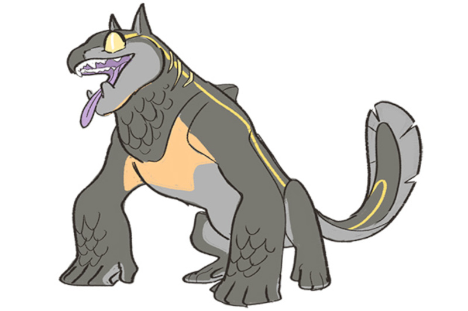](https://www.deviantart.com/dream-piper/art/ProjChim-Chimera-Forms-Close-Up-687419827 "ProjChim: Chimera Forms Close-Up By Dream-Piper")## Moʻo, espíritu acuático cambiaforma
Las _moʻos_ son entidades multimorfas y suelen adoptar la forma de reptiles gran tamaño, de humanos y hasta de pequeños gecos. Por eso se les considera a veces como kupuas, pero son veneradas como _aumakuas_ (espíritus familiares). Las más antiguas y poderos suelen tener poderes sobre el clima y el agua. Son anfibias y suelen frecuentar pequeñas masas de agua dulce como estanques, pozas o remansos de los ríos.

Cuando una moʻo muere, su cuerpo se petrifica y se convierte en parte del paisaje, lo cual explica las extrañas formas que pueden tomar las piedras.

Suelen ser espíritus burlones y vividores que disfruta de la vida y gustan de relacionarse con los _hauka_ que visitan las cascadas y ríos donde suelen vivir. Llegan incluso a coquetear e incluso seducir y mantener relaciones con los _hauka_ que las visitan. 

Según los cuentos, cada moʻos tiene una habilidad excepcional, algo que hacen extraordinariamente bien, quizás sean unas surfistas increíbles, grandes artesanas o excepcionales cantantes. Puede que tus _hauka_ tengan que buscar una _moʻo_ con habilidades especiales que les ayude.
### Humanoide

* **Nivel/Tipo:** XXX / Terrestre
* **Botín:** XXX
* **PM/PG:** X / X
* **Iniciativa:** XXX
* **Salud:** XXX
* **FUE/DES/INT/ESP:** X / X / X / X
* **Impactar/Daño:** dX+dX / dX
* **Defensa:** XXX
* **Habilidad especial:** **Habilidad excepcional.** Hay una habilidad, destreza o artesanía que se le da excepcionalmente bien y tira siempre con un +4.
* **Terreno habitual:** Riachuelos
* **XXX/Marea:** XXX

### Gran lagarto

* **Nivel/Tipo:** XXX / Anfibio
* **Botín:** XXX
* **PM/PG:** X / X
* **Iniciativa:** XXX
* **Salud:** XXX
* **FUE/DES/INT/ESP:** X / X / X / X
* **Impactar/Daño:** dX+dX / dX
* **Defensa:** XXX
* **Habilidad especial:** **Habilidad excepcional.** Hay una habilidad, destreza o artesanía que se le da excepcionalmente bien y tira siempre con un +4.
* **Terreno habitual:** Riachuelos
* **XXX/Marea:** XXX

## Nanaue, escualiántropos 
[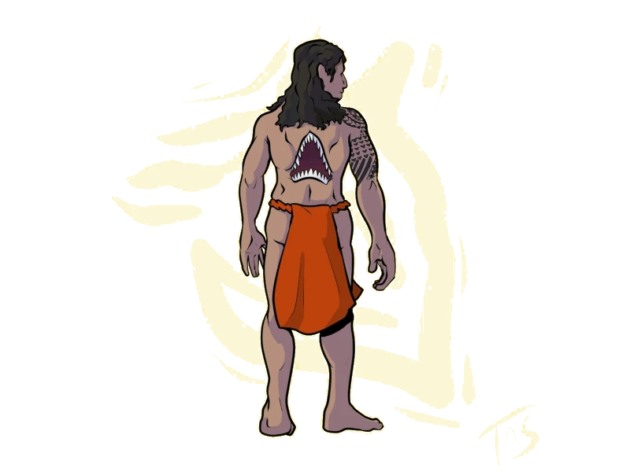](https://mythus.fandom.com/wiki/Nanaue "Nanau by Knightkamia")

A este monstruo se le describe como un hombre con la boca de un tiburón en la espalda que puede transformarse en un tiburón gigante y nadar grandes distancias a mucha velocidad.

Siente una tremenda ansía por la carne humana, por lo que siempre andan como tiburones en la costa vigilando a los pescadores o como humanos por caminos cercanos a la costa a la caza de _hauka_ solitarios. Tiene predilección por la carne podrida y se dice que matan a sus víctimas y dejan sus cuerpos en cuevas y cavidades para darse un festín cuando la carne se pudre.

Sus ansias de cazar aumentan durante su marea, la pleamar nocturna, con lo que suelen atacar de noche a las presas que han vigilado y seguido durante el día. Debido a ser un cambiaformas prefiere intentar engañar a sus víctimas haciéndose pasar un viajero buscando un fuego donde pasar la noche.

La gran boca de tiburón en su espalda es lo único que los identifica como _nanaues_, por lo que siempre llevan ropa, como una capa, una camisa o una _tiputa_, para taparla.
* **Nivel/Tipo:** 7 / Anfibio
* **Botín:** XXX
* **PM/PG:** X / X
* **Iniciativa:** XXX
* **Salud:** XXX
* **FUE/DES/INT/ESP:** 8 / 8 / 6 / 8
* **Impactar/Daño:** d8+d8 / d8
* **Defensa:** 4
* **Habilidad especial:** **Grandes nadadores.** Pueden cubrir grandísimas distancias (unos 200 km) en 1 día.
* **Terreno habitual:** Playa, costa y acantilados litorales
* **Marea:** Pleamar nocturna
[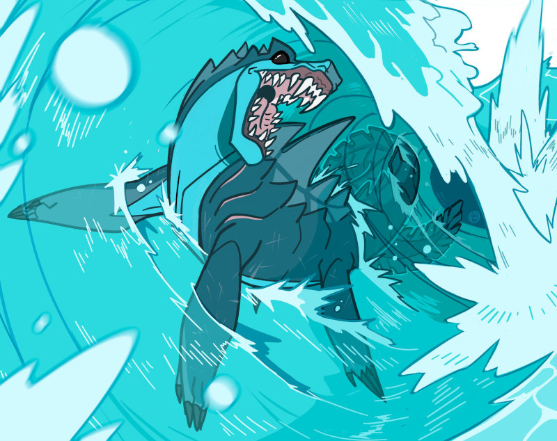](https://www.deviantart.com/dream-piper/art/Commission-Taniwha-1006296281 "Commission: Taniwha By Dream-Piper")

## Taniwha, dragón protector
Los _taniwha_ son grandes seres sobrenaturales multimorfo anfibios. Cuando están en tierra tienen forma de reptil gigantesco con rasgos dragonescos. Cuando están en el agua suelen parecerse más a plesiosaurios principalmente con aletas como extremidades.

Viven en pozas profundas de ríos, cuevas oscuras o en el mar, especialmente en lugares con corrientes peligrosas u olas gigantes.

Suelen ser considerados _kaitiaki_ (guardianes protectores) muy respetados, pero hay algunos peligrosos y malvados, que, por ejemplo, secuestran personas para que les sirvan.
Algunos llegan a tener un gran tamaño de forma que tus _hauka_ pueden viajar en su espalda, si fuera necesario.

Son grandes, cavadores pudiendo crear canales acuáticos, abriendo cuevas incluso creando puertos. Se sabe de _taniwha_ que han creado puertos para las comunidades que protegen o castigado a otras desviando ríos del que vivían dichas comunidades.

Como los _moʻo_, cuando muere, su cuerpo se petrifica y se convierte en parte del paisaje pudiendo formar incluso islote o grandes monolitos de piedra.

* **Nivel/Tipo:** 7 / Anfibio
* **Botín:** XXX
* **PM/PG:** 16 / 40
* **Iniciativa:** 8
* **Salud:** 12
* **FUE/DES/INT/ESP:** 10 / 8 / 6 / 8
* **Impactar/Daño:** d10+d8 / d10
* **Defensa:** 4
* **Habilidad especial:** **Capacidades mágicas.** Pueden usar todos los Conjuros de Magia de su marea predilecta.
* **Terreno habitual:** Acantilados, mar abierto, playas y ríos navegables
* **Marea:** Cada _taniwha_ tiene su marea predilecta.
## Animales
Las islas no tienen grandes animales terrestres que pudieran ser un problema para tus _hauka_, pero todo eso cambia en el mar, donde tiburones, morenas o mantarrayas pueden ser muy peligrosos.

### Tiburón

Las aguas del archipiélago están llenas de tiburones de todo tipo de formas y tamaños desde el tiburón ballena que se alimenta pequeños crustáceos a los agresivos tiburón toro. Solo los más afresivos son un problema para tus _hauka_ y mejor no caigan al agua si estos merodean cerca.

* **Nivel/Tipo:** XXX / Acuático
* **Botín:** XXX
* **PM/PG:** X / X
* **Iniciativa:** XXX
* **Salud:** XXX
* **FUE/DES/INT/ESP:** X / X / X / X
* **Impactar/Daño:** dX+dX / dX
* **Defensa:** XXX
* **Habilidad especial:** XXX
* **Terreno habitual:** XXX
* **Marea:** XXX

### Mantarraya

Estos increíbles peces emparentados con los tiburones se caracterizan por su extraña forma aplanada y su cola con un aguijón venenoso. 

Su capacidad de salto fuera de agua les permite atacar a seres que no estén dentro del agua, por ejemplo encima de una canoa.

* **Nivel/Tipo:** XXX / Acuático
* **Botín:** XXX
* **PM/PG:** X / X
* **Iniciativa:** XXX
* **Salud:** XXX
* **FUE/DES/INT/ESP:** X / X / X / X
* **Impactar/Daño:** dX+dX / dX
* **Defensa:** XXX
* **Habilidad especial:** **Cola venenosa.** Al final de su cola tienen un dardo afilado con veneno. XXX
* **Terreno habitual:** Costa y arrecifes
* **Marea:** Pleamar diurna

### Almeja gigante

No hay héroe, heroína o semidivinidad en los mitos del archipiélago que no se haya enfrentado a una almeja gigante de entre 5 a 15 metros. Son de gran tamaño y los músculos de sus conchas son tremendamente poderosos. Si te atrapa con ellos será muy difícil que puedas soltarte y también le permiten nadar rápidamente por el fondo marino.

* **Nivel/Tipo:** XXX / Acuático
* **Botín:** XXX
* **PM/PG:** X / X
* **Iniciativa:** XXX
* **Salud:** XXX
* **FUE/DES/INT/ESP:** X / X / X / X
* **Impactar/Daño:** dX+dX / dX
* **Defensa:** XXX
* **Habilidad especial:** XXX
* **Terreno habitual:** Costa y arrecifes
* **Marea:** Pleamar nocturna

## Monstruos del manual básico

 

Puedes usar los monstruos del manual básico de Ryuutama en tus aventuras en _Hua Tarakona_, pero deberías, por lo menos, hacer algunos cambios estéticos para adaptarlos a esta ambientación. Veamos algunos ejemplos:

* Casi todas las plantas fantasma pueden ser usadas con pequeñas modificaciones en las junglas de _Hua Tarakona_, sobre todo en las zonas de selva virgen. Quizas la rosa tiránica puede convertirse en una rafflesia tiránica.
* Los _piedremonios Moai_, podrían tener forma de tótem _tiki_ en vez de caras de la isla de Pascua.

Los **animales de este mundo no son grandes enemigos** a no ser que sean acuáticos. No hay lobos, ni osos, ni tigres. El animal terrestre más peligroso es el jabalí. La cosa cambia cuando entramos en el agua donde tenemos peligrosas bestias.

Para los **PNJ como ladrones de camino, caballeros, milicianos, etc.** debes recordar a la hora de describirlos que no deberían portar útiles, armas y armaduras de metal.
Los **no-muertos como zombis o vampiros no son normales como monstruos** en _Hua Tarakona_, los muertos suelen ser reverenciados como _aumakuas_ (espíritus familiares). Los cadáveres no se levantan y atacan a los vivos, sino que suelen aparecerse como fantasma para aconsejar o atormentar a los descendientes que se lo merecen.

No hay muchos animales acuáticos en el manual básico, como el Pezespada, pero hay toda una serie de monstruos que podrían tener su versión acuática en _Hua Tarakona_.

* Las **anacondas** son buenas nadadoras y podrías encontrarlas en los ríos navegables y pantanos de las islas.
* El **kabuto maximillion** puede ser usados como **gigantescos cangrejos** de mar y rio.
* La **Dama Lechera** es una vaca submarina, pero como los rumiantes no son conocidos en las islas de _Hua Tarakona_, puedes sustituirlo algún tipo de **deidad marina femenina** como Hina-ika, madre de Maui, o simplemente **sirenas**.
* La **tortuga jardín** puede convertirse en una **tortuga islote** que nade por el mar y cuyo caparazón forme un islote lleno de plantas y árboles. Perfectamente tus _hauka_ podrían desembarcar en una pequeña isla que se mueve y termina siendo una tortuga gigante.
* Los **fósiles petrificados** pueden ser de **animales marinos extintos** hace milenios como megalodones que ataquen a embarcaciones.

> Recuerda que «tu mesa, tus reglas». Eres libre de meter cualquier tipo de monstruo de cualquier ambientación. En _Hua Tarakona_ hay miles de islas, unas más mágicas y misteriosas que otras y donde hay cabida a que estén pobladas por todo tipo de seres y monstruos. 
> Puede haber sin problemas, por ejemplo, una isla donde encalló un barco vikingo y donde estos han sobrevivido desde hace siglos aislados del resto del mundo y que ahora salgan a atacar y saquear a otras islas en sus _drakars_. 

***

# Epílogo
## Planteamiento de las aventuras

Las aventuras en el mundo de _Hua Tarakona_ puedes plantearlo de maneras diferentes. Por un lado, como un mundo independiente en el que tus _hauka_ corren aventuras en ellas.

Pero quizas ya tengas tu propio mundo con sus propias reglas y con tu grupo de personajes ya creados. En ese caso puede plantearlo como una parte de tu mundo, las lejanas islas al otro lado del mar. Tus personajes serán unos bárbaros extranjeros cubiertos de metal que no saben nadar ni guiarse por las estrellas.

## Licencia

«Makai Mauka» está hecho bajo licencia [CC BY 4.0](https://creativecommons.org/licenses/by/4.0/legalcode.es). Puedes usar este contenido en cualquier forma que te permita la licencia incluso comercial, siempre que incluyas el siguiente texto de atribución:

 > _Este trabajo está basado en la ambientación para el juego de rol Ryuutama «Makai Mauka» creada por Jorge Monclús y está disponible de forma gratuita en [https://ryuutama.gwannon.com](https://ryuutama.gwannon.com) y el código original puede obtenerse en [https://github.com/gwannon/ideasRoleras/tree/main/MakaiMauka](https://github.com/gwannon/ideasRoleras/tree/main/MakaiMauka). Está licenciada para nuestro uso bajo una licencia Creative Commons Atribución 4.0 Internacional cuyo texto legal puede verse en [https://creativecommons.org/licenses/by/4.0/legalcode.es.Licencia](https://creativecommons.org/licenses/by/4.0/legalcode.es.Licencia) de Creative Commons_

Todo el código fuente puedes encontrarlo en [GitHub](https://github.com/gwannon/ideasRoleras/tree/main/MakaiMauka)

Esta ambientación se ha desarrollado tratando de seguir los preceptos y normas que ha establecido el autor en su [página web](https://kotohi.com/ryuutama/licensing/).

## Inspiración

Muchos de los elementos de esta ambientación están basados en un proyecto anterior que desarrolle para [MausRitter](https://losing-games.itch.io/mausritter).

Así que si te ha gustado este «setting» para Ryuutama, quizás debieras darle un vistazo a [MausTiki](https://maustiki.gwannon.com/), para llevar tus aventuras ratoniles a las islas del Pacífico.

## Agradecimientos

Quiero dar agradecimiento a:

* [@Rataunderground](https://mastorol.es/@Rataunderground@neopaquita.es) por sus consejos de diseño en la portada.
* [@dangordillo.itch.io](https://bsky.app/profile/dangordillo.itch.io) por sus ideas para nombres del mundo.
## Define los velos y herramientas de seguridad

> Antes de iniciar la aventura, todos los miembros de la mesa debéis definir las herramientas de seguridad que queráis utilizar y los temas o escenas que deben evitarse durante la partida para que nadie se sienta incómodo durante la sesión de juego. Podéis escoger los elementos que no queráis incluir durante la partida previamente o podéis utilizar un mecanismo de seguridad cuando estos aparezcan.

> No importa cuál sea la herramienta de seguridad o el tipo de mecanismo utilicéis, pero es importante recordad que el rol es un juego y todos deben pasarlo bien. En caso de que consideréis entre todos que no necesitáis una herramienta de seguridad tampoco pasa nada, pero en ese caso es necesario que el director de juego se asegure de forma más activa de que ningún miembro de la mesa se sienta incómodo o lo esté pasando mal.

> Por [FaustoRolero](https://twitter.com/FaustoRolero)

Aquí tienes algunas otras herramientas de seguridad que puedes usar: [DEVIR](https://devir.es/herramientas-seguridad-rol) y [NetCon](https://www.netconplay.com/guia-de-buenas-practicas/herramientas-en-la-mesa/)
## Surf

El surf que se representa aquí con trucos, carreras y tablas rápidas es más cercano al surf moderno competitivo. Nada tiene que ver con el que practicaban los antiguos polinesios. Me he tomado la licencia de meter esos elementos para darle más importancia y acción y poder hacer escena de tensión sobre tablas de surf. También me parecía que era una buena excusa para que tus _hauka_ se embarcaran en un viaje. Suena bastante bien que vayas de isla en isla buscando la ola perfecta y sintiendo como te embarga el _hopupu_.

Pero desde luego esto está muy lejos de la realidad de los primeros tiempos del surf en la polinesia y tiene unos toques muy eurocentrista. Es por ello que puedes obviar toda esta parte y dejarlo como un mero divertimento y un medio de transporte.

## Atribución de contenidos

En cumplimiento de las licencias de uso del material de este documento este es el listado de atribución de ese material.

* Terminología por [Preply](https://preply.com/es/blog/palabras-hawaianas/)
* Hand drawn zen doodle pattern illustration by [freepik](https://www.freepik.com/free-vector/hand-drawn-zen-doodle-pattern-illustration_65393567.htm)
* Black and white pattern design by [0melapics](https://www.freepik.com/free-vector/black-white-pattern-design_893508.htm)
* Flat design lattice pattern by [freepik](https://www.freepik.com/free-vector/flat-design-lattice-pattern_31085871.htm)
* Flat design lattice pattern by [freepik](https://www.freepik.com/free-vector/flat-design-lattice-pattern_31085878.htm)
* Fairy shark By [RAPHTOR](https://www.deviantart.com/raphtor/art/Fairy-shark-790661741)
* Hand drawn zen doodle pattern design by [freepik](https://www.freepik.com/free-vector/hand-drawn-zen-doodle-pattern-design_69124915.htm)
* Flat design maori tattoo pattern design by [freepik](https://www.freepik.com/free-vector/flat-design-maori-tattoo-pattern-design_28492105.htm)
* Jungle Swamp By [Bear1037](https://www.deviantart.com/bear1037/art/Jungle-Swamp-482759290)
* Sketch of Fijian outrigger canoe with lateen sail by [Museum of New Zealand](https://picryl.com/media/sketch-of-fijian-outrigger-canoe-with-lateen-sail-eeedcb)
* Tikiwhakapakoko by [John White](https://picryl.com/media/tikiwhakapakoko-626d5d)
* Humpback whale watercolor painting in watercolor banner vector by [rawpixel.com](https://www.freepik.com/free-vector/humpback-whale-watercolor-painting-watercolor-banner-vector_17433815.htm)
* Commission: Taniwha By [Dream-Piper](https://www.deviantart.com/dream-piper/art/Commission-Taniwha-1006296281)
* ProjChim: Chimera Forms Close-Up By [Dream-Piper](https://www.deviantart.com/dream-piper/art/ProjChim-Chimera-Forms-Close-Up-687419827)
* Nanaue by [Knightkamia](https://mythus.fandom.com/wiki/Nanaue)
* Manaia pounamu carving by [Sarang](https://en.wikipedia.org/wiki/Manaia_(mythological_creature)#/media/File:Pounamu_9.jpg)
* Tótem tiki hawaiano amarillo [vexels](https://es.vexels.com/png-svg/vista-previa/220378/totem-tiki-hawaiano-amarillo)
* Leiomano by [Jen](https://commons.wikimedia.org/wiki/File:Leiomano.jpg)
* Board game collection by [freepik](https://www.freepik.com/free-vector/board-game-collection_10115170.htm)
* Medieval weapons by [ddraw](https://www.freepik.es/vector-gratis/armas-medievales_1015205.htm)
* Model of outrigger canoe from Hawai‘i by [Joel Abroad](https://www.flickr.com/photos/40295335@N00/10010587593) con licencia [CC BY-NC-SA](https://creativecommons.org/licenses/by-nc-sa/2.0/deed.es)
* Kayak canoe design illustration set by [pikisuperstar](https://www.freepik.com/free-vector/kayak-canoe-design-illustration-set_18274734.htm)
* Flat candelaria tamales collection by [freepik](https://www.freepik.com/free-vector/flat-candelaria-tamales-collection_21530497.htm)
* Neanderthal primitive rock weapon flat set by [pch.vector](https://www.freepik.com/free-vector/neanderthal-primitive-rock-weapon-flat-set_12291204.htm)
* Tropical island cartoon poster with rising sun above sea vector illustration by [macrovector](https://www.freepik.com/free-vector/tropical-island-cartoon-poster-with-rising-sun-sea-vector-illustration_37366207.htm)
* Volcanic lava erupt landscape prehistoric volcano by [upklyak](https://www.freepik.com/free-vector/volcanic-lava-erupt-landscape-prehistoric-volcano_375731237.htm)
* Silueta de niña hawaiana de diseño plano por [freepik](https://www.freepik.es/vector-gratis/silueta-nina-hawaiana-diseno-plano_42112447.htm)
* Vector de ilustración de cesta de viaje vintage, remezclado de la obra de arte de Vincent P. Rosel por [rawpixel.com](https://www.freepik.es/vector-gratis/vector-ilustracion-cesta-viaje-vintage-remezclado-obra-arte-vincent-p-rosel_16335422.htm)
* Silueta de niña hawaiana de diseño plano de [freepik](https://www.freepik.es/vector-gratis/silueta-nina-hawaiana-diseno-plano_42112452.htm)
* Cartoon stormy seascape rainfall and lightning by [upklyak](https://www.freepik.com/free-vector/cartoon-stormy-seascape-rainfall-lightning_45244395.htm)
* Hand drawn tropical sunset background by [freepik](https://www.freepik.com/free-vector/hand-drawn-tropical-sunset-background_58569823.htm)

***
Makai Mauka 

«Makai Mauka» es una ambientación para el juego de rol Ryuutama basado en los mitos y leyendas de las islas de la polinesia.

Este suplemento contiene:

1. Una ambientación completa 
2. Nuevas profesiones, hechizos, equipo y terrenos adaptados a los mitos polinesios
3. Monstruos basados en la mitología de toda la polinesia
4. Una aventura introductoria a la ambientación 

