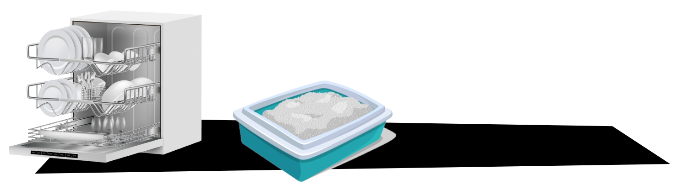

# Hay nabucodosorcitos en mi macetero

«Hay nabucodosorcitos en mi macetero» es un **mini-juego de rol** para **une DM y hasta cuatre jugadores**. En este juego seréis unos nabucodosorcitos (nabucos para abreviar), unos **insectos inteligentes** que viven en Barrio Sésamo en los maceteros y las macetas de las casas.

XXX

> Los DJ son llamados EPI, ya que en los sketches donde se cuentan las historias de los nabucos, Epi (de Epi y Blas) es una especie de narrador de sus aventuras.

Mientras que en otras ambientaciones de seres pequeños, estos suelen ser pequeños, listos y hábiles con las manos, los nabucos son totalmente distintos, son tontos, realmente tontos. Evolutivamente deberían estar extintos, pero por alguna razón sobreviven, por muchas tonterías que hagan.

## Sistema

XXX

Los resultados por encima de 12 o más son éxitos completos. Cuando tus jugadores saquen 12 o más, solo pueden decir que han sacado 12. Recuerda que solo te enseñaban a contar hasta 12. XXX

> Cuanto más tonto es lo que piensen hacer, más fácil será hacerlo.

Taparse con un paraguas para evitar la lluvia le es más difícil que taparse con el coche familiar porque otro nabuco les dijo que usaba el coche para ir a la panadería cuando llovía.

## Crear tu nabuco

Los nabuco se caracterizan por dos cosas, ser muy pequeños y ser muy tontos y especialmente literales, tanto que si hay un cartel de «No pisar el césped», puede que se ponga a andar por la hierba haciendo el pino y así no pisarla.

Arquetipos:

* **El líder.** XXX
* **El entusiasta.** XXX
* **El pesimista.** XXX
* **El que ha ido al cole.** Siempre hay un listillo que ha ido al cole y ha atendido en clase y puede usar una opción lógica y sencilla sin sufrir penalización. Por ejemplo, si llueve, puede decir «En el colegio de la nabucodosorcitos nos enseñaron que cuando llueve debemos usar un paraguas». Otra cosa es que el resto de sus compañeros abran sus paraguas, se monten encima como si fueran un pogo saltarín y empiecen a saltar en los charcos. 

### El grupo

Los nabucos son gregarios y se mueven en grupo con lo que deberéis que os une a todos los PJ. En Barrio Sésamo eran todos familia, pero podéis ser lo que os venga en gana, amigos, compañeros de trabajo o de colegio, del mismo equipo deportivo, …

XXX

### Anatomía de un nabuco

* **Alitas de _brilli-brilli_.** Son alas funcionales. El problema es que ningún nabuco se ha puesto a pensar que pueden usarlas para volar. Quizás si se cae de un tercer piso, el instinto de supervivencia les haga volar
* **Antenitas cuquis.** El número es totalmente aleatorio y no sirven para mucho. A los diseñadores le sobraban de otro muñeco y gastaron todas las que tenían.

### Experiencia, suerte y otras cosas que tienen los juegos de rol y que este no tiene

¿Experiencia? De eso poco aquí. Los nabucos no mejoran, la evolución se dio por vencida con ellos, así que fueron, son y serán tontos y no aprenden nunca de sus errores.

En cuanto a la suerte, toda la que pudieran tener se la gastan en salir vivos de sus estúpidos planes.

Como has visto en el sistema, se tira siempre con ventaja (2d8 y te quedas con el mejor), porque ser un nabuco ya es suficiente desventaja.

Opcionalmente, puedes darles tokens cuando hagan cosas muy estúpidas XXX.

### Interpretando nabucos

Ya sabemos que son muy tontos y muy literales. Si les han dicho que para salir de casa han de usar la puerta, seguramente la arrancarán de su quicio y la usarán de ariete para tirar una pared y poder salir.

Pero también son tremendamente dramáticos, si tienen hambre tienen muchísima hambre, casi se mueren de hambre. Si están cansados, no pueden ni moverse. Y el más mínimo problema es un obstáculo insalvable. 

Su capacidad de pasar del drama a la total alegría también es curiosa, pueden estar muriéndose de hambre y en cuanto encuentran medio donut empiezan a saltar y bailar de alegría.

## Equipo

XXX

> No hay reglas de peso ni necesitan mochilas para llevar el equipo, simplemente se agachan y cuando se levantan tienen el objeto de su equipo en la mano. Cuando se agachan es cuando el marionetista aprovecha a pegarles el objeto en el velcro que tienen en la mano.

### Reciclaje

La regla fundamental del equipo es el único equipo que pueden tener tus personajes son cosas que creen ellos recicladas, así que necesitan una pala deberán buscar en los cubos de reciclaje cosas como chapa de refresco y palillos de pinchos y juntarlos con pegamento y claro a escala nabucodosorcito.

Los nabucodosorcitos no controlan la electricidad, así que la única manera que conocen de generar energía son gomas elásticas y tracción animal, es decir ellos tirando/empujando como burros.

## Aventuras

La vida de los nabucodosorcitos es una aventura constante y cada día es un reto para estos pequeños seres. Para ti, bajar a comprar el pan es muy sencillo, pero una gesta titánica para los nabucodosorcitos.

### Mascotas y fauna urbana

Aunque los nabucos creen que pueden hablar con los animales y les obedecen, es realidad estos no los entienden y suelen irse rápidamente. Solo oyen chirriantes chillidos ultrasónicos tremendamente irritantes.

EPI y Blas y otros humanos son invisibles para los nabucos, XXX

## La muerte y los nabucos

Los nabucos son prácticamente inmortales no pueden morir de enfermedades, ni de heridas, ni nada por el estilo, pero si hay situaciones parecidas a la muerte. Por ejemplo, si un nabuco se cae de un sexto piso, hasta que regrese a donde estaban, con lo tontos que son, puede que se tiren días y días y días, con lo cual quedan fuera de la partida como si hubiera muerto.

El resto de nabucos le olvidarán casi al instante y no se acordarán de él hasta que vuelva.

## Modo marioneta

El modo marioneta es un modo de jugar especial, más loco, si es posible, que el modo normal. En el modo normal eres un insecto humanoide. En el **modo marioneta eres una marioneta como tal**, con lo que no tienes piernas, tus dedos son prensiles, sino que se te pegan las cosas porque tienen velcro y no te puedes alejar de uno de tus compañeros porque un solo marionetista controla a dos nabucos y los brazos le dan hasta donde le dan. 

No tienen piernas, son marionetas. De cintura para abajo están todos los artilugios de la marioneta y la mano que los controla. Así que no puede dar patadas altas o hacer claqué. Solo pueden hacer como que golpean algo (en realidad es el marionetista con su mano) o ruido de claqué y hacer como que bailan. Tampoco, no pueden saltar alto porque se vería el palo con el que las mueve el marionetista.

En tus muñecas hay dos palitos para mover tus brazos, con lo que olvídate de ponerte bolsas al hombro o cosa así.

XXX

## Generación de aventuras

Seamos sinceros, las aventuras de este juego no son grandes epopeyas épicas, son aventuras cortas de unas pocas sesiones como mucho. Así que aquí te ponemos unas tablas para generar semillas de aventuras, darles algunos detalles y ponerte a jugar rápidamente.

### Tabla de semillas de aventuras

|1d8|Semillas de aventuras|
|---|---|
|1|**Cuidado del macetero:** regar, arreglar o podar las plantas de macetero, buscar y esparcir abono, acabar con las plagas|
|2|**Viaje:** Os vais de vacaciones, de pícnic al parque, a los columpios, a las piscinas|
|3|**Limpieza:** Ir al lavadero de coches, a la lavandería, usar la manguera o la regadera|
|4|**Entretenimiento:** Noche en el autocine, concierto de los XXX|
|5|**Visitas:** Reciben visitas de parientes del pueblo, de un nabuco de intercambio de un país muy lejano, hacen de niñeras de unos nabuquitos, ...|
|6|**XXX:** XXX|
|7|**XXX:** XXX|
|8|**Cambios en la casa:** Hay obras en la casa donde viven los nabucos o, quizás, una mudanza con los cambios que supone que se vaya gente y que venga gente nueva y desaparezcan unas cosas y aparezcan otras diferentes.|

En esta tabla puedes encontrar sencillas semillas de aventuras que den inicio a la partida que vas a jugar. Como decimos siempre en este juego, pueden ser cosas muy simples, pero que para los nabucos pueden ser toda una odisea.

Estas semillas están pensadas considerando que tus nabucos viven en un macetero en la ventana o en la terraza, pero son fácilmente adaptables a nabuco que vivan en otros sitios.

### Tabla de problemas añadidos

|1d8|Problemas añadidos|
|---|---|
|1|Llueve, todo es peor si llueve.|
|2|Es de noche y nadie podrá ayudaros. Están todos en su casa tranquilamente cenando o viendo la tele.|
|3|XXX|
|4|XXX|

|1d8|Problemas añadidos|
|---|---|
|5|XXX|
|6|Es festivo nacional y todo está cerrado, o hay un gran evento y todo el mundo ha ido a verlo o está en casa delante del TV. Las calles están desiertas y los nabucos se temen lo peor.|
|7|XXX|
|8|Las calles están nevadas y el suelo helado y resbaladizo. Las terrazas están llenas de nieve y de los alféizares caen carámbanos.|

«Si algo puede ir mal, irá mal» es una máxima que siempre se cumple en las aventuras de los nabucos. Claro que lo que es un problema para un nabuco es muy diferente a lo que podemos pensar nosotros. La lluvia, que para ti no es nada, es un problemón muy gordo para los nabucos.

### Tabla de eventos al azar

|1d8|Eventos al azar|
|---|---|
|1|Una rana reportera con micrófono y gabardina empieza a haceros una entrevista. Es bastante pesado con sus preguntas.|
|2|Algo extraño pasa volando. Quizás el superhéroe del barrio, la vaca que salto la luna, una ave gigante, …|
|3|Caen 1d8 rayos en las inmediaciones, el vampiro local desde su castillo debe estar contando algo. Cuidado que no os caigan encima.|
|4|Les vecines están cantando tan alto que no os entendéis.|
|5|Alguien quiere explicarte la diferencia entre izquierda y derecha, cerca y lejos, grande, más grande y el más grande de todos.|
|6|La gente empieza a realizar una especie de flash-mob y se mueve siguiendo algún tipo de coreografía. Cuidado, si no quieres que te aplasten, porque no se fijan donde pisan.|
|7|Te golpeas contra algo invisible y no puedes pasar, será le amigue invisible de alguna persona. Quizás haya otro camino, se mueva o puedas rodearlo.|
|8|Une inventore chiflade quiere enseñar un invento nuevo con un nombre ridículo que en realidad es algo muy común ya inventado.|

Aquí tienes eventos al azar que pueden darle color a la aventura. Son cosas que pueden pasar en cualquier momento en el barrio y que le dan el sabor a Barrio Sésamo.

Puedes tirar las que veces que sean en tu partida y pueden repetirse porque como verás es común que la gente baile y cante cada poco en el barrio.

### Tabla de enemigos

|1d8|Enemigos|
|---|---|
|1|Robot aspirador|
|2|Sensores de movimiento|
|3|Altavoces inteligentes|
|4|Aspersores|
|5|Lluvia de confeti|
|6|Alarmas ruidosas|
|7|Juguetes|
|8|Fauna urbana|

Los enemigos de un nabuco, no son enemigos en realidad, son cosas que ellos creen que son enemigos y que están contra ellos.

Estaríamos hablando, por ejemplo, del sensor del grifo del agua de un baño público que saca agua cuando detecta una mano debajo, pero no ante ellos que son tan pequeños que no los detecta. 

#### Alarma ruidosa

Una alarma empieza a sonar atronadoramente volviendo locos a los nabucos que corren sin sentido moviendo los brazos y chillando. Hasta que no se apague no podrán continuar normalmente.

Las alarmas pueden ser de coches, de incendios, de casas y negocios o ese despertador de Don Dormilón que suena tan alto. 

#### Altavoces inteligentes

XXX.

Incluso podrían tomarlo como algún tipo de deidad o igual hay una comunidad de nabucos que le rezan a un altavoz inteligente. Por otro lado piensa que siempre darán respuesta a soluciones pensando en seres de tamaño humano o marioneta, nunca nabuco.

#### Aspersores

XXX

#### Fauna urbana

Ratas, mapaches, palomas, ardillas, gorriones, tanto normales como marionetas XXX

#### Juguetes

XXX

O imaginaros encontraros una versión gigante de vosotros mismos en peluche o muñeca de trapo, pues imaginaros como pueden quedarse los nabucos ante peluches de ellos mismos encima una cama.

#### Lluvia de confeti

Los nabucos tienen mala memoria y se olvidan de que es el confeti, así que cada vez que cae no saben qué es y como reaccionar. A parte de confeti, otras opciones podrían ser serpentinas, espuma, pompas de jabón, … Quizás lo esquiven porque piensan que es peligroso o piensen que son seres vivos que explotan. 

#### Robot aspirador

XXX. También podrían ser barredoras de calles, pulidoras de suelos, …

#### Sensores de movimiento

Sensores que abren puertas, hacen que los grifos den agua, se accionen las escaleras automáticas, den jabón, … Seguramente el _beep_ que hacen al activarse les debería traer de cabeza a tus jugadores.

## Las locas vacaciones de una familia de nabucodosorcitos

> Lleváis años queriendo ir a Whirlpool Park, el mejor parque acuático que existe, y este año se han juntado los astros y todos podéis ir. Será un viaje increíble cruzando el desierto, durmiendo hoteles de carretera, visitando la bola de lana más grande del mundo hasta llegar a vuestro destino.

XXX

## Preparando el viaje

XXX

## En ruta

XXX

## La bola de lana más grande del mundo

XXX

## Noche en la carretera

El típico hotel de carretera donde las casetas tienen forma de tipi indio XXX

## Atravesando el desierto

El cajón de arena del gato XXX

## El parque acuático

XXX es el lavavajillas

## Mermelada rolera de Seppu 2026

Creado para la [Mermelada rolera de Seppu 2026](https://itch.io/jam/la-mermelada-de-seppu-rnr-2026) organizada por [Rolerøs No Representativøs](https://rolerosnorepresentativos.itch.io/).

Ingredientes usados en este juego de rol:

* **Ingredientes mecánicos:** Mundo en miniatura o microscópico.
* **Ingredientes temáticos:** Más allá de la mesa. Mecánicas fuera de partida.

## Licencia

Hecho bajo licencia [CC BY 4.0](https://creativecommons.org/licenses/by/4.0/legalcode.es). El código fuente puedes encontrarlo en [GitHub/IdeasRoleras](https://github.com/gwannon/ideasRoleras/tree/main/Nabucodonosorcitos). Imágenes libres de derecho de diferentes fuentes.

* Encantador balcón con caja de flores de brgfx de [Magnific](https://www.magnific.com/es/vector-gratis/encantador-balcon-caja-flores_290244994.htm)
* Un mapa de los sistemas de tuberías de agua de brgfx de [Magnific](https://www.magnific.com/es/vector-gratis/mapa-sistemas-tuberias-agua_2451769.htm)
* Máquina blanca realista 3d del lavaplatos … de vectorpocket de [Magnific](https://www.magnific.com/es/vector-gratis/maquina-blanca-realista-3d-lavaplatos-tres-estantes-metal-llenos-placas-limpias-vidrio_2890990.htm)
* Estilo de dibujos animados tienda de mascotas supermercado ... de user15245033 de [Magnific](https://www.magnific.com/es/vector-gratis/estilo-dibujos-animados-tienda-mascotas-supermercado-arena-perros-gatos-casa-jugar-arbol-juguetes-herramientas-aseo-paquete-comida_11464181.htm)