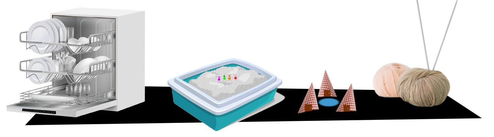

\sinc

## Las locas vacaciones de los nabucodonosorcitos

&nbsp;

&nbsp;

\conc

> Lleváis años queriendo ir a Whirlpool Park, el mejor parque acuático que existe, y este año se han juntado los astros y todos podéis ir. Será un viaje increíble cruzando el desierto, durmiendo hoteles de carretera, visitando la bola de lana más grande del mundo hasta llegar a vuestro destino.

Esta **aventura es una _roadtrip_** en la que tus jugadores recorrerán miles de kilómetros por exóticos parajes en su coche para **ir al mejor parque acuático del mundo, el Whirlpool**, o sea el lavavajillas de la cocina.

Durante el viaje visitarán varias localizaciones donde se encontrarán con personajes curiosos y extravagantes y se enfrentarán con todo tipo de problemas y situaciones extrañas.

Aunque para los nabucos sea un gran viaje en coche, cada parte de la aventura no será más que una habitación de la casa donde vive tu grupo de jugadores.

El grupo puede ser de cualquier tipo, una familia, un club deportivo, un grupo escolar, etc. Lo más importante es que tengan un vehículo con que hacer kilómetros.

La excusa del viaje puede ser muy variada, han ganado unas entradas gratis en la radio, les ha dado un bono especial en el trabajo, llevan años ahorrando para ellos, etc. Pueden hasta habérselas vendido muy baratas un monstruo con gabardina y sombrero en un oscuro callejón.

De hecho, si la historia suena muy chunga mejor, para que tus jugadores piensen que les va a pasar algo raro con las entradas.

### Recuerdos y regalos

Como todo viaje habrá que conseguir **regalos para amigos y familiares** y tener **bonitos recuerdos** que contar en las reuniones.

Eso quiere decir que deberán **ocupar sus brazos con regalos y sus antenas con recuerdos** del viaje. Según avancen, estos recursos serán más escasos y deberán que decidir que recordar, que olvidar, que recoger y de que deshacerse.

En cada etapa de su viaje hay listados de recuerdos que pueden obtener y bellos recuerdos que atesorar.

### Preparando el viaje

La primera escena consistirá en la preparación del viaje. Plantéatelo como lo que harías con unas vacaciones normales.

\sp

Ideas de las cosas que pueden hacer:

* Tendrán que **poner a punto el coche**. Recuerda que los coches son cajas de cartón con asientos, un volante y ruedas, pero se mueven gracias a que los que están dentro mueven los pies muy rápido.
* Necesitarán **trazar la ruta del viaje**. Para ellos tendrán cosas como un laberinto de un mantel de un local de comida rápida, una postal con un mapa de una zona e imágenes de diferentes sitios turísticos, una guía de viajes de hace muchos años o el mapa de un libro de fantasía. Recuerda que **el mapa cuenta como un elemento del equipo**.
* Necesitarán **algo para tomar fotos**, quizás una cámara desechable, un móvil viejísimo rollo Nokia 3210 que hace fotos malísimas o una de esas de juguete llena de chuches que te da gominolas cuando haces clic. Este es otro objeto que **ocupará espacio en el equipo**.
* Si quieres, puedes buscar cosas como comida y bebida, tienda de campaña, trajes de buceo, … las locuras que se te ocurran.

### En ruta

**Pasillo**

La idea de esta parte es que tus jugadores se hagan con el sistema, así que puedes ponerles un reto divertido como un robot aspiradora que está limpiando el pasillo.

Cada vez que intentar atravesar el pasillo el robot se acerca y tienen que retroceder, porque si no, se tragara si automóvil.

Correr a toda velocidad cuando el robot esté lejos para que les pille sería lo más sencillo e inteligente, pero ese no es el estilo nabuco. Como va todos juntos en el coche la tirada será grupal y todos sufrirán las consecuencias.

Otra opción sería poner porquerías para que se llene el depósito y se vaya al punto de carga. Si prefieren esperar, recuerda que son muy dramáticos y la espera se les hará insoportable. Por otro lado, la aspiradora se irá a la sala de estar que es su siguiente etapa del viaje. Con lo que seguirán teniendo el mismo problema.

Veamos algunas ideas locas que tendrían ventajas:

* Si lo ven como una especie de bestia a domar, podrían subirse encima como un toro de rodeo e intentar domarlo. Al final le habrán dado sin saberlo al botón de Home y se irá a la zona de carga donde estará tranquilo unas horas. Necesitarán una forma de subirse encima (o dejarse caer) y otra de ponerle unos arreos.
* Pueden confundirlo con algún tipo de tortuga y como les enseñaron en la escuela, si le dan la vuelta y la dejan bocarriba no se podrá mover. Otra cosa es como le dan la vuelta. Quizás la engañen para lanzarse por algún tipo de cuña que haga que se dé la vuelta, aunque debería ser muy alta para conseguirlo, pero si el Equipo A podía tus nabucos también.
* Otras ideas podrían ser pegarle un globo para que se vaya volando, dejarse tragar y hacer ruidos raros desde dentro para que un humano crea que está rota, poner una trampa de algo resbaladizo y que no pueda salir, ...
* Con la opción de correr puedes llenar el suelo de aceite, que el robot lo esparza y patinar rápidamente sobre el aceite, ponerse un disfraz de San Fermín para correr delante de la aspiradora o ponerse barro como en Depredador para que no le detecten los sensores de la aspiradora.

\sp

Si algo falla y unos o todos acaban atrapados dentro del robot, la base de carga está en la sala de estar. Así que tras escaparse de las entrañas de la bestia robótica, podrán continuar su viaje sin problemas.

**Recuerdos y regalos:** —

**Momentos inolvidables:** —

### La bola de lana más grande del mundo

**Sala de estar**

Cuando lleguen a la sala de estar, se encontrarán a una señora en un sillón orejero tejiendo una bufanda para sus nietes. En el suelo tiene una cesta con montones de bolas de lana y en el centro una bola gigantesca que es la quieren visitar. Un nabuco ha escrito en la etiqueta de la gran bola de lana con pinturas de colores «La bola de lana más grande del mundo. ENTRADA 2 €. Descuentos por grupo negociables» y cobra entrada por verla.

Lo curioso es que la ves igual de bien pagando entrada que sin pagarla, no hay una cerca que evite que te acerques o que te bloquee la vista. El nabuco simplemente ha puesto una mesa con una caja y cobra igual. 

Aun así, tus nabucos deberán negociar con el feriante para verla si no tienen dinero. A priori, a no ser que alguien haya dicho que lleva dinero, no tienen dinero. Ya que has llegado hasta aquí no vas a ser un rácano y no verla por unos pocos euros.

XXX

Una vez consigan sus entradas tienen muchas actividades de las que disfrutar y con las que puedes alargar un poco la escena si ya no queda mucho tiempo para el final de la sesión.

* Ver la gran bola de lana.
* Fotografiar la gran bola de lana.
* Escalar la gran bola de lana.
* Saltar sobre la gran bola de lana como si fuera una cama elástica.
* Aprender a tejer con unos mondadientes viendo a la señora mayor como teje.
* Hacerse unas pulseras de la amistad con los recortes de lana.

El feriante también vende trozos de lana como recuerdo, pero la verdad es que puedes recogerlos del suelo sin problema o cortarlos tú mismo de los ovillos que hay, pero bueno se pueden meter en otro estúpido regateo.

**Recuerdos y regalos:** Trozos de lana, agujas de tejer, descartes de lana trenzada

**Momentos inolvidables:** Subirse arriba de las madejas, jugar a la comba con las lanas, aprender a tejer imitando a la abuela

### Noche en la carretera

**Baño**

Escondido detrás del aseo, hay un típico hotel de carretera donde los bungalows tienen forma de _teepee_ de los nativos norteamericanos. La estructura son pajitas de plástico y se han usado una cortina de baño de patitos para las telas que cubren la tienda.

El hotel se llama Beits y está regentado por Nor, un tipo un tanto extraño incluso para un nabuco. El motel tiene una piscina, el propio aseo que está lleno de agua. Pueden lanzarse desde el grifo y subir por la cadena del tapón. También hay un pozo de fuego en el centro de los _teepees_ para asar malvavisco y disfrutar de las llamas.

Nor es poco hablador lleva un traje de señora mayor de los 60, una peluca canosa y pone voces raras. Dice que es algo que vio en una película de un humano que llevaba un hotel de carretera y que parece que le iba muy bien. Así que ha copiado lo que hace en la película.

\sp

XXX

**Recuerdos y regalos:** Toallas y albornoces del motel, gofrera del buffet de desayuno, llavero de las llaves del motel

**Momentos inolvidables:** Tirarse a la piscina haciendo bomba, esquivar las cuchilladas de Nor, atiborrarse en el buffet de desayuno

### Atravesando el desierto

**Balcón**

La sala de estar da acceso al balcón y desde el balcón se puede entrar en la cocina, que es el objetivo final. Lo más destacable del balcón es que hay un cajón de arena para el gato gigantesco. A ojos de lo nabucos es casi un desierto.

A la entrada del desierto hay un puesto que vende mapas del cajón de arena y libros de supervivencia en la naturaleza (o eso dice el vendedor en realidad son libros de colorear de oso guarda forestal de la prevención de incendios). 

XXX

En el centro del desierto se encontrarán en Zunk «el sabio». Es un ermitaño al que van los nabucos en busca de consejo. Cuando se lo encuentren irá desnudo, cosas que es chocante porque tus nabucos también. Como mucho llevan sombreros para el sol o pañuelos para taparse la cara de la arena del desierto.

XXX

**Recuerdos y regalos:** Arena del desierto (está aromatizada), zurullo de broma (no es de broma), atrapasueños que vende Zunk

**Momentos inolvidables:** Recibir la sabiduría de Zunk, encontrar agua amarilla, aprender supervivencia

### El parque acuático

**Cocina**

XXX

**Recuerdos y regalos:** Pastilla de detergente, tapa de plástico usada como flotador o tabla de surf (y así los humanos tendrán un táper sin tapa, igual que pasa con los calcetines), pegatinas promocionales de Whirlpool

**Momentos inolvidables:** Montarse en el aspersor durante el aclarado, fiesta de la espuma en el lavado, tirarse por el tobogán de tapas
