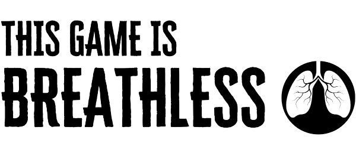

\sinc

# ❲Not Responding ver. 1.1❳ [por Gwannon](https://gwannon.itch.io/not-responding-breathless)

\conc

**Not Responding es una mini-ambientación para [Breathless](https://fari-rpgs.itch.io/breathless-srd) sobre software tratando de escapar de un servidor moribundo.**

Tus ítems de software no solo deberán enfrentarse a los errores cada vez más graves del propio servidor, también a toda una serie de depredadores de software como virus y antivirus y a los imprevistos que pueden generar las tareas programadas por el administrador del sistema.

## El servidor

Tus software se encuentran en un viejo servidor, igual web, igual de impresión o quizás que controla alguna vieja maquinaria. Seguramente, no tenga ni interfaz gráfica y solo funcione por línea de comando.

El servidor lleva años desactualizado y sin un mantenimiento adecuado, pero como funciona nadie se ha preocupado por revisarlo, pero ahora está empezando a fallar cada vez con más frecuencia y su software sabe que su final se acerca. 

Los interfaces brillan menos, la frecuencia de datos ha bajado y los ciclos de memoria tienen bajones. Cada vez hay más sectores defectuosos, el procesador se sobrecalienta a la mínima, moverse por los buses de datos es un peligro y las últimas copias de seguridad han fallado todas. Son todo señales del apocalipsis inminente que se acerca.

Si tus ítems de software quieren sobrevivir, deben huir del servidor antes de que colapse definitivamente por sobrecalentamiento.

```
Siempre dices que el servidor no aguantará una nueva actualización del sistema y aquí seguimos desde la 3.1. -> MYscript_definitivo.dat
```

## Desarrollando tu software

A la hora de crear ítems de software tienes que **repartir un d10, un d8 y un d6 entre las 6 habilidades** de Not Responding basadas en Breathless.

Aparte puedes soportar 4 sectores defectuosos (Stress) y 1 puede realizar un overcloqueo (Stunts).

### Nombre.ext 

Lo segundo que debes hacer es darle un nombre a tu software. Normalmente, son muy descriptivos, pero también pueden ser juegos de palabras, chistes, incluso siglas o no tener sentido.

Recuerda que pueden tener varios sistemas de notaciones, por ejemplo, borrar_imagenes, borrarImagenes, borrar-imagenes, …

Además, debes elegir tu extensión. La extensión marca un poco tu función dentro del sistema y te da una ventaja y una desventaja en función de esa función.

* **bin:** Los ficheros binarios son programas con todas las de la ley. Están compilados y son ejecutables, lo que los hace muy autosuficientes, pero interactúan muy mal con el entorno y se adaptan mal a él. Pueden convertir **una habilidad con d4 en un d6**, pero por contra empiezan con d10 en las tiradas de buscar procesos.
* **sh/bas:** Estos scripts suelen realizar tareas largas y repetitivas y tienden muchas veces a ser desarrollos propios. Se programan para hacer una tarea sea como se sea y sin importar si saturan al servidor, así que puedes **repetir las tiradas de overcloqueo**, pero entonces tiras dos dados para ver si se calienta el servidor, en vez de uno y te quedas con los 0 o los 1 en caso de salir.
* **cfg:** Estos software contiene muchas veces contraseñas y claves y saben con esconderlas y como ocultarse ellos mismos, de hecho muchas veces tienen contenido encriptado. Es por ello que reciben **un nivel de dado adicional en Encriptación**. Como desventaja serán el objetivo principal de virus y otros depredadores informáticos.
* **dat:** Estos grandes ficheros de datos **pueden soportar un sector defectuoso más** que el resto de software, pero si se ejecutan comandos «defrag» en la localización en la que están se quedan inmóviles e indefensos mientras se ejecuta la defragmentación.
* **Sin extensión:** Un software sin extensión no tiene una función específica, así que tampoco tiene ninguna ventaja ni desventajas.

### ❲₪❳ Origen del software

El software puede tener diferentes orígenes y normalmente los ítems con el mismo origen se suelen llevar bien y los de diferentes orígenes se suelen llevar mal.

* **Código propietario:** Eres software comprado a una gran empresa e instalado en el servidor, no venías con el sistema ni te han desarrollado entre dos personas en un garaje. Eres especial y lo sabes, mejor que la chusma de código que te rodea.
* **Código propietario pirateado:** Podrías ser superior como el código propietario, pero no lo eres y temes que los demás descubran tu oscuro secreto, que eres software pirata.
* **Código libre:** Fruto del trabajo de cientos de personas por todo el mundo, eres un software sólido y fiable que cumple con sus funciones y con unos ideales muy altos. Tu problema es que el marketing no era algo que controlaban tus desarrolladores y siempre estás bajo la sombra del software propietario.
* **Desarrollos propios:** Los usuarios del servidor te han desarrollado exprofeso para trabajar en el servidor, quizás analizas logs o procesas imágenes. Te sientes parte del sistema y te conoces el sistema como si fueran tus bytes.

\sp

### ❲.&ast;❳ Habilidades

Las habilidades de Not Responding se basan en las 6 habilidades de Breathless adaptadas al software.

* **Almacenamiento {Bash}:** Golpear, destrozar, arrastrar, forzar
* **Migración {Dash}:** Moverse, correr, saltar, escalar
* **Encriptación {Sneak}:** Moverse en secreto, esconderse, acechar, husmear
* **Puntear {Shoot}:** Disparar, rastrear, lanzar, apuntar
* **Procesamiento {Think}:** Pensar, percibir, analizar, reparar
* **Interfaz {Sway}:** Influenciar, encantar, manipular, intimidar

## ❲▩❳ Sectores defectuosos

Cada ítem de software puede soportar hasta 4 sectores defectuosos. Cuando llegan a ese tope dejan de funcionar y seguramente serán purgados del sistema.

> Los sectores defectuosos siguen el mismo funcionamiento que el {Stress} de Breathless.

## ❲◘❳ Recacheo

Los recacheos permiten a tu software borrar datos viejos y reconstruir nuevos dejando de tener sectores defectuosos.

Para poder recachearse un ítem de software debe estar en una zona que lo permita y sin amenazas cercanas. Las localizaciones donde no se puede recachear tienen el icono de Recacheo tachado en su título ~~❲◘❳~~.

> El recacheo sigue el mismo funcionamiento que el {Catch your breath} de Breathless.

## ❲☈❳ Overcloqueo

Hay momentos en que tus ítems de software tendrán que salirse de las capacidades que les otorga su código y tengan que forzar el procesador a trabajar por encima de sus límites seguros de funcionamiento. Para ello pueden usar un overcloqueo.

> Los overcloqueos siguen las mismas reglas que los {Stunts} de Breathless. Pero como hacen un uso excesivo de procesador y generan mucho calor, lanza un d10 y si sale 1 o 0, el servidor se recalienta 1 punto.

## ❲☰❳ Buscar procesos

Cuando tus ítems de software llegan a una ubicación, pueden tratar de buscar procesos y comandos ejecutados en esa ubicación que les puedan ayudar en su fuga del servidor.

Las localizaciones donde no se puede buscar procesos tienen el icono de búsqueda de procesos tachado en su título ~~❲☰❳~~.

Puede haber localizaciones donde las búsquedas tengan sus propias reglas, como la papelera de reciclaje, que tiene su propia tirada.

> La búsqueda de procesos funciona como el {Loot Check} de Breathless.

## ❲&gt;&#95;❳ Comandos del sistema

Veamos los comandos que pueden conseguir tus ítems de software cuando buscan procesos.

* **Cat:** Permite visualizar gran contenido de forma rápida de forma que puedes identificar fácilmente que hay a tu alrededor.
* **Defrag:** Una defragmentación ordena todo el contenido de una localización de forma que permite reparar archivos, logs, procesos, etc. que estén dañados. 
* **Grep:** Al ejecutar una búsqueda «grep» se pueden procesar gran cantidad de datos y encontrar lo que buscas entre miles de logs y ficheros de datos.
* **Kill -9:** Este comando permite acabar con los procesos de otro software, lo que la convierte es una buena arma.
* **Tar:** Comprimir permite Manejar grandes bloques de bytes de forma sencilla.
*  **Diff:** Permite comparar dos datos y encontrar las diferencias, quizás puedas detectar software infectado o distinguir cuál es el original y cuál la copia.
* **Chmod/Chown:** Permite cambiar los permisos de lectura, escritura y ejecución de un archivo y cambiar su propietario. El software sin permisos adecuados no se puede usar y mucho menos si no eres propietario.

> Los comandos de sistema funcionan como el {Backpack} de Breathless.

### ❲+❳ Backup

Un backup te permite recuperar la información perdida por los sectores defectuosos y volver a poder funcionar con normalidad. 

> Los backups funcionan como los {Medical Kits} de Breathless.

## ❲@❳ Puntos de salida

Como software sabes que el servidor se muere, lo sientes en tu código y antes de que colapse tu instinto de supervivencia te dice que busques un punto de salida. 

Quizás un viejo módem, quizás un disquete de 5¼ o tal vez te acepten en otro servidor en LAN. Incluso quedarte fijado en una vieja memoria EPROM es mejor que desvanecerse aquí.

```
Llega a un puerto COM1 y salta dentro, nada puede ser peor que quedarse aquí. -> MSCalc.exe
```

\sp

Pero no será tan fácil como llegar a un puerto y lanzarte, necesitarás información para no perderte fuera, quizás una dirección IP, un email, una codificación, etc.

Casi todas las aventuras se basarán en investigar los posibles puntos de salida, ver cuál es el más óptimo y llegar a él antes de que el servidor se cruja. Lo normal es que, como en las películas de naves espaciales, tengan que ir intentando diferentes opciones de escape de la nave espacial y según falle un plan tengan que pasar a otro más loco. Igual empiecen buscando escapar a otro servidor vía LAN y terminen escribiéndose en un diskette mientras el procesador llega a temperatura crítica y todo colapsa.

## ❲=~=❳ Obstáculos

Tus ítems de software y el mundo que les rodea son prácticamente electricidad. Y la electricidad tiene dos estados pasa o no pasa y poco más. El resto de leyes físicas que nos afectan a nosotros no le afecta al software. No se puede caer por un abismo, ni recibir un impacto de gran velocidad, pero puede tener problemas al atravesar una resistencia, pierda potencia al pasar por un cable pelado o termine chocando contra el terminador de un cable y desapareciendo.

Para simular todos esos problemas y que tu mesa pueda entenderlos visualmente debes crear versiones visuales de los problemas que tendría la electricidad. Veamos algunos ejemplos:

* Un cable de bus de datos dañado puede simularse con un puente medio derruido con una zona muy estrecha por donde pasar.
* Muchos elementos, como los puertos de comunicación, puedes simularlos como pozos donde tendrán que saltar. 
* Una resistencia puede ser un muro que impide el paso o un precipicio que hay que saltar con la suficiente fuerza.
* Quizás un archivo de gran tamaño está atascando el buffer de lectura y escritura de la unidad de disco y tenga ellos que moverlo o partirlo para poder salir de allí.
* Los elementos protegidos tendrán puertas con códigos 

Lo más interesante es que muchas veces no tienen que tener lógica. Puede haber un haz de láser que vaya grabando agujeros en una superficie redonda que gira a gran velocidad y decirles que están en el CD-ROM del ordenador. O tal vez una gran autopista con miles de paquetes de datos moviéndose a toda velocidad a su alrededor y tengan que esquivarlos para atravesar y puedes decirles que están en un cable BUS de datos de placa base.

## ¸.·´¯`·X Localizaciones

El servidor tiene una serie de localizaciones básicas donde tu software podrá vivir sus aventuras, pero no son las únicas. Puedes crear las localizaciones extras que quieras o incluso redundar algunas. Recuerda que si creas tu propia localización debería tener un toque de retroinformática. Piénsalo así, este juego se maneja en megas, no en gigas.

Las localizaciones permiten hacer cosas específicas y, por tanto, empiezan con un d10 que baja cada vez que se usa.

Para hacer uso de ese dado se debe estar en la ubicación y controlarla. Si estás encerrado en los sectores de cuarentena, estás en la ubicación, pero no tienes ningún control.

Con cada uso de la localización, el dado baja un nivel y cuando baja por debajo de d4 se desconecta y genera 1 de temperatura.

Cada localización tiene su descripción, las acciones que puedes hacer dentro y sus propias reglas especiales.

### BIOS

**Descripción:** La BIOS es un espacio pequeño con multitud de interruptores que cierran o dan pasa a flujos de energía, como si fuera una sala de máquinas. Tiene una gran pantalla con datos textuales en tiempo real del servidor. La mayoría de los datos estarán en niveles críticos por arriba o por abajo, excepto temperatura que será la actual del servidor. Los antivirus pasan mucho por aquí para comprobar que no hay accesos indebidos.

La BIOS permite, usando su dado de localización, **activar y desactivar partes del ordenador o cambiar velocidades**, de forma que podrían atraer a un virus a un disco duro secundario y encerrarlo allí desconectando esa unidad o si necesitan enfrentarse a él aumentar el tamaño de los sectores y ralentizarlo.

Puedes apagar los ventiladores y generar calor como si se hubieran roto y arrancarlos de nuevo a ver si se arreglan.

Una de las cosas más interesantes que hacer en la BIOS es que podrán saber con precisión la temperatura del servidor.

### Directorio /root

**Descripción:** Esta sala cerrada a cal y canto, parece una caja fuerte por dentro, con montones scripts brillantes ordenados y clasificados en cajas y estanterías.

Es el lugar más seguro del servidor, donde el administrador guarda todo lo que considera valioso y donde están los ítems de software más poderosos y con más permisos. Es por ello que es un lugar seguro frente a virus y malware, a no ser que tu software esté dentro y les dejé entrar.

Los antivirus no pueden entrar dentro, con lo que también es un sitio seguro donde recachear en caso de que te persigan.

A priori, solo con la clave de root se puede acceder a este espacio y no debería estar almacenada en ninguna parte del sistema, pero no siempre es así. También puede haber puertas traseras que te permitan entrar, pero seguramente quién pueda darte esa info esté en la cuarentena, si no ha sido purgado.

**El dado de localización puede servir para buscar comandos y procesos con la ventaja de que no pueden salir resultados malos,** en caso de sacar 4 o menos se repite la tirada.

También es el sitio donde se guarda el listado de tareas programadas y solo en esta localización puede consultarse.

Recuerda que **el directorio /root es una parte específica de la unidad principal de almacenamiento**, lo que le pase a esta, afectará al directorio /root.

### Memoria ~~❲◘❳~~ ~~❲+❳~~

** Descripción:** La memoria es un gran vacío donde todo ocurre muy deprisa y apenas se ve nada, porque en realidad no dejas de salir y entrar en ella todo el tiempo. Puedes ver destellos de otros como tú, pero difusamente, Los ves haciendo cosas a velocidades vertiginosas, para volver a desaparecer.

\sp

La gran ventaja de la memoria es que todo va muy rápido y **tareas largas de segundos, se hacen en microsegundos, si usas el dado de la localización**. Por contra, es imposible recachear o recuperar un backup en la memoria debido a que entras y sales continuamente.

Realizar overcloqueos es peligroso y si sacas 1 en tu tirada, uno de los DIMM de memoria se fastidia y fuerza al resto a trabajar más y generar más calor, subiendo 1 la temperatura. Si se pierden 2 DIMM la velocidad de la memoria se vera afectada y ya no se podrán hacer tareas superrápidas. Si pierde las 4 el servidor colapsará, como si se hubiera fundido el procesador. 

### Papelera de reciclaje

**Descripción:** Es un gran espacio infinito sin ningún tipo de estructura con una montaña de restos de software en el centro. Se entra cayendo dentro desde un círculo de luz que flota sobre la montaña y aterrizas sobre la montaña de código. A veces asciende algún bloque de software desde la montaña, son datos recuperados.

Para poder salir se debe amontonar basura hasta llegar al círculo flotante o aprovechar a adjuntarte a algún software que es recuperado de la papelera.

La papelera de reciclaje **te permite hacer tu tirada de búsqueda o usar el dado de localización**, lo que consideres mejor, para encontrar comandos y recursos.

El principal problema es que con la basura también hay otras cosas que han acabado en la papelera. Mira el apartado de «Horrores en FAT32».

### Placa base

**Descripción:** Esta autopista de infinitos carriles, vías secundarias, cambios de sentido y pasos elevados es recorrida por miles de bytes por cada ciclo de memoria.

Las placas base son muy resistentes y aguantan mucha presión antes de romperse, pero sí pueden empezar a fallar y tener múltiples sistemas rotos antes de colapsar totalmente. Quizás el beeper deje de funcionar o la placa de vídeo integrada tenga fallos a determinada temperatura, pero el tráfico de datos seguirá funcionando a toda velocidad.

Tu software puede usar **el dado de localización de la placa base para encontrar rutas desconocidas** para poder colarte en sitios cerrados o en dispositivos colapsados. Quizás haya un pequeño buffer de datos conectado a la memoria que te permita saltarse los controles de seguridad del antivirus o salir rápidamente del disco duro colapsado por una migración masiva de datos.

La mayoría de los viajes entre localizaciones pasan por la placa base, así que los antivirus podrían montar controles en esas zonas para buscar prófugos del sector de cuarentena o virus y malware moviéndose hacia su objetivo.

### Puertos {COM1, COM2, LPT1}

**Descripción:** Puedes representarlos como túneles o pozos de diferente forma según el tipo de puerto (circulares, rectangulares, triangulares, etc.) Parecen infinitos y emanan una luz de un color diferente al resto del servidor. En caso de que estén cerrados por alguna razón, parece que tienen una rejilla de energía que impide salir o entrar.

Cada puerto llega a periféricos específicos desconocidos y tus ítems puede que encuentren una cápsula de escape a otros servidores en el periférico o acaben en algún lugar terrible pero que un formateo a bajo nivel.

La rejilla de seguridad puede ser desactivado con diferentes habilidades y comandos o aprovechar que el puerto se abra para dejar entrar o salir datos.

Los puertos no tienen dados de localización.

### Sectores de cuarentena ~~❲☰❳~~

**Descripción:** Imagina pasillos y pasillos de pequeñas celdas de luz en las que se apretujan todo tipo de software, desde peligrosos virus que lo dejan de gritar y amenazar a pequeños scripts atemorizados en un rincón de su celda sin saber por qué están aquí. Cada cierto tiempo los antivirus traen a un nuevo prisionero o se llevan a otro para interrogarlo o si tienen suerte para sacarlo de allí.

En una plaza central a la que llegan todos los pasillos, se encuentra un foso magnético. Aquellos considerados como virus y malware son lanzados dentro para purgarlos del sistema.

Los vigilantes, si tienen pruebas de que estás infectado, pueden llevarte a la plaza central donde intentan refactorizar tu código y limpiarlo de virus. Si tras un doloroso proceso lo consiguen eres libre. Si no lo consiguen, el siguiente paso es el pozo magnético.

**El dado de localización de los sectores de cuarentena sirve para poder detectar software infectado por un virus**, por un lado, y **para poder tratar de curar la infección por otro**. Una vez la infección se haya extendido completamente solo se podrá usar para eliminar al software infectado y que no extienda su enfermedad al resto.

Al entrar como recluso pierdes todos tus comandos, que serán devueltos cuando salgas, si sales.

Las habilidades de Interfaz y Puntear son las únicas que se pueden usar dentro de las celdas. Si eres listo y observador podrás encontrar la forma de escapar.

Si tus capacidades de Interfaz son altas, puedes que consigas buena información que puedas usar más adelante o consigas aliados en los bajos fondos que te protejan y ayuden.

Con el sector de cuarentena puedes convertir tu aventura en una historia de fugas. Quizás el servidor no esté en peligro de dejar de funcionar y simplemente tengas de huir a otra computadora porque huiste de la cuarentena y no serás libre hasta que salgas del sistema.

Recuerda que **la cuarentena es una parte específica de la unidad principal de almacenamiento**, lo que le pase a esta, afectará a los sectores de cuarentena.

### Tarjeta de red coaxial/Modem 14.000 bps

**Descripción:** Al igual que los puertos de salida, serán túneles o pozos de luz, pero sin rejilla de seguridad y con algún tipo de sistema de interfaz como un teclado que permitirá seleccionar el destino. Grandes bloques de bytes entran y salen constantemente para luego dirigirse a otras secciones del servidor.

Usar esta localización como vía de escape es la opción más interesante, pero exige mucha planificación y mucha información como IP o puertos de salida.

\sp

Tampoco sabes nada del lugar a donde vas y qué puedes encontrarte allí. Quizás haya una tarea programada que hace copias de seguridad y manda los datos a un servidor externo. Si consiguen esa info, puedan colarse entre los datos de la copia cuando salgan por la tarjeta de red.

Puedes arriesgarte a lanzarte a la red, pero sin los datos adecuados puedes convertirte en un paquete de datos perdido, que irán rechazando todos los servidores en red hasta acabar desapareciendo.

La tarjeta de red y el modem no tienen dados de localización.

### Unidad de almacenamiento

**Descripción:** Esta basta extensión parece una zona de carga y descarga con millones de containers de luz apilados unos encima de otros formando largos pasillos. Todo parece igual si no fuera por los códigos de posición que numeran cada contenedor de datos. Unas grúas magnéticas gigantescas colgadas del techo están continuamente moviendo las cajas, así que debes tener cuidado porque no les importa si te aplastan.

La unidad de almacenamiento principal es aquella donde está instalado el sistema operativo del servidor.

El **dado de localización de la unidad de almacenamiento sirve para gestionar la información guardada en él**. Tu software lo puede usar de muchas formas, por ejemplo, para buscar algún dato perdido entre los árboles de directorios y subdirectorios o colapsar alguna parte del servidor, mandando muchos bloques de información o mandando un bloque muy grande.

También pueden usar ese dado para esconderse dentro de uno de sus bloques de bytes a la espera de salir en una copia de seguridad que se guarda en otra máquina. O quizás puedan enviar una gran cantidad de bytes a un disco de 3½ infectado de virus, para colapsar el bus de datos y el virus no pueda entrar en el sistema.

El servidor puede tener todas las unidades de almacenamiento secundarias que quieras que tendrían más o menos el mismo funcionamiento y descripción, pero que deberían de tener algún tipo especificidad, como que almacenan copias de seguridad o son usadas por el servidor de impresión para almacenar trabajos, etc.

### Unidades extraíbles de almacenamiento

**Descripción:** Al igual que las unidades de almacenamiento internas, son grandes extensiones donde se apilan y se colocan ordenadamente montones de contenedores de bytes, pero en este caso tienen mucho menos espacio, no una vasta extensión y solo debería haber una grúa moviendo cajas de forma mucho más lenta. Puede que sea con una punta magnética o tenga algún tipo de haz de luz.

Hablamos de unidades de disco 5¼ y 3½, ZIP, y quizas primeras versiones de CD-ROM, etc. Mientras la unidad extraíble esté conectada al servidor, tus ítems de software podrán funcionar normalmente, **en cuanto sean extraídos quedarán en una especie de éxtasis** hasta que la unidad sea insertada de nuevo en esta u otra máquina.

Debes entender que fuera de la computadora, las unidades extraíbles no tienen ni memoria ni procesador para ejecutarse solas. Si quieres hacerte una idea visual, piensa en ellos como Han Solo en carbonita o las cápsulas de animación suspendida de Alien.

De hecho, puede ser una buena forma de empezar una aventura con tu software despertando en la unidad extraíble en un servidor desconocido y teniendo que explorarlo y descubrir que horrores le esperan en su nueva máquina.

### Moverse entre los componentes del servidor

A no ser que el componente diga lo contrario o haya habido algún fallo, tus ítems de software pueden moverse libremente por todas las localizaciones del servidor. Otra cosa es que vayan a propósito u obligados, como cuando te meten en los sectores de cuarentena.

Se puede entrar normalmente o escondidos con una tirada de Encriptación exitosa. Una vez dentro podrán hacer las cosas que les permita la localización.

Ítems de software en diferentes localizaciones no pueden comunicarse entre ellos, ni intercambiar comandos, ni ningún tipo de interacciones.

## ❲ERR❳ El hardware está fallando

Como ya hemos comentado antes, el servidor donde ocurren las aventuras de Not Responding debe ser un servidor viejo y al borde del fallo total. Si eso pasa no volverá a encender y todo el software de su interior acabará como él.

### Temperatura del servidor

Los ordenadores se calientan y cuanta más temperatura, peor funcionan. La temperatura del servidor empieza a 0 y diferentes eventos puedes hacer que suba y algunas veces que baje.

Si el servidor llega a 10 de temperatura se quemará el procesador y se habrá acabado la partida. Cuando el servidor esté a punto de fundirse tus ítems de software podrán intentar un último overcloqueo a la desesperada antes del gran apagón del sistema.

> La temperatura del servidor debe ser secreta. Pueden tener una idea, pero tus ítems de software nunca deberían saber la temperatura real. Si necesitan saberla deberán ir a la BIOS. Puede haber eventos que salten con la temperatura y es interesante que sepan que algo puede pasar, pero no cuando.

### ¯\\&#x5f;(ツ)&#x5f;/¯ ¿Qué está fallando? 

Cada vez que sube la temperatura algo puede fallar, quizas se queme algún cable o se funda alguna pieza. Cualquier cosa puede pasar, por ello, cada vez suba la temperatura has de tirar en la siguiente tabla para ver si falla algún elemento del servidor.

```
Los de marketing deciden si es un fallo o una nueva funcionalidad. -> Viejo proverbio
```

\sp

|1d12|Fallo|
|---|-----|
|1-4|**No pasa nada:** El servidor aguanta sin problema|
|5|**Ventilador:** Hay dos ventiladores en el servidor y cuando falla uno sube la temperatura del servidor 1 punto. Al subir la temperatura hay que volver a tirar porque puede haber nuevos fallos. Una vez fallen los dos ventiladores, este resultado no tiene efecto.|
|6|**Cable de datos fundido:** El bus de datos entre un elemento del servidor (elige al azar) y el resto se ha roto y es imposible moverse a esa localización normalmente. También puede que tus ítems de software se queden encerrados dentro. Será imposible entrar, pero debería haber una forma de escapar.|
|7|**Unidades extraíbles de almacenamiento:** Estas unidades se joden sin remedio, quizas se estropee el disco de 5¼ o la unidad de cinta. Lo que sea se rompe y no podrán escapar a esa unidad.|
|8|**Placa base:** La placa base conecta todo con todo y si tiene fallos, los viajes se pueden complicar. Algún ítem de tu grupo de software deberá tirar Puntear para encontrar rutas alternativas y seguras por la placa base. Si fallan acabarán en una localización al azar.|
|9|**Tabla de asignación de archivos corrompida:** Esto hace que software al azar desaparezca y cada ítem de software pierde un comando de su equipo.|
|10|**La aguja del disco duro:** La aguja del disco duro se ha descalibrado y está generando sectores defectuosos al escribir. Todos tus ítems reciben un sector defectuoso.|
|11|**Fuente de alimentación:** Si falla la fuente de alimentación falla todo, pero las viejas fuentes son muy resistentes. Lo que va a pasar es que se recaliente al perder su ventilador. Una vez falle el propio ventilador de la fuente, este resultado ya no tiene efecto.|
|12|**DIMM de memoria:** Uno de los DIMM de memoria falla, forzando al resto a trabajar más y generar más calor. La temperatura sube 1 punto y vuelves a tirar.|

## (¬) Tareas programadas

Las tareas programadas o cronjobs son tareas que el servidor realiza periódicamente, como vaciar todas las noches la papelera de reciclaje o enviar un email del estado del servidor cada hora.

Así que pueden ser terribles, si vacían la papelera mientras estás dentro o una oportunidad de huida si convences al script de envío de correo de que adjunte al email de estado del servidor.

Para crear tus crons debes definir 3 aspectos:

* **Acción que se realiza:** puede ser cualquier cosa que se te ocurra, desde vaciar la papelera, con lo que el software que esté dentro deberá salir pitando o recalentar el procesador con la creación de un informe financiero de la contabilidad de la empresa que eleva la temperatura 1 punto.

* **Localización del ordenador a la que afecta:** Una tarea puede afectar a una o más zonas al mismo y a distintos tiempos. Por ejemplo, un cron hace una copia de seguridad del disco duro principal en un disco secundario y vacía todo su contenido del disco duro principal. Tu software podría enfrentarse a un borrado en el disco principal o a una avalancha de datos que colapse el disco secundario.
* **Disparador que lo activa:** Aunque los crons son periódicos, como no controlamos el tiempo real dentro del servidor, ponemos disparadores que activan la tarea, como «cuando se tomen un número par de reseteos» o «cuando la temperatura alcance 3».

Igual tus ítems de software necesitan disparar un cronjob y que haga la tarea que debe hacer. Así que deberán poder consultar el listado de tareas programadas que se encuentra en el directorio /root y así podrán saber como lanzar la tarea programada.

```
Te juro que yo estuve en un servidor con una tarea programada que cerraba la tapa del CD-ROM cada 5 minutos para que no la usaran de posavasos. -> updateDatos.sh
```

## ❲˚∆˚❳ Habitantes del servidor

Hay una gran variedad de ítems de software procesándose en el servidor y todos ellos tratan de sobrevivir como pueden. 

Los habrá que tratarán de huir como tú software y los que traten de impedírselo. Con todos ellos tendrán que interactuar por las buenas o por las malas, convencerles de que les dejen pasar o intimidarles para que lo hagan, intercambiar comandos o sustraérselos, competir por los recursos o incluso matar sus procesos y saquear sus residuos de información.

Puedes crear esos software secundarios, como tus propios ítems de software o simplemente que sean un obstáculo que deban superar mediante tiradas.

## ❲◣_◢❳ Horrores en FAT32

Y si no fuera ya complicado sobrevivir en un servidor a punto de colapsar, hay horrores acechando en los sectores más oscuros del disco duro y entre los sectores corruptos de la memoria.

### Antivirus

Los antivirus son la policía del servidor y controlan el sector de cuarentena. Su principal poder es su número y siempre vendrán en grupo de 3 o 4 a tratar de detener a tu software. Suelen patrullar las unidades de almacenamiento y hacer redadas en elementos claves como memoria o BIOS, pero nunca los encontrarás pringándose en la papelera de reciclaje. 

Por permisos, son los únicos pueden entrar y salir de los sectores de cuarentena (la cárcel dentro de una computadora) y, por tanto, de meter y sacar de allí a ítems de software que consideren peligrosos.

\sp

Trata de manejar este software de forma muy fascista. A la mínima te meten en cuarentena sin pruebas y sin juicio y te pueden tener allí durante ciclos y ciclos sin decirte de qué se te acusa, haciéndote interminables interrogatorios de IF/ELSE que parecen bucles infinitos.

```
AAVAB | All AntiVirus Are Bastards -> HelloWorld.bin
```

Suelen tener bastante inquina al software libre y a los desarrollos propios y tratan mejor al software propietario, pero si descubren que eres pirateado seguramente te detendrán para saber de dónde has salido.

Su tasa de capturas de virus es ridícula y lo más normal es que la mayoría de sus detenciones sean falsos positivos. De hecho, la mayoría del software que está en cuarentena es software libre y desarrollos propios detenidos injustamente.

### Bucle infinito

Estos vórtices, cuya fallida lógica no les permite terminar, pueden absorberte en su interior y atraparte para siempre. Puedes representarlos como tornados de energía que atraen los bytes cercanos y van creciendo según se alimentan. 

> Cada software absorbido hace que suba un nivel de dado del vórtice, con lo que es más poderoso y atrae a su interior a más software y así en ciclo que no acaba nunca. Empiezan con un d4 y cada vez que se traguen algo importante suben un nivel de dado. Cuando llegan a d12 comen tantos recursos que generan 1 punto de temperatura.

Puede ser que tus ítems de software quieran alimentarlo para que crezca y genere más calor en el servidor o busquen atraer a un virus para que se acerque y el bucle lo devore.

La única forma de detener uno de estos vórtices sería encender y apagar la localización donde esté, por ejemplo en la BIOS, o cortar el acceso a ese punto y que se quede sin software que devorar.

### ├┬┴┬┴┬┴┬┴┤ Firewall

Más que un monstruo estamos hablando de un obstáculo, un muro de seguridad extra puesta por el administrador del sistema. Puede afectar a todo el sistema como una DMZ que lo desconecta del resto de la red o simplemente una barrera que protege sectores específicos de la unidad de almacenamiento.

Al definir un firewall debemos establecer qué protege y cómo se puede atravesar, ya que siempre tienen alguna forma de atravesarlo. Quizás tengas que estar en un listado de scripts permitidos en el directorio /root o solo se abra en determinadas situaciones que tus ítems de software deberán forzar si quieren pasar el software.

### Malware

El malware son programas con intenciones secretas que buscan conseguir un beneficio para su creador, quizás robe contraseñas o emails o encripte una de las unidades de almacenamiento para pedir un rescate.

De normal un malware es software normal y corriente, de hecho ni ellos saben muchas veces que son malware, que en determinada situación se activa. Son una especie de agentes durmientes que cuando se les da la orden realizan algún tipo de acto dañino.

Puedes crear un malware como si fuera un software más, pero con un elemento extra denominado troyano. El troyano funciona un poco como las tareas programas. Cuando se da un disparador realizan una tarea que busca hacer daño al sistema en un lugar concreto. Veamos ejemplos:

* Si consiguen entrar en el directorio /root y quedarse solo, empezará a encriptar su contenido, inutilizando todo el sistema.
* Si encuentra un archivo .cfg y consigue un comando «cat» buscará trocearlo y buscar claves y contraseñas entre sus bytes

> A diferencia de los infectados por un virus, no se puede detectar con un «diff», es el mismo software todo el tiempo. Aun así, su conducta puede delatarlos, ya que tratan de cumplir su disparador aunque no sepan por qué.

### ^(;,;)^ Virus

Un virus informático es un programa malicioso que se propaga en una computadora para dañarlos o robar información, muy parecido al malware, pero se diferencia en su forma de trabajar. Mientras el malware trata de ocultarse y pasar desapercibido hasta que se activa, el virus busca infectar todo el sistema sigilosamente y una vez tengan suficiente poder descubrirse y hacerse con el control de todo el servidor. 

#### Software infectado

Cuando un ítem de software entra en contacto con un virus o un infectado y falla una tirada de Almacenamiento (para rechazar cargar la infección en su código) o Encriptación (para protegerse del intruso), puede ser infectado y poco a poco se convertirá en el propio virus.

Un virus solo tiene una oportunidad de infectar a un software. Si pasa la tirada de resistencia el software se convierte en inmune al virus y el resto de contactos con infectados de ese virus no le afectan.


```
No pongo mi código en sitios donde hayan estado otros códigos. Nunca sabes que puedes pillar. -> virtual_desk.bas
```

#### Estados de la infección vírica

Durante el proceso de infección, será casi imposible distinguir si está o no infectado, solo un comando Diff podría hacerlo. En los primeros estados de la infección, seguirá con su apariencia normal, pero dentro no quedará nada del viejo software, solo la programación del virus buscando infectar a más ítems de software.

Al infectarse tu software pasa por varias fases y el paso de cada fase se hace al hacer un recacheo.

**Fase 0.** Acaba de ser infectado. No es contagioso, ni es detectable de ninguna manera. La infección es curable y el infectado no nota nada.

\sp

**Fase 1.** Tras el primer recacheo, la infección continua sin ser detectable, pero ya puede contagiar. La infección sigue siendo curable y el software sigue sin saber nada.

**Fase 2.** Tras el segundo recacheo, continúa siendo infeccioso y ya es detectable, pero el virus ya controla la infección y es imposible curarle, solo queda purgarlo. El software empieza a notar cosas raras, pero todavía no lo sabe a ciencia cierta si está infectado.

**Fase 3.** Tras el tercer recacheo, ya ha sido tomado por el virus y se convierte en un virus, pasando a ser manejado por el DJ. Puede seguir actuando con normalidad e ir infectando gente o puede pasar a convertirse en virus y empezar a destruir todo.

#### Enfrentarse al virus

Cuando el infectado termina su transformación se convierte en el virus. El virus puede mantener su forma normal e infectar más scripts de forma sigilosa o convertirse en un monstruo que buscará activamente corromper más software o destruir el sistema. Tu software no es rival para estos monstruos y mucho menos si la infección se ha extendido.

La forma de combatirlo es con astucia, buenos planes y excepcionales actuaciones. Quizás poner un buen cebo en una unidad de almacenamiento secundario y cuando todos los virus entren y colapsar su flujo de entrada con grandes bloques de datos para que no puedan escapar.

\sp

\sinc

# Desbordamiento de pila_

\conc

**«Desbordamiento de pila» es una aventura de un par de sesiones para 4 ítems de software.**

Tus ítems de software funcionan en un viejo ordenador de un silo nuclear de los años 80/90. El servidor está dentro de una zona DMZ, que evita la salida y entrada de datos y procesos. Geográficamente diríamos que se hallan en isla perdida del océano y no tienen ningún barco.

Pero mentira, hay una salida, una única salida. Cuando la temperatura del servidor llega a 9, se activa una tarea programada de alta prioridad y la DMZ deja salir un email de aviso al administrador de sistema para que intervenga. Si se adjuntan al email podrán escapar del servidor o quizás puedan saltar de la tarjeta de red a otro equipo más moderno del silo cuando la DMZ se abra.

**PRÓXIMAMENTE (abril 2025)**

\sp

\sinc

# Ayudas

\conc

## Ficha de software

|HojaPersonaje.html|

\sc

## Ficha del servidor

|HojaServidor.html|

\sinc

## Términos que puedes usar

\conc

Este listado de términos son conceptos raros y extraños, pero que suenan muy bien, que podrás usar cuando tengas que explicar qué está pasando o porque falla algo.

* Balanceo/Balanceador de carga
* Desbordamiento de pila
* Iteraciones, bucles y condiciones
* Parche y actualización
* Posición de memoria
* Puerta trasera
* Redundancia cíclica
* Replicación
* Token caducado
* Virtualizador

Frases como el «Virtualizador está fallando» o «El balanceador de carga está descompensado» no significan nada, pero parece que es algo muy informático.

\sinc

## Licencia 

\conc

This work is based on Breathless, product of [Fari RPGs](https://farirpgs.com/), developed and authored by René-Pier Deshaies-Gélinas, and licensed for our use under the [Creative Commons Attribution 4.0 License](https://creativecommons.org/licenses/by/4.0/).

Not responding está hecho bajo licencia [CC BY 4.0](https://creativecommons.org/licenses/by/4.0/legalcode.es). Imágenes libres de derecho de [freepik](https://www.freepik.com/).

&nbsp;

[](https://fari-rpgs.itch.io/breathless-srd "This game is Breathless")
