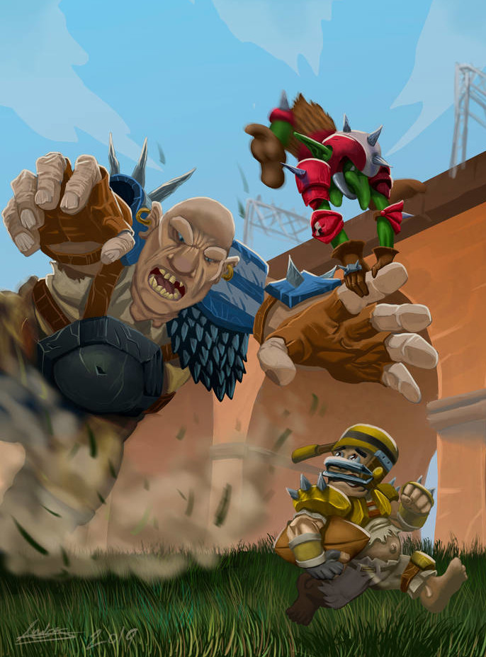
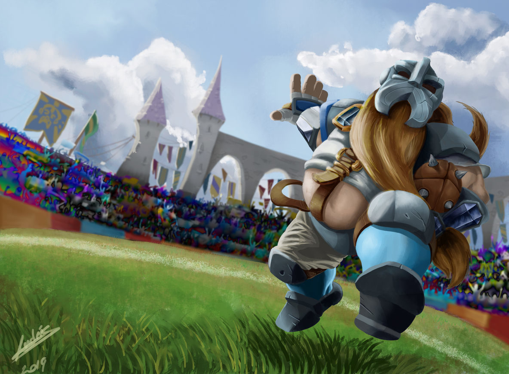
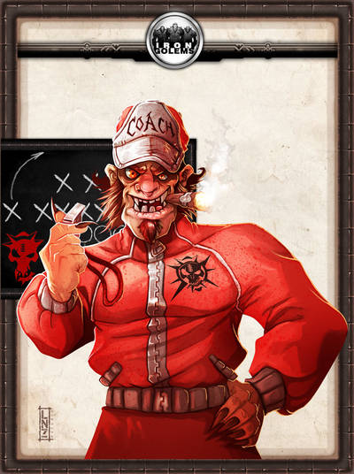

# Pases y bloqueos [por Gwannon](https://gwannon.com/)

«Pases y bloqueos» es un hack para el juego de rol «Lasers & Feelings» creado por [John Harper](https://johnharper.itch.io/lasers-feelings).

Es la última jugada del partido de fútbol amoricano (aka Blood Bowl) más importante de vuestras vidas. Vuestro equipo va perdiendo, pero, si lo hacéis bien, podéis conseguir la gloria reservada a los ganadores de la Copa de Sangre.

Para jugar a este juego necesitarás papel, lápiz y 3 dados de 6 caras (denominados d6). La duración aproximada de una partida puede ser de 1 hora, hora y media como máximo.  

## PJ: Crear tu jugador estrella

### Creación del equipo

Lo primero sería crear vuestro equipo y para crear vuestro equipo hay que definir 3 elementos:

**Nombre.** Suelen tener dos partes, un denominador como los Segadores, los Rufianes o las Pesadillas, y luego su lugar de procedencia, del Bosque Oscuro, de Khazad Nüm, de Riverland, …

**Especie predominante.** La especie puede cualquiera de fantasía, enano, elfos, gnomos, orcos, … hasta de ciencia ficción, cíborgs, aliens, … Qué más da. 

**Estilo de juego.** Deben elegir si son rudos o técnicos. Si tu equipo es técnico su juego se basa en estrategia, en jugadas espectaculares y en pases, recepciones y largas carreras. Si tu equipo es de rudos, lo vuestro es machacar al equipo contrario sin ningún miramiento. _Esta decisión afectará a la creación del jugador estrella._

### Creación del jugador

La especie de tu jugador estrella debería ser la de la especie del equipo. También puedes permitir especies «afines». No es raro ver goblins en equipos de orcos o gnomos en equipos de elfos.

A continuación debes ponerle **un nombre**. Elige también **unos pronombres**.

Si tu equipo es **rudo elige un número entre 2 y 4** y si es **técnico entre 3 y 5**. Con un número alto eres mejor en PASES (todo lo relacionado con la destreza y la inteligencia, lanzar, recibir, esquivar, saltar y también la táctica y el engaño). Con uno bajo eres mejor con los BLOQUEOS (todo lo relacionado con la fuerza y la resistencia, bloquear, empujar, cargar, correr, derribar y también el miedo y la intimidación).
Cuando apareces en el campo, dispones de tu **equipo básico**, protecciones (peto, hombreras, coderas, guanteletes, rodilleras, guanteletes, botas y casco). Si tu equipo es rudo, suelen ser pesadas, resistentes y con pinchos y si eres técnico suelen ligeras, pequeñas y con libertad de movimientos.

Por último, debes seleccionar una posición en el equipo, línea, bloqueador, lanzador, receptor y corredor.

### El agente libre, el veterano y el novato brillante

El todo equipo siempre hay tres arquetipos que le dan carácter, el agente libre, el veterano y el novato brillante. Tus jugadores pueden coger si quieren alguno de estos arquetipos.

El **novato brillante es nuevo, no sabe nada**, pero cree que lo sabe todo. Quieres destacar y ganar a toda costa y eso le hace imprudente, cosa que este deporte podría costarle la carrera.

El **veterano ya se las sabe todas** y sabe sobre todo que está será su última temporada. Su viejo cuerpo pide descanso, demasiados orcos bloqueadores en su camino se cobran un precio.

El **agente libre es el mercenario** que hoy está en un equipo de orcos y mañana en uno de elfos. Es bueno y lo sabe y le gusta brillar porque eso aumenta sus tarifas.

La regla que limita tu habilidad según si el equipo es rudo o técnico, puede ser obviada por dos de tus jugadores que elijan ser el novato o el agente libre. En esos casos podrán elegir su habilidad entre 2 y 5.

Tampoco tienen por qué ser de la especie predominante del equipo, sobre todo el agente libre.

### Posición y estilo de juego

Cuando consigues un resultado de «Pases y Bloqueos», en la siguiente acción puedes hacer una **acción heroica** que depende de tu posición dentro de equipo.

#### Línea

Eres el jugador más simple, tu misión es ayudar al resto y servir de carne de cañón, es lo que hay. Estás jugando remontadas únicas no es momento de jugar con una línea. Es aconsejable, pero no obligatorio, no elegir esta posición. **No tienes acción heroica,** estás solo para apoyar a otros jugadores a que se luzcan. 

#### Bloqueador

Eres una bestia parda que acaba todos sus partidos lleno de sangre de tus contrincantes y también, muchas veces, tuya. Podrías pasarte semanas contando como te hiciste cada cicatriz de tu cuerpo, pero eso ya no te llena como antes, quieres algo más, quizas marcar algún punto, hacer una gran carrera, …

Usando tu **bloqueo salvaje** puedes lanzarte contra varios oponentes y derribarlos e incluso enfrentarte de tú a tú con un tipo grande. 
#### Lanzador

Lo normal es que solo haya un lanzador por equipo, puedes ser el lanzador veterano que trata de irse en toda su gloria.

También el novato que acaba de entrar porque el lanzador oficial ha perdido su brazo de lanzar (severamente seccionado a mordiscos por un goblin rabioso) y quiere demostrar que tiene madera de estrella. 

Con tu **lanzamiento a la desesperada** puedes intentar hacer un pase a lo loco al algún compañero aunque estés rodeado de oponentes, la lluvia no te deje ver nada y el viento es casi un huracán. Quizás si tu compañero puede hacer una **estirada épica** y coger ese pase imposible, 

#### Receptor

Lo tuyo es esquivar, zafarte, correr deprisa, saltar y tener unas buenas manos. En el momento que te cogen eres carne picada, pero eres más difícil de coger que un cerdo engrasado. El agente libre y el veterano no suelen ser receptores, este puesto se reserva muchas veces para el novato, ese pequeño que lo que le falta de fuerza y tamaño lo suple con valentía y agilidad.

Con tu **estirada épica** puedes lanzarte a la desesperada para tratar de atrapar un pase imposible sin importarte tu seguridad física. Pero no tiene por qué acabar ahí, tu estirada puede acabar en una voltereta acrobática que te permite evadir a tus defensores o cayendo al barro y deslizándote hasta la línea de meta.

#### Corredor

Eres una extraña mezcla entre un bloqueador y un receptor, fuerte y ágil, pero casi siempre solo. Esta posición suele ser muy propia de agentes libres que destacan por su individualismo y por los veteranos que tienen la experiencia y la maña para cumplir en esta posición.

Tu **carrera audaz** te permite teniendo el balón lanzarte hacia adelante, rezarle a tus dioses y mediante una mezcla de bloqueos y esquivas llegar con suerte hasta la línea de gol. Seguramente podrás lanzarte en el último momento para llegar a la zona de marcaje con un gran salto sobre tus defensas que dejará al público mudo ante lo que acaba de ver.

## Tiradas de dados

Cuando quieras hacer algo arriesgado tira 1d6 para determinar cómo te fue. Tira +1d6 si estás preparado (de pie en el lugar del campo y en momento oportuno y a poder ser sin contrincantes cerca) y +1d6 si está dentro de las capacidades normales de tu posición (el DJ te dirá cuantos dados puedes tirar, basándose en tu posición). Tira los dados y compara cada resultado con el número que elegiste.

Si estás usando PASES, necesitas sacar un número inferior. Si estás usando BLOQUEOS, necesitas sacar un número superior.

1. Si ninguno de tus dados tiene éxito, algo salió mal. El DJ te dirá cómo empeoraron las cosas.
2. Si sacas **un éxito**, lo consigues a duras penas. El DJ te pondrá una complicación, un coste o un daño.
3. Si sacas **dos éxitos**, lo hiciste bien. ¡Buen trabajo!
4. Si sacas **tres éxitos**, ¡consigues un éxito crítico! El DJ te dará algún **beneficio extra**, que normalmente estará asociada a tu posición. Quizás hayas hecho un tiro imposible de interceptar o cuando recibe un pase estás solo sin nadie alrededor.
5. Si sacas **exactamente tu número**, obtienes PASES BLOQUEOS. Te darás cuenta de algo especial que está pasando en el partido. Hazle una pregunta al DJ, y él te dará una respuesta sincera. Algunas preguntas interesantes: ¿Qué estrategia parece que tiene? ¿Parece que se guarden algo bajo la manga? ¿Me creen una amenaza? ¿Vienen a por mí o por el balón? ¿Puedo lanzar el balón de manera segura? ¿Puedo derribarlo?. Puedes cambiar tu acción si quieres a raíz de la nueva información, en ese caso vuelve a tirar. Dentro de esa nueva acción puedes hacer uso de la **acción heroica** de tu posición que también exige hacer una tirada.

### Apoyos

Si quieres apoyar la tirada de otro, explica cómo lo haces y tira los dados. Si tienes éxito le das +1d6. En principio debe estar en la misma parte del campo para poder apoyarte, aunque en algunas situaciones no es necesario

No puedes apoyar a nadie con tu misma posición a no ser que seas línea que puedes apoyar a todos. Un bloqueador solo puede apoyar a otros bloqueadores o al lanzador. Lanzadores y receptores tampoco pueden apoyarse entre sí, están es partes del campo totalmente opuestas.## DJ: Cuando todos lo creían imposible …

Las últimas jugadas de «Pases y bloqueos» son fáciles de crear a través de estas simples tablas, pero siéntete libre de crear la jugada que tú creas. |1d6|Tiempo atmosférico|
|---|---|
|1|**Nieve y hielo.** El suelo está helado y resbaladizo.|
|2|**Lluvias torrenciales.** El campo es un barrizal que hace muy difícil moverse y coger el balón.|
|3|**Ola de calor.** Correr es agotador y hay varios jugadores en la enfermería por golpes de calor.|
|4|**Tiempo perfecto** para jugar a fútbol amoricano.|
|5|**Mucho viento.** Los pases se vuelven muy imprecisos.|
|6|**Muy soleado.** El sol te ciega muchas veces.||1d6|Hinchadas|
|---|---|
|1|Día de traer a tus hijos al partido. Todo lleno de niños ilusionados en la zona de tus contrincantes y con carita triste en vuestra zona. Hagáis lo que hagáis habrá caritas tristes de niños tristes.|
|2|Han regalado entradas y el estadio está lleno de personas que no saben muy bien de que va esto.|
|3|Hooligans violentos y borrachos|
|4|Hay una gran rivalidad y ambas hinchadas llevan todo el partido peleando.|
|5|Los espectadores están aburridos y no prestan atención al partido, incluso hay un goblin que ha sacado un libro y se ha puesto a leer.|
|6|Un dios del Caos aburrido y su séquito ha decidido ver un partido|Las hinchadas son de las especies del equipo de tus jugadores y del equipo contrario y puede que se lleven bien o se lleven a muerte.
|1d6|Equipo contrario|
|---|---|
|1|Enanos, elfos, medianos, gnomos|
|2|Orcos, goblins, trasgos|
|3|Humanos, nórdicos, bretones|
|4|Elfos oscuros, enanos caóticos, semiorcos|
|5|Hombres lagarto, hombre rata, hombres bestia|
|6|No muertos, vampiros, momias||1d6|Equipo ilegal y trampas|
|---|---|
|1|Apisonadora enana|
|2|Francotirador escondido en el techo del estadio|
|3|Mago escondido entre el público|
|4|Motosierra, bala con cadena, trabuco lanza-pelotas|
|5|Trampa: hoyo con pinchos, cepo de osos, minas antipersona|
|6|Tipos grandes: Trolls, hombres árbol, ogros, minotauros|

|1d6|Cómo va el partido|
|---|---|
|1|Si marcáis en esta última jugada, os lleváis la copa. Estáis cansados, heridos y desmoralizados, pero nadie dijo que esto fuera fácil. Los que se han reído de vosotros durante toda la temporada van a saber de qué pasta estáis hechos.|
|2|Extrañamente todos los jugadores fijos del equipo han sufrido maldición tras el descanso y están indispuestos. Os han sacado del fondo del banquillo y esta es vuestra única oportunidad de brillar y conseguir un puesto fijo en el equipo.|
|3|Sois lo últimos jugadores literalmente vivos de vuestro equipo. Si aguantáis hasta el final del tiempo, ganáis el partido.|
|4|Estáis en defensa y vais perdiendo. Seguramente van a retener el balón hasta que termine el partido. Tenéis que encontrar una estrategia loca y suicida para robarles el balón y poder marcar.|
|5|Habéis aceptado sobornos para dejaros ganar, pero en el último momento preferís la gloria de la victoria. Eso significa que los asesinos y magos mercenarios que ha contratado el mafioso de turno por si os echabais atrás entrarán en juego. Y seguro que han puesto precio a vuestra cabeza así que le equipo contrario va a ir a por todas.|
|6|Los ánimos están caldeados y el público está a punto invadir el campo. Marcar no es imposible, pero una vez que lo hagáis no creéis que salgáis vivos de la invasión de campo.|## DJ: Cómo dirigir una partida

Cómo ya hemos dicho **no vas a jugar un partido entero, solo esa última jugada épica** en la que tus jugadores quieren demostrar que no son los perdedores que todos creen. Así que son partidas cortas de como mucho 1 hora de duración.

Lo primero que debes hacer es explicarles su situación, por cuánto pierden, a qué equipo se enfrentan, qué tiempo hace y sobre todo a cuántas yardas están hasta la línea de gol.

Tiene que ser una situación desesperada, quizás tengan que marcar a la desesperada para ganar o solamente sobrevivir un último cuarto para no ser descalificados por no tener jugadores suficientes. Quizás tengan que perder por menos de 5 puntos para que el malvado dueño del equipo pierda una apuesta o quizás todo el equipo está comprado menos tus jugadores y deban enfrentarse a ambos equipos para marcar. 

**En resumen, sea lo que sea debe sonar deportivamente épico.**

Lo siguiente es la reunión de equipo, tus jugadores se agachan y hacen un corro para hablar. Déjales que hagan algunas de estas opciones:

1. Darse ánimos los unos a otros.
2. Alguien suelta una arenga motivadora.
3. Alguien tiene una idea genial para salir victoriosos.
4. Se propone hacer algún tipo de trampas para ganar.

Una vez hecho esto, se ponen en posición y esperan el pitido del árbitro. Tal vez sea un buen momento para narrar como está la situación con más detalles: como están los hinchas, como está el contrincante, explicarles como está el campo y que día hace, … para que se hagan una imagen mental de lo que se enfrentan.

### Complicaciones

Una partida de este juego es principalmente una sucesión de complicaciones que tus jugadores tienen que resolver de alguna manera. Estas complicaciones no tienen que venir solo del equipo contrincante. No todo es «locos sedientos de sangre que cargan hacia ti» hay muchas otras complicaciones. Algo como tan sencillo como ser derribado es una complicación, sobre todo si se acerca una apisonadora enana o un troll despistado tratando de lanzar a un goblin.

El tiempo atmosférico puede ser una complicación, la lluvia puede ser muy problemática, pero un jugador hábil puede intentar esquivar a sus contrarios deslizándose por el agua.
El árbitro también puede ser una complicación, quizas este comprado, o no vea 3 en un burro, o este más interesado en comerse un perrito que en el partido. Igual le tiene ojeriza al novato porque la noche anterior le levanto un ligue en el bar local.

El público también es una complicación interesante, no solo los del equipo contrario, también los tuyos. Los abucheos y los gritos de «Vete del campo, manta. No sirves para este deporte» duelen como tanto como los bloqueos. Puede lanzar cosas, pueden meterse en el campo a robar el balón o incluso puede haber una invasión de campo. Y no olvides que si ganan, esos fans se lanzarán a por ellos a llevarlos en volandas.

Por último, **mete todas las locuras que se te ocurran**, pelotas explosivas, asesinos francotiradores con ballestas, barcos voladores publicitarios que caen al campo, trampas con pinchos, seductores animadores que te distraen con sus cánticos y bailes, apariciones sorpresa de viejas glorias de este deporte o perrillos que saltan al campo y se roban el balón.

Es importante que no se repitan, quizas hagas 3 oleadas distintas de contrincantes que van contra tu corredor, pero la primera podría ser normal, la segunda uno de ellos ir con una bola y cadena y tercera ser un minotauro hambriento. De esta forma la complicación es en esencia la misma, pero tendrán que afrontarla de maneras diferentes.

### Cada vez más cerca y con menos tiempo

**El tiempo y el espacio son relativos y se rigen por la épica.** Las yardas se pueden estirar o encoger según te interese y quede emocinante. Si están cerca, faltarán poquísimas yardas para que si fallan lo hagan a las puertas de la línea de gol y si están lejos, avanzarán muy poco y a base de sudor, sangre.

Lleva un pequeño control de las yardas, ya que será más fácil para tus jugadores saber si están más menos lejos de su objetivo y recuerda que las medidas van en bloques en 10 yardas y medio campo son 1210 yardas.

Con el tiempo puede pasar lo mismo. Un pase superlargo puede ser instantáneo o permitir a tus jugadores hacer varias acciones para intentar hacer esa mítica jugada que no creían que saldría.

Y si el tiempo y el espacio se doblegan a tu voluntad, los enemigos también. Saca los que quieras y ves que te has pasado puedes recurrir a un mago que los ha teletransportado, a que estaban haciendo trampas y había jugadores de más en el campo o incluso a espontáneos del público.

### Otras consideraciones

La **comunicación es difícil**, los hinchas gritan, los vendedores de cerveza gritan, tus contrincantes gritas, las animadoras gritan, … En fin, el ruido es infernal, así que la comunicación entre tus jugadores debería ser a gritos (pueden hablar normal no hace falta gritar), pero todo lo que se griten será escuchado por el resto de jugadores. Quizas puedan pasarse algunas señas, pero de cosas muy básicas.

**El campo tiene dos zonas, delante y detrás.** El lanzador, normalmente, siempre está detrás, mientras que un receptor se mueve principalmente. El resto, gradas, banquillos, … son solo sitios de lo que pueden venir complicaciones.
Si ves perdida a tu mesa, puedes usar un truco visual muy divertido. Cuando sufran un fuerte bloqueo, mientras caen al suelo, el tiempo se ralentiza y le das al jugador tiempo de examinar alguna cosa que se les haya pasado por alto o quizás revivan algo que le dé alguna idea para seguir adelante.

**La épica es una parte importante del deporte y de este juego,** anima a tus jugadores y que imbuyan de ello, busca que intenten lo imposible y, si los dioses del fútbol amoricano lo permiten (y los dados), conseguirán hacer auténticas proezas deportivas en los últimos segundos.

Si te ves inspirado, como DJ puedes tratar de **narrar lo que pasa como si fueras un locutor deportivo**, tanto para presentar las complicaciones como para narrar los resultados de las acciones y tiradas. Usas frases como «Contra todo pronóstico …», «¡Esto es increíble!», «En todos mis años de comentarista nunca …» o «Cuando nadie daba un euro por …» entre otras.

## Licencia

Creado por [Gwannon](https://gwannon.com) y hecho bajo licencia **[CC BY 4.0](https://creativecommons.org/licenses/by/4.0/legalcode.es)**. Tienes en **[Github](https://github.com/gwannon/ideasRoleras/tree/main/PasesBloqueos)** todo el código fuente para que puedas hacer con ello todo lo que quieras. 
Parte de los textos se han extraído de la traducción al castellano de hecha por Hugo González y Luis Fernández.

La [imagen de fondo](https://www.freepik.com/free-photo/green-fake-grass-background_2791853.htm) y la [manchas de sangre](https://www.freepik.com/free-photo/halloween-concept-blood-splatter-white-background_1018848.htm) son de [Freepik](https://www.freepik.es/). Las imágenes de escenas deportivas son de [RomCova](https://www.deviantart.com/romcova/) y de [LANZAestudio](https://www.deviantart.com/lanzaestudio).

Se ha usado la fuente [JACKPORT COLLEGE NCV](https://www.fontspace.com/jackport-college-ncv-font-f21145).

Se agradecen las correcciones de [@kinderwebo](https://bsky.app/profile/kinderwebo.eurosky.social).