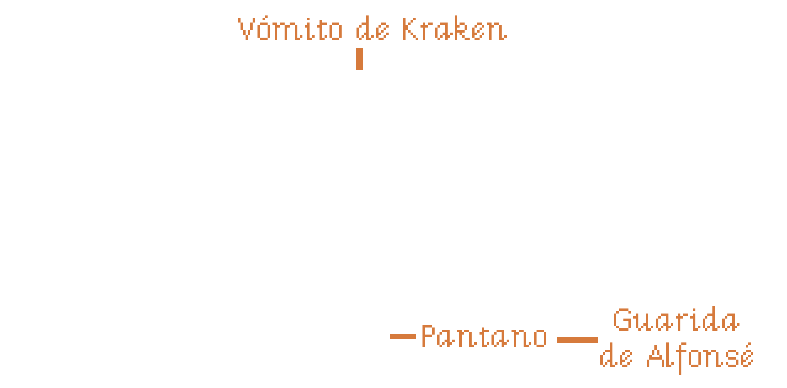

\sinc

## Floppy disk 2/3: Mighty voodoo magic

&nbsp;

\conc

In this second part, your players will have to overcome three more scenes. The first will be a quick scene in which the _**Pirate Ladybosses**_ task them with rescuing Governor Marlon, as he owes them a lot of money for work they've been doing for his upcoming election campaign. Luckily, they'll be given a dilapidated ship they use for tourist shows.

In the second scene, they'll have to venture into the Island's swamps to find _**Alfonsé**_, the voodoo count of the swamps, so he can explain how they can defeat DraChuckla and how to reach Ape Peninsula, where the fearsome vampire is supposedly searching for _**Mac’n Cheese**_.

According to _**Alfonsé**_, the only way to defeat Captain DraChuckla is by using the _**Coronado Cross**_, which is part of the _**Mac 'n Cheese**_ treasure. So they'll have to find the treasure before their terrible enemy does.

In the third and final scene, they must cross the Caribbean Sea to reach the _**Ape Peninsula, following the instructions of the _**oracle bones**_ given to them by the Voodoo Count.

### 1. My first pirate ship

So what now? Your plan to rob the governor has fallen through, so we'll have to come up with a plan B.

\sc

\sp

Remind them of what Vizzini from Princess Bride used to say: «When a job went wrong, you went back to the beginning.» So they should head over to the _**Boiled Crab**_ and see what the barflies are saying.

#### Boiled Crab tavern

Boiled Crab tavern is still just as dirty and filthy, and in the background, the three _**Pirate Lady Bosses**_ are talking amongst themselves. It seems they've been doing «jobs» for Governor Marlon's pre-election campaign and haven't been paid yet, so they're more interested in saving the kidnapped governor and the money DraChuckla stole.

As soon as they see them approaching, they'll see an opportunity to saddle some poor, unsuspecting players with the mess. So, with a lot of smooth talk, they'll offer them a real ship for their piracy if they agree to rescue the governor and recover the lost money.

They'll pull out a _**contract for work and service**_ with super small print, which they could only see with the _**Lulock Holmes magnifying glass**_ that _**Maxine the Red**_ has in her _**souvenir shop**_ and which she won't let them take, but it might be fun for them to try until they get bored and sign the contract.

El contrato estipula que deben salvar al gobernador y sus riquezas de las garras de DraChuckla que actualmente se encuentra en la perdida Península del Simio (perdida porque nadie sabe ir).

To encourage them to sign, they'll be told that they might find the mythical treasure, Mac’n Cheese, since DraChuckla is searching for it right now on the peninsula, and if they find the vampirate, they might just stumble upon the treasure as a bonus.

Finally, they'll tell you to go talk to the Voodoo Count, _**Alfonsé**_, at the _**swamp**_ for more information about DraChuckla and the Ape Peninsula.

In one corner, there's a very drunk young guy wearing a t-shirt that says, "Problems? Alfonsé, the Voodoo Count, is the solution." He looks like a _**leaflet distributor**_ hired by Alfonsé.

#### Kraken's puke

Now you can find the _**Kraken's Puke**_ in the _**harbour**_, the pirate ship that the three _**Pirate Ladybosses**_ have given you. From a distance, it looks impressive, but when you board it, you'll see that it's all cardboard and a trick. In fact, they've only painted one side of the ship because that's the only side tourists see when it passes by in the distance.

On the main deck, you'll meet _**Miss Bridalis**_. _**Bridalis**_ works for the Bucan Ville Tourism Development Commission, which is part of the Bucan Ville Pirate Guild, run by the Pirate Bosses. _**Bridalis**_ is in charge of the ship's maintenance and putting on pirate shows for the tourists who visit the island.

\sp

During the shows, _**Bridalis**_ moves incredibly fast, changes outfits, and uses different voices, so from the outside it looks like the ship is full of crew, but she's the only one piloting it. She has several famous pirates she can perfectly imitate and for whom she has excellent costumes.

She speaks with a very strong pirate accent and is so immersed in the role that if you don't speak to her with the same accent, she won't understand you.

_**Bridalis**_ will tell them that the ship is ready to set sail, but first they should find out or get some clue about where the Ape Peninsula is. Perhaps the powerful voodoo count _**Alfonsé**_, who lives in the swamp, can help them. He made a hairy wart on his mother's back disappear, so his effectiveness as a sorcerer is proven.

### 2. The path of the voodoo

The only way to get to _**Alfonsé**_ hut is to get one of his flyers explaining how to get there. The problem is, the _**distributor**_ he hired has already given them all out and can't give any to your players. In fact, he threw them all in the swamp and went to get drunk with grog at the _**Boiled Crab**_.

No matter how hard you look, you won't find any more of _**Alfonsé's flyers**_; there's only one, and it's in the _**souvenir shop**_.

#### Souvenir Shop

The only _**leaflet**_ you can get right now is one signed by the famous pirate François l'Olonnais for Maxine the Red. She keeps it in a display case in her _**souvenir shop**_ like it's royal jewels. She doesn't want to sell or lend it.

If you try any tricks with the _**discount vouchers**_, she'll show you they've expired and you can't use them.

The only way she'll give you the _**leaflet**_ is if you get her a signed photo of another famous pirate, for which she'll give you a [Polaroid camera](https://en.wikipedia.org/wiki/Instant_camera). And the only way to get a photo of a famous pirate is to have _**Bridalis**_ put on one of her famous pirate costumes and then sign the photo. She gets so into character that she even knows how to sign her name like them.

Depending on the photo they receive, _**Maxine**_ should invent some scandalous/spicy story she had with the person in the picture.

If they get creative, they might even convince _**Alfonsé**_, the Voodoo Count, to hold a séance for them with a famous pirate and have her sign something while possessing the medium.

#### The Swamp

The swamp is a labyrinth that is impossible to navigate without the proper directions, namely, _**Alfonsé's leaflet**_. If you enter without it, you will navigate through three screens with four exits before finally escaping the swamp.

\sp

**There's nothing in the swamp to mark the way**, but if you want to keep them entertained, throw in a few red herrings. You could place a special-colored herb along one of the paths or a crocodile that escapes through an exit when the players enter. They'll try to figure out the logic and recreate it.

If they have the _**leaflet**_, they simply have to follow the directions. There will be three directions: North (up), South (down), East (right), and West (left). On the fourth screen, they'll reach _**Alfonsé's lair**_.

If you want to make it more challenging, you could have them enter any swamp screen from the right, and the directions must be referenced to the entrance. That is, if they first enter from the north (up), they'll appear on the right, meaning north would be exiting to the left instead of from above, east would be above, west below, and south the way they came.

Your players might think outside the box and try to sober up the _**leaflet distributor**_ so he'll tell them the way to the **lair**. It's an interesting option, and you could, for example, have **Sam** have a giant coffee pot in the **shipyard**.

#### Alfonsé's lair

Upon leaving the swamp, they will reach a marshland so dense that it barely lets the light through. On a throne shaped like a skull, surrounded by lit candles, incense burners, and piles of voodoo paraphernalia, sits _**Alfonsé**_, the voodoo count of the swamps. They is a powerful sorcerer who can turn your players into chickens for a few seconds if they are rude to him.

Es muy fantasma y le gusta darse mucho bombo con sus poderes vudú, que si no hay nadie con sus poderes y conocimientos, que él solo podría con DraChuckla, pero entonces dejaría sin vigilancia Bucan Ville, que si podría encontrar el _**Mac’n Cheese**_, pero a él no le mueve el dinero, etc.

Tras dar muchas vueltas y vueltas a la conversación, si son persistentes, le sacarán toda la info necesaria:

* Para matar a DraChuckla necesitan la _**cruz de Coronado**_, una cruz de oro y joyas de gran valor que se supone que forma parte del _**Mac’n Cheese**_.
* Todo el mundo sabe que el _**Mac’n Cheese**_ está escondido en la península del Simio, el problema es encontrar la península. Para encontrarla debes usar los _**huesos vudú**_ y resolver su misterio.
* La única manera de contrarrestar los muñecos vudú que hizo DraChuckla de ellas es destruirlas.

Como ya hemos dicho, si tus jugadoras son descorteses, puede convertirlas en gallina durante unos minutos. La _**gallina**_ puede meterse en el equipo y al poco de sacarse se volverá a convertirse en persona. Seguramente traten de solucionar algún reto con esta opción y si son creativos podrían usarlo.

\sp

El conde del vudú hace mucho hincapié en que los _**huesos**_ son «huesos del oráculo» no «huesos oráculo» (guiño, guiño, golpe, golpe). Vamos, que son huesos humanos, exactamente de un vidente llamado Tom «el bidente» por tener solo dos dientes.

Como anécdota, al principio de la pantalla hay un cubo de basura lleno de panfletos de Alfonsé que ha tirado allí el _**repartidor**_.

### 3. En mareas extrañas

Esta escena es un puzzle en el que deberán usar los _**huesos del oráculo**_. Los huesos son 9 dados de 6 caras con puntos en vez de números. Para invocar al oráculo deben conseguir la siguiente figura que representa una calavera. En ese momento aparecerá el oráculo y les guiará a la península del simio.

La DJ debe tirar los dados y formar una cuadrícula de 3x3. Las jugadoras deben decir cuantos movimientos deben hacer para conseguir el dibujo.

Un movimiento consiste en mover un dado a una cara y girar 90 grados un dado. Luego deberán conseguir dibujar la calavera con el número exacto de movimiento. Pueden deshacer un movimiento gastando un píxel.

Si lo consiguen los huesos tomarán vida y _**Tom «el bidente»**_ empezará a hablar. Habla como un genio de la lámpara con expresiones como «Lo que ordene mi ama y señora» o «Como deseéis».

_**Tom «el bidente»**_ puede contestar a 3 preguntas, una la van a gastar en saber las coordenadas de la península del Simio, las otras dos para lo que quieran. Pero solo podrá responder mientras sus huesos estén en posición. En cuanto se separen o muevan los dados, el oráculo se desvanecerá y no podrá volver a ser invocado.

Si siguen las coordenadas que les dé _**Tom «el bidente»**_, conseguirán llegar a la península del Simio. A partir de este momento podrán venir siempre que quieran.

\sp

\sinc

## Resumen del disquete II

&nbsp;

\conc

### Updated screens

Los nuevos elementos están en cursiva.

#### Astilleros

* **NPC:** Sam
* **Conexiones:** Plaza Mayor de Bucan Ville, _Laberinto pantanoso_

#### Puerto

* **Conexiones:** Plaza Mayor de Bucan Ville, Laberinto pantanoso, _Kraken's puke_, Casa del Gobernador (Exterior)

#### Taberna del Cangrejo Cocido

* **NPC:** Jefas Piratas, Piratas borrachos, _Repartidor de folletos_
* **Elementos clicables:** _Contrato por obra y servicio_
* **Conexiones:** Puerto

#### Souvenir Shop

* **NPC:** Maxine la roja
* **Elementos clicables:** Lupa de Lulock Holmes, _Folleto de Alfonsé firmado por François «El Olones»_, _Cámara Polaroid_
* **Conexiones:** Centro de Bucan Ville

\sc

### Nuevas pantallas de Bucan Ville

#### Kraken's puke

* **NPC:** Señorita Bridalis
* **Conexiones:** Puerto

#### Laberinto pantanoso

* **Conexiones:** Astilleros, Guarida de Alfonsé

#### Guarida de Alfonsé

* **NPC:** Alfonsé
* **Elementos clicables:** Huesos del oráculo
* **Conexiones:** Laberinto pantanoso

\sp

\sinc

### Map of the island

&nbsp;

&nbsp;

&nbsp;

_New locations in orange_

\conc
