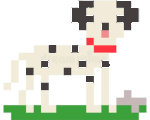
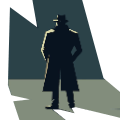
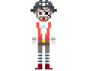

\sinc

## Personajes no jugables

&nbsp;

\conc

Hay un tipo especial de elementos clicables que son los personajes no jugadores. Hay 3 tipos de personajes no jugables:

* **Unifrase:** Solo tienen una sola frase y están en una sola escena.
* **Multifrases:** Tienen varias frases con alguna pista importante, pueden aparecer en diferentes escenas y recibir o dar algún objeto.
* **Principales:** Personajes clave con montones de frases, aparecen en muchas escenas y dan muchas pistas y equipo constantemente.

> Los tipos no son fijos, un personaje unifrase puede convertirse en multifrase en otra parte de la aventura.

### Unifrase

Estos personajes son los más simples de las AG y simplemente tienen una frase que sueltan cuando intentas hablar con ellos. Normalmente, dicen tonterías o chistes y en algunos casos, los menos, dan alguna pista muy críptica. Alguno tienen alguna simple rutina de movimiento como andar de un punto a otro o empujar un gran bloque de piedra.

Con que registres la frase que van a soltar es suficiente. Aparte de soltar su frase, para poco más valen.

Algunos de ellos, sobre todo si tienen movimientos, pueden usarse como elementos clicables para resolver algún reto o puzzle. Igual untas de sebo a un unifrase para que le ataquen las gaviotas y se le caiga el tonel de aceite haciendo que resbale otro PNJ más importante.

#### Señora con andador (unifrase)

Su única frase es «¿Ha pensado en introducir más fibra en su dieta?». Se mueve lentamente con el andador y cuando entras en su pantalla está en un punto aleatorio.

#### Perro con hueso (unifrase)

Se encuentra al lado de un mendigo ciego en la calle principal. Su única frase es «Grrrrr» cuando te acercas al bote de las limosnas del ciego o intentas quitarle el hueso que tiene a sus pies. Tal vez puedas distraerle con un chuletón, un gato o una pelota.

\sp

### Multifrases

Son personajes **más complejos** que los anteriores, con más frases, objetos que pueden dar o recibir y alguna rutina de movimiento. Seguramente tengan alguna tarea como dar información sobre cierto asunto, evitar que puedan acceder a cierta zona o que consigan ciertos objetos. 

Más que frases deberás elegir un par de temas de los que saben mucho y de los que podrían hablar con los PJ y también la información clave que pueden darte.

En caso de que debamos conseguir algo de ellos (información, objetos o acceso), deberías apuntar como se puede conseguir, quizas sea dándole otro objeto, preguntándole algo exactamente, o haciendo alguna serie de acciones con objetos clicables cercanos y/o del equipo.

También deberías apuntarles algunas debilidades que las jugadoras puedan aprovechar y que seguramente ellos mismos u otros personajes les comenten a las jugadoras.

#### Tipo sospechoso en un callejón (multifrase)

Avanzas por la calle y de repente de un callejón sale un «¡Eh, tú, pringao!», preguntas «¿Yo?» y responde «¡Sí, tú, pringao!». Entras y hay un tipo sospechoso con sombrero calado que no te deja ver su cara y una gabardina larga que le cubre hasta los pies. 

\sc

¿Es un ladrón que te va a robar? ¿Es un traficante de drogas o, peor, de cartas Pokémon? ¿Un pervertido? No lo sabes y mejor no acercarse.

Si te acercas, es un vendedor de globos de helio de formas divertidas. Puedes hablar con él de varios temas, globos de helio, inversiones en criptomonedas y cartas Pokémon.

Si le consigues **una buena carta Pokémon, te dará un montón de globos de helio** que podrías usar para levantar algo pesado o volar unos metros. También puedes conseguir los globos con algo que parezca una criptomoneda como los tokens de la lavandería.

### Principales

Son tan complejo como tus propias jugadoras, tienen infinitas frases, su propio equipo y se mueven por toda las pantallas a su gusto y aparecerán en casi todas las escenas. Seguramente sean las némesis de tus jugadoras o personajes con mucho peso en la historia.  

Si son el villano no suelen tener acciones que nos permitan conseguir algo, por ejemplo, empujarlos para que se les caiga una moneda, sino que encontrar la manera de derrotarlos es el desafío de una escena completa, incluso de una parte completa.

Es normal que empezarán como multifrase y un cambio en la historia los convierta en principales. Quizás el pilluelo de la calle que te da rumores del mundo criminal (multifrase), sea secuestrado y se convierta en principal.

\sp

#### Capitán vampirata (principal/villano)

Estas ante el terror del todo Caribe, pronunciar su nombre llena de miedo el corazón. Es el villano perfecto para tu aventura. Además capitán pirata y vampiro, es un usuario de poderosa magia vudú y posee un barco zombi con su tripulación de sirvientes ghouls. 

Sus debilidades son las típicas de los piratas y de los vampiros, es decir, por un lado, el grog, el oro y los mancebos y/o mancebas y por otro lado, el sol, las cruces, el agua bendita, el ajo y los mancebos y/o mancebas. Así que tus jugadoras deberán buscar la manera de usar esas debilidades contra él. Quizás algún otro usuario del vudú pueda ayudarles.

Además, con suerte, quizas tus jugadoras logren averiguar si es pirata al que convirtieron en vampiro o un vampiro que se decidió dedicarse a la piratería. 

### Interactuar con los PNJ

Al interactuar con PNJ ahí serie de reglas que puedes seguir y que le darán a la partida el sabor a AG:

* Puedes preguntar las veces que sean que o se van a molestar y siempre deberían dar la misma respuesta. Las respuestas solo cambiarán si haces algo distintos. Tampoco deberían molestarse.

\sc

* Lo mismo pasa cuando usas objetos con ellos, mientras no uses el adecuado no debería cambiar nada. Si les das dinero, simplemente lo rechazará, si le tiras un cubo de agua, se apartará o simplemente se mojará y te gritará, pero no se moverá de la puerta que guarda. Pero si sacas un ratón y le das un trozo de queso al portero, el ratón se acercará atraído por el olor a queso y el PNJ saldrá corriendo atemorizado por el roedor.
* Normalmente el truco de un PNJ deja de funcionar cuando se cambia de pantalla o de escena. Si el portero vuelve aparecer en otra escena, ya no funcionará lo del ratón y te dirá que su psicoanalista le ha ayudado en ese tema.
* Los PNJ solo participan en un reto por escena, nuestro portero es un reto para entrar en la guarida de la mafia. Una vez superado este reto, no va a dar equipo o pistas para otros retos, pero no siempre.