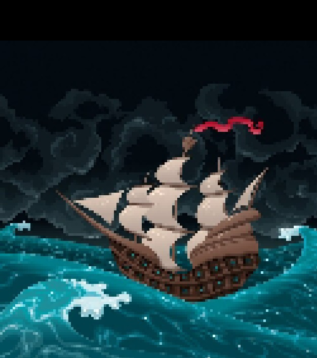
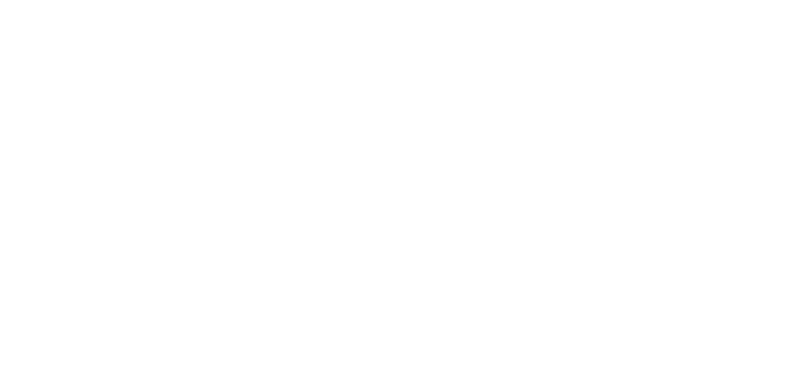
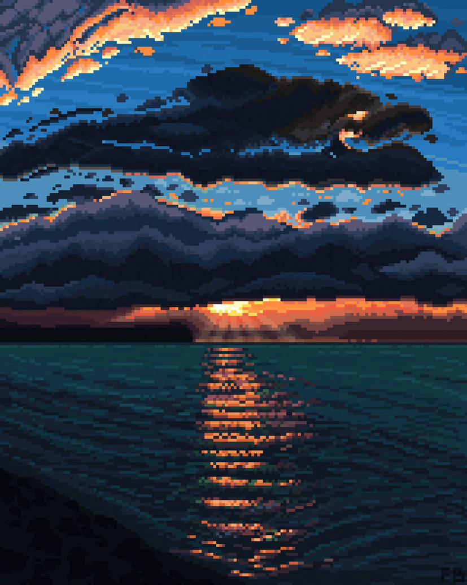
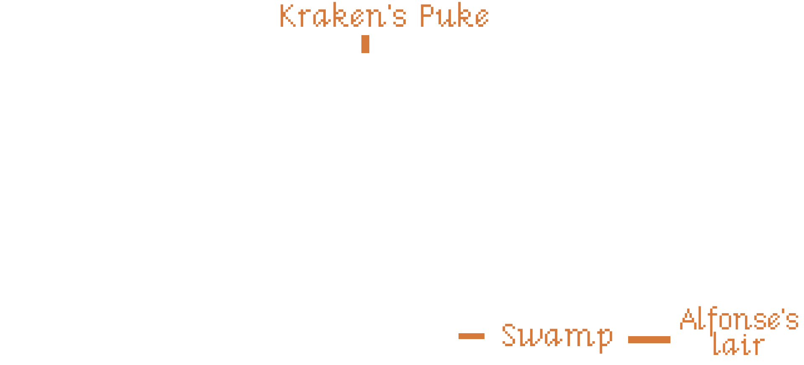
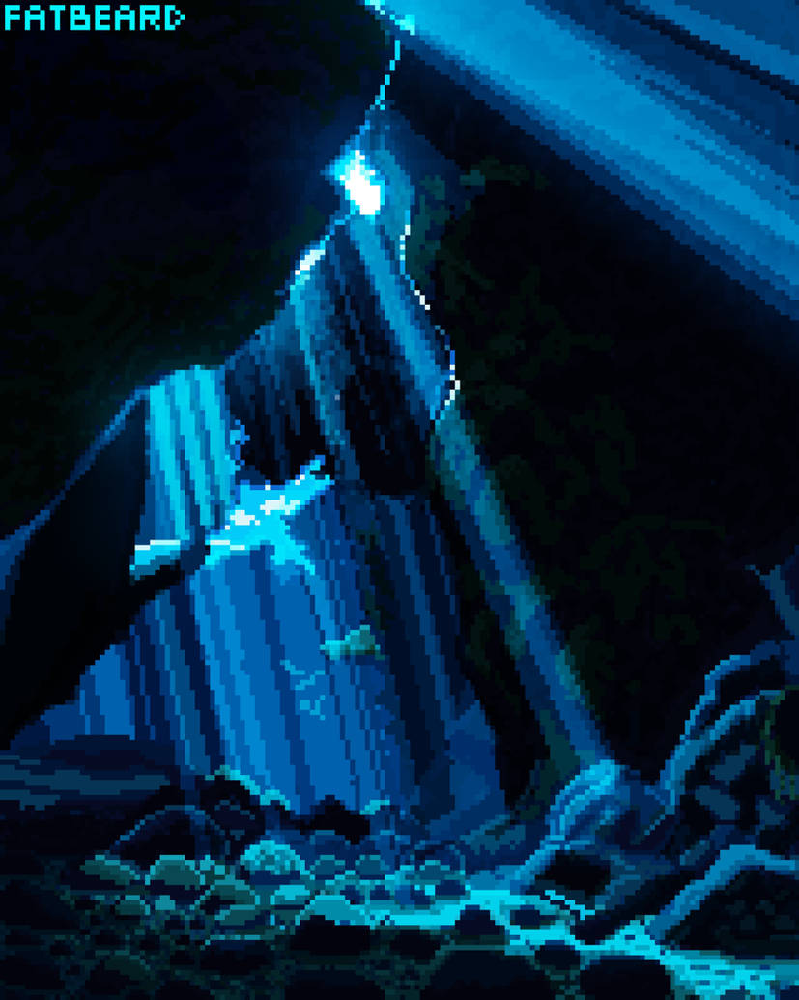

# The enigma of the Ape Peninsula
> Version 1.0 | May 2025
_Deep in the Caribbean lies a peninsula surrounded by water on all sides, called the Ape Peninsula. Venture into its dark grottoes, dense jungles, and well-stocked gift and souvenir shops to become a true buccaneer._

_You'll have to face zombie ships, vampire pirate captains, talking shrunken heads, and plenty of apes, using your intelligence, your wit, and the powerful, sometimes explosive, magic of voodoo._

_If you're lucky enough to avoid scurvy, you might just survive this adventure and find the greatest pirate treasure ever known, Mac’n Cheese, earning the respect of the entire Caribbean._## The enigma of the Ape Peninsula

«The enigma of the Ape Peninsula» is a graphic adventure game for EGA, available on three 3.5-inch floppy disks. Its theme is humor and fantasy, and it was developed by LucasArts Games. To play this adventure, you only need the [Basic Rules for «Point and Click RPG»](https://pointnclick.gwannon.com/).

The first part of this adventure (Disk 1) is the introductory adventure included in the basic rules, so if you've already played it, you can skip it.

### Special rules

#### Look behind you… A three-tailed ape!

Once per game session, one of your players can spend 2 pixels and use the "Look behind you… A three-tailed ape!" trick. After saying the phrase, the player must roll a d6.

On a roll of 6, the other target turns around to face the three-tailed ape, and all players can perform an action, such as picking up something the target was holding, fleeing, or going through a door.

This trick only works with NPCs you can talk to, and it always fails when there is actually a three-tailed ape behind you.
[](https://www.freepik.com/free-vector/ship-sailing-sea_956625.htm "Ship sailing on the sea By ddraw")## Floppy disk 1/3: How to be a pirate

Your PCs have just arrived in Bucan Ville, a pirate haven, with the intention of becoming pirates themselves and making a fortune through piracy.

This part is divided into four scenes. The first will be a brief introduction. Then there will be two parallel scenes: one in which the _**Pirate Lady Bosses**_ grant them the _**pirate degree**_ after they pass a test, and another in which they acquire a ship and its flag. The fourth scene will be the heist of the governor's safe.

### 1. The beginning

The PJs appear at nightfall in the harbour of Bucan Ville and will shout «My name is [PJ name] and I want to be a pirate».

#### Harbour

In this filthy, seedy harbour, there's only one place to go: the _**Boiled Crab Tavern**_, a pirate's den where the grog is watered down and the snacks and peanuts were once Blackbeard's cabin boys.

In the distance, a _**ship with tattered black sails**_ can be seen. An eerie glow floods its deck, and flocks of bats circle overhead.

From the port, you can access _**Bucan Ville Town Center**_.
[ By Fatbeard91")](https://www.deviantart.com/fatbeard91/art/18-57-Rework-1230846234 "18:57 (Rework) By Fatbeard91")
#### Boiled Crab Tavern

The place is a dingy old dive, packed with _**drunken pirates**_. The few who aren't sleeping off their hangovers can barely manage a sentence:

* So you want to be a pirate, huh? Talk to the three _**Pirate Ladybosses**_.
* The grog in my day was real grog, not like the stuff they make now with little umbrellas, cloves, and mint leaves. We used to put real cloves in it.
* Have you heard of [Ahoy! Cthulhu](https://arrrcthulhu.com/)? It's an excellent setting for pirate adventures in a Caribbean of the Cthulhu Mythos.
* They stole my idea for the ape-traffic light. I could have been a millionaire and retired to a Caribbean island and spent my days drinking grog. Oops, I already do that.

At a large table in the back sit the _**3 Pirate Ladybosses**_. The most powerful pirates of Bucan Ville, chosen by the democratic method of slaughtering all their competition.

These three rude pirates are at the table, drinking grog and singing bawdy songs. When your players explain that they want to be pirates, they'll laugh a lot and tell them to stop wasting their time and go back to what they were doing.

Your players will have to prove they really want to be pirates by answering questions like these:

* What was Stede Bonnet's nickname? - Gentleman pirate
* What was Blackbeard's flag? - A horned skeleton holding an hourglass in its right hand and a spear in its left, using the spear to pierce a red heart that drips three drops of red blood.
* What was the name of Blackbeard's first ship? - Queen Anne's Revenge.

They'll also make them sing "Yo Ho Ho and a bottle of rum" (which your players will have to sing). After a while trying to prove they deserve a test, they agree to take the standardized pirate guild exam, which consists of two tests:

* You must prove you're on the other side of the law.
* You must own your own self-propelled ship and create your own unique, personalized pirate flag.

After explaining the standardized tests, they will be asked to sign some paperwork and given a _**discount voucher**_ for the _**Souvenir Shop**_. If they ask for any hints, they will simply be told to ask for _**Sam**_ at the shipyard to see what they can offer in terms of ships.

On the table of the  _**three Pirate Ladybosses**_, there is a _**fruit bowl**_ with oranges, bananas, apples, Swiss vitamin C candies, and lemons, which they claim are from their scurvy eradication campaign.

If they ask, they can take _**a piece of fruit**_. Choose one at random and give it to them. If they eat it, they can ask for another. Until they finish the other piece of fruit they took, the _**Pirate Ladybosses**_ will tell them to finish it first.
### 2.a Cross over to the other side of the law

As the Pirate lady Bosses explained, to become a pirate, you need to be on the other side of the law and have proof of it.

There are several ways to commit crimes:

* The easiest way is to run the red light at the ape-traffic light in _**Bucan Ville's Main Square**_.
* Another way is to stand to the left of the _**courthouse**_ while the _**painter**_ in the _**Main Square**_ is painting.
* If you try other kind of crimes, your characters will look at the screen and say things like, «My mother didn't raise a petty thief» or «This would put me on Santa's naughty list.»

If you see them getting lost at this point, emphasize the "other side of the law" part or remind them of the drunken pirate in the Boiled Crab Tavern who claimed to have invented the ape-traffic light and ask them for a clue.

#### Bucan Ville's Town Center

The streets of the Town Center are deserted at night, the gas lamps are lit, and the shops are closed—all except the _**souvenir shop**_ with its large neon sign that reads "Open 24 Hours."

To cross the street that runs through the center, you have to go through a pedestrian crossing controlled by a _**ape-traffic light**_ and watched over by a _**city guard**_ who only says, "Move along, move along!" The ape-traffic light is operated by a ape that changes the color of the light by moving levers. When you approach, the ape moves the levers, and you always cross on green.

No matter how hard you try, the ape always sets it to green. The only way to cross on red is to give to the ape a banana when the light is red, and as it eats the banana, it stays red. At that moment you can cross and the _**city guard**_ will give you a _**fine**_ and, therefore, you will be an outlaw.

#### Bucan Ville's Main Square

The Plaza Mayor is like all plazas, a large, empty cobblestone space with a single _**dead tree**_ in the center bearing a sign that reads "Tree for Hanging Pirates - Closed for Renovations."

Next to the tree is a _**painter**_ who is painting the town hall. He paints the pictures at lightning speed and leaves them in a _**pile**_ beside him. If you examine them closely, you'll see they aren't very good.

If you try to talk to him, he'll tell you he's very busy; he has to paint 1,000 identical pictures of the town hall for the fundraising campaign for the governor's reelection.
Next to the town hall is the _**courthouse**_. As you approach, you'll see that it's open from 24:00 to 00:00, except on weekends when it's closed. If you stand to its left before the painter starts a new painting and wait until they finish, you can pick up a painting that shows you next to the courthouse—that is, on the other side of the law, just as the _**Pirate Ladybosses**_ requested.

On the other side of the town hall, you can access a _**dark alley**_ from which random snippets of a conversation emerge.

#### Dark alley

It's just a trap. When they enter, the voices will fall silent and figures will vanish into the shadows. As soon as they step back out into the plaza, the voices will return.

### 2.b Get a pirate ship and flag

The only place on the island that sells boats is the _**shipyard**_, and the only one your players can afford right now is a rowboat. The problem is, it's not self-propelled, so they'll have to find a way to make a sail for it.

For the sail fabric, they just need to get the _**Twister vinyl**_ from the _**souvenir shop**_. The mast will simply be one of the oars, and they'll have to tell _**Sam**_, the _**shipyard**_ manager, their idea.

They might waste pixels converting non-clickable elements into clickable ones, like rugs, sheets, etc. When they take it to Sam, he'll make up some silly excuse.

If they present the rowboat's _**title deed**_ to the _**Pirate Ladybosses**_ without a sail, they'll fail the test, shouting in unison, "It's not self-propelled!"

The flag isn't a challenge; let them use whatever they find to make their flag, and if you can make it as ridiculous as possible, even better. They can use the discount _**voucher**_ at the _**souvenir shop**_, and the shop assistant can give them any silly thing you can think of to use for their flag.#### Shipyard

From the _**Main Square**_, you can access the Bucan Ville _**shipyards**_, where your players can acquire a boat they can afford.

There they'll find _**Sam**_, a nautical geek with thick glasses and a t-shirt that says, "Kiss me, I'm a model ship builder."

_**Sam**_ lives to design and build ships... to scale (he always says this quietly), and since he hasn't been able to dedicate himself to building them, he sells them.

Despite being a main character and being able to talk about many topics, _**Sam**_ only talks about ships, ship design, the history of navigation, nautical trivia, etc. If you try to talk about something else, he steers the conversation back to ships.
If they tell him they want to buy a ship, he'll offer them what he has in stock: a luxury pirate ship, a second-hand pirate ship, and a fishing boat. When your players explain their financial situation—that is, 0 doubloons—he'll take them to one side of the shipyard and show them an old _**rowboat**_ with a broken oar.

_**Sam**_ will say that the _**luxury pirate ship_** costs so many gold doubloons that only by robbing the _**governor's safe_** could they afford it, but it's pure luxury. In fact, the wheel even has its own ebony coaster. The problem no one saw coming is that when you turn it, it flips over and spills all the drinks.

After tough negotiations, _**Sam**_ will agree to 200 gold doubloons to be paid with their first act of piracy and plunder. He'll give them the _**title deed**_ to the _**rowboat**_ and a _**pile of papers specifying the payment method**_, which they mustn't lose.

To make it self-propelled, they'll need something to serve as a mast and something to serve as a sail. There's a strike by sailmakers and mast makers, and he's out of them, so your players will have to find something to replace it.

As we've already mentioned, for the sail they'll need the _**Twister vinyl**_ decal and for the mast the oar that isn't broken. With these, _**Sam**_ will assemble some sails and change the description on the _**title deed**_.
#### Souvenir shop

_**Maxine**_ the Red, the red-haired terror of the Caribbean, retired from piracy and used her earnings to open a souvenir shop selling famous pirate memorabilia in Bucan Ville. In her shop, you can find the most outlandish items from the pirate world, from a lock of Blackbeard's beard to Sir Francis Drake's mouthguard.

When customers try to buy a clickable item, Maxine will tell some strange story to discourage them, such as that it's riddled with woodworm or belonged to a leper.

The only thing in the shop that could serve as a sail is a _**Twister vinyl**_ Pirate Edition with skulls, crossbones, treasure chests, and cannons instead of the colored circles.

Like most things in her shop, she doesn't want to give the _**Twister vinyl**_ because it reminds him of when he used to "play" (wink, wink, knock, knock) Twister with Anne Bonny, Jack Rackham, and Mary Read aboard the "Ranger."

The _**discount voucher**_ the _**Pirate Ladybosses**_ gave them has a typo, and if you take Lulock Holmes's _**magnifying glass**_ —Lulock Holmes being Sherlock Holmes's Caribbean cousin and the first pirate detective in literature— you can read the fine print. Where it should say, "Presenting this voucher will get you a 50% discount on pirate merchandise OR a 50% discount on board games," it actually says, "Presenting this voucher will get you a 50% discount on pirate merchandise AND a 50% discount on board games."
So they can use the _**discount voucher**_ to get the _**Twister vinyl**_ completely free and Maxine can't refuse because the truth is that it's the most useless and cheapest thing she has in the store.

Ideas for other silly and weird things you might have in the shop that you could add as clickable items, but that Maxine doesn't want to sell because they bring back fond memories:

* Blackbeard's red beard curls
* Sir Francis Drake's dental splint
* Anne Bonny action figure with a karate chop, red-light eyes, and a button that makes her say, "If you had fought like a man, you wouldn't be hanged like a dog now"
* Long John Silver's running peg leg
* Unofficial Pirates of the Caribbean merchandise signed by the main characters' stunt doubles
* A signed and dedicated photo of Ron Gilbert saying not to buy video games over $20.

### 3. You're a Pirate Now

Players can submit proof of their pirate status simultaneously or separately, but until they've fulfilled both requirements and proven it, they won't be considered full-fledged pirates. The _**Pirate Ladybosses**_ will only refer to them as cabin boys and/or landlubbers with mocking laughter.

After acquiring their ship and being on the wrong side of the law, the player characters can apply for their official __**Pirate Certificate**_, which identifies them as pirates, after paying the corresponding fee of one gold doubloon. You can use this as an opportunity to introduce new challenges, such as searching for loose change under the tavern's jukebox.

### 4. Stealing in the Governor's mansion

Throughout the previous scenes, your players will have heard about the governor, his safe, and the vast amounts of money he keeps inside. Since they can't board ships with their rowboat, they'll need to find a way to rob the governor so they can buy a real pirate ship.

When they leave the Boiled Crab Tavern, you can tell them that they can access the governor's house from the harbor. In fact, there's now a giant neon sign at the harbor that reads, "Visit Governor Marlon's Museum, where the magic of democracy happens."

#### Exterior of the Governor's mansion

Governor Marlon's mansion is a Victorian home perched on a cliff overlooking the Caribbean Sea. It is luxurious and well-maintained; surely the upkeep and luxuries, such as the _**equestrian statue of Governor Marlon**_, are paid for with the taxes of all the residents of Bucan Ville.
Examining his statue, Governor Marlon is a good looking human: long hair, a chiseled chin with a divine dimple, broad shoulders, a torso sculpted from stone, and powerful arms and legs.

The exterior is guarded by _**peacocks**_ that gobble loudly as soon as they see you. Then a light on the second floor comes on, and Governor Marlon goes to the window to keep watch, armed with a black powder rifle. When he sees nothing suspicious, he goes back inside.

If you hide behind the _**equestrian statue**_ and hit them when they're not looking in your direction, you can take a _**feather**_ from each of them. When you have three feathers, you can make yourself a _**peacock headdress**_, and the _**peacocks**_ will consider you one of their own and let you pass without informing the governor.

#### Governor's Mansion Main Hall

Upon entering the Governor's Mansion, you'll find yourself in the main hall. It's large and luxurious, filled with artwork, expensive vases, ivory figures, and so on. The _**hall**_ is dimly lit by a few _**candles in a large chandelier**_.

If you try to pull/push the _**pulleys that raise and lower**_ the chandelier, they will creak, and you'll see lights from the upper floor and hear the sounds of Governor Marlon loading his rifle. This makes it impossible to lower the chandelier while it's making noise; you need some kind of lubricant.

Let them search the screens for something non-clickable that can serve as a lubricant, like the grog the _**Pirate Lady Bosses**_ drink, the turpentine the _**painter**_ in the _**Main Square**_ uses, etc., and make it clickable with their pixels.

##### Governor's Mansion's Basement

The basement is dark, and the only visible feature is the large _**safe**_ door, covered in a multitude of locks, combination dials, and gears. It appears incredibly complex—so complex, in fact, that Governor Marlon has left a note hidden in a specific pixel on the screen with instructions for opening it.

There is very little light in the basement, and the exact pixel can only be found if light is available. The only light source will be the _**candles in the chandelier**_ in the _**main hall**_. If they try to bring in a light source from elsewhere (by making something clickable), make it difficult for them, as these will be electric or gas-powered.

### 5. Enter DraChuckla

Once they've managed to break into the governor's vault and are swimming in gold and jewels, they'll hear a loud cannon blast, and suddenly a cannonball will shatter one of the walls.

As they recover from the explosion, they'll see the fearsome vampire captain DraChuckla enter through the hole with his ghoul henchmen to seize their loot while laughing at them.
He'll approach the player characters, pluck a hair from each of them, and stick them to voodoo dolls, saying, "Just in case you become a problem," and then they'll fall unconscious.

When they manage to get up, they'll see through the hole in the wall that the black-sailed ship that was in the distance from the port is sailing away with DraChuckla on board and Governor Marlon tied and gagged.## Summary of the floppy disk 1/3

### Shipyard

* **NPC:** Sam
* **Clickable items:** Luxury pirate ship, Second-hand pirate ship, Fishing boat, Rowboat, Title deed, Pile of papers specifying the payment method
* **Connections:** Bucan Ville's Main Square

### Bucan Ville

#### Dark alley

* **Connections:** Bucan Ville's Main Square

#### Bucan Ville's Town Center

* **NPC:** City guard
* **Clickable items:** Ape-traffic light
* **Connections:** Bucan Ville's Main Square, Harbour, Souvenirs Shop

#### Souvenirs Shop

* **NPC:** Maxine the Red
* **Clickable items:** Twister vinyl, Some stupid object to use as a flag, like Blackbeard's underwear, Lulock Holmes magnifying glass
* **Connections:** Bucan Ville's Town Center

#### Bucan Ville's Main Square

* **NPC:** Painter
* **Clickable items:** Courthouse, Pile of pictures
* **Connections:** Bucan Ville's Town Center, Dark alley

### Governor's mansion

#### Exterior

* **NPC:** Peacocks
* **Clickable items:** Equestrian statue of Governor Marlon, Peacock feathers, Peacock headdress
* **Connections:** Harbour, Governor's mansion (Main Hall)

#### Main Hall

* **Clickable items:** Candles in a large chandelier, Pulleys that raise and lower the chandelier
* **Connections:** Governor's mansion (Exterior), Governor's mansion (Basement)

#### Basement

* **Clickable items:** Safe, Note with instructions for opening the safe (Exact pixel)
* **Connections:** Governor's mansion (Main Hall)
### Docks

#### Harbour

* **Clickable items:** Ship with tattered black sails
* **Connections:** Boiled Crab Tavern, Bucan Ville's Town Center, Governor's mansion (Exterior)

#### Boiled Crab Tavern

* **NPC:** Pirate Lady Bosses, Drunken pirates
* **Clickable items:** Fruit bowl, Random piece of fruit, Discount voucher of the souvenir shop
* **Connections:** Harbour

### Map of Bucan Ville



## Floppy disk 2/3: Mighty voodoo magic

In this second part, your players will have to overcome three more scenes. The first will be a quick scene in which the _**Pirate Ladybosses**_ task them with rescuing Governor Marlon, as he owes them a lot of money for work they've been doing for his upcoming election campaign. Luckily, they'll be given a dilapidated ship they use for tourist shows.

In the second scene, they'll have to venture into the Island's swamps to find _**Alfonsé**_, the voodoo count of the swamps, so he can explain how they can defeat DraChuckla and how to reach Ape Peninsula, where the fearsome vampire is supposedly searching for _**Mac’n Cheese**_.

According to _**Alfonsé**_, the only way to defeat Captain DraChuckla is by using the _**Coronado Cross**_, which is part of the _**Mac 'n Cheese**_ treasure. So they'll have to find the treasure before their terrible enemy does.

In the third and final scene, they must cross the Caribbean Sea to reach the _**Ape Peninsula, following the instructions of the _**oracle bones**_ given to them by the Voodoo Count.

### 1. My first pirate ship

So what now? Your plan to rob the governor has fallen through, so we'll have to come up with a plan B.
[](https://www.deviantart.com/fatbeard91/art/Glowing-Horizons-1072294859 "Glowing Horizons By Fatbeard91")
Remind them of what Vizzini from Princess Bride used to say: «When a job went wrong, you went back to the beginning.» So they should head over to the _**Boiled Crab**_ and see what the barflies are saying.#### Boiled Crab tavern

Boiled Crab tavern is still just as dirty and filthy, and in the background, the three _**Pirate Lady Bosses**_ are talking amongst themselves. It seems they've been doing «jobs» for Governor Marlon's pre-election campaign and haven't been paid yet, so they're more interested in saving the kidnapped governor and the money DraChuckla stole.

As soon as they see them approaching, they'll see an opportunity to saddle some poor, unsuspecting players with the mess. So, with a lot of smooth talk, they'll offer them a real ship for their piracy if they agree to rescue the governor and recover the lost money.

They'll pull out a _**contract for work and service**_ with super small print, which they could only see with the _**Lulock Holmes magnifying glass**_ that _**Maxine the Red**_ has in her _**souvenir shop**_ and which she won't let them take, but it might be fun for them to try until they get bored and sign the contract.

The contract stipulates that they must save the governor and his riches from the clutches of DraChuckla, who is currently in the lost Ape Peninsula (lost because nobody knows how to get there).

To encourage them to sign, they'll be told that they might find the mythical treasure, Mac’n Cheese, since DraChuckla is searching for it right now on the peninsula, and if they find the vampirate, they might just stumble upon the treasure as a bonus.

Finally, they'll tell you to go talk to the Voodoo Count, _**Alfonsé**_, at the _**swamp**_ for more information about DraChuckla and the Ape Peninsula.

In one corner, there's a very drunk young guy wearing a t-shirt that says, "Problems? Alfonsé, the Voodoo Count, is the solution." He looks like a _**leaflet distributor**_ hired by Alfonsé.

#### Kraken's puke

Now you can find the _**Kraken's Puke**_ in the _**harbour**_, the pirate ship that the three _**Pirate Ladybosses**_ have given you. From a distance, it looks impressive, but when you board it, you'll see that it's all cardboard and a trick. In fact, they've only painted one side of the ship because that's the only side tourists see when it passes by in the distance.

On the main deck, you'll meet _**Miss Bridalis**_. _**Bridalis**_ works for the Bucan Ville Tourism Development Commission, which is part of the Bucan Ville Pirate Guild, run by the Pirate Bosses. _**Bridalis**_ is in charge of the ship's maintenance and putting on pirate shows for the tourists who visit the island.
During the shows, _**Bridalis**_ moves incredibly fast, changes outfits, and uses different voices, so from the outside it looks like the ship is full of crew, but she's the only one piloting it. She has several famous pirates she can perfectly imitate and for whom she has excellent costumes.

She speaks with a very strong pirate accent and is so immersed in the role that if you don't speak to her with the same accent, she won't understand you.

_**Bridalis**_ will tell them that the ship is ready to set sail, but first they should find out or get some clue about where the Ape Peninsula is. Perhaps the powerful voodoo count _**Alfonsé**_, who lives in the swamp, can help them. He made a hairy wart on his mother's back disappear, so his effectiveness as a sorcerer is proven.

### 2. The path of the voodoo

The only way to get to _**Alfonsé**_ hut is to get one of his flyers explaining how to get there. The problem is, the _**distributor**_ he hired has already given them all out and can't give any to your players. In fact, he threw them all in the swamp and went to get drunk with grog at the _**Boiled Crab**_.

No matter how hard you look, you won't find any more of _**Alfonsé's flyers**_; there's only one, and it's in the _**souvenir shop**_.

#### Souvenir Shop

The only _**leaflet**_ you can get right now is one signed by the famous pirate François l'Olonnais for Maxine the Red. She keeps it in a display case in her _**souvenir shop**_ like it's royal jewels. She doesn't want to sell or lend it.

If you try any tricks with the _**discount vouchers**_, she'll show you they've expired and you can't use them.

The only way she'll give you the _**leaflet**_ is if you get her a signed photo of another famous pirate, for which she'll give you a [Polaroid camera](https://en.wikipedia.org/wiki/Instant_camera). And the only way to get a photo of a famous pirate is to have _**Bridalis**_ put on one of her famous pirate costumes and then sign the photo. She gets so into character that she even knows how to sign her name like them.

Depending on the photo they receive, _**Maxine**_ should invent some scandalous/spicy story she had with the person in the picture.

If they get creative, they might even convince _**Alfonsé**_, the Voodoo Count, to hold a séance for them with a famous pirate and have her sign something while possessing the medium.

#### The Swamp

The swamp is a labyrinth that is impossible to navigate without the proper directions, namely, _**Alfonsé's leaflet**_. If you enter without it, you will navigate through three screens with four exits before finally escaping the swamp.
**There's nothing in the swamp to mark the way**, but if you want to keep them entertained, throw in a few red herrings. You could place a special-colored herb along one of the paths or a crocodile that escapes through an exit when the players enter. They'll try to figure out the logic and recreate it.

If they have the _**leaflet**_, they simply have to follow the directions. There will be three directions: North (up), South (down), East (right), and West (left). On the fourth screen, they'll reach _**Alfonsé's lair**_.

If you want to make it more challenging, you could have them enter any swamp screen from the right, and the directions must be referenced to the entrance. That is, if they first enter from the north (up), they'll appear on the right, meaning north would be exiting to the left instead of from above, east would be above, west below, and south the way they came.

Your players might think outside the box and try to sober up the _**leaflet distributor**_ so he'll tell them the way to the **lair**. It's an interesting option, and you could, for example, have **Sam** have a giant coffee pot in the **shipyard**.

#### Alfonsé's lair

Upon leaving the swamp, they will reach a marshland so dense that it barely lets the light through. On a throne shaped like a skull, surrounded by lit candles, incense burners, and piles of voodoo paraphernalia, sits _**Alfonsé**_, the voodoo count of the swamps. They is a powerful sorcerer who can turn your players into chickens for a few seconds if they are rude to him.

They's a real show-off and likes to boast a lot about his voodoo powers, saying that there's no one with his powers and knowledge, that they alone could take on DraChuckla, but then they'd leave Bucan Ville unguarded, that he could find the **Mac'n Cheese**, but money isn't their motivation, etc.

After going around in circles with the conversation, if they are persistent, they will get all the necessary information out of him:

* To defeat DraChuckla, you need the _**Coronado’s cross**, a gold cross and valuable jewels that are supposedly part of the _**Mac’n Cheese**_.
* Everyone knows that the _**Mac’n Cheese**_ is hidden on Ape Peninsula; the problem is finding the peninsula. To find it, you must use the **voodoo bones** and solve its mystery.
* The only way to counter the voodoo dolls DraChuckla made of them is to destroy them.

As we've already mentioned, if your players are rude, they can turn them into chickens for a few minutes. The _**chicken**_ can be inserted into the equip as and item and will quickly revert to human form. They'll probably try to solve a challenge with this option, and if they're creative, they could use it.
The Voodoo Count is very insistent that the _**bones**_ are "bones of the oracle," not "oracle bones" (wink, wink, nudge, nudge). Basically, they're human bones, specifically from a seer named Tom «the visionary» because he said that in the future there would be no coins, only «bits of coins».

As an aside, at the beginning of the screen there's a trash can full of Alfonsé's pamphlets that the _**leaflet distributor**_ threw away.

### 3. On Stranger Tides

This scene is a puzzle in which you will need to use the _**bones of the oracle**_. The bones are nine six-sided dice with dots instead of numbers. To summon the oracle, you must obtain the following shape, which represents a skull. At that moment, the oracle will appear and guide you to the Ape Peninsula.


The GM must roll the dice and form a 3x3 grid. The players must then say how many moves they need to make to create the drawing.
One move consists of moving one die to a face and rotating another die 90 degrees. Then, you must draw the skull using the exact number of moves. You can undo a move by spending one pixel.

If they succeed, the bones will come to life and _**Tom «the visionary»**_ will begin to speak. He speaks like a genie in a lamp, using phrases like «As my lady commands» or «As you wish».

_**Tom «the visionary»**_ can answer three questions. One will be used to determine the coordinates of the Ape Peninsula, and the other two can be used for any other purpose. However, he can only answer while his bones are in position. As soon as they are separated or the dice are moved, the oracle will vanish and cannot be summoned again.

If they follow the coordinates given by _**Tom «the visionary»**_, they will reach the Ape Peninsula. From this moment on, they can return whenever they wish.## Summary of the floppy disk 2/3

### Updated locations

New locations are in cursive.

#### Shipyard

* **NPC:** Sam
* **Conecctions:** Bucan Ville's Main Square, _The Swamp_

#### Harbour

* **Connections:** Bucan Ville's Main Square, The Swamp, _Kraken's puke_, Governor's mansion (Exterior)

#### Boiled Crab Tavern

* **NPC:** Pirate Lady Bosses, Drunken pirates, _Leaflet distributor_
* **Clickable items:** _Contract for work and service_
* **Connections:** Harbour

#### Souvenir Shop

* **NPC:** Maxine the Red
* **Clickable items:** Lulock Holmes magnifying glass, _**Leaflet signed by the famous pirate François l'Olonnais_, _Polaroid camera_
* **Connections:** Bucan Ville's Town Center
### New screens of Bucan Ville

#### Kraken's puke

* **NPC:** Miss Bridalis
* **Connections:** Harbour

#### The Swamp

* **Conexiones:** Shipyard, Alfonsé's lair

#### Alfonsé's lair

* **NPC:** Alfonsé
* **Clickable items:** Bones of the oracle
* **Connections:** The Swamp### Map of the island
_New locations in orange_## Floppy disk 3/3: At the Ape Peninsula

Your players have reached the Ape Peninsula and are about to discover that «The Walker», DraChuckla's ship, is anchored nearby in a small cove. So they'll have to find another place to disembark.

On this third floppy disk, you must complete the last three scenes. First, you must find the _**Mac’n Cheese**_ before Captain DraChuckla and obtain the _**Cross of Coronado**_.

Later, in the second scene, they must infiltrate _**The Walker**_, DraChuckla's zombie ship, and recover their _**voodoo dolls**_, since with them in the possession of their enemy, they are defenseless against the powerful magic of the evil vampirate captain.

Finally, they must face DraChuckla in single combat and use the _**Cross of Coronado**_ to kill him—and kill him good. We don't want any sequels here, do we?

### 1. The dig

Your players have arrived at the coast of the Ape Peninsula and the first thing is to find the great pirate treasure and get the _**Cross of Coronado**_.

The first task is to find the cave where the treasure is hidden without getting lost in the jungle labyrinth. And this time, unlike with the swamp, there won't be a map.
[](https://www.deviantart.com/fatbeard91/art/Silence-959695299 "Silence By Fatbeard91")
They'll have to discover the key: doubloons placed on a exact pixel that mark the route.

To access the treasure, which is at the bottom of the cave, they must pass through 3 screens and solve a small puzzle on each one.

At the bottom of the cave, on top of a mountain of _**gold ingots**_, is the Cross of Coronado**_, but climbing the pile of _**ingots**_ and getting the cross will be another challenge.

> If you want to simplify things, you can have _**The Walker**_ sink your players' ship, _**The Kraken's Puke**_, so they can't leave the peninsula. This prevents them from going crazy trying to travel to _**Bucan Ville**_ for this part.

#### The beach

Your players, along with _**Bridalis**_, will disembark on the _**beach**_. The _**beach**_ is idyllic, with sand and palm trees, perfect for sunbathing while lying on the sand and drinking grog. You can collect seaweed from the ground, although it's dry and smelly. While your players enter into the jungle, _**Bridalis**_ will stay on the beach looking after the _**boat**_.

Each time they enter the screen, _**Bridalis**_ will have a new costume and will be doing one of these activities:

* Building a sandcastle
* Sunbathing
* Playing with a beach ball
* Coming out of the water in a wetsuit
* Fishing
* Cooking a barbecue
* Using a metal detector to look for coins

If they seem really lost, you can give them some of the items _**Bridalis**_ is using; for example, the metal detector can help them in the jungle. You can also fill their equipment with junk they won't need or be able to use.

If they use the _**boat**_, they can return to _**Kraken's Puke**_ and from there to _**Bucan Ville**_.

#### The jungle

The dark jungle is a maze. As in the swamp, they'll move through jungle areas with connections above, below, left, and right. After moving through four areas, they'll return to the beach.

The only way through the maze is to follow the trail of _**gold doubloons**_ that mark the path to the _**treasure cave**_. The _**doubloons**_ are hidden in exact pixels. If they have a metal detector, you can give them a bonus for finding the exact pixel.

If you find the four doubloons and follow their directions, you will reach the _**entrance of the cave**_. From that point on, when you enter the jungle, you will arrive directly at the _**entrance of the cave**_.
#### Entrance of the cave

The _**entrance of the cave**_ is a gigantic stone ape head and is guarded by a _**bunch of apes**_ who snarl at you and throw poop if you get too close.

Si se fijan bien, los _**simios**_ lanzan las cacas siempre en las 3 mismas zonas y antes de lanzar gruñen. Las cacas al caer salpican, así que las zonas donde se pueden pringar son amplias.

Después de cada ronda de lanzamiento de cacas, mientras consiguen nueva munición (tómatelo como quieras), tus jugadoras pueden atravesar una zona de salpicadura y quedarse en una zona protegida.

Así, poco a poco podrán avanzar hacia la cabeza de mono y una vez estén enfrente de los _**simios**_ huirán despavoridos.

Puedes pedirles tiradas para recordar con precisión si están en zona de pringue o no. Dales bonus si se les ocurre dejar algo para marcarlas como papeles y negativos si intentan pasar a toda velocidad.

Si les cae una caca encima a una de tus jugadoras, saldrá corriendo a la playa a limpiarse y con ella sus compañeras. Recuerda que no pueden separarse y deben estar siempre en la misma pantalla.

Las cacas una vez impactan desaparecen sin dejar pistas de donde están las zonas de caída de cacas.

#### First chamber of the cave

En esta _**primera cámara**_ hay tres _**estatuas de simios**_, cada una con un gesto, uno que se tapa las orejas, otro la boca y otro los ojos. Encima de cada una las _**estatuas**_ hay un pequeño simio que imita cualquier gesto. Si avanzan y algún simio no es igual al gesto de su estatua, en cuanto pasan las _**3 estatuas**_, los simios tocan algún resorte y se levanta un muro que no les deja avanzar.

Los monos imitan lo que hace la persona que hay delante de la estatua, así que, por ejemplo, al ponerse delante del que tiene tapadas las orejas y taparse los ojos, se taparán los ojos. Automáticamente, el resto cambian siguiendo estás reglas.

* Si cambian la primera estatua o tercera estatua, el gesto actual pasa a la estatua de que no tenga el gesto al que queremos cambiar y gesto que no hemos cambiado ocupa el lugar libre.
* Si cambian el gesto de la segunda estatua solo se intercambia por el nuevo gesto.

La solución es sencilla, pero hay que descubrir el movimiento de los gestos.

|&nbsp;|1ª estatua|2ª estatua|3ª estatua|
|---|---|---|---|
|Gesto estatua|Orejas|Boca|Ojos|
|Gesto simio inicial|Ojos|Boca|Orejas|
|1ª estatua **orejas**|**Orejas**|Ojos|Boca|
|3ª estatua **ojos**|Boca|Orejas|**Ojos**|
|2ª estatua **boca**|Orejas|**Boca**|Ojos|
Si colocan cada simio en su estatua, no saltará el muro y podrán avanzar. Los gestos se conservan aunque salgan de la pantalla.

#### Second chamber of the cave

En la segunda cámara hay un gran precipicio y hay un _**tronco**_ que parece ser demasiado corto para hacer una pasarela con la que pasar por encima del precipicio. Las soluciones pueden ser muy varias.

* Lo más sencillo es meterle al _**tronco**_ todos sus píxeles para hacer que sea más largo.
* Pueden mirar en su equipo y atar algo para que _**tronco**_ sea más largo, pero en principio no deberían tener nada que sirva.
* El precipicio es muy poco hondo, pero como el fondo queda fuera de pantalla parece que no tiene fin. Si lanzan algo verán que no es nada hondo, apenas les llega a las rodillas. Pueden bajar, pasar andando y volver a subir por el otro lado.
* Si quieren hacer un poco de metajuego de videojuego, pueden poner el _**tronco**_ verticalmente y podrían trepar y acceder a la parte superior de la interfaz gráfico y cruzar el precipicio usando la interfaz de puente. Una vez pasen el precipicio podrán descolgarse de la interfaz.

#### Third chamber of the cave

La _**tercera cámara**_ es un largo pasillo en el que parece que no hay nada, pero cuando vayan a atravesarla saldrá una _**cuchilla gigante del techo**_ que estará a punto de cortarles por la mitad y no podrán pasar al otro lado.

Cuando se activa la _**cuchilla**_ se oye un chillido de mono que sale de una _**agujero en la pared**_ más adelante, así que seguro que un mono vigila desde esa trampilla y activa la _**cuchilla**_. No puede acercarse al _**agujero**_ porque la _**cuchilla**_ salta, así que no pueden hacerle nada al simio.

El pasillo es tan largo que hay scroll en la pantalla de izquierda a derecha y el truco de esta pantalla está en usar ese scroll para atravesar la cuchilla.

Si tus jugadoras van juntas, van en el centro de la pantalla y cuando llegan al punto donde está la _**cuchilla**_ el _**agujero del simio**_ está en pantalla y el vigía los ve y activa la cuchilla.

Si van avanzando, una jugadora en cada lado de la pantalla, cuando la de la derecha llega a la cuchilla, la _**trampilla del mono**_ vigía no está en pantalla (ya que la otra jugadora mueve el scroll hacia su lado), por tanto, no los ve y no puede activar la _**cuchilla**_.

Una vez ha pasado una jugadora la cuchilla, podrá espantar al mono de la _**trampilla**_ y que pasen el resto.

Igual si vuelven a hablar con el creador del simio-semáforo y les dé una pista de cómo funciona la _**simio-cuchilla**_.
#### Treasure chamber

En esta gran sala hay montañas de monedas de oro, cetros y coronas enjoyadas y diamantes, rubíes y esmeraldas como melones. Pueden llenar todo su equipo con _**riquezas**_ de todo tipo si lo desean.

Han encontrado el gran tesoro pirata, pero conseguir la _**cruz de Coronado**_ no es tarea fácil. Encima de una montaña de lingotes de oro está la _**cruz**_, pero si intentan escalar la _**montaña de lingotes**_ para cogerla, resbalan y te caes al pie de la montaña.

A priori, necesitan algún tipo de equipo de escalada o algún tipo de invento que les permita coger la _**cruz**_ a distancia, pero nada más lejos de la realidad.

La única opción es que cojan los _**lingotes**_ de la montaña y las metan en su equipo para hacer más pequeña la montaña y puedan escalarla fácilmente. Necesitarán por lo menos quitar 20 casillas de equipo de _**lingotes**_ para que disminuya a un nivel adecuado. El problema es que con todo ese oro es muy imposible moverse, con coger 1 lingote no podrán moverse y no podrán trepar. Si lo tiran, volverá al montón y este volverá a crecer y no se podrá escalar.

El truco de esta prueba es dar los _**lingotes**_ a una compañera que este al otro lado de la jugadora y esta lo tire al otro lado de manera que los _**lingotes**_ crean otro montón, de esa manera la primera jugadora se puede mover y coger la _**cruz**_.

### 2. De vampiros y zombis

Con la cruz en su poder, la siguiente parte es ir a enfrentarse a DraChuckla, pero primero deben recuperar sus _**muñecos vudú**_. Tus jugadoras pueden ir directamente a enfrentarse a DraChuckla sin haber recuperado sus _**muñecos vudú**_, pero nada más verlos llamara a un zombi que entrará con los muñecos y empezará a atravesarlos con unas agujas, con lo que tendrán que salir corriendo y aparecerán fuera del navío. Tendrán que volver a empezar la infiltración en el barco desde el principio.

De vuelta a la playa, tras tener en su mano la _**cruz de Coronado**_, podrán usar el bote con el que han bajado a tierra. Podrán salir de la cala en la que está su barco e ir al lugar donde fondea _**El caminante**_, el navío de velas negras de DraChuckla.

Esta escena se desarrollará en _**El caminante**_. Como rey de los no-muertos, DraChuckla ha convertido en zombis a todas sus víctimas y los ha enrolado en su tripulación. No son muy eficientes ni rápidos, pero son difíciles de matar, no necesitan agua, ni comida, ni cobrar a fin de mes. Así que todo son ventajas.

Si los _**no-muertos**_ los detectan, se lanzarán a por ellos y tendrán que salir del barco y volver a empezar la escena desde el principio, igual que cuando _**DraChuckla**_ usa los muñecos vudú.
#### Outside The Walker

Tus jugadoras pueden acercarse al casco de _**El caminante**_ cerca de su ancla, que han dejado caer al mar. El casco está cubierto de _**percebes, lapas y mejillones**_ que pueden recolectarse.

No hay ningún tipo de prueba o reto en esta pantalla, simplemente escalar la _**cadena del ancla**_ y entrar a la _**cubierta inferior**_.

#### Lower deck

La _**cubierta inferior**_ está llena de zombis vagando de un lado al otro. La pantalla tiene un scroll muy largo. La escotilla que han usado para entrar está a un lado de la cubierta y la escalera para subir está al otro lado.

Los _**zombis**_ solo dicen las típicas frases de zombi, como «Cerebro ricooooo», «Chomp chomp» o «Maaaaaaaa», y no paran de moverse aleatoriamente por toda la cubierta. 

Los zombis están sucios y apestosos, así que si son listos podrían embadurnarse con las _**lapas, percebes y mejillones**_ del casco y hacerse algún tipo de disfraz de algas de la _**playa**_. Con esto, los _**zombis**_ de la cubierta inferior no deberían molestarlas.

#### Upper deck

La _**cubierta superior**_ está también llena de _**zombis**_, pero estos parecen más inteligentes, están haciendo tareas sencillas como barrer la cubierta o atar y desatar cabos.

Esta pantalla también es larga con un scroll desde la escalera que subía de la _**cubierta inferior**_ hasta la puerta del _**castillo de popa**_.

Esta vez no bastará con ponerse los restos malolientes del marisco de casco, deberán coger algo como _**una fregona**_ o un _**cepillo**_ y limpiar el suelo o coger una _**maroma**_ y llevarlas al otro lado de la cubierta.

Hazles pasar una tirada para engañar a los _**zombis de cubierta**_ y puedes darles positivos o negativos según su interpretación, si hacen sonidos de zombis o hablan como humanos, etc.

#### Poop deck

El castillo de popa es una estancia que hace las veces de almacén de trastos, mapas, herramientas de navegación, trofeos varios y toda la parafernalia vudú de DraChuckla como _**cabezas reducidas parlantes**_ o los _**muñecos vudú**_ de tus jugadoras. En una esquina hay un camastro para el _**primer oficial zombi**_ y un baúl donde están sus cosas. 

La misión en esta pantalla es coger los _**muñecos vudú**_ para que cuando _**DraChuckla**_ quiera usarlos no pueda. Los muñecos están en una _**vitrina de exposición con cerrojo**_ con otros objetos vudús. El problema es que cuando intentas abrir la _**vitrina**_, _**3 cabezas reducidas parlantes**_ que hay encima de la _**vitrina**_ empiezan a chillar y todo se llena de zombis, con lo que tus jugadoras se tiran al agua por una escotilla para escapar.
Puede hacerse de varias maneras.

* La más sencilla es coger las cabezas (tendrán que coger una cada vez) porque al momento el resto se ponen a gritar y aparecen los zombis. Cuando tengan todas, podrán abrir la _**vitrina**_ sin que suene ninguna alarma.
* Podrían hacer sonar las alarmas montones de veces y largarse rápidamente antes de que les vean. De esta manera, el _**primero de abordo**_ terminará hartándose y quitando las _**cabezas**_ para que no griten. Pon un número de falsas alarmas y hasta que no lo completen no las quitará el _**primero de abordo**_.

Por si tienen alguna idea genial y/o mirando su equipo inventan algún tipo de artilugio para robar los muñecos, debes tener en cuenta que si tocan el _**cerrojo**_, las _**cabezas**_ dan la alarma y si tocan propias _**cabezas**_, también dan la alarma.

Con los muñecos en su poder podrán entrar en el _**camarote de DraChuckla**_ y enfrentarse a él sin miedo.

### 3. ¡Muere maldito vampirata!

Esta escena es la batalla final contra el terrible _**DraChuckla**_. La batalla es un duelo de ingenio y habilidad sin parangón que pondrá a prueba todas las capacidades de tus jugadoras ... Qué va, mentira. Va a ser una cinemática chusca y pista, que los disquetes están caros.

#### DraChuckla's Cabin

_**DraChuckla**_ les espera tocándole al _**Gobernador Marlon**_ una de sus piezas musicales tremendamente tétrica en un gigantesco órgano en su camarote. Viste su capa de vampiro que tiene un vuelo estupendo y va con su gorro de capitán pirata. El _**gobernador**_ está atacado y amordazado

Cuando entren, llamará a su _**primero de a bordo zombi**_ para que les traiga los _**muñecos vudú**_ y acabar con tus jugadoras, pero si han hecho bien los deberes, el _**primero de abordo**_ aparecerá y le dirá «Mi señor, los muñecos no están».

Aquí empezará la batalla entre jugadoras y el temible capitán DraChuckla. Puedes enfocarlo como quieras, pero la idea que te ofrecemos es que sea una especie de cinemática donde DraChuckla se acerca a tus jugadoras soltando amenazas tipo «Voy a chuparos la sangre» o «Me daré un festín con vuestra vitae». Ellas sacarán la _**cruz de Coronado**_ que empieza a brillar. La luz que emite la _**cruz**_ quema al vampiro que empieza a convertirse en cenizas y muere. 

Si quieres pueden quitar el monólogo y poner un diálogo con zascas entre DraChuckla y tus jugadoras. Si le dan buenas réplicas, se irá enfadando y acercando hasta ponerse cerca y poder sacar la _**cruz**_.

Otra opción tremendamente insatisfactoria, es que tengan que sacar la cruz en el momento justo. Si lo sacan antes de tiempo, DraChuckla saldrá volando sin haberlo podido matar. Si lo hacen demasiado tarde, se cubrirá con su capa y les quitará la cruz de un manotazo para proceder a convertirlas en sus esclavos zombis.
### 4. Final Scene

After defeating DraChuckla and freeing the governor, you can return to Bucan Ville where you'll be welcomed as heroines by the citizens. If you've collected any treasure, you'll return rich.

The governor will promise you a political position if you help him get re-elected, and you'll see that the governor is exactly as he appeared in his equestrian statue.

There will be music, parties, dancing, and grog galore, culminating in fireworks that no one knows where they came from. Let each player say a solemn phrase as the fireworks explode, and…

Suddenly, the screen will shift back to DraChuckla's cabin where his ashes will begin to glow while ghostly organ music plays, before transitioning to the adventure's credits and a «The End».

> If your players ask you at the end of the adventure what the enigma of the Ape Peninsula is, you can tell them that the enigma is that it is actually an island, something that was already mentioned in the introduction of the adventure.

## Summary of the floppy disk 3/3### Lost Jungle

#### Beach

* **NPC:** Bridalis
* **Clickable items:** Algae, Items that Bridalis uses in her costumes
* **Connections:** Kraken's puke

#### Jungle

* **Clickable items:** Gold doubloons
* **Connections:** Beach, Entrance of the cave

#### Entrance of the cave

* **NPC:** Bunch of apes
* **Connections:** Jungle, 1st chamber

#### First chamber of the cave

* **Clickable items:** Estatua de mono tapándose la boca, Estatua de mono tapándose las orejas, Estatua de mono tapándose los ojos, Muro desplazable
* **Connections:** Entrance of the cave, 2nd chamber
#### Second chamber of the cave

* **Clickable items:** Tronco
* **Connections:** 1st chamber, 3rd chamber

#### Third chamber of the cave

* **Clickable items:** Trampa cuchilla, Trampilla del mono vigía
* **Connections:** 2nd chamber, Treasure chamber

#### Treasure chamber

* **Clickable items:** Gold ingots, Cross of Coronado
* **Connections:** 3rd chamber### The Walker

#### Outside The Walker

* **Clickable items:** Cadena del ancla
* **Clickable items:** Percebes, lapas y mejillones
* **Connections:** Beach, Lower deck

#### Lower deck

* **NPC:** Muchos zombis
* **Connections:** Outside The Walker, Upper deck

#### Upper deck

* **NPC:** Muchos zombis inteligentes
* **Clickable items:** Maromas, Fregonas, Cepillos, Cubos de Agua, Otros objetos normales en la cubierta de un barco
* **Connections:** Lower deck, Poop deck
#### Poop deck

* **NPC:** Primero de a bordo zombi
* **Clickable items:** Muñecos vudú, Cabezas reducidas parlantes, Vitrina de exposición
* **Connections:** Upper deck, DraChuckla's Cabin

#### DraChuckla's Cabin

* **NPC:** DraChuckla, Gobernador Marlon, Ayudante zombi
* **Clickable items:** Pipe organ
* **Connections:** Poop deck

### Map of locations

```
Kraken's puke
 ↕
Beach↔Jungle↔Entrance cave↔1st chamber↔2nd chamber↔3rd chamber↔Treasure chamber
    ↘ Outside The Walker ↔ Lower deck ↔ Upper deck ↔ Poop deck ↔ Cabin
```## License and acknowledgments

### License CC BY 4.0

«The enigma of the Ape Peninsula» is an adventure for the point-and-click RPG written by [@gwannon](https://gwannon.com) and licensed under [CC BY 4.0](https://creativecommons.org/licenses/by/4.0/legalcode.es). You may use all of this material as you wish, even commercially, except for images and fonts, which belong to their respective creators and are properly attributed. To use this material, you only need to attribute it appropriately.

All the content for this project can be found at [pointnclick.gwannon.com](https://pointnclick.gwannon.com/MisterioDeLaPeninsulaDelSimio.html), and all the source code is available on [GitHub](https://github.com/gwannon/ideasRoleras/tree/main/Point-n-click).
### Atributions

#### Fonts

* Fool by [Void](https://arcade.itch.io/fool)

#### Images

* 18:57 (Rework) By [Fatbeard91](https://www.deviantart.com/fatbeard91/art/18-57-Rework-1230846234)
* Glowing Horizons By [Fatbeard91](https://www.deviantart.com/fatbeard91/art/Glowing-Horizons-1072294859)
* Silence By [Fatbeard91](https://www.deviantart.com/fatbeard91/art/Silence-959695299)
* Vector boho art tribal doodle sketch corner frame by [rawpixel.com](https://www.freepik.com/free-vector/vector-boho-art-tribal-doodle-sketch-corner-frame_35510790.htm)
* Cartoon jungle background with pathway through exotic plants by [freepik](https://www.freepik.com/free-vector/cartoon-jungle-background-with-pathway-through-exotic-plants_13810853.htm)
* Background of pirate woman on a boat [freepik](https://www.freepik.com/free-vector/background-pirate-woman-boat_1126876.htm)
* Ship sailing on the sea By [ddraw](https://www.freepik.com/free-vector/ship-sailing-sea_956625.htm)