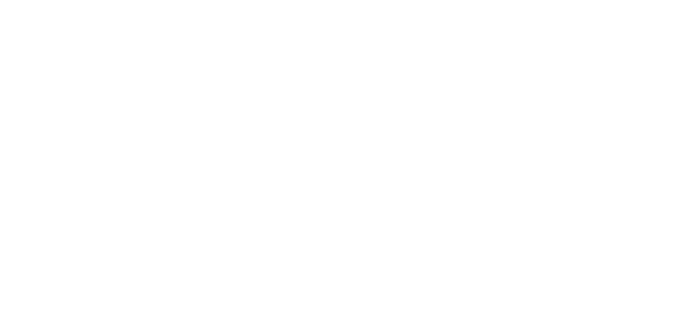
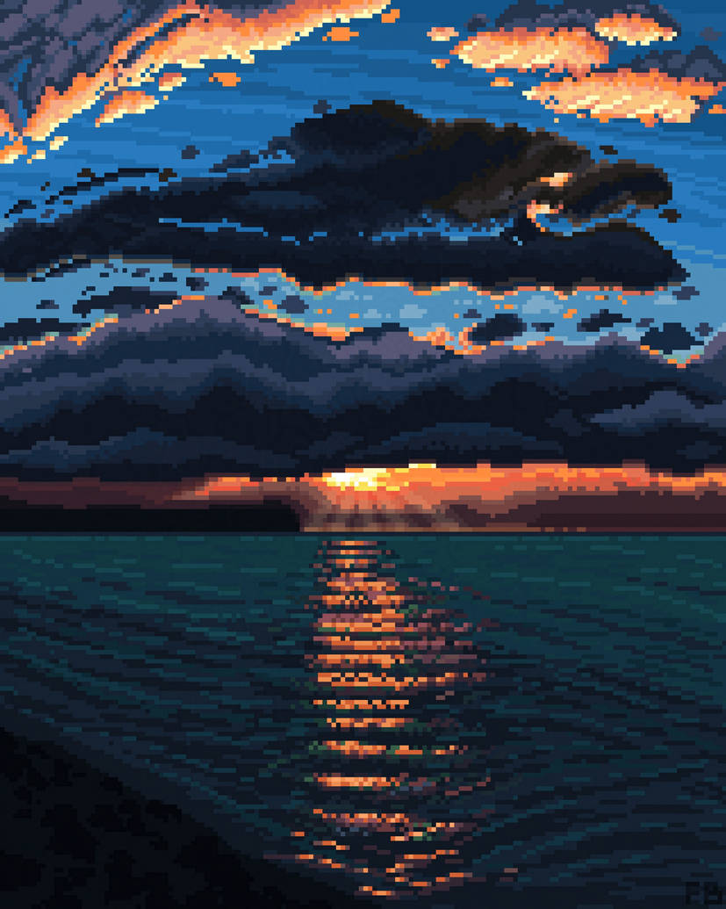
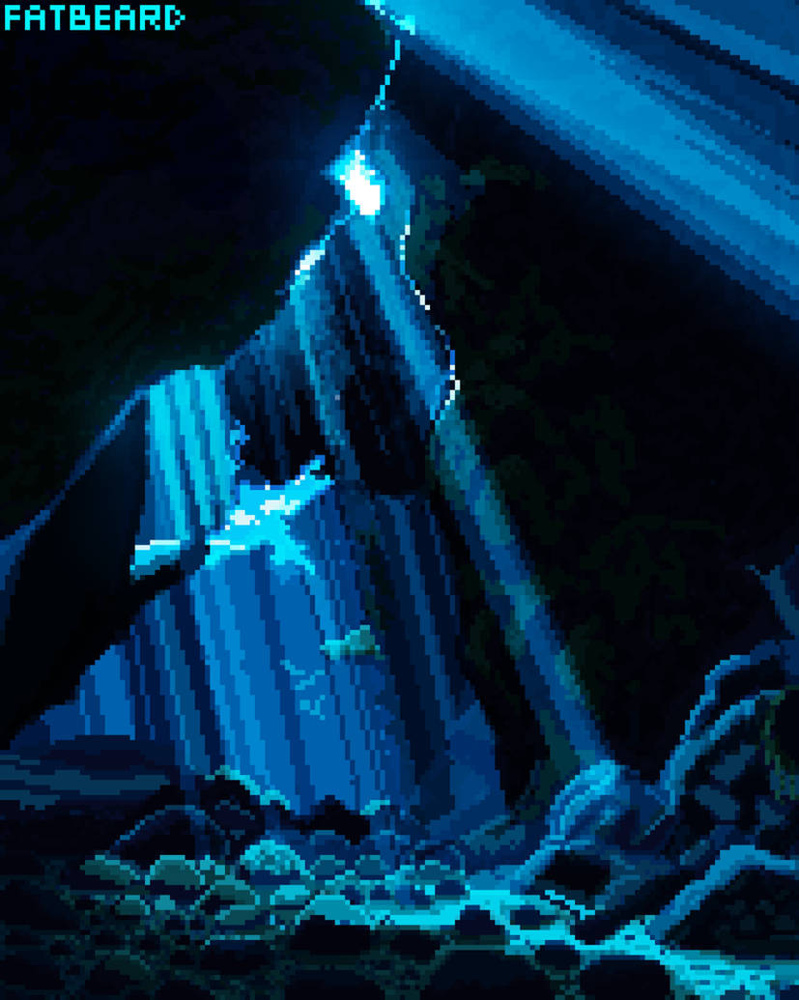

# El enigma de la Península del Simio> Versión 0.1 | Diciembre 2025
_En lo profundo del Caribe hay una península rodeada de agua por todas partes llamada la Península del Simio. Adéntrate en sus oscuras grutas, sus espesas selvas y sus surtidas tiendas de regalos y souvenirs, para convertirte en una bucanera de pleno derecho._

_Tendrás que enfrentarte a buques zombis, capitanes piratas vampiros o vampiratas, cabezas reducidas parlantes y muchos simios, usando tu inteligencia, tu ingenio y la poderosa y a veces explosiva magia vudú._

_Si eres afortunada y evitas el escorbuto, quizás salgas viva de esta aventura y encuentres el tesoro pirata más grande conocido, el Mac’n Cheese, y te ganes el respeto de todo el Caribe._## El enigma de la Península del Simio

«El enigma de la Península del Simio» es una aventura gráfica en EGA de 3 disquetes de 3½. Su temática es Humor y Fantasía y su desarrolladora es LucasArts Games. Para poder jugar esta aventura solo necesitas las [reglas básicas de «Point an click RPG»](https://pointnclick.gwannon.com/).

### Reglas especiales

#### Mira detrás de ti ... ¡Un simio de tres colas! 

Una vez por sesión de juego, una de tus jugadoras pueden gastar 2 píxeles y usar el truco de "Mira detrás de ti ... ¡Un simio de tres colas!". La jugadora, tras decir la frase, debe tirar un d6.

Con un resultado de 6 el otro objetivo, se gira para ver al simio de tres colas y todas las jugadoras pueden hacer una acción, como coger algo que estaba guardando el objetivo, huir, atravesar una puerta.

Este truco solo funciona con PNJ con los que puedas HABLAR y cuando sí hay un simio de tres colas detrás falla siempre.

## Disquete I: Cómo ser un pirata

Tus PJ acaban de llegar a Bucan Ville, un nido de piratas, con la intención de hacerse piratas y ganar grandes cantidades de dinero con la piratería.

Esta parte se divide en 4 escenas, la primera será una breve presentación. Luego habrá dos escenas paralelas que consisten en que las _**Jefas Piratas**_ les den el _**título de piratas**_ tras pasar una prueba y otra en conseguir un barco y su bandera. La cuarta escena será el robo de la caja fuerte del gobernador.

### 1. Inicio

Las PJ aparecen al anochecer en el puerto de Bucan Ville y gritarán «Me llamo [nombre de PJ] y quiero ser una pirata».

#### Puerto

En este cochambroso y sucio puerto solo hay un sitio al que ir, la _**Taberna del Cangrejo Cocido**_, un antro de piratas donde el grog está aguado y los ganchitos y cacahuetes fueron grumetes de Barbanegra.

A lo lejos se ve un _**navío de velas negras**_ rasgadas. Un brillo espectral inunda su cubierta y bandadas de murciélagos lo sobrevuelan.

Desde el puerto puedes acceder al _**Centro de Bucan Ville**_.
[ By Fatbeard91")](https://www.deviantart.com/fatbeard91/art/18-57-Rework-1230846234 "18:57 (Rework) By Fatbeard91")
#### La Taberna del Cangrejo Cocido

El local es un cuchitril viejo y sucio y está abarrotado de _**piratas borrachos**_. Los pocos que no están durmiendo la mona, apenas pueden decir alguna frase:

* Así que quieres ser un pirata, ¿no? Habla con las 3 _**Jefas Piratas**_.
* El grog de mis tiempos sí que era grog, no como el de ahora que le ponen sombrillitas, clavo y hojitas de menta. Nosotros le poníamos clavos de verdad.
* ¿Has oído hablar de [¡Arrr! Cthulhu](https://arrrcthulhu.com/), una excelente ambientación para vivir aventuras de piratas en un Caribe de los mitos de Cthulhu?
* Me robaron la idea del simio-semáforo. Yo podría haber sido millonario y haberme retirado a una Isla del Caribe y pasarme el día bebiendo grog. Upsss, si eso ya lo hago.

En una gran mesa al fondo están las _**3 Jefas Piratas**_. Las más poderosas piratas de Bucan Ville elegidas por el democrático método de pasar a cuchillo a todos su competencia.

Estas tres rudas piratas están en la mesa trasegando grog y cantando canciones salidas de tono. Cuando tus jugadoras les expliquen que quieren ser piratas se reirán un montón y les dirán que dejen de hacerlas perder el tiempo y seguirán a lo suyo. 

Tus jugadoras deberán demostrar que de verdad quieren ser piratas respondiendo a preguntas como estas.

* ¿Cuál era la bandera de Barbanegra? - Un esqueleto con cuernos que sostiene un reloj de arena en la mano derecha y una lanza en la izquierda, utilizando la lanza para pinchar un corazón rojo que gotea tres gotas rojas de sangre.
* ¿Cuál se llamaba el primer barco de Barbanegra? - La venganza de la Reina Ana.
* ¿Cuál era el apodo de Stede Bonnet? - Caballero Pirata

Les harán también cantar «Ron, ron, ron, la botella de ron» (cosa que deberán cantar tus jugadoras). Tras un rato tratando de demostrar de que son merecedores de una prueba, accederán a hacerle es examen estandarizado del gremio de piratas que consiste en dos pruebas:

* Debes demostrar que estás al otro lado de la ley.
* Tener tu propia nave acuática autopropulsada y crear su bandera pirata única y personalizada.

Tras explicar las pruebas estandarizadas, les harán firmar una serie de papeleo y les entregarán un _**bono de descuento**_ de la _**Tienda de souvenir**_. Si piden alguna pista, solo les dirán que pregunten por _**Sam**_ en el astillero para ver que pueden ofrecerles en tema de barcos.

En la mesa de las _**3 Jefas Piratas**_ hay un _**frutero**_ con naranjas, plátanos, manzanas, caramelos suizos con vitamina C y limones que según ellas son de su campaña contra el escorbuto.
Si se lo piden podrán coger una _**pieza de fruta**_. Elige al azar entre una de ellas y dásela. Si se comen podrán, pedir otra. Mientras no se la coman, las _**Jefas Pirata**_ les dirán que se terminen primero la otra fruta que cogieron.

### 2.a Pasarse al otro lado de la ley

Como han explicado las Jefas Piratas, para convertirse en pirata necesitan estar al otro lado de la ley de tener una prueba de ellos. 

Hay varias opciones para cometer delitos:

* La manera más sencilla es cruzar en rojo el semáforo mono de la _**Plaza Mayor de Bucan Ville**_.
* Otra forma es ponerse a la izquierda del _**juzgado**_ mientras el _**pintor de cuadros**_ que está en la _**Plaza Mayor**_ pinta un cuadro.
* Si intentan otros tipos de delitos, sus personajes mirarán a la pantalla y dirán cosas como «Mi madre no crio a un ladronzuelo» o «Esto me metería en problemas con Santa Claus».

Si les ves muy perdidos en esta parte, recálcales lo del «otro lado de la ley» o recuérdales lo de pirata borracho en la Taberna del Cangrejo Cocido que decía que había inventado el simio-semáforo y que les dé una pista.

#### Centro de Bucan Ville

Las calles del centro están desiertas por la noche, las farolas de gas están encendidas y las tiendas están cerradas, todas menos la _**tienda de souvenirs**_ con su gran cartel de neón que pone abierto 24 horas.

Para cruzar la calle que atraviesa el centro hay que atravesar un paso de cebra dirigido por un _**simio-semáforo**_ y vigilado por un _**guardia de la ciudad**_ que solo dice «¡Circulen, circulen!». El simio-semáforo es un semáforo manejado por un mono que cambia el color del semáforo moviendo unas palancas. Cuando te acercas, el simio mueve las palancas y siempre cruzas en verde.

Por mucho que lo intentes, el mono siempre lo pone en verde. La única manera de cruzar en rojo es darle un plátano al mono cuando esté en rojo y como se pone a comer el plátano se queda en rojo. En ese momento puedes cruzar y el _**guardia de la ciudad**_ te pondrá una _**multa**_ y, por tanto, serás una fuera de la ley.

#### Plaza Mayor de Bucan Ville

La Plaza Mayor es como todas las plazas, un gran espacio vacío de adoquines con un único _**árbol seco**_ en el centro con un cartel que pone «Árbol para colgar piratas - Cerrado por reformas».

Al lado del árbol hay un _**pintor de cuadros**_ que está pintando el ayuntamiento. Pinta los cuadros a una velocidad superrápida y los deja en un _**montón**_ que está a su lado. Si los examinan, verán que no son muy buenos.

Si tratan de hablar con él, les dirá que está muy ocupado, tiene que hacer 1000 cuadros iguales del ayuntamiento para la campaña de recaudación para la reelección del gobernador.
Al lado del ayuntamiento está el _**juzgado**_. Al acercarse verán que abre de 24:00 a 00:00 menos los fines de semana que cierra por descanso. Si se colocan a su izquierda antes de que el pintor empiece un nuevo cuadro y esperan a qué terminen, podrán coger una pintura donde están ellos junto a los juzgados, es decir, al otro lado de la ley, como pedían las _**Jefas Piratas**_.

Al otro lado del ayuntamiento podrán acceder a un _**callejón oscuro**_ del que salen retazos aleatorios de una conversación.

#### Callejón oscuro

Es solo una ubicación de trampa. Cuando entren, las voces se callarán y unas figuras desaparecerán en las sombras. En cuanto salgan a la plaza, volverán las voces.

### 2.b Conseguir un barco y una bandera pirata

El único sitio de la isla donde venden barcos es en el _**astillero**_ y lo único que se pueden pagar ahora mismo tus jugadoras es un barco de remos. El problema es que no está autopropulsado, con lo que deberán encontrar la manera de construirle una vela. 

Para la tela de la vela solo tienen que conseguir el _**vinilo del Twister**_ en la _**Tienda de souvenirs**_. El mástil simplemente será unos de los remos y deberán decir su idea a _**Sam**_, el gerente del _**astillero**_. 

Puede que gasten píxeles en convertir elementos no clicables en clicables, como alfombras, sabanas, etc. Cuando se lo lleven a _**Sam**_ este les pondrá alguna excusa tonta.

Si presentan el _**título de propiedad**_ de la barca de remos a las _**Jefas piratas**_ sin vela les suspenderán la prueba gritando al unísono «¡No es autopropulsado!»

La bandera no es un reto, déjales usar lo que encuentren para hacerse su bandera y si puedes conseguir que sea lo más ridícula posible, mucho mejor. Pueden usar el _**bono descuento**_ en la _**Tienda de Souvenirs**_ y que la dependienta les dé cualquier chorrada que se te ocurra para que la usen para crear su bandera.  

#### Astilleros

Desde la _**Plaza Mayor**_ se puede acceder a los _**astilleros**_ de Bucan Ville, donde, igual, tus jugadoras pueden conseguir una embarcación que puedan pagar.

Allí encontrarán a _**Sam**_, un friki de la náutica con gafas de culo de vaso y una camiseta que pone «Bésame, soy constructor de maquetas de barcos».

_**Sam**_ vive para diseñar y construir barcos … a escala (siempre lo dice en bajito) y como no ha podido dedicarse a construirlos, se dedica a venderlos.

A pesar de ser un personaje principal y poder hablar sobre muchos temas, _**Sam**_ solo habla de barcos, diseño de barcos, historia de la navegación, curiosidades de la náutica, etc. Si se intenta hablar de otra cosa, encauza la conversación de nuevo a los barcos.
Si le dicen que quieren comprar un barco, les ofrecerá lo que tiene en stock: Un barco pirata de lujo, un barco pirata de 2ª mano y un barco de pesca. Cuando tus jugadoras le expliquen su situación económica, es decir, 0 doblones, les llevará a un lado del astillero y les enseñará un viejo _**bote de remos**_ con un remo partido.

_**Sam**_ las dejará caer que el _**barco pirata de lujo**_ cuesta tantos doblones de oro que solo robando la _**caja fuerte del gobernador**_ podrían pagarlo, pero es que es puro lujo. De hecho, el timón tiene hasta su propio posavasos de ébano, el problema que nadie vio es que al girarlo se da la vuelta y derrama toda la bebida.

Tras duras negociaciones, _**Sam**_ aceptará 200 doblones de oro a pagar con su primer acto de piratería y saqueo. Les dará el _**título de propiedad**_ del _**bote a remo**_ y un _**montón de papeles especificando la forma de pago**_ que no deben perder.

Para conseguir que sea autopropulsado necesitarán algo que sirva de mástil y algo que sirva de vela. Justo hay huelga de fabricantes de velas y mástiles y no le quedan, así que tus jugadoras deberán conseguir algo para reemplazarlo.

Como ya hemos dicho, para la vela necesitarán el _**vinilo del Twister**_ y para el mástil el remo que no está roto. Con esto _**Sam**_ montará unas velas y cambiará la descripción del _**título de propiedad**_.

#### Tienda de souvenirs

Maxine la roja, el terror pelirrojo del Caribe, se retiró de la piratería y con las ganancias monto una tienda de souvenirs de piratas famosos en Bucan Ville. En su tienda puedes encontrar las cosas más estrambóticas del mundillo pirata, desde un rizo de la barba de Barbanegra hasta la férula de descarga dental de Sir Francis Drake.

Cuando quieran llevarse algún elemento clicable, Maxine soltará alguna historia rara para que no se lo lleven, como que tiene carcoma o pertenecía a un leproso.

Lo único que hay en la tienda que pueda servir de vela es un _**vinilo del Twister**_ Edición pirata con calaveras, tibias cruzadas, cofres del tesoro y cañones en vez de los círculos de colores.

Como la mayoría de las cosas de su tienda, no quiere deshacerse del vinilo porque le recuerda a cuando «jugaba» (guiño, guiño, golpe, golpe) al Twister con Anne Bonny, Jack Rackham y Mary Read a bordo del «Ranger».

El _**vale de descuento**_ que les dieron las _**Jefas Piratas**_ tiene una errata y si cogen la _**lupa**_ de Lulock Holmes, el primo de las Antillas de Sherlock Holmes y el primer pirata detective de la literatura, podrán leer la letra pequeña. Donde debía poner «Al presentar este vale se conseguirá un 50% de descuento en material pirata O un 50% en juegos de mesa» en realidad pone «Al presentar este vale se conseguirá un 50% de descuento en material pirata Y un 50% en juegos de mesa».
Así que pueden usar el vale de descuento para conseguir el _**vinilo del Twister**_ completamente gratis y Maxine no puede se negará porque la verdad es que lo más inútil y barato que tiene en la tienda.

Ideas para otras chorradas que puede haber en la tienda y que puedes poner como elementos clicables, pero que Maxine no quiere vender porque le traen buenos recuerdos:

* Rizos pelirrojos de la barba la Barbanegra
* Férula de descarga dental de Sir Francis Drake
* Muñeco de acción de Anne Bonny con golpe de karate, ojos con luces rojas y un botón que hace que diga «Si hubieses luchado como un hombre, no serías ahora ahorcado como un perro» 
* Pata de palo de «running» de Long John Silver
* Merchandising no-oficial de Piratas del Caribe firmado por los dobles de acción de los protagonistas
* Una foto firmada y dedicada de Ron Gilbert donde dice que no compres videojuegos de más de 20 $.

### 3. Ya eres una pirata

Pueden entregar las pruebas de que son auténticas piratas al mismo tiempo o por separado, pero hasta no haber cumplido las dos reglas y probarlo, no se les considerará piratas de pleno derecho y las _**Jefas Piratas**_ solo les llamarán grumetes y/o marineras de agua dulce entre risas socarronas.

Tras conseguir tu barco y estar al otro lado de la ley, las PJ podrán solicitar su _**Título oficial de piratería**_ que los identifica como piratas tras pagar la tasa correspondiente de un doblón de oro. Puede aprovechar esto para meterles nuevos retos como buscar calderilla debajo de la gramola de la taberna.

### 4. Robar al gobernador

A lo largo de las escenas anteriores tus jugadoras habrán oído hablar del gobernador, su caja fuerte y las inmensas cantidades de dinero que tiene en ella. Como no pueden ir a abordar barcos con su bote de remos, deberán buscar la manera de robar al gobernador para poder comprarse un barco pirata de verdad.

Cuando salgan de la Taberna del Cangrejo Cocido, puedes decirles que desde el puerto pueden acceder a la casa del Gobernador. De hecho, ahora en el puerto hay un neón gigante que pone «Visite el Museo del Gobernador Marlon, donde la magia de la democracia sucede».

#### Exterior de la casa del gobernador

La casa del Gobernador Marlon es una casa victoriana al lado de un acantilado que da al mar Caribe. Es lujosa y bien cuidada, seguramente el mantenimiento y los lujos como una _**estatua ecuestre del gobernador Marlon**_ se paga con los impuestos de todos los habitantes de Bucan Ville.
Examinando su estatua, el gobernador Marlon es un excelente ejemplar de ser humano, larga melena, mentón cincelado con un hoyuelo divino, grandes hombros, torso esculpido en piedra y poderosos brazos y piernas.

El exterior está vigilado por unos _**pavos reales**_ que gluglutean muy alto en cuanto te ven. Entonces una luz de la segunda planta se enciende y el gobernador Marlon sale a la ventana a vigilar armado con un rifle de pólvora negra. Cuando no ve nada sospechoso se vuelve a meter.

Si te escondes detrás de la _**estatua ecuestre**_ y les golpeas cuando no miran hacia donde estás, puedes quitarles una _**pluma**_. Cuando tienes tres plumas, puedes hacerte un _**tocado de pavo real**_ y los _**pavos reales**_ te consideran uno de los suyos y te dejan pasar sin avisar al gobernador.

#### Hall principal de la casa del gobernador

Al entrar a la casa del gobernador se accede al hall principal. Es grande y lujoso, lleno de obras de arte, jarrones caros, figuras de marfil, etc. El _**hall**_ está levemente iluminado por unas pocas _**velas de la una gran lámpara de araña**_.

Si tratan de Tirar/Empujar las _**poleas que suben y bajan la lámpara**_, estas chirriarán y se verán luces desde el piso superior y sonidos del gobernador Marlon cargando su rifle. Eso hace que sea imposible bajar la lámpara mientras haga ruido, necesitan algún tipo de lubricante.

Déjales que busque por las pantallas algo que no sea clicables y que sirva de lubricante, como el grog que beben las _**Jefas Piratas**_, el aguarrás que usa el _**pintor**_ de la _**Plaza Mayor**_, etc. y que lo conviertan en clicable con sus píxeles.

##### Sótano de la casa del gobernador

En el sótano está oscuro y solo se vislumbra la gran puerta de la _**caja fuerte**_ con un montón cerraduras, ruedas con combinaciones y engranajes para girar. Parece muy complicada, tan complicada que el gobernador Marlon ha dejado una nota escondida en un pixel exacto de la pantalla con las instrucciones para abrir la caja fuerte.

Hay muy poca luz en el sótano y solo podrán encontrar el píxel exacto, si consiguen luz. La única fuente de luz será las _**velas de la lámpara de araña**_ del _**hall principal**_. Si intentan traer alguna fuente de luz de otro sitio (convirtiendo algo en clicable), pónselo difícil, porque serán eléctricas o a gas.

### 5. Aparece DraChuckla

Cuando hayan conseguido entrar en la caja fuerte del gobernador y estén nadando en oro y joyas, oirán un fuerte cañonazo y de repente una bala cañón derrumbará una de las paredes. 

Mientras se recuperan de la explosión verán como el temible capitán vampirata DraChuckla entrará por el agujero con sus secuaces ghouls para llevarse su botín mientras se ríe de ellos.
Se acercará a las PJ, les quitará un pelo a cada una y los pegará a unos muñecos vudú, diciendo «Por si acaso se convierten en un problema» y entonces caerán inconscientes.

Cuando consiguen levantarse verán por el agujero de la pared que el navío de velas negras que había a lo lejos del puerto se aleja con DraChuckla a bordo y el gobernador Marlon atado y amordazado.## Resumen del disquete I

### Astilleros  

* **PNJ:** Sam
* **Elementos clicables:** Barco pirata de lujo, Barco pirata de 2ª mano, Barco de pesca, Barca con remos, Título de propiedad, Montón de papeles especificando la forma de pago del bote de remos
* **Conexiones:** Plaza Mayor de Bucan Ville

### Bucan Ville

#### Callejón oscuro

* **Conexiones:** Plaza Mayor de Bucan Ville

#### Centro de Bucan Ville

* **PNJ:** Guardia de la ciudad
* **Elementos clicables:** Simio-semáforo
* **Conexiones:** Plaza Mayor de Bucan Ville, Puerto, Tienda de Souvenirs

#### Tienda de Souvenirs

* **PNJ:** Maxine la roja
* **Elementos clicables:** Vinilo del Twister, Algún objeto estúpido que usar de bandera como los calzoncillos largos de Barbanegra, Lupa de Lulock Holmes
* **Conexiones:** Centro de Bucan Ville

#### Plaza Mayor de Bucan Ville

* **PNJ:** Pintor de cuadros
* **Elementos clicables:** Juzgado, Montón de cuadros
* **Conexiones:** Centro de Bucan Ville, Callejón oscuro

### Casa del gobernador 

#### Exterior

* **PNJ:** Pavos reales
* **Elementos clicables:** Estatua ecuestre del gobernador Marlon, Pluma de pavo real, Tocado de plumas de pavo real
* **Conexiones:** Puerto, Casa del gobernador (Hall principal)

#### Hall principal

* **Elementos clicables:** Velas de la lámpara de araña, Polea que sube y baja la lámpara de araña
* **Conexiones:** Casa del gobernador (Exterior), Casa del gobernador (Sótano)

#### Sótano

* **Elementos clicables:** Caja fuerte, Nota con la combinación de la caja fuerte (píxel exacto)
* **Conexiones:** Casa del gobernador (Hall Principal)
### Muelles

#### Puerto

* **Elementos clicables:** Navío de velas negras
* **Conexiones:** Taberna del Cangrejo Cocido, Centro de Bucan Ville

#### Taberna del Cangrejo Cocido

* **PNJ:** Jefas Piratas, Piratas borrachos
* **Elementos clicables:** Frutero, Pieza de fruta aleatoria, Bono de descuento de la Tienda de Souvenirs
* **Conexiones:** Puerto

### Mapa de pantallas

## Disquete II: Poderosa magia vudú

En esta segunda parte tus jugadoras tendrán que superar otras 5 escenas. La primera será una escena rápida en que las _**Jefas Piratas**_ les encarguen rescatar al Gobernador Marlon, ya que les debe mucha pasta que le prestaron para su próxima campaña electoral. Por suerte les dejarán un barco cochambroso que usan para espectáculos para turistas.

Luego tendrán que adentrarse en los pantanos de la Isla para encontrarse a Alfonsé, el conde vudú de los pantanos, para que les explique cómo pueden acabar con DraChuckla y dónde encontrar la Península del Simio donde está el temible pirata buscando el Mac’n Cheese.

XXX
## Resumen del disquete II

XXX

### Mapa de pantallas

XXX

## Disquete III: En la Península del Simio

XXX

XXX

> Si tus jugadoras te preguntan al acabar la aventura cuál es el enigma de la Península del Simio, puedes decirles que el enigma es que en realidad es una isla, cosa que ya se dijo en la introducción de la aventura.

## Resumen del disquete III

XXX

### Mapa de pantallas

XXX

## Licencia y agradecimientos

### Licencia CC BY 4.0

«El enigma de la Península del Simio» es una aventura para el juego de rol «Point and click RPG» escrita por [@gwannon](https://gwannon.com) y está hecho bajo licencia [CC BY 4.0](https://creativecommons.org/licenses/by/4.0/legalcode.es). Puedes hacer uso de todo este material como desees, incluso comercialmente, menos imágenes y fuentes tipográficas que pertenecen a sus creadores y son adecuadamente atribuidos. Para hacer uso de este material, solo debes atribuirlo adecuadamente.

Todo el contenido de este proyecto puede encontrarse en [pointnclick.gwannon.com](https://pointnclick.gwannon.com/MisterioDeLaPeninsulaDelSimio.html) y todo el código fuente en [GitHub](https://github.com/gwannon/ideasRoleras/tree/main/Point-n-click).
### Atribuciones

#### Fuentes

* Fool by [Void](https://arcade.itch.io/fool)

#### Imágenes

* 18:57 (Rework) By [Fatbeard91](https://www.deviantart.com/fatbeard91/art/18-57-Rework-1230846234)
* Glowing Horizons By [Fatbeard91](https://www.deviantart.com/fatbeard91/art/Glowing-Horizons-1072294859)
* Silence By [Fatbeard91](https://www.deviantart.com/fatbeard91/art/Silence-959695299)
* Vector boho art tribal doodle sketch corner frame by [rawpixel.com](https://www.freepik.com/free-vector/vector-boho-art-tribal-doodle-sketch-corner-frame_35510790.htm)
* Cartoon jungle background with pathway through exotic plants by [freepik](https://www.freepik.com/free-vector/cartoon-jungle-background-with-pathway-through-exotic-plants_13810853.htm)
* Background of pirate woman on a boat [freepik](https://www.freepik.com/free-vector/background-pirate-woman-boat_1126876.htm)