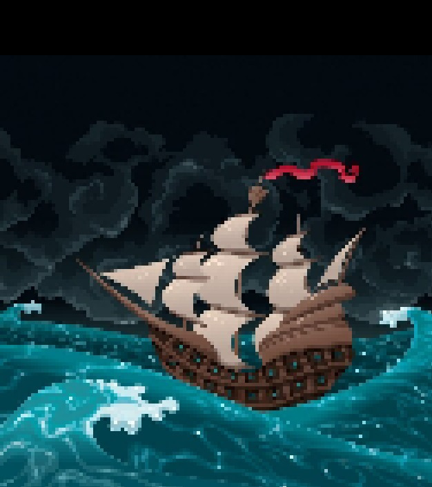
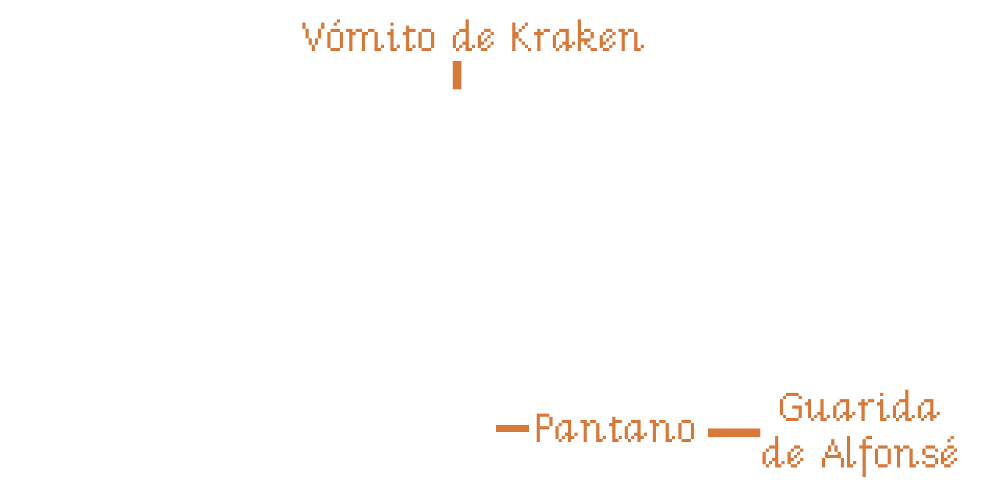

# El enigma de la Península del Simio
> Versión 1.0 | Diciembre 2025
_En lo profundo del Caribe hay una península rodeada de agua por todas partes llamada la Península del Simio. Adéntrate en sus oscuras grutas, sus espesas selvas y sus surtidas tiendas de regalos y souvenirs, para convertirte en una bucanera de pleno derecho._

_Tendrás que enfrentarte a buques zombis, capitanes piratas vampiros o vampiratas, cabezas reducidas parlantes y muchos simios, usando tu inteligencia, tu ingenio y la poderosa y a veces explosiva magia vudú._

_Si eres afortunada y evitas el escorbuto, quizás salgas viva de esta aventura y encuentres el tesoro pirata más grande conocido, el Mac’n Cheese, y te ganes el respeto de todo el Caribe._## El enigma de la Península del Simio

«El enigma de la Península del Simio» es una aventura gráfica en EGA de 3 disquetes de 3½. Su temática es Humor y Fantasía y su desarrolladora es LucasArts Games. Para poder jugar esta aventura solo necesitas las [reglas básicas de «Point and click RPG»](https://pointnclick.gwannon.com/).

La primera parte de esta aventura (Disquete I), es la aventura introductoria que viene en las reglas básicas, así que si ya la has jugado, puedes saltártela.

### Reglas especiales

#### Mira detrás de ti … ¡Un simio de tres colas!

Una vez por sesión de juego, una de tus jugadoras pueden gastar 2 píxeles y usar el truco de "Mira detrás de ti … ¡Un simio de tres colas!". La jugadora, tras decir la frase, debe tirar un d6.

Con un resultado de 6 el otro objetivo, se gira para ver al simio de tres colas y todas las jugadoras pueden hacer una acción, como coger algo que estaba guardando el objetivo, huir, atravesar una puerta.

Este truco solo funciona con PNJ con los que puedas HABLAR y cuando sí hay un simio de tres colas detrás falla siempre.
[](https://www.freepik.com/free-vector/ship-sailing-sea_956625.htm "Ship sailing on the sea By ddraw")## Disquete I: Cómo ser un pirata

Tus PJ acaban de llegar a Bucan Ville, un nido de piratas, con la intención de hacerse piratas y ganar grandes cantidades de dinero con la piratería.

Esta parte se divide en 4 escenas, la primera será una breve presentación. Luego habrá dos escenas paralelas que consisten en que las _**Jefas Piratas**_ les den el _**título de piratas**_ tras pasar una prueba y otra en conseguir un barco y su bandera. La cuarta escena será el robo de la caja fuerte del gobernador.

### 1. Inicio

Las PJ aparecen al anochecer en el puerto de Bucan Ville y gritarán «Me llamo [nombre de PJ] y quiero ser una pirata».

#### Puerto

En este cochambroso y sucio puerto solo hay un sitio al que ir, la _**Taberna del Cangrejo Cocido**_, un antro de piratas donde el grog está aguado y los ganchitos y cacahuetes fueron grumetes de Barbanegra.

A lo lejos se ve un _**navío de velas negras**_ rasgadas. Un brillo espectral inunda su cubierta y bandadas de murciélagos lo sobrevuelan.

Desde el puerto puedes acceder al _**Centro de Bucan Ville**_.
[ By Fatbeard91")](https://www.deviantart.com/fatbeard91/art/18-57-Rework-1230846234 "18:57 (Rework) By Fatbeard91")
#### La Taberna del Cangrejo Cocido

El local es un cuchitril viejo y sucio y está abarrotado de _**piratas borrachos**_. Los pocos que no están durmiendo la mona, apenas pueden decir alguna frase:

* Así que quieres ser un pirata, ¿no? Habla con las 3 _**Jefas Piratas**_.
* El grog de mis tiempos sí que era grog, no como el de ahora que le ponen sombrillitas, clavo y hojitas de menta. Nosotros le poníamos clavos de verdad.
* ¿Has oído hablar de [¡Arrr! Cthulhu](https://arrrcthulhu.com/), una excelente ambientación para vivir aventuras de piratas en un Caribe de los mitos de Cthulhu?
* Me robaron la idea del simio-semáforo. Yo podría haber sido millonario y haberme retirado a una Isla del Caribe y pasarme el día bebiendo grog. Upsss, si eso ya lo hago.

En una gran mesa al fondo están las _**3 Jefas Piratas**_. Las más poderosas piratas de Bucan Ville elegidas por el democrático método de pasar a cuchillo a todos su competencia.

Estas tres rudas piratas están en la mesa trasegando grog y cantando canciones salidas de tono. Cuando tus jugadoras les expliquen que quieren ser piratas, se reirán un montón y les dirán que dejen de hacerlas perder el tiempo y seguirán a lo suyo.

Tus jugadoras deberán demostrar que de verdad quieren ser piratas respondiendo a preguntas como estas.

* ¿Cuál era la bandera de Barbanegra? - Un esqueleto con cuernos que sostiene un reloj de arena en la mano derecha y una lanza en la izquierda, utilizando la lanza para pinchar un corazón rojo que gotea tres gotas rojas de sangre.
* ¿Cuál se llamaba el primer barco de Barbanegra? - La venganza de la Reina Ana.
* ¿Cuál era el apodo de Stede Bonnet? - Caballero Pirata

Les harán también cantar «Ron, ron, ron, la botella de ron» (cosa que deberán cantar tus jugadoras). Tras un rato tratando de demostrar de que son merecedores de una prueba, accederán a hacerle es examen estandarizado del gremio de piratas que consiste en dos pruebas:

* Debes demostrar que estás al otro lado de la ley.
* Tener tu propia nave acuática autopropulsada y crear su bandera pirata única y personalizada.

Tras explicar las pruebas estandarizadas, les harán firmar una serie de papeleo y les entregarán un _**bono de descuento**_ de la _**Tienda de souvenir**_. Si piden alguna pista, solo les dirán que pregunten por _**Sam**_ en el astillero para ver que pueden ofrecerles en tema de barcos.

En la mesa de las _**3 Jefas Piratas**_ hay un _**frutero**_ con naranjas, plátanos, manzanas, caramelos suizos con vitamina C y limones que según ellas son de su campaña contra el escorbuto.
Si se lo piden podrán coger una _**pieza de fruta**_. Elige al azar entre una de ellas y dásela. Si se comen podrán, pedir otra. Mientras no se la coman, las _**Jefas Pirata**_ les dirán que se terminen primero la otra fruta que cogieron.

### 2.a Pasarse al otro lado de la ley

Como han explicado las Jefas Piratas, para convertirse en pirata necesitan estar al otro lado de la ley de tener una prueba de ellos.

Hay varias opciones para cometer delitos:

* La manera más sencilla es cruzar en rojo el semáforo mono de la _**Plaza Mayor de Bucan Ville**_.
* Otra forma es ponerse a la izquierda del _**juzgado**_ mientras el _**pintor de cuadros**_ que está en la _**Plaza Mayor**_ pinta un cuadro.
* Si intentan otros tipos de delitos, sus personajes mirarán a la pantalla y dirán cosas como «Mi madre no crio a un ladronzuelo» o «Esto me metería en problemas con Santa Claus».

Si les ves muy perdidos en esta parte, recálcales lo del «otro lado de la ley» o recuérdales lo de pirata borracho en la Taberna del Cangrejo Cocido que decía que había inventado el simio-semáforo y que les dé una pista.

#### Centro de Bucan Ville

Las calles del centro están desiertas por la noche, las farolas de gas están encendidas y las tiendas están cerradas, todas menos la _**tienda de souvenirs**_ con su gran cartel de neón que pone abierto 24 horas.

Para cruzar la calle que atraviesa el centro hay que atravesar un paso de cebra dirigido por un _**simio-semáforo**_ y vigilado por un _**guardia de la ciudad**_ que solo dice «¡Circulen, circulen!». El simio-semáforo es un semáforo manejado por un mono que cambia el color del semáforo moviendo unas palancas. Cuando te acercas, el simio mueve las palancas y siempre cruzas en verde.

Por mucho que lo intentes, el mono siempre lo pone en verde. La única manera de cruzar en rojo es darle un plátano al mono cuando esté en rojo y como se pone a comer el plátano se queda en rojo. En ese momento puedes cruzar y el _**guardia de la ciudad**_ te pondrá una _**multa**_ y, por tanto, serás una fuera de la ley.

#### Plaza Mayor de Bucan Ville

La Plaza Mayor es como todas las plazas, un gran espacio vacío de adoquines con un único _**árbol seco**_ en el centro con un cartel que pone «Árbol para colgar piratas - Cerrado por reformas».

Al lado del árbol hay un _**pintor de cuadros**_ que está pintando el ayuntamiento. Pinta los cuadros a una velocidad superrápida y los deja en un _**montón**_ que está a su lado. Si los examinan, verán que no son muy buenos.

Si tratan de hablar con él, les dirá que está muy ocupado, tiene que hacer 1000 cuadros iguales del ayuntamiento para la campaña de recaudación para la reelección del gobernador.
Al lado del ayuntamiento está el _**juzgado**_. Al acercarse verán que abre de 24:00 a 00:00 menos los fines de semana que cierra por descanso. Si se colocan a su izquierda antes de que el pintor empiece un nuevo cuadro y esperan a qué terminen, podrán coger una pintura donde están ellos junto a los juzgados, es decir, al otro lado de la ley, como pedían las _**Jefas Piratas**_.

Al otro lado del ayuntamiento podrán acceder a un _**callejón oscuro**_ del que salen retazos aleatorios de una conversación.

#### Callejón oscuro

Es solo una ubicación de trampa. Cuando entren, las voces se callarán y unas figuras desaparecerán en las sombras. En cuanto salgan a la plaza, volverán las voces.

### 2.b Conseguir un barco y una bandera pirata

El único sitio de la isla donde venden barcos es en el _**astillero**_ y lo único que se pueden pagar ahora mismo tus jugadoras es un barco de remos. El problema es que no está autopropulsado, con lo que deberán encontrar la manera de construirle una vela.

Para la tela de la vela solo tienen que conseguir el _**vinilo del Twister**_ en la _**Tienda de souvenirs**_. El mástil simplemente será unos de los remos y deberán decir su idea a _**Sam**_, el gerente del _**astillero**_.

Puede que gasten píxeles en convertir elementos no clicables en clicables, como alfombras, sabanas, etc. Cuando se lo lleven a _**Sam**_, este les pondrá alguna excusa tonta.

Si presentan el _**título de propiedad**_ de la barca de remos a las _**Jefas piratas**_ sin vela les suspenderán la prueba gritando al unísono «¡No es autopropulsado!»

La bandera no es un reto, déjales usar lo que encuentren para hacerse su bandera y si puedes conseguir que sea lo más ridícula posible, mucho mejor. Pueden usar el _**bono descuento**_ en la _**Tienda de Souvenirs**_ y que la dependienta les dé cualquier chorrada que se te ocurra para que la usen para crear su bandera.

#### Astilleros

Desde la _**Plaza Mayor**_ se puede acceder a los _**astilleros**_ de Bucan Ville, donde, igual, tus jugadoras pueden conseguir una embarcación que puedan pagar.

Allí encontrarán a _**Sam**_, un friki de la náutica con gafas de culo de vaso y una camiseta que pone «Bésame, soy constructor de maquetas de barcos».

_**Sam**_ vive para diseñar y construir barcos … a escala (siempre lo dice en bajito) y como no ha podido dedicarse a construirlos, se dedica a venderlos.

A pesar de ser un personaje principal y poder hablar sobre muchos temas, _**Sam**_ solo habla de barcos, diseño de barcos, historia de la navegación, curiosidades de la náutica, etc. Si se intenta hablar de otra cosa, encauza la conversación de nuevo a los barcos.
Si le dicen que quieren comprar un barco, les ofrecerá lo que tiene en stock: Un barco pirata de lujo, un barco pirata de 2ª mano y un barco de pesca. Cuando tus jugadoras le expliquen su situación económica, es decir, 0 doblones, les llevará a un lado del astillero y les enseñará un viejo _**bote de remos**_ con un remo partido.

_**Sam**_ las dejará caer que el _**barco pirata de lujo**_ cuesta tantos doblones de oro que solo robando la _**caja fuerte del gobernador**_ podrían pagarlo, pero es que es puro lujo. De hecho, el timón tiene hasta su propio posavasos de ébano, el problema que nadie vio es que al girarlo se da la vuelta y derrama toda la bebida.

Tras duras negociaciones, _**Sam**_ aceptará 200 doblones de oro a pagar con su primer acto de piratería y saqueo. Les dará el _**título de propiedad**_ del _**bote a remo**_ y un _**montón de papeles especificando la forma de pago**_ que no deben perder.

Para conseguir que sea autopropulsado necesitarán algo que sirva de mástil y algo que sirva de vela. Justo hay huelga de fabricantes de velas y mástiles y no le quedan, así que tus jugadoras deberán conseguir algo para reemplazarlo.

Como ya hemos dicho, para la vela necesitarán el _**vinilo del Twister**_ y para el mástil el remo que no está roto. Con esto _**Sam**_ montará unas velas y cambiará la descripción del _**título de propiedad**_.

#### Tienda de souvenirs

Maxine la roja, el terror pelirrojo del Caribe, se retiró de la piratería y con las ganancias monto una tienda de souvenirs de piratas famosos en Bucan Ville. En su tienda puedes encontrar las cosas más estrambóticas del mundillo pirata, desde un rizo de la barba de Barbanegra hasta la férula de descarga dental de Sir Francis Drake.

Cuando quieran llevarse algún elemento clicable, Maxine soltará alguna historia rara para que no se lo lleven, como que tiene carcoma o pertenecía a un leproso.

Lo único que hay en la tienda que pueda servir de vela es un _**vinilo del Twister**_ Edición pirata con calaveras, tibias cruzadas, cofres del tesoro y cañones en vez de los círculos de colores.

Como la mayoría de las cosas de su tienda, no quiere deshacerse del vinilo porque le recuerda a cuando «jugaba» (guiño, guiño, golpe, golpe) al Twister con Anne Bonny, Jack Rackham y Mary Read a bordo del «Ranger».

El _**vale de descuento**_ que les dieron las _**Jefas Piratas**_ tiene una errata y si cogen la _**lupa**_ de Lulock Holmes, el primo de las Antillas de Sherlock Holmes y el primer pirata detective de la literatura, podrán leer la letra pequeña. Donde debía poner «Al presentar este vale se conseguirá un 50% de descuento en material pirata O un 50% en juegos de mesa» en realidad pone «Al presentar este vale se conseguirá un 50% de descuento en material pirata Y un 50% en juegos de mesa».
Así que pueden usar el vale de descuento para conseguir el _**vinilo del Twister**_ completamente gratis y Maxine no puede se negará porque la verdad es que lo más inútil y barato que tiene en la tienda.

Ideas para otras chorradas que puede haber en la tienda y que puedes poner como elementos clicables, pero que Maxine no quiere vender porque le traen buenos recuerdos:

* Rizos pelirrojos de la barba la Barbanegra
* Férula de descarga dental de Sir Francis Drake
* Muñeco de acción de Anne Bonny con golpe de karate, ojos con luces rojas y un botón que hace que diga «Si hubieses luchado como un hombre, no serías ahora ahorcado como un perro»
* Pata de palo de «running» de Long John Silver
* Merchandising no-oficial de Piratas del Caribe firmado por los dobles de acción de los protagonistas
* Una foto firmada y dedicada de Ron Gilbert donde dice que no compres videojuegos de más de 20 $.

### 3. Ya eres una pirata

Pueden entregar las pruebas de que son auténticas piratas al mismo tiempo o por separado, pero hasta no haber cumplido las dos reglas y probarlo, no se les considerará piratas de pleno derecho y las _**Jefas Piratas**_ solo les llamarán grumetes y/o marineras de agua dulce entre risas socarronas.

Tras conseguir tu barco y estar al otro lado de la ley, las PJ podrán solicitar su _**Título oficial de piratería**_ que los identifica como piratas tras pagar la tasa correspondiente de un doblón de oro. Puede aprovechar esto para meterles nuevos retos como buscar calderilla debajo de la gramola de la taberna.

### 4. Robar al gobernador

A lo largo de las escenas anteriores tus jugadoras habrán oído hablar del gobernador, su caja fuerte y las inmensas cantidades de dinero que tiene en ella. Como no pueden ir a abordar barcos con su bote de remos, deberán buscar la manera de robar al gobernador para poder comprarse un barco pirata de verdad.

Cuando salgan de la Taberna del Cangrejo Cocido, puedes decirles que desde el puerto pueden acceder a la casa del Gobernador. De hecho, ahora en el puerto hay un neón gigante que pone «Visite el Museo del Gobernador Marlon, donde la magia de la democracia sucede».

#### Exterior de la casa del gobernador

La casa del Gobernador Marlon es una casa victoriana al lado de un acantilado que da al mar Caribe. Es lujosa y bien cuidada, seguramente el mantenimiento y los lujos como una _**estatua ecuestre del gobernador Marlon**_ se paga con los impuestos de todos los habitantes de Bucan Ville.
Examinando su estatua, el gobernador Marlon es un excelente ejemplar de ser humano, larga melena, mentón cincelado con un hoyuelo divino, grandes hombros, torso esculpido en piedra y poderosos brazos y piernas.

El exterior está vigilado por unos _**pavos reales**_ que gluglutean muy alto en cuanto te ven. Entonces una luz de la segunda planta se enciende y el gobernador Marlon sale a la ventana a vigilar armado con un rifle de pólvora negra. Cuando no ve nada sospechoso se vuelve a meter.

Si te escondes detrás de la _**estatua ecuestre**_ y les golpeas cuando no miran hacia donde estás, puedes quitarles una _**pluma**_. Cuando tienes tres plumas, puedes hacerte un _**tocado de pavo real**_ y los _**pavos reales**_ te consideran uno de los suyos y te dejan pasar sin avisar al gobernador.

#### Hall principal de la casa del gobernador

Al entrar a la casa del gobernador se accede al hall principal. Es grande y lujoso, lleno de obras de arte, jarrones caros, figuras de marfil, etc. El _**hall**_ está levemente iluminado por unas pocas _**velas de la una gran lámpara de araña**_.

Si tratan de Tirar/Empujar las _**poleas que suben y bajan la lámpara**_, estas chirriarán y se verán luces desde el piso superior y sonidos del gobernador Marlon cargando su rifle. Eso hace que sea imposible bajar la lámpara mientras haga ruido, necesitan algún tipo de lubricante.

Déjales que busque por las pantallas algo que no sea clicables y que sirva de lubricante, como el grog que beben las _**Jefas Piratas**_, el aguarrás que usa el _**pintor**_ de la _**Plaza Mayor**_, etc. y que lo conviertan en clicable con sus píxeles.

##### Sótano de la casa del gobernador

En el sótano está oscuro y solo se vislumbra la gran puerta de la _**caja fuerte**_ con un montón de cerraduras, ruedas con combinaciones y engranajes para girar. Parece muy complicada, tan complicada que el gobernador Marlon ha dejado una nota escondida en un pixel exacto de la pantalla con las instrucciones para abrir la caja fuerte.

Hay muy poca luz en el sótano y solo podrán encontrar el píxel exacto, si consiguen luz. La única fuente de luz será las _**velas de la lámpara de araña**_ del _**hall principal**_. Si intentan traer alguna fuente de luz de otro sitio (convirtiendo algo en clicable), pónselo difícil, porque serán eléctricas o a gas.

### 5. Aparece DraChuckla

Cuando hayan conseguido entrar en la caja fuerte del gobernador y estén nadando en oro y joyas, oirán un fuerte cañonazo y de repente una bala cañón derrumbará una de las paredes.

Mientras se recuperan de la explosión verán como el temible capitán vampirata DraChuckla entrará por el agujero con sus secuaces ghouls para llevarse su botín mientras se ríe de ellos.
Se acercará a las PJ, les quitará un pelo a cada una y los pegará a unos muñecos vudú, diciendo «Por si acaso se convierten en un problema» y entonces caerán inconscientes.

Cuando consiguen levantarse verán por el agujero de la pared que el navío de velas negras que había a lo lejos del puerto se aleja con DraChuckla a bordo y el gobernador Marlon atado y amordazado.## Resumen del disquete I

### Astilleros

* **PNJ:** Sam
* **Elementos clicables:** Barco pirata de lujo, Barco pirata de 2ª mano, Barco de pesca, Barca con remos, Título de propiedad, Montón de papeles especificando la forma de pago del bote de remos
* **Conexiones:** Plaza Mayor de Bucan Ville

### Bucan Ville

#### Callejón oscuro

* **Conexiones:** Plaza Mayor de Bucan Ville

#### Centro de Bucan Ville

* **PNJ:** Guardia de la ciudad
* **Elementos clicables:** Simio-semáforo
* **Conexiones:** Plaza Mayor de Bucan Ville, Puerto, Tienda de Souvenirs

#### Tienda de Souvenirs

* **PNJ:** Maxine la roja
* **Elementos clicables:** Vinilo del Twister, Algún objeto estúpido que usar de bandera como los calzoncillos largos de Barbanegra, Lupa de Lulock Holmes
* **Conexiones:** Centro de Bucan Ville

#### Plaza Mayor de Bucan Ville

* **PNJ:** Pintor de cuadros
* **Elementos clicables:** Juzgado, Montón de cuadros
* **Conexiones:** Centro de Bucan Ville, Callejón oscuro

### Casa del gobernador

#### Exterior

* **PNJ:** Pavos reales
* **Elementos clicables:** Estatua ecuestre del gobernador Marlon, Pluma de pavo real, Tocado de plumas de pavo real
* **Conexiones:** Puerto, Casa del gobernador (Hall principal)

#### Hall principal

* **Elementos clicables:** Velas de la lámpara de araña, Polea que sube y baja la lámpara de araña
* **Conexiones:** Casa del gobernador (Exterior), Casa del gobernador (Sótano)

#### Sótano

* **Elementos clicables:** Caja fuerte, Nota con la combinación de la caja fuerte (píxel exacto)
* **Conexiones:** Casa del gobernador (Hall Principal)
### Muelles

#### Puerto

* **Elementos clicables:** Navío de velas negras
* **Conexiones:** Taberna del Cangrejo Cocido, Centro de Bucan Ville, Casa del Gobernador (Exterior)

#### Taberna del Cangrejo Cocido

* **PNJ:** Jefas Piratas, Piratas borrachos
* **Elementos clicables:** Frutero, Pieza de fruta aleatoria, Bono de descuento de la Tienda de Souvenirs
* **Conexiones:** Puerto

### Mapa de Bucan Ville


## Disquete II: Poderosa magia vudú

En esta segunda parte tus jugadoras tendrán que superar otras 3 escenas. La primera será una escena rápida en que las _**Jefas Piratas**_ les encarguen rescatar al Gobernador Marlon, ya que les debe mucha pasta por trabajos que han estado haciendo para su próxima campaña electoral. Por suerte les dejarán un barco cochambroso que usan para espectáculos para turistas.

En una segunda escena, tendrán que adentrarse en los pantanos de la Isla para encontrarse a _**Alfonsé**_, el conde vudú de los pantanos, para que les explique cómo pueden acabar con DraChuckla y como llegar a la Península del Simio donde se supone que está el temible vampirata buscando el _**Mac’n Cheese**_.

Según _**Alfonsé**_, la única forma de acabar con el capitán DraChuckla es usando la _**cruz de Coronado**_ que es parte del tesoro del _**Mac’n Cheese**_. Así que tendrán que encontrar el tesoro antes que su terrible enemigo.

En la tercera y última escena deberán atravesar el mar Caribe para llegar a la _**Península del Simio**_ siguiendo los designios de los _**huesos del oráculo**_ que les ha dado el conde del vudú.

### 1. Mi primer barco pirata

¿Y ahora qué? Vuestro plan de robar al gobernador se ha ido al garete, así que habrá que buscarse un plan B.
[](https://www.deviantart.com/fatbeard91/art/Glowing-Horizons-1072294859 "Glowing Horizons By Fatbeard91")
Recuérdales lo que decía tu viejo tío Vizzini «Si algo sale mal, vuelve al principio». Así que deberían ir al _**Cangrejo Cocido**_ a ver que se rumorea entre los parroquianos de la taberna.

#### La taberna del Cangrejo Cocido

El Cangrejo Cocido sigue igual de sucio y mugriento y al fondo las 3 _**Jefas Piratas**_ hablan entre ellas. Parece ser que han estado haciendo «trabajos» para el gobernador Marlon precampaña electoral y todavía no los han cobrado con lo que les interesa salvar al secuestrado gobernador y el dinero que robó DraChuckla.

En cuanto les vean acercarse verán una posibilidad de encasquetarle el marrón a unas pobres incautas, tus jugadoras. Así que con mucha verborrea, les ofrecerán un barco de verdad para sus piraterías, si aceptan rescatar al gobernador y recuperar el dinero perdido.

Sacarán un _**contrato por obra y servicio**_ con una letra superpequeña, que solo podrían ver con la _**lupa de Lulock Holmes**_ que tiene _**Maxine la roja**_ en su _**tienda de souvenirs**_ y que no les dejará sacar, pero puede ser divertido que lo intenten hasta que se aburran y firme el contrato.

El contrato estipula que deben salvar al gobernador y sus riquezas de las garras de DraChuckla que actualmente se encuentra en la perdida Península del Simio (perdida porque nadie sabe ir).

Para animarles a firmar, les contarán que puede que encuentren el mítico tesoro, el Mac’n Cheese, ya que DraChuckla lo busca ahora mismo en la península y si encuentran al vampirata, igual de rebote encuentran el tesoro.

Como consejo final les dirán que vayan a hablar con el conde del vudú _**Alfonsé**_ en el _**pantano**_ para más información sobre DraChuckla y la Península del Simio.

En una esquina hay un chaval joven muy borracho con una camiseta que pone «¿Problemas? Alfonsé, el conde vudú, es la solución». Parece un _**repartidor de folletos**_ que trabaja para Alfonsé.

#### El vómito del Kraken

Ahora podrán encontrar en el _**puerto**_ el _**Vómito del Kraken**_, el barco pirata que las 3 _**Jefas Piratas**_ les han entregado. A lo lejos parece tener una pinta impresionante, pero cuando suban a él verán que todo es cartón y trampa. De hecho, solo han pintado un lado del barco porque es el único que ven los turistas cuando pasa a lo lejos.

En la cubierta principal se encontrarán con la _**Señorita Bridalis**_. _**Bridalis**_ trabaja para la «Comisión por el desarrollo turístico de Bucan Ville», dependiente del «Gremio de Piratas de Bucan Ville», dirigido a su vez por las _**Jefas Piratas**_. _**Bridalis**_ se encarga del mantenimiento del barco y de hacer los shows piratas para los turistas que visitan la isla.
Durante los shows _**Bridalis**_ se mueve superrápido, se cambia de traje y pone voces, de manera que desde el exterior parece que el barco está lleno de tripulantes, pero solo está pilotado por ella. Tienes varios piratas famosos que sabe imitar a la perfección y de los que tiene un buen disfraz.

Habla con muchísimo acento pirata y está tan metida en el papel que, si no le hablas con igual acento, no te entiende.

_**Bridalis**_ les dirá que tiene el barco preparado para zarpar, pero antes deberían averiguar o conseguir alguna pista sobre donde está la Península del Simio. Tal vez el poderoso conde vudú _**Alfonsé**_ que vive en el pantano pueda ayudarles. A su madre le hizo desaparecer una verruga con pelos que tenía en la espalda, así que su eficacia como brujo está probada.

### 2. La senda del vudú

La única manera de llegar a choza de _**Alfonsé**_ es conseguir uno de sus panfletos publicitarios que explica como llegar. El problema es que el _**repartidor**_ que ha contratado los ha repartido ya todos y no puede dar ninguno a tus jugadoras. En realidad los ha tirado todos en el pantano y se ha ido a empapuzarse de grog de bañera en el _**Cangrejo Cocido**_.

Por mucho que busquen, no van a encontrar _**panfletos de publicidad de Alfonsé**_, solo hay uno y está en la _**tienda souvenirs**_.

#### Tienda de souvenirs

El único _**panfleto**_ que pueden conseguir ahora mismo es uno que le firmo el famoso pirata François «El Olones» a _**Maxine la roja**_. Esta lo guarda en una vitrina de su _**tienda de souvenirs**_ como oro en paño. No quiere desprenderse de él.

Si les quedan e intentan algún truco con los _**vales de descuento**_, les enseñará que ya han caducado y no pueden usarlos.

La única forma de que les dé el _**folleto**_ es que les consiga una foto firmada de otro gran pirata, para lo que les dará una [cámara de fotos Polaroid](https://es.wikipedia.org/wiki/C%C3%A1mara_instant%C3%A1nea). Y la única manera de conseguir la foto de un pirata famoso es hacer que _**Bridalis**_ se ponga uno de sus disfraces de piratas famosos y luego firme la foto. Se mete tanto en el personaje que incluso sabe firmar como ellos.

Según entreguen la foto, _**Maxine**_ debería inventarse alguna historia escabrosa/picante que tuvo con el personaje fotografiado.

Si se ponen ingeniosas, igual pueden convencer a _**Alfonsé**_, el conde del vudú, para que les haga una sesión de espiritismo con alguna pirata famosa y que les firme algo poseyendo al médium.
#### El pantano

El pantano es un laberinto que es imposible atravesar sin las indicaciones adecuadas, es decir, el _**folleto de Alfonsé**_. Si entran sin el folleto se moverán por 3 pantallas con 4 salidas para terminar saliendo del pantano.

**No hay nada en el pantano que indique el camino**, pero si quieres tenerlos entretenidos, mete alguna pista falsa. Puedes meter una hierba de cierto color especial en alguno de los caminos o un cocodrilo que se escapa por una salida cuando entran los jugadores. Tratarán de encontrarle la lógica y de reproducirla.

Si tienen el _**folleto**_, simplemente tendrán que seguir las indicaciones del folleto. Serán 3 direcciones, Norte (arriba), Sur (abajo), Este (derecha) y Oeste (izquierda). A la cuarta pantalla llegarán a la _**guarida de Alfonsé**_.

Si quieres complicárselo, podrías hacer que cuando entren en cualquier pantalla del pantano lo hagan por la derecha y que las indicaciones tengan que ser en referencia a la entrada. Es decir, si la primera se meten por el norte (arriba), aparecerán por la derecha con lo que el norte estaría saliendo por la izquierda en vez de saliendo por arriba y este estaría arriba, oeste abajo y sur por donde han venido.

Tus jugadoras pueden pensar fuera de la caja y querer quitarle la borrachera al _**repartidor de publicidad**_ para que les diga el camino a la _**guarida**_. Es una opción interesante y puedes hacer que, por ejemplo, _**Sam**_ tenga una jarra gigante de café en el _**astillero**_.

#### La guarida de Alfonsé

Al salir del pantano llegarán a una de marjales tan frondosos que casi no dejan pasar la luz. En un trono con forma de calavera y rodeado de velas encendidas, incensarios y montones de quincallería vudú está _**Alfonsé**_, el conde vudú de los pantanos. Es un poderoso brujo que puede convertir a tus jugadoras en gallina durante unos segundos, si son descorteses con él.

Es muy fantasma y le gusta darse mucho bombo con sus poderes vudú, que si no hay nadie con sus poderes y conocimientos, que él solo podría con DraChuckla, pero entonces dejaría sin vigilancia Bucan Ville, que si podría encontrar el _**Mac’n Cheese**_, pero a él no le mueve el dinero, etc.

Tras dar muchas vueltas y vueltas a la conversación, si son persistentes, le sacarán toda la info necesaria:

* Para matar a DraChuckla necesitan la _**cruz de Coronado**_, una cruz de oro y joyas de gran valor que se supone que forma parte del _**Mac’n Cheese**_.
* Todo el mundo sabe que el _**Mac’n Cheese**_ está escondido en la península del Simio, el problema es encontrar la península. Para encontrarla debes usar los _**huesos vudú**_ y resolver su misterio.
* La única manera de contrarrestar los muñecos vudú que hizo DraChuckla de ellas es destruirlas.
Como ya hemos dicho, si tus jugadoras son descorteses, puede convertirlas en gallina durante unos minutos. La _**gallina**_ puede meterse en el equipo y al poco de sacarse se volverá a convertirse en persona. Seguramente traten de solucionar algún reto con esta opción y si son creativos podrían usarlo.

El conde del vudú hace mucho hincapié en que los _**huesos**_ son «huesos del oráculo» no «huesos oráculo» (guiño, guiño, golpe, golpe). Vamos, que son huesos humanos, exactamente de un vidente llamado Tom «el bidente» por tener solo dos dientes.

Como anécdota, al principio de la pantalla hay un cubo de basura lleno de panfletos de Alfonsé que ha tirado allí el _**repartidor**_.

### 3. En mareas extrañas

Esta escena es un puzzle en el que deberán usar los _**huesos del oráculo**_. Los huesos son 9 dados de 6 caras con puntos en vez de números. Para invocar al oráculo deben conseguir la siguiente figura que representa una calavera. En ese momento aparecerá el oráculo y les guiará a la península del simio.

La DJ debe tirar los dados y formar una cuadrícula de 3x3. Las jugadoras deben decir cuantos movimientos deben hacer para conseguir el dibujo.
Un movimiento consiste en mover un dado a una cara y girar 90 grados un dado. Luego deberán conseguir dibujar la calavera con el número exacto de movimiento. Pueden deshacer un movimiento gastando un píxel.


Si lo consiguen los huesos tomarán vida y _**Tom «el bidente»**_ empezará a hablar. Habla como un genio de la lámpara con expresiones como «Lo que ordene mi ama y señora» o «Como deseéis».

_**Tom «el bidente»**_ puede contestar a 3 preguntas, una la van a gastar en saber las coordenadas de la península del Simio, las otras dos para lo que quieran. Pero solo podrá responder mientras sus huesos estén en posición. En cuanto se separen o muevan los dados, el oráculo se desvanecerá y no podrá volver a ser invocado.

Si siguen las coordenadas que les dé _**Tom «el bidente»**_, conseguirán llegar a la península del Simio. A partir de este momento podrán venir siempre que quieran.## Resumen del disquete II

### Pantallas actualizadas

Los nuevos elementos están en cursiva.

#### Astilleros

* **PNJ:** Sam
* **Conexiones:** Plaza Mayor de Bucan Ville, _Laberinto pantanoso_

#### Puerto

* **Conexiones:** Plaza Mayor de Bucan Ville, Laberinto pantanoso, _El vómito del Kraken_, Casa del Gobernador (Exterior)

#### Taberna del Cangrejo Cocido

* **PNJ:** Jefas Piratas, Piratas borrachos, _Repartidor de folletos_
* **Elementos clicables:** _Contrato por obra y servicio_
* **Conexiones:** Puerto

#### Tienda de Souvenirs

* **PNJ:** Maxine la roja
* **Elementos clicables:** Lupa de Lulock Holmes, _Folleto de Alfonsé firmado por François «El Olones»_, _Cámara Polaroid_
* **Conexiones:** Centro de Bucan Ville
### Nuevas pantallas de Bucan Ville

#### El vómito del Kraken

* **PNJ:** Señorita Bridalis
* **Conexiones:** Puerto

#### Laberinto pantanoso

* **Conexiones:** Astilleros, Guarida de Alfonsé

#### Guarida de Alfonsé

* **PNJ:** Alfonsé
* **Elementos clicables:** Huesos del oráculo
* **Conexiones:** Laberinto pantanoso### Mapa de la isla
_Nuevas ubicaciones en naranja_## Disquete III: En la Península del Simio

Tus jugadoras han conseguido llegar a la península del Simio y van a descubrir que cerca está fondeado en una pequeña cala «El caminante», el barco de DraChuckla. Así que deberán buscarse otro sitio donde desembarcar.

En este tercer disquete, deberán recorrer las 3 últimas escenas. Primero deberán encontrar el _**Mac’n Cheese**_ antes que el capitán DraChuckla y conseguir la _**Cruz de Coronado**_.

Posteriormente, en la segunda escena, deberán infiltrarse en _**El Caminante**_, el barco zombi del DraChuckla, y recuperar sus _**muñecos vudús**_, ya que con ellos en poder de su enemigo, están indefensos antes la poderosa magia del malvado capitán vampirata.

Por último, deberán enfrentarse en singular combate con DraChuckla y usar la Cruz de Coronado para darle muerte, pero una muerte muerte. Aquí no queremos segundas partes, ¿o sí?

### 1. La excavación

Tus jugadoras han llegado a la costa de la península del Simio y lo primero es encontrar el gran tesoro pirata y conseguir la _**cruz de Coronado**_.
[](https://www.deviantart.com/fatbeard91/art/Silence-959695299 "Silence By Fatbeard91")
Lo primero será encontrar la cueva donde está el tesoro sin perderse en el laberinto de la jungla. Y esta vez no habrá mapa como con el pantano. Deberán descubrir la clave, que son unos doblones en un pixel exacto que marcan la ruta.

Para acceder al tesoro, que está al fondo de la cueva, deberán pasar por 3 pantallas y en cada una de ellas solucionar un pequeño puzzle.

En el fondo de la cueva, encima de una montaña de _**lingotes de oro**_ está la _**cruz de Coronado**_, pero escalar el montón de _**lingotes**_ y coger la cruz será otro reto.

> Si quieres simplificar las cosas puedes hacer que _**El Caminante**_ hunda el barco de tus jugadoras, _**El vómito del Kraken**_, de forma que no puedan salir de la península. Así evitas que se vuelvan locos intentando cosas en _**Bucan Ville**_ para usarla en esta parte.

#### La playa

Tus jugadoras junto con _**Bridalis**_ van a desembarcar en la _**playa**_. La _**playa**_ es paradisíaca, con arena y palmeras, perfecta para broncearse al sol tumbado en la arena y tomando grog. Puede recoger algas del suelo, aunque están secas y son malolientes. Mientras tus jugadoras se adentran en la jungla, _**Bridalis**_ se quedará en la playa cuidando la _**barca**_.

Cada vez que entren en la pantalla _**Bridalis**_ tendrá un nuevo disfraz y estará haciendo alguna de estas actividades:

* Hacer un castillo de arena
* Broncearse al sol
* Jugar con una pelota de playa
* Salir del agua con traje de submarinismo
* Pescar con caña
* Hacer una barbacoa
* Con un detector de metales buscando monedas

Si las ves muy perdidas puedes darles, alguno de los objetos que está usando _**Bridalis**_, por ejemplo, el detector de metales puede ayudarles en la jungla. También puedes llenarles el equipo de mierdas que no van a necesitar ni poder usar.

Si usan la _**barca**_ podrán volver al _**Vómito de Kraken**_ y de ahí a _**Bucan Ville**_.

#### La jungla

La oscura jungla es un auténtico laberinto. Como en el pantano se moverán por zonas de jungla con conexiones arriba, abajo, izquierda y derecha. Tras moverse por 4 zonas volverán a la playa.

La única manera de atravesar el laberinto es seguir el rastro de _**doblones de oro**_ que marcan la ruta hacia la _**caverna del tesoro**_. Los _**doblones**_ están escondidos en píxeles exactos. Si tienen algún tipo de detector de metales, puedes darles bonus en la búsqueda del píxel exacto.

Si encuentran los 4 doblones y siguen sus indicaciones, llegarán a la _**entrada de la caverna**_.
A partir de ese momento, cuando entren en la jungla llegarán directamente a la _**entrada de la cueva**_.

#### Entrada de la cueva del tesoro

La _**entrada de la cueva**_ es una gigantesca cabeza de simio de piedra y está guardada por un _**montón de simios**_ que te gruñen y lanzan cacas si te acercas.

Si se fijan bien, los _**simios**_ lanzan las cacas siempre en las 3 mismas zonas y antes de lanzar gruñen. Las cacas al caer salpican, así que las zonas donde se pueden pringar son amplias.

Después de cada ronda de lanzamiento de cacas, mientras consiguen nueva munición (tómatelo como quieras), tus jugadoras pueden atravesar una zona de salpicadura y quedarse en una zona protegida.

Así, poco a poco podrán avanzar hacia la cabeza de mono y una vez estén enfrente de los _**simios**_ huirán despavoridos.

Puedes pedirles tiradas para recordar con precisión si están en zona de pringue o no. Dales bonus si se les ocurre dejar algo para marcarlas como papeles y negativos si intentan pasar a toda velocidad.

Si les cae una caca encima a una de tus jugadoras, saldrá corriendo a la playa a limpiarse y con ella sus compañeras. Recuerda que no pueden separarse y deben estar siempre en la misma pantalla.

Las cacas una vez impactan desaparecen sin dejar pistas de donde están las zonas de caída de cacas.

#### Primera cámara de la cueva

En esta _**primera cámara**_ hay tres _**estatuas de simios**_ cada una con un gesto, uno que se tapa las orejas, otro la boca y otro los ojos. Encima de cada una las _**estatuas**_ hay un pequeño simio que imita cualquier gesto. Si avanzan y algún simio no es igual al gesto de su estatua, en cuanto pasan las _**3 estatuas**_, los simios tocan algún resorte y se levanta un muro que no les deja avanzar.

Los monos imitan lo que hace la persona que hay delante de la estatua, así que, por ejemplo, al ponerse delante del que tiene tapadas las orejas y taparse los ojos, se taparán los ojos. Automáticamente, el resto cambian siguiendo estás reglas.

* Si cambian la primera estatua o tercera estatua, el gesto actual pasa a la estatua de que no tenga el gesto al que queremos cambiar y gesto que no hemos cambiado ocupa el lugar libre.
* Si cambian el gesto de la segunda estatua solo se intercambia por el nuevo gesto.

La solución es sencilla, pero hay que descubrir el movimiento de los gestos.

|&nbsp;|1ª estatua|2ª estatua|3ª estatua|
|---|---|---|---|
|Gesto estatua|Orejas|Boca|Ojos|
|Gesto simio inicial|Ojos|Boca|Orejas|
|1ª estatua **orejas**|**Orejas**|Ojos|Boca|
|3ª estatua **ojos**|Boca|Orejas|**Ojos**|
|2ª estatua **boca**|Orejas|**Boca**|Ojos|
Si colocan cada simio en su estatua, no saltará el muro y podrán avanzar. Los gestos se conservan aunque salgan de la pantalla.

#### Segunda cámara de la cueva

En la segunda cámara hay un gran precipicio y hay un _**tronco**_ que parece ser demasiado corto para hacer una pasarela con la que pasar por encima del precipicio. Las soluciones pueden ser muy varias.

* Lo más sencillo es meterle al _**tronco**_ todos sus píxeles para hacer que sea más largo.
* Pueden mirar en su equipo y atar algo para que _**tronco**_ sea más largo, pero en principio no deberían tener nada que sirva.
* El precipicio es muy poco hondo, pero como el fondo queda fuera de pantalla parece que no tiene fin. Si lanzan algo verán que no es nada hondo, apenas les llega a las rodillas. Pueden bajar, pasar andando y volver a subir por el otro lado.
* Si quieren hacer un poco de metajuego de videojuego, pueden poner el _**tronco**_ verticalmente y podrían trepar y acceder a la parte superior de la interfaz gráfico y cruzar el precipicio usando la interfaz de puente. Una vez pasen el precipicio podrán descolgarse de la interfaz.

#### Tercera cámara de la cueva

La _**tercera cámara**_ es un largo pasillo en el que parece que no hay nada, pero cuando vayan a atravesarla saldrá una _**cuchilla gigante del techo**_ que estará a punto de cortarles por la mitad y no podrán pasar al otro lado.

Cuando se activa la _**cuchilla**_ se oye un chillido de mono que sale de una _**agujero en la pared**_ más adelante, así que seguro que un mono vigila desde esa trampilla y activa la _**cuchilla**_. No puede acercarse al _**agujero**_ porque la _**cuchilla**_ salta, así que no pueden hacerle nada al simio.

El pasillo es tan largo que hay scroll en la pantalla de izquierda a derecha y el truco de esta pantalla está en usar ese scroll para atravesar la cuchilla.

Si tus jugadoras van juntas, van en el centro de la pantalla y cuando llegan al punto donde está la _**cuchilla**_ el _**agujero del simio**_ está en pantalla y el vigía los ve y activa la cuchilla.

Si van avanzando, una jugadora en cada lado de la pantalla, cuando la de la derecha llega a la cuchilla, la _**trampilla del mono**_ vigía no está en pantalla (ya que la otra jugadora mueve el scroll hacia su lado), por tanto, no los ve y no puede activar la _**cuchilla**_.

Una vez ha pasado una jugadora la cuchilla, podrá espantar al mono de la _**trampilla**_ y que pasen el resto.

Igual si vuelven a hablar con el creador del simio-semáforo y les dé una pista de cómo funciona la _**simio-cuchilla**_.
#### Cámara del tesoro

En esta gran sala hay montañas de monedas de oro, cetros y coronas enjoyadas y diamantes, rubíes y esmeraldas como melones. Pueden llenar todo su equipo con _**riquezas**_ de todo tipo si lo desean.

Han encontrado el gran tesoro pirata, pero conseguir la _**cruz de Coronado**_ no es tarea fácil. Encima de una montaña de lingotes de oro está la _**cruz**_, pero si intentan escalar la _**montaña de lingotes**_ para cogerla, resbalan y te caes al pie de la montaña.

A priori, necesitan algún tipo de equipo de escalada o algún tipo de invento que les permita coger la _**cruz**_ a distancia, pero nada más lejos de la realidad.

La única opción es que cojan los _**lingotes**_ de la montaña y las metan en su equipo para hacer más pequeña la montaña y puedan escalarla fácilmente. Necesitarán por lo menos quitar 20 casillas de equipo de _**lingotes**_ para que disminuya a un nivel adecuado. El problema es que con todo ese oro es muy imposible moverse, con coger 1 lingote no podrán moverse y no podrán trepar. Si lo tiran, volverá al montón y este volverá a crecer y no se podrá escalar.

El truco de esta prueba es dar los _**lingotes**_ a una compañera que este al otro lado de la jugadora y esta lo tire al otro lado de manera que los _**lingotes**_ crean otro montón, de esa manera la primera jugadora se puede mover y coger la _**cruz**_.

### 2. De vampiros y zombis

Con la cruz en su poder, la siguiente parte es ir a enfrentarse a DraChuckla, pero primero deben recuperar sus _**muñecos vudú**_. Tus jugadoras pueden ir directamente a enfrentarse a DraChuckla sin haber recuperado sus _**muñecos vudú**_, pero nada más verlos llamara a un zombi que entrará con los muñecos y empezará a atravesarlos con unas agujas, con lo que tendrán que salir corriendo y aparecerán fuera del navío. Tendrán que volver a empezar la infiltración en el barco desde el principio.

De vuelta a la playa, tras tener en su mano la _**cruz de Coronado**_, podrán usar el bote con el que han bajado a tierra. Podrán salir de la cala en la que está su barco e ir al lugar donde fondea _**El caminante**_, el navío de velas negras de DraChuckla.

Esta escena se desarrollará en _**El caminante**_. Como rey de los no-muertos, DraChuckla ha convertido en zombis a todas sus víctimas y los ha enrolado en su tripulación. No son muy eficientes ni rápidos, pero son difíciles de matar, no necesitan agua, ni comida, ni cobrar a fin de mes. Así que todo son ventajas.

Si los _**no-muertos**_ los detectan, se lanzarán a por ellos y tendrán que salir del barco y volver a empezar la escena desde el principio, igual que cuando _**DraChuckla**_ usa los muñecos vudú.
#### Fuera de El caminante

Tus jugadoras pueden acercarse al casco de _**El caminante**_ cerca de su ancla, que han dejado caer al mar. El casco está cubierto de _**percebes, lapas y mejillones**_ que pueden recolectarse.

No hay ningún tipo de prueba o reto en esta pantalla, simplemente escalar la _**cadena del ancla**_ y entrar a la _**cubierta inferior**_.

#### Cubierta inferior

La _**cubierta inferior**_ está llena de zombis vagando de un lado al otro. La pantalla tiene un scroll muy largo. La escotilla que han usado para entrar está a un lado de la cubierta y la escalera para subir está al otro lado.

Los _**zombis**_ solo dicen las típicas frases de zombi, como «Cerebro ricooooo», «Chomp chomp» o «Maaaaaaaa», y no paran de moverse aleatoriamente por toda la cubierta. 

Los zombis están sucios y apestosos, así que si son listos podrían embadurnarse con las _**lapas, percebes y mejillones**_ del casco y hacerse algún tipo de disfraz de algas de la _**playa**_. Con esto, los _**zombis**_ de la cubierta inferior no deberían molestarlas.

#### Cubierta superior

La _**cubierta superior**_ está también llena de _**zombis**_, pero estos parecen más inteligentes, están haciendo tareas sencillas como barrer la cubierta o atar y desatar cabos.

Esta pantalla también es larga con un scroll desde la escalera que subía de la _**cubierta inferior**_ hasta la puerta del _**castillo de popa**_.

Esta vez no bastará con ponerse los restos malolientes del marisco de casco, deberán coger algo como _**una fregona**_ o un _**cepillo**_ y limpiar el suelo o coger una _**maroma**_ y llevarlas al otro lado de la cubierta.

Hazles pasar una tirada para engañar a los _**zombis de cubierta**_ y puedes darles positivos o negativos según su interpretación, si hacen sonidos de zombis o hablan como humanos, etc.

#### Castillo de popa

El castillo de popa es una estancia que hace las veces de almacén de trastos, mapas, herramientas de navegación, trofeos varios y toda la parafernalia vudú de DraChuckla como _**cabezas reducidas parlantes**_ o los _**muñecos vudú**_ de tus jugadoras. En una esquina hay un camastro para el _**primer oficial zombi**_ y un baúl donde están sus cosas. 

La misión en esta pantalla es coger los _**muñecos vudú**_ para que cuando _**DraChuckla**_ quiera usarlos no pueda. Los muñecos están en una _**vitrina de exposición con cerrojo**_ con otros objetos vudús. El problema es que cuando intentas abrir la _**vitrina**_, _**3 cabezas reducidas parlantes**_ que hay encima de la _**vitrina**_ empiezan a chillar y todo se llena de zombis, con lo que tus jugadoras se tiran al agua por una escotilla para escapar.
Puede hacerse de varias maneras.

* La más sencilla es coger las cabezas (tendrán que coger una cada vez) porque al momento el resto se ponen a gritar y aparecen los zombis. Cuando tengan todas, podrán abrir la _**vitrina**_ sin que suene ninguna alarma.
* Podrían hacer sonar las alarmas montones de veces y largarse rápidamente antes de que les vean. De esta manera el _**primero de abordo**_ terminará hartándose y quitando las _**cabezas**_ para que no griten. Pon un número de falsas alarmas y hasta que no lo completen no las quitará el _**primero de abordo**_.

Por si tienen alguna idea genial y/o mirando su equipo inventan algún tipo de artilugio para robar los muñecos, debes tener en cuenta que si tocan el _**cerrojo**_, las _**cabezas**_ dan la alarma y si tocan propias _**cabezas**_, también dan la alarma.

Con los muñecos en su poder podrán entrar en el _**camarote de DraChuckla**_ y enfrentarse a él sin miedo.

### 3. ¡Muere maldito vampirata!

Esta escena es la batalla final contra el terrible _**DraChuckla**_. La batalla es un duelo de ingenio y habilidad sin parangón que pondrá a prueba todas las capacidades de tus jugadoras.

#### Camarote de DraChuckla

_**DraChuckla**_ les espera tocándole al _**Gobernador Marlon**_ una de sus piezas musicales tremendamente tétrica en un gigantesco órgano en su camarote. Viste su capa de vampiro que tiene un vuelo estupendo y va con su gorro de capitán pirata. El _**gobernador**_ está atacado y amordazado

Cuando entren, llamará a su _**primero de a bordo zombi**_ para que les traiga los _**muñecos vudú**_ y acabar con tus jugadoras, pero si han hecho bien los deberes el _**primero de abordo**_ aparecerá y le dirá «Mi señor, los muñecos no están».

Aquí empezará la batalla entre jugadoras y el temible capitán DraChuckla. Puedes enfocarlo como quieras, pero la idea que te ofrecemos es que sea una especie de cinemática donde DraChuckla se acerca a tus jugadoras soltando amenazas tipo «Voy a chuparos la sangre» o «Me daré un festín con vuestra vitae». Ellas sacarán la _**cruz de Coronado**_ que empieza a brillar. La luz que emite la _**cruz**_ quema al vampiro que empieza a convertirse en cenizas y muere. 

Si quieres pueden quitar el monólogo y poner un diálogo con zascas entre DraChuckla y tus jugadoras. Si le dan buenas réplicas, se irá enfadando y acercando hasta ponerse cerca y poder sacar la _**cruz**_.

### 4. Secuencia final

Tras acabar con DraChuckla y liberar al gobernador, podrán volver a Bucan Ville donde serán recibidos como heroínas por la gente de la ciudad. Si han recogido algo de tesoro, también volverán ricas.
El gobernador les prometerá un cargo político si les ayudan en su reelección y podrán comprobar que el gobernador es tal y como se veía en su estatua ecuestre.

Habrá música, fiestas, bailes y grog en abundancia y para terminar fuegos artificiales que nadie sabe donde han pasado. Deja que cada jugadora diga una frase solemne mientras explotan los fuegos artificiales y … 

De repente la pantalla pasará de nuevo al camarote de DraChuckla donde sus cenizas empezarán a brillar mientras suena tétrica música de órgano, para transicionar seguidamente a los títulos de crédito de la aventura y un gran «Fin» final.

> Si tus jugadoras te preguntan al acabar la aventura cuál es el enigma de la Península del Simio, puedes decirles que el enigma es que en realidad es una isla, cosa que ya se dijo en la introducción de la aventura.

## Resumen del disquete III### Jungla perdida

#### Playa

* **PNJ:** Bridalis
* **Elementos clicables:** Algas, Objetos que usa Bridalis en sus disfraces
* **Conexiones:** Vómito del Kraken

#### Jungla

* **Elementos clicables:** Doblones de oro
* **Conexiones:** Playa, Entrada de la cueva del tesoro

#### Entrada de la cueva del tesoro

* **PNJ:** Muchos simios
* **Conexiones:** Jungla, Primera cámara

#### Primera cámara de la cueva

* **Elementos clicables:** Estatua de mono tapándose la boca, Estatua de mono tapándose las orejas, Estatua de mono tapándose los ojos, Muro desplazable
* **Conexiones:** Entrada de la cueva del tesoro, Segunda cámara
#### Segunda cámara de la cueva

* **Elementos clicables:** Tronco
* **Conexiones:** Primera cámara, Tercera cámara

#### Tercera cámara de la cueva

* **Elementos clicables:** Trampa cuchilla, Trampilla del mono vigía
* **Conexiones:** Segunda cámara, Cámara del tesoro

#### Cámara del tesoro

* **Elementos clicables:** Lingotes de oro, Cruz de Coronado
* **Conexiones:** Tercera cámara### El caminante

#### Fuera de El caminante

* **Elementos clicables:** Cadena del ancla
* **Elementos clicables:** Percebes, lapas y mejillones
* **Conexiones:** Playa, Cubierta inferior

#### Cubierta inferior

* **PNJ:** Muchos zombis
* **Conexiones:** Fuera de El caminante, Cubierta superior

#### Cubierta superior

* **PNJ:** Muchos zombis inteligentes
* **Elementos clicables:** Maromas, Fregonas, Cepillos, Cubos de Agua, Otros objetos normales en la cubierta de un barco
* **Conexiones:** Cubierta inferior, Castillo de popa
#### Castillo de popa

* **PNJ:** Primero de a bordo zombi
* **Elementos clicables:** Muñecos vudú, Cabezas reducidas parlantes, Vitrina de exposición
* **Conexiones:** Cubierta superior, Camarote de DraChuckla

#### Camarote de DraChuckla

* **PNJ:** DraChuckla, Gobernador Marlon, Ayudante zombi
* **Elementos clicables:** Órgano
* **Conexiones:** Castillo de popa

### Mapa de ubicaciones

```
Vómito del Kraken
 ↕
Playa ↔ Jungla ↔ Entrada cueva ↔ 1ª cámara ↔ 2ª cámara ↔ 3ª cámara ↔ Cámara del tesoro
    ↘ Fuera de El caminante ↔ Cub. inferior ↔ Cub. superior ↔ Castillo de popa ↔ Camarote
```## Licencia y agradecimientos

### Licencia CC BY 4.0

«El enigma de la Península del Simio» es una aventura para el juego de rol «Point and click RPG» escrita por [@gwannon](https://gwannon.com) y está hecho bajo licencia [CC BY 4.0](https://creativecommons.org/licenses/by/4.0/legalcode.es). Puedes hacer uso de todo este material como desees, incluso comercialmente, menos imágenes y fuentes tipográficas que pertenecen a sus creadores y son adecuadamente atribuidos. Para hacer uso de este material, solo debes atribuirlo adecuadamente.

Todo el contenido de este proyecto puede encontrarse en [pointnclick.gwannon.com](https://pointnclick.gwannon.com/MisterioDeLaPeninsulaDelSimio.html) y todo el código fuente en [GitHub](https://github.com/gwannon/ideasRoleras/tree/main/Point-n-click).
### Atribuciones

#### Fuentes

* Fool by [Void](https://arcade.itch.io/fool)

#### Imágenes

* 18:57 (Rework) By [Fatbeard91](https://www.deviantart.com/fatbeard91/art/18-57-Rework-1230846234)
* Glowing Horizons By [Fatbeard91](https://www.deviantart.com/fatbeard91/art/Glowing-Horizons-1072294859)
* Silence By [Fatbeard91](https://www.deviantart.com/fatbeard91/art/Silence-959695299)
* Vector boho art tribal doodle sketch corner frame by [rawpixel.com](https://www.freepik.com/free-vector/vector-boho-art-tribal-doodle-sketch-corner-frame_35510790.htm)
* Cartoon jungle background with pathway through exotic plants by [freepik](https://www.freepik.com/free-vector/cartoon-jungle-background-with-pathway-through-exotic-plants_13810853.htm)
* Background of pirate woman on a boat [freepik](https://www.freepik.com/free-vector/background-pirate-woman-boat_1126876.htm)
* Ship sailing on the sea By [ddraw](https://www.freepik.com/free-vector/ship-sailing-sea_956625.htm)