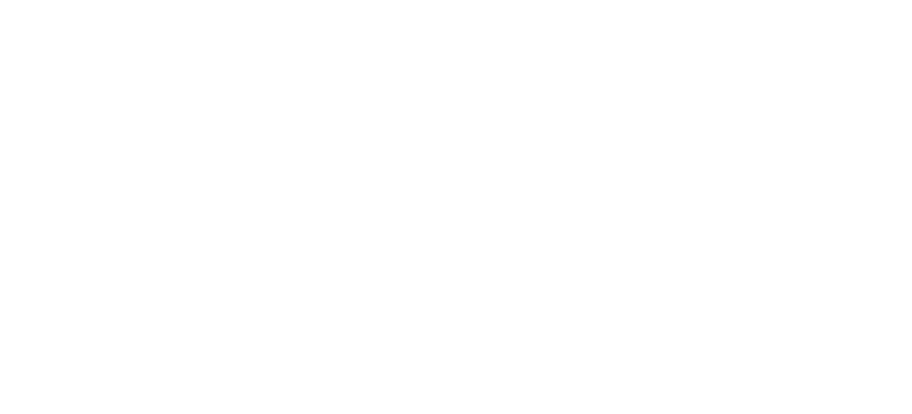

# Point and click RPG **by Gwannon**

## The role-playing game of classic adventure game

«Point and click RPG» is a small **role-playing game for a GM and up to two players** that tries to simulate the experience of classic point-and-click adventure games from the 80s and 90s, such as «Simon the Sorcerer» or «KingQuest».

These are video games where you control a character through a series of screens, solving various puzzles using objects on the screen and in your equipment, along with actions or verbs like **Use, Pick Up, Open, Push, etc.**

You also interact with different characters who provide useful information and objects to help you solve more riddles.

As you progress and solve puzzles, stories of all kinds unfold, from fantastical voyages and pulp adventures to wacky cartoon-style situations.

In these stories, you can be a pathetic pirate, a cartoon character, an avid aviator, or even a time traveler lost in the past.

To play you will need **paper, pencils and 6-sided dice (d6)**. On the last pages you have colored pixels that you can print on cardboard and use as tokens._Version 1.1_

_November 2025_## Create your PC

The first thing you need to do to start playing this role-playing game is to create a character for each player. The process is simple; you just need to make a few decisions and write them down on your character sheet.

### 1. Step - Defining Your Adventure Game

The first thing is to choose which Adventure Game (AG) your character comes from. The AG where your character was originated determines their abilities. Being a character from «The Dig» is not the same as being one from «Maniac Mansion».

When defining which AG your character come from, the first step is to give your AG a title and **choose the video resolution** in which it was developed. Your resolution determines the initial pixels of your character. Your pixel count is important because it allows you to do special things within the GA.

It also determines the size of your equipment area. With low resolution, you have a lot of space because it's mostly text lists, while with high resolution, it's mostly complex pixelated images.

* **CGA:** 320x200 and 4 colors, **4 píxels** and **10 spaces**
* **EGA:** 320×200 and 16 colors, **8 píxels** and **8 spaces**
* **VGA:** 640x480 and 256 colors, **10 píxels** and **4 spaces**

Next, choose your theme, **choosing 2 topics**:

* **Science Fiction:** Adventures with futuristic or non-futuristic science fiction themes. **+2 pixels**
* **Franchise:** Stories based on famous movies and book series. **+2 spaces**
* **Fantasy:** Magical fairytale worlds inhabited by elves, dwarves, and other magical beings. **+2 spaces**
* **Horror:** Scary and horrific stories featuring haunted houses, cursed towns, creatures frozen in ice, etc. **+1 pixel and +1 space**
* **Comedy:** Wacky, cartoon-like stories, usually with eccentric characters or anthropomorphic animals. **+2 pixels**
* **Mystery:** From Victorian detectives to modern police cases, including hard-boiled detectives. **+2 pixels**
* **Pulp:** Pulp stories with heroes and heroines searching for lost civilizations, traveling by seaplanes, and almost always fighting Nazis. **+1 pixel and +1 space**
* **Spicy:** Stories that are very close to humor, but with spicy and lustful touches. **+1 pixel and +1 space**

Finally, **choose the developer**:

* **LucasArts Games:** The developer of classic AG that everyone remembers. **+2 pixels**
* **Sierra:** The distinguished competition. **+2 spaces**
* **Alcachofa Soft:** The geniuses of wacky humor. **+1 pixel and +1 space**
* **Revolution Software:** A hidden gem that has produced some of the genre's greatest treasures. **+2 pixels**
* **Coktel studios:** The geeks who were looking for alternative approaches to a very static format. **+1 pixel and +1 space**
* **Pendulo Studios:** They've tried to bring the genre back to its former glory without much success, but without losing hope and their touch. **+2 spaces**
* **Deconstructeam!:** You're a modern indie gamer who enjoys retropixels. **+2 pixels**

The next step is to **calculate the equipment space and pixels**. Remember that if the pixels or spaces are odd, convert one pixel to a space, or vice versa.

### 2. Step - Create your interface

Every character in an AG has some basic verbs:

* Walk to
* Pick up
* Give
* Talk to
* Look
* Use

Then you must **choose 3 more verbs** from this list:

* Open/Close
* Search
* Run
* Turn on/Off
* Hit
* Read
* Pull/Push

### 3. Step - Finishing Touches

As finishing touches, you must **define your name**, something that fits your AG and its theme, and **choose your pronouns**.

Finally, you must **choose a starting piece of equipment** by rolling on the following table:

|d6|Science Fiction, Fantasy, Pulp|Mystery, Horror, Franchise|Humor, Spicy|
|---|---|---|---|
|1|Shovel|Rusty Pruning Shears|Rubber Chicken|
|2|Grog Jug|Broken Magnifying Glass|Helium Balloon|
|3|Spurs|Fake Passport|Stress Ball|
|4|Tranquilizer Dart Gun|Metronome|Mousetrap|
|5|Cardboard 3D Glasses|Carnival Mask|Ball of Twine|
|6|Flashlight|Whistle|Trumpet|
## Rules

### Scenes

**Graphic adventures are divided into parts**, and each part is **divided into scenes and screens**. A scene can consist of one or more screens and is usually associated with a main puzzle or challenge, which in turn contains other puzzles.

For example, a scene might involve finding the three missing pieces of a treasure map. One piece is lost in the library, another is in the dean's office, and the third is being sold by your office mate for $1,000. To solve the scene, you must recover each piece of the map by solving each puzzle or challenge (searching the library, sneaking into the dean's office, and getting $1,000) and then reassemble the map from the recovered pieces.

To solve the challenges in each scene, **you must move between the different screens** at the points where they connect. If you want to go to the dean's office, you'll need to enter through the university entrance, pass by her secretary's desk, and then enter her office. We'll have three interconnected screens, so you can't (for now) get from the entrance to the office without passing by the secretary.

There may be screens that are inherently challenging to enter, requiring you to solve a puzzle to gain access. For example, you might have to convince the dean's secretary that there's free frozen yogurt in the university cafeteria and, on top of that, find the office key hidden under the ficus planter.

Upon **entering a new screen**, the GM should **describe all the clickable items in the scene**. Initially, the PCs can only interact with clickable items, but as we'll see later, by spending pixels, they can interact with other, previously non-clickable items.

The GM should also provide an **indication of how this screen connects to others** that don't have a direct logical link. If you're in a bell tower, the GM can mention that the screen is above the screen for the church entrance, and the harbor lighthouse is visible in the distance. This will suggest to the PCs that they might be able to interact with the lighthouse from here, for instance, using the binoculars they stole from the museum.

### Actions and Rolls

There are different types of possible actions:

* Verb + Equipment
* Verb + Equipment + Equipment
* Verb + Clickable item in the Scene
* Verb + Equipment + Clickable item in the Scene
* Insert + Clickable item / Remove + Equipment

Actions can or cannot be performed; there is no possibility of success or failure. Therefore, normally there are no rolls.

Rolls only occur in the rare situations where an action can fail. In that case, you roll 1d6, and if you roll 4 or higher, you succeed. You can grant a +1 bonus if they have suitable equipment or if they discover something that gives them an advantage.

For example, if we want to spit in the spitting contest, we roll 1d6. If they say they spit when the wind blows or take a shoot of grog first to thicken their phlegm, you could give them a +1 bonus for each cheat applied.

When using items, equipment items are always within easy reach, but clickable items require you to approach them to use them. This means that if they're unreachable, like deer antlers above the door, you'll need a chair or a ladder first.

On the other hand, logic dictates whether equipment is consumed when used. A match is used up, but a matchbox has infinite uses.

### The Equipment

In each slot, you can place one object that shouldn't be larger than something that would fit in your pockets or a backpack. Weight doesn't matter; as long as it fits in a backpack and there are free spaces, you can put it in. It also has to make sense; you can store a torch unlit, but never lit.

If you have, for example, 6 equipment spaces, you can put in your equipment a pumpkin, a watermelon, the head of a Roman emperor sculpture, needle and thread, a trumpet, and an Arkansas Panthers pin.

Each object occupies one equipment slot, and if you try to put a large barrel of wine in your equipment, it won't fit because you don't have any free space, and it won't fit in a backpack.

> You can ignore this size rule in humorous cartoon-style games where the pockets are more spacious.

### Using Your Pixels

Pixels are what make your character feel real, allowing them to do extraordinary things, exploiting glitches and bugs in the software, reading game guides, trying everything with everything, and so on.

The possible uses of pixels are:

#### Making Background Elements Clickable

One of the most frustrating aspects of Adventure Games was seeing things on the screen that you could use but couldn't click. By exploiting bugs and spending between 1 and 4 pixels, at the GM's discretion, you can make something unclickable clickable. It will only be clickable while you're on the screen; it will become unclickable as soon as you leave the screen.
#### Read the Guide

If you spend pixels, you can read a game guide from your favorite video game magazine and receive a hint on how to solve a puzzle or fix a problem. It can also remind you of a detail you might have forgotten. Depending on the number of pixels you spend, from 1 to 4, you'll receive more or less information, and it will be more or less interesting and clear.

#### Try Everything with Everything

You can spend all your pixels (minimum 4) to try every item in your equipment with every clickable item in the scene (not the screen). In this case, you'll eventually find the next action you need to take but haven't been able to find. However, the challenge or scene might not be solved this way, and you may still need to perform other actions, but at least it will guide the players toward the right path.

#### Parallel Plot

If a player spends all their points (minimum 4), they can request a parallel plot. A message will appear on screen saying «Meanwhile in [location]…» and the current villain will be seen speaking and revealing part of their plan or their next steps. It could also be some kind of important information, such as the ingredients of a chemical formula or the name of the magic grimoire containing the spell to destroy them.
#### Force the Theme

By spending 1 pixel, players can force the theme of the adventure they are playing or the one they came from and gain a +1 bonus to a roll. For example, a character from a fantasy adventure can try to gain a +1 bonus to a roll if they have a sword duel, or in a science fiction adventure, a player can try to gain a +1 bonus to a Search roll by claiming that their tricorder's sensors are very advanced.

> You are free to create new uses for pixels that suit your graphic adventure.

#### Recovering Pixels

You recover pixels in certain situations:

* Upon completing a scene, you recover up to half of your maximum pixels.
* At the GM's discretion, if they deem it fun and fitting for their character and the story. **DON'T BE STINGY ABOUT GIVING AWAY PIXELS.**

### Special rules of Adventure Games

Adventure Games sometimes have their own logic, and all the following rules attempt to reflect that.

#### Object Permanence

The **equipment you leave** in a screen **remains in that screen**; only your characters and other important characters can pick it up.
If you build a rope bridge over a chasm, that bridge will stay there forever. But even if you want to cross it and want to retrieve your rope, you dismantle the bridge, thus recovering the rope and no longer being able to cross to the other side.

> It's important to keep track of scenes and objects and how they are arranged.

#### Accessing the Map

At some point, someone will give you a map, a passport, or something similar, allowing you to access the map and move directly to a scene without having to go through other screens.

From the map, you can move directly to the beginning of any screen you've already visited. Keep in mind that any objects used to reach a screen will no longer be needed and can be picked up.

Following the previous example of the rope bridge, you no longer need to have the bridge built to reach the screens on the other side of the chasm. You can go directly there using the map.

#### Moving Objects

Moving objects within a screen or between screens is easy; they're stored in your inventory. For larger objects, you can use Pull/Push to move them within the screen.

If you want to move heavy objects between screens, you'll need to use some kind of trick or contraption, from using fryer grease to push them downhill to a complicated pulley system or a minecart.

#### Screen Width

The group of characters cannot be separated; AGs don't have split screen, so everyone stays together. In fact, there will be things you can't access in a scene because another player is on the other side and your screen resolution isn't high enough to reach them.

#### Screen Connections

The screens in a scene have connections that your players can walk throught, and others that they can't, but which they can use to their advantage.

For example, if you climb onto a roof and knock down a tile, it can knock unconscious the guard at the door you wanted to enter. Your characters can't move from the roof to the door of the hideout, but the tile can.

#### Single Pixel

When things are hidden, they can be located in a single pixel on the screen. This means that to find it, you have to make a Search roll; a simple Look roll won't suffice.

#### Maze

There are labyrinthine areas like caves, sewers, or passageways that cause players to move in circles and eventually exit the way they came in.
In these areas, you must meet a condition to find the exit and be able to cross them. This might involve having a compass, knowing the correct order to follow, or observing the path a rat takes.

The important thing is that, without this clue, it's impossible to cross that labyrinthine area.

#### Copy Protection

Copy protections were systems that prevented players from simply making a copy of the diskette where the game was stored.

They were dynamic questions that could only be answered with a physical device, such as a coordinate card whose numbers were only visible with a red filter and which couldn't be photocopied, or circular cards with holes that had to be moved to a precise position to extract a piece of information through the holes. The truth is, they weren't very effective systems and are now seen as quite naive.

Applying this to this role-playing game, copy protection allows the GM to make any request, and if the players want to play, they must comply. If they don't, the copy protection kicks in, and the session doesn't continue until the GM's request is met.

As the GM, you can request things like:

* Only the GM can eat gummy bears, or there must always be popcorn in a bowl near the GM.
* No cell phones on the table.
* If a die falls off the table, all players must stand up, turn around, shout «Ahoy sailors», and toast the DJ.

#### Saving the Game

It's not necessary to explain what «saving the game» is; it's something many video games still do today. But we will explain how it applies to this role-playing game.

This action can only be performed **once per session** and with **all players agreeing**, and it provides several benefits.

* In case of death (as we'll see in AG creation), we will return to the save point, not to the beginning of the scene.
* Since we usually only save when we think something important is about to happen or we might die, this action restores up to half of your character's maximum pixels. If your character has a maximum of 10 pixels and only 3 remain, they receive 2 more pixels. If they have 12 and only 8 remain, they don't receive any because they are already above half their maximum.
## Non-player character

There is a special type of clickable item called non-player characters (NPCs). There are three types of NPCs:

* **Monophrase:** They only have one line and appear in only one scene.
* **Multiphrases:** They have several lines with an important clue, can appear in different scenes, and can give or receive items.
* **Main characters:** Key characters with many lines, appear in many scenes, and constantly give clues and equipment.

> These types are not fixed; a monophrase character can become a multiphrase character later in the adventure.

### Monophrase
These characters are the simplest in the Game Guides and only have one line they utter when you try to talk to them. They usually say silly things or jokes, and in a few cases, they offer a very cryptic clue. Some have a simple movement routine, like walking from one point to another or pushing a large stone block.

Recording the line they're going to say is enough. Aside from uttering their line, they're not much else to use.

Some of them, especially those with movement capabilities, can be used as clickable items to solve a challenge or puzzle. For example, you could smear grease on a monophrase character so that seagulls attack it, causing it to drop its oil barrel and make another, more important NPC slip.

#### Old lady with walker (monophrase)

Her only sentence is, «Have you thought about adding more fiber to your diet?» She moves slowly with his walker, and when you enter her screen, she's at a random point.

#### Dog with a bone (monophrase)

Him stands next to a blind beggar on the main street. His only utterance is «Grrrrr» when you approach the blind man's donations or try to take the bone from his feet. Perhaps you can distract him with a steak, a cat, or a ball.

### Multiphrases

These characters are **more complex** than the previous ones, with more dialogue, items they can give or receive, and some movement patterns.
They will likely have a task, such as providing information on a certain matter, preventing access to a specific area, or preventing the acquisition of certain items.

Rather than specific dialogue, you should choose a couple of topics they know a lot about and could discuss with the player characters, as well as the key information they can provide.

If we need to obtain something from them (information, items, or access), you should note how to do so. This could involve giving them another item, asking them a specific question, or performing a series of actions with nearby clickable objects and/or equipment.

You should also note any weaknesses the players can exploit, which they or other characters will likely mention to the players.

#### Suspicious guy in an alley (multiphrase)

You're walking down the street and suddenly from an alleyway comes a shout: «Hey, you, loser!» You ask, «Me?» and he replies, «Yeah, you, loser!». You go in and there's a suspicious-looking guy with a wide-brimmed hat that hides his face and a long trench coat that covers him to his feet.

Is he a thief about to rob you? A drug dealer, or worse, a Pokémon card dealer? A pervert? You don't know, and it's best not to approach him.

If you do approach him, he's a seller of fun-shaped helium balloons. You can talk to him about various topics: helium balloons, cryptocurrency investments, and Pokémon cards.

If you get him **a extrarare Pokémon card**, he'll give you a bunch of helium balloons that you could use to lift something heavy or fly a few meters. You can also get the balloons with something that looks like cryptocurrency, like the tokens from the laundromat.

### Main characters

They're as complex as your PC, with countless lines of dialogue, their own equipment, and the freedom to move around the screen as they please, appearing in almost every scene. They'll likely be your players' nemesis or characters with significant weight in the story.

If they're the villain, they don't usually have actions that allow you to achieve something, like pushing them to make them drop a coin. Instead, finding a way to defeat them is the challenge of an entire scene, or even a whole part.

It's common for them to start as multiphrases and then become main characters due to a change in the story. Perhaps the street urchin who gives you rumors about the criminal underworld (multiphrase) will be kidnapped by your nemesis and become a main character.
#### Vampirate captain (main character/villain)

You are facing the terror of the entire Caribbean; uttering his name fills the heart with dread. He is the perfect villain for your adventure. Besides being a pirate captain and a vampire, he wields powerful voodoo magic and owns a zombie ship with its crew of ghoul servants.

His weaknesses are typical of pirates and vampires: grog, gold, and young men and/or young ladies, and sunlight, crosses, holy water, garlic, and young men and/or young ladies. So your players will have to find a way to exploit these weaknesses against him. Perhaps another voodoo user can help them.

Furthermore, with luck, your players might be able to discover whether they is a pirate who was turned into a vampire or a vampire who decided to become a pirate.

### Interacting with NPCs

When interacting with NPCs, there are a few rules you can follow that will give the game that classic AG flavor:

* You can ask questions as many times as you like; they won't get annoyed and should always give the same answer. The answers will only change if you do something different. Even then, they shouldn't get annoyed.
* The same applies when you use objects on them. As long as you don't use the right one, nothing should change. If you give them money, they'll simply refuse it. If you throw a bucket of water at them, they'll either move away or get wet and yell at you, but they won't move from the door they're guarding. However, if you take out a mouse and give the doorman a piece of cheese, the mouse will approach, attracted by the smell of cheese, and the NPC will run away, terrified of the rodent.
* Usually, an NPC's trick stops working when you change screens or scenes. If the doorman reappears in another scene, the mouse trick will no longer work, and he'll tell you that his psychoanalyst helped him with that phobia.
* NPCs only participate in one challenge per scene; our doorman's challenge is to infiltrate the mafia's hideout. Once this challenge is completed, he won't provide equipment or clues for other challenges, but this isn't always the case.## Create a Point and Click Adventure Game

### Adventure duration

To begin creating your AG, you must decide its duration. The duration of an adventure is measured in floppy disks, and each disk represents one game session.

> End your sessions by saying something funny like, «Insert disk number 2».

#### 1 5.25" Floppy Disk

Due to the limited capacity of computers, 5.25" floppy disk adventures were short, with one scene per part and a maximum of two screens per scene. Perfect for an afternoon in front of your computer.

#### 1 3.5" Floppy Disk

Computers were now more powerful, allowing for longer storylines. These adventures were more complex and could take several sessions. Each part could have two or more scenes, and each scene could have multiple screens.

#### Several 3.5" Floppy Disks

We're now talking about many hours of gameplay, which can usually involve several AG played consecutively with the same theme and recurring characters/villains. We're talking about series like «KingQuest» or «Monkey Island».

### First Steps

Once the duration is decided, you need to proceed as when creating a character: choose their resolution, two topics, and select their developer. Resolution:

* **CGA:** The low resolution and lack of color in these adventures make it difficult to interact with on-screen elements. All possible rolls have a -1 penalty. Fortunately, players can place pixels (at the GM's discretion) to transform one object or clickable item into another, provided they are very similar. For example, they could transform a candle into a lit stick of dynamite. Also, with so few colors, forget about creating color-based puzzles.
* **EGA:** AGs in EGA have an acceptable and normal amount of color and resolution and neither add to nor detract from the adventures.
* **VGA:** The higher resolution of VGA means that more extra pixels must be used than usual, because everything has more pixels, so every pixel expenditure costs one extra pixel. The resolution also causes Find the single pixels rolls to have an extra penalty of -1.
Choose two topics:

* **Science Fiction:** Science fiction is very broad and allows for a wide variety of topics, from adventures on alien planets to time travel or cloning. When setting up the adventure, you will need to establish a technological level and specify which technologies are available and which are not. There might be clones and psychic powers, but no space travel or robots.
* **Franchise:** The adventure must feature the franchise's flagship hero or heroine, so one of your players cannot create their own character; they must be that iconic character, and you will provide them with a pre-made character.
* **Fantasy:** Fantasy, and especially medieval fantasy, is a recurring theme, always closer to classic fairy tales with trolls under bridges and princesses and princes than to the D&D/Tolkien fantasy more typical of other role-playing games. The other option is entirely different magical worlds, like in the classic «Loom». In these GAs, your characters' verbs can be considered spells and do not need to be next to the clickable item, only on the same screen.
* **Horror:** These adventures should be highly deadly, and it can be very interesting to set up some kind of timer or clock to put pressure on the players. They have a certain number of attempts to finish a scene, and if they fail, the monster will end their lives.
* **Humor:** Humorous adventures can't be deadly; it doesn't fit the tone. Dying and becoming a ghost, however, can be a funny scene.
* **Mystery:** Perhaps a Sherlock Holmes story shouldn't be deadly, but something darker certainly should be.
* **Pulp:** As they say, everything is better with a pulp , from science fiction to racy stories. If you take «Pulp» and «Franchise», like Conan, Zorro, or Indiana Jones, you can choose a third theme that better defines the adventure.
* **Spicy:** Spicy adventures always work well with humor—let's not forget «Leisure Suit Larry »—but they can also work with «pulp». Remember to discuss this option with your players.

Choose the developer:

* **LucasArts Games:** Humor is LucasArts' hallmark, what they're known for, but they've actually explored every genre. Even if you're not making a humorous adventure, you should include a joke, a funny line, and a parodic character. Importantly, in these adventures, **death doesn't exist**.
* **Sierra:** This distinguished competitor clearly wasn't going to exploit LucasArts' brand, so **humor is forbidden** at this developer. It's important that the adventure is called «WhateverQuest», think of «KingQuest», «SpaceQuest», or «PoliceQuest». Sierra's adventures **are always deadly**.
* **Alcachofa Soft:** Humor is your thing, so at least **one of the topics must be humorous**.
* **Revolution Software:** Its creators wanted to create a middle ground between LucasArts and Sierra games, with games that didn't take themselves too seriously, but with serious stories. The «Broken Sword» series was their biggest success, and this makes **mystery a very typical element** in their work.
* **Coktel Studios:** This French developer was a subsidiary of Sierra, but instead of being absorbed, it always maintained its distinct style with series like Goblins. They tried numerous variations of «point-and-click» games with varying degrees of success. Try to include some different and groundbreaking mechanic in your AGs, something that changes the interface, the use of pixels, etc.
* **Pendulo Studios:** Your screens are small mini-puzzles woven into a story. That's why there should be a higher proportion of puzzles than conversations or interactions with on-screen elements. **You only develop in VGA**, and the characters should also be in VGA, but it's not mandatory.
* **Deconstructeam!:** You're a modern developer; CGA and EGA aren't your thing. Like Pendulo, you only develop in VGA.

With this information, you should create the game synopsis, which will be written on the back of the game board box. This couple of paragraphs will be the introduction with which you should begin the game.

Once you've chosen everything above, you must decide **whether the adventure will be deadly or not**. That's one of the major differences between game boards.

#### Deadly Adventures

These adventures will feature certain situations defined as deadly. From a sword fight with a medieval knight to crossing a room filled with deadly lasers.

If the players attempt these actions, they should be able to roll to succeed. If they fail, they simply die. There are no hit points or wounds involved.

You should warn them that what they want to do is very dangerous before they roll the dice.

You should also have set up items and actions that grant bonuses to their rolls, such as putting a wrench in their boxing gloves or crossing a corridor when the skull's red eyes flicker because the mechanism that launches poison darts from the walls is reactivating.

#### Non-Deadly Adventures

In these adventures, they simply won't be able to attempt the dangerous action they want to do, and it will often mean they're missing something to solve the challenge.

Imagine there's a river of lava, and a rope has been placed across it. If they try to cross the river balancing on the rope, the character will turn around, look at the screen, and say something funny like, «Are you stupid?» or «My mother didn't raise a fool».
They'll probably be missing something, and they'll have to go back to using a mop, take off the mop head, and use it as a pole to cross the river like a tightrope walker. And don't be surprised if later you use the mop head as a wig for a disguise.

> Humorous adventures shouldn't be deadly, but it's your game, your rules.

#### You're dead…

When a **character dies**, they simply **disappear**, explode, fall down a bottomless pit, are disintegrated, etc., and **reappear once the scene is resolved** with all their equipment, but without pixels.

If all the players die, then it's more serious, and both will reappear at the beginning of the scene and have to do it again. They will have lost all the progress they made in that scene, and on top of that, they're all **without pixels**.

### Main Structure

Action Game Players (AGs), like all stories, are typically divided into three parts: introduction, rising action, and resolution. Each part is further divided into several scenes, each with its own challenges and puzzles to solve.

The scenes within each part can be sequential, occur in parallel, or even be a mix of both.

For example, a sequential scene might involve obtaining the map that reveals the location of the king's lost tomb, overcoming the tomb's traps, and finally deciphering the symbols on the king's medallion to open the portal that allows you to advance to the second part.

A parallel scene might involve simultaneously investigating three clues found at the murder scene to identify the killer.

### Scenes and Screens

Each scene will have one or more challenges and one or more screens. Creating a scene is as simple as defining what will happen in that scene and writing a couple of paragraphs describing what should happen. From there, you need to define the elements of that scene: screens, NPCs, and clickable items, and how they relate to each other.

The easiest way to record all of this is to create a diagram of the screens with their clickable items and the NPCs on them. You should also note how the screens connect, which connections can be used, and which connections are closed and need to be opened.

The adventure «The Enigma of the Monkey Peninsula» shows you how to create this diagram.

#### Challenges, Riddles, and Mini-Puzzles

By challenges, we mean a combination of actions, clickable items, and NPCs to solve a problem. We must define what we will need and how to obtain it; perhaps it's simply talking to someone specific, like the third passenger on the bus.
They can also be more complex options: take the ketchup packet from the table, give it to diner 1, who will thank you by giving you their mashed potatoes, and clog the toilet with the mashed potatoes so that the restaurant's cook has to leave the kitchen to fix it, allowing you to enter the kitchen.

When examining clickable items, they should have clues about how to use those objects, for example, with phrases like, «This mashed potato is so thick it could be cement». Talking to NPCs should also provide clues, such as, «I'm never coming back to this restaurant. The food is bland, and this is the worst mashed potato I've ever had». Perhaps placing a plunger near the cook is another clue, and when examining it, mentioning that it's very worn and has many hamburger grease stains.

To create riddles or mini-puzzles, you can draw inspiration from anything; you just need to adapt it to the AG's setting. If you want to include a sliding puzzle, it will have an Aztec image; if it's a pulp story, a 1920s theme; or circuits if it's a cyberpunk story.

You can find many riddles online, and like puzzles, simply adapting them to the setting is all it takes.

### Passage of Time

Time does not pass in AGs. If a scene takes place at night, whatever they do during the scene will always be night, even if they wait for hours in the same place, it will still be night.

Time only advances (if you want it to) at the end of each scene. You have an entire night to discover who killed the commissioner, and when you do, day breaks and you launch into a frantic race to capture his killer, who is trying to flee to Mexico.

Just as the players can force a «meanwhile» moment with pixels, the GM can force flashbacks to give the players information; some scenes can even be flashbacks where they play with their past selves.

> Using information across time isn't «metagaming». You can use what you know about the adventure whenever you want, regardless of how many time shifts occur.

### Railroad Adventures

Game-set adventures are classic examples of railroad adventures; there's only one path and one way to progress, and any other approach won't work.

However, this isn't fun in a role-playing game. But unlike a video game, as a GM, you can overcome this. Your decisions aren't fixed in the code; instead, you can modify the story and accept other options.

So, if the players propose a viable option that solves the challenges, let them use it even if it's not the solution you had in mind.
### Final Touches

Finally, if you haven't already, add a cool mechanic that sets your adventure apart from the rest. Let's look at some classic examples:

* In «Loom», they aren't verbs, they're combinations of musical notes, and if you play them backward, they do the opposite. If Do Re Mi opens things, Mi Re Do closes them.
* The «Monkey Island» games have their insult duels where you must learn sharp insults and their comebacks to defeat your enemies in sword fights.
* «The Dig» had its colored rod puzzles with different polyhedra. You had to find the right combination from different clues you saw throughout the adventure.
[ By Fatbeard91")](https://www.deviantart.com/fatbeard91/art/18-57-Rework-1230846234 "18:57 (Rework) By Fatbeard91")
## The enigma of the Ape Peninsula

_Deep in the Caribbean lies a peninsula surrounded by water on all sides, called the Ape Peninsula. Venture into its dark grottoes, dense jungles, and well-stocked gift and souvenir shops to become a true buccaneer._

_You'll have to face zombie ships, vampire pirate captains, talking shrunken heads, and plenty of apes, using your intelligence, your wit, and the powerful, sometimes explosive, magic of voodoo._

_If you're lucky enough to avoid scurvy, you might just survive this adventure and find the greatest pirate treasure ever known, Mac’n Cheese, earning the respect of the entire Caribbean._

«The enigma of the Ape Peninsula» is a graphic adventure game for EGA, released on three 3.5-inch floppy disks. Its genre is humor and fantasy, and it was developed by LucasArts Games. This chapter comprises only the first of the three disks that make up the complete campaign.

### Diskette #1: How to Be a Pirate

Your PCs have just arrived in Bucan Ville, a pirate haven, with the intention of becoming pirates and making a fortune through piracy.

This part is divided into four scenes. The first is a brief introduction. Then there are two parallel scenes: one in which the _**Pirate Lady Bosses**_ grant them the _**title of pirate**_ after they pass a test, and another in which they acquire a ship and its flag. The fourth scene is the heist of the governor's safe.

#### 1. Start

The player characters appear at nightfall in the port of Bucan Ville and shout, «My name is [player character name] and I want to be a pirate!».

##### Harbour

In this filthy, shabby harbour, there's only one place to go: the _**Boiled Crab Tavern**_, a pirate den where the grog is watered down and the snacks and peanuts were once Blackbeard's cabin boys.

In the distance, you can see a _**ship with tattered black sails**_. A ghostly glow floods its deck, and flocks of bats circle overhead.

From the port, you can access the _**Bucan Ville Town Center**_.

#### The Boiled Crab Tavern

The place is a dingy, old dive, packed with _**drunken pirates**_. The few who aren't passed out can barely manage a sentence:

* So you want to be a pirate, huh? Talk to the three _**Pirate Lady Bosses**_.
* The grog of my day was real grog, not like the stuff they make now with little umbrellas, cloves, and mint leaves. We used to put real cloves in it.
* Have you heard of [Arrr! Cthulhu](https://arrrcthulhu.com/), an excellent setting for pirate adventures in a Caribbean of the Cthulhu Mythos?
* They stole my idea for the ape-trafficlights. I could have been a millionaire and retired to a Caribbean island and spent my days drinking grog. Oops, I already do that.

At a large table in the back sit the _**3 Pirate Lady Bosses**_. The most powerful pirates of Bucan Ville, chosen by the democratic method of slaughtering all their competition.

These three rude pirates are at the table, swigging grog and singing bawdy songs. When your players explain that they want to be pirates, they'll laugh a lot and tell them to stop wasting their time and go back to what they were doing. Your players will have to prove they really want to be pirates by answering questions like these.

* What was Blackbeard's flag? - A horned skeleton holding an hourglass in its right hand and a spear in its left, using the spear to pierce a red heart that drips three drops of red blood.
* What was the name of Blackbeard's first ship? - Queen Anne's Revenge.
* What was Stede Bonnet's nickname? - Gentleman Pirate

They'll also be made to sing «Yo Ho Ho And a Bottle of Rum» (which your players will have to sing). After a while trying to prove they deserve a test, they'll agree to take the Pirate Guild's standardized exam, which consists of two tests:

* You must prove you're on the other side of the law.
* You must own your own self-propelled watercraft and create its unique, personalized pirate flag.

After explaining the standardized tests, they'll be made to sign some paperwork and given a __**discount voucher**_ for the _**Souvenir Shop**_. If they ask for any hints, they'll just be told to ask for Sam at the shipyard to see what ships they can offer.

On the table of the three _**Pirate Lady Bosses**_, there's a fruit bowl with oranges, bananas, apples, Swiss vitamin C candies, and lemons, which they say are from their anti-scurvy campaign. If they ask, they can take a _**piece of fruit**_. Choose one at random and give it to them. If they eat it, they can ask for another. Until they finish it, the _**Pirate Lady Bosses**_ will tell them to finish the other fruit they took first.

#### 2.a Going over to the other side of the law

As the _**Pirate Lady Bosses**_ have explained, to become a pirate you need to be on the other side of the law, or have proof of it.

There are several ways to commit crimes:

* The easiest way is to run the red light at the _**ape-trafficlights**_ in Bucan Ville's _**Main square**_.
* Another way is to stand to the left of the _**courthouse**_ while the _**painter**_ in the _**Main square**_ paints.
* If they attempt other types of crimes, your characters will look at the screen and say things like, «My mother didn't raise a petty thief» or «This would get me in trouble with Santa Claus».

If they seem lost at this point, emphasize the «other side of the law» or remind them of the drunken pirate at the _**Boiled Crab Tavern**_ who claimed to have invented the ape-trafficlights and ask them for a clue.

##### Bucan Ville Center

The downtown streets are deserted at night, the gas lamps are lit, and the shops are closed—all except the _**souvenir shop**_ with its large neon sign that reads «Open 24 Hours».

To cross the street that runs through the center, you have to go through a pedestrian crossing controlled by a _**ape-trafficlights**_ and watched over by a _**city guard**_ who only says, «Move along, move along!» The monkey-traffic light is operated by a monkey that changes the color of the light by moving levers. When you approach, the monkey moves the levers, and you always cross on green.

No matter how hard you try, the monkey always sets it to green. The only way to cross on red is to give the monkey a banana when the light is red, and as it eats the banana, it stays red. At that moment you can cross and the _**city guard**_ will give you a _**fine**_ and, therefore, you will be an outlaw.

##### Bucan Ville Main square

The Main square is like all plazas, a large, empty cobblestone space with a single _**withered tree**_ in the center bearing a sign that reads «Tree for Hanging Pirates - Closed for Renovations».

In the center of the plaza, a _**painter**_ is busy painting the town hall. He paints the pictures at lightning speed and leaves them in a _**pile**_ beside him. If you examine them closely, you'll see they aren't very good.

If you try to talk to him, he'll tell you he's very busy; he has to paint 1,000 identical pictures of the town hall for the fundraising campaign for the governor's reelection.

Next to the town hall is the _**courthouse**_. As you approach, you'll see that it's open from midnight to midnight, except on weekends when it's closed. If they stand to the left of the painter before he starts a new painting and wait until he finishes, they can pick up a painting where they are next to the courthouse—that is, on the other side of the law, as the _**Pirate Lady Bosses**_ requested.

On the other side of the town hall, they can access a _**dark alley**_ from which random snippets of a conversation emerge.

##### Dark alley

It's just a distraction. When they enter, the voices will fall silent and figures will vanish into the shadows. As soon as they step back out into the plaza, the voices will return.
#### 2.b Get a pirate ship and flag

The only place on the island that sells boats is the _**Shipyard**_, and the only thing your players can afford right now is a rowboat. The problem is, it's not self-propelled, so they'll have to find a way to build a sail for it.

For the sail fabric, they just need to get the _**Twister vinyl**_ from the _**Souvenir Shop**_. The mast will simply be one of the oars, and they'll have to tell their idea to Sam, the Shipyard Manager.

They might waste pixels converting non-clickable elements into clickable ones, like carpets, sheets, etc. When they take it to _**Sam**_, he'll give them some silly excuse.

If they present the title deed of the rowboat to the _**Pirate Lady Bosses**_ without a sail, they'll fail the test, shouting in unison, «It's not self-propelled!»

The flag isn't a challenge; let them use whatever they find to make their flag, and if you can, make it as ridiculous as possible. They can use the _**discount voucher**_ at the _**Souvenir Shop**_, and the clerk can give them any silly thing you can think of to use for their flag.

##### Shipyards

From the _**Main Square**_ you can access the Bucan Ville _**shipyards**_, where your players can also acquire a boat they can afford.

There they'll find _**Sam**_, a nautical geek with thick glasses and a t-shirt that says, «Kiss me, I'm a model ship builder».

_**Sam**_ lives to design and build ships… to scale (he always says this quietly), and since he hasn't been able to dedicate himself to building them, he sells them.

Despite being a main character and being able to talk about many topics, _**Sam**_ only talks about ships, ship design, the history of navigation, nautical trivia, etc. If you try to talk about something else, he steers the conversation back to ships.

If they tell him they want to buy a ship, he'll offer them what he has in stock: a luxury pirate ship, a second-hand pirate ship, and a fishing boat. When your players explain their financial situation—that is, zero doubloons—he'll take them to one side of the shipyard and show them an old _**rowboat**_ with a broken oar.

_**Sam**_ will casually mention that the _**luxury pirate ship**_ costs so many gold doubloons that they could only afford it by robbing the _**governor's safe**_, but it's truly luxurious. In fact, the wheel even has its own ebony coaster; the problem no one noticed is that when you turn it, it flips over and spills all the drinks.

After tough negotiations, _**Sam**_ will accept 200 gold doubloons to be paid with their first act of piracy and plunder. He will give them the _**title deed**_ to the _**rowboat**_ and a _**stack of papers specifying the payment method**_, which they must not lose.
To make it self-propelled, they will need something to serve as a mast and something to serve as a sail. There's a strike by sail and mast makers, and he's out of them, so your players will have to find something to replace it.

As we've already mentioned, for the sail they'll need the _**Twister vinylpad**_, and for the mast, the unbroken oar. With this, _**Sam**_ will set some candles and change the description of the _**title deed**_.

##### Souvenir Shop

Maxine the Red, the red-haired terror of the Caribbean, retired from piracy and used her earnings to open a souvenir shop selling famous pirate memorabilia in Bucan Ville. In her shop, you can find the most outlandish items from the pirate world, from a lock of Blackbeard's beard to Sir Francis Drake's mouthguard.

When someone tries to buy a clickable item, Maxine will spin some bizarre story to discourage them, such as it being infested with woodworm or belonging to a leper.

The only thing in the shop that could serve as a candle is a **Twister vinyl record** Pirate Edition with skulls, crossbones, treasure chests, and cannons instead of the colored circles.

Like most of the things in her shop, she doesn't want to part with the vinyl record because it reminds her of when she used to «play» (wink, wink, knock, knock) Twister with Anne Bonny, Jack Rackham, and Mary Read aboard the «Ranger».

The _**discount voucher**_ the _**Pirate Lady Bosses**_ gave them has a typo, and if you take _**Lulock Holmes' magnifying glass**_ (Lulock Holmes is Sherlock Holmes' Caribbean cousin and the first pirate detective in literature) you can read the fine print. Where it should say «Presenting this voucher will get you a 50% discount on pirate merchandise OR a 50% discount on board games», it actually says «Presenting this voucher will get you a 50% discount on pirate merchandise AND a 50% discount on board games».

So, they can use the discount voucher to get the _**Twister vinyl**_ decal completely free, and Maxine can't refuse because, frankly, it's the cheapest and most useless thing she has in the shop.

Ideas for other silly things that might be in the shop and that you could put up as clickable items, but that Maxine doesn't want to sell because they bring back fond memories:

* Blackbeard's red curls
* Sir Francis Drake's dental splint
* Anne Bonny action figure with a karate punch, red-light eyes, and a button that makes her say, «If you had fought like a man, you wouldn't be hanged like a dog now».
* Long John Silver's running wooden leg
* Unofficial Pirates of the Caribbean merchandise signed by the main characters' stunt doubles
* A signed and dedicated photo of Ron Gilbert saying not to buy video games over $20.

#### 3. You are already a pirate

They can submit proof of their pirate status simultaneously or separately, but until they've fulfilled both requirements and proven it, they won't be considered full-fledged pirates, and the _**Pirate Lady Bosses**_ will only call them cabin boys and/or landlubbers with mocking laughter.

After acquiring their ship and being on the wrong side of the law, the PCs can apply for their _**official Pirate Certificate**_, which identifies them as pirates, after paying the corresponding fee of one gold doubloon. You can use this as an opportunity to introduce new challenges, such as searching for loose change under the tavern's jukebox.

#### 4. Stealing the governor's safe

Throughout the previous scenes, your players will have heard about the governor, his safe, and the vast amounts of money he keeps inside. Since they can't attack comercial ships with their rowboat, they'll have to find a way to rob the governor so they can buy a real pirate ship.

When they leave the Boiled Crab Tavern, you can tell them that they can access the governor's house from the harbor. In fact, there's now a giant neon sign at the harbor that reads, «Visit Governor Marlon's Museum, where the magic of democracy happens».

##### Exterior of the governor's house

Governor Marlon's house is a Victorian home perched on a cliff overlooking the Caribbean Sea. It's luxurious and well-maintained; surely the upkeep and luxuries, like the _**equestrian statue of Governor Marlon**_, are paid for with the taxes of all the residents of Bucan Ville.

Examining his statue, Governor Marlon is a fine example of a human being: long hair, a chiseled chin with a divine dimple, broad shoulders, a torso sculpted in stone, and powerful arms and legs.

The exterior is guarded by _**peacocks**_ that squawk loudly as soon as they see you. Then a light from the second floor comes on, and Governor Marlon appears at the window to keep watch, armed with a black powder rifle. When he sees nothing suspicious, he goes back inside.

If you hide behind the _**equestrian statue**_ and hit them when they're not looking in your direction, you can take a _**feather**_ from them. When you have three feathers, you can make yourself a _**peacock feathers headdress**_ and the peacocks consider you one of their own and let you pass without notifying the governor.

##### Main hall of the governor's house

Upon entering the governor's house, you enter the main hall. It is large and luxurious, filled with works of art, expensive vases, ivory figures, and so on. The _**hall**_ is dimly lit by a few _**candles in a large chandelier**_.
If you try to pull or push the _**pulleys that raise and lower the chandelier**_, they will creak, and you will see lights from the upper floor and hear the sounds of Governor Marlon loading his rifle. This makes it impossible to lower the chandelier while it's making noise; you need some kind of lubricant.

Let them search the screens for something non-clickable that can serve as a lubricant, such as the grog the _**Pirate Lady Bosses**_ drink, the turpentine the _**painter**_ in the _**Main Square**_ uses, etc., and make it clickable with their pixels.

##### Cellar hall of the governor's house

It's dark in the cellar, and all that's visible is the large _**safe door**_, covered in locks, combination dials, and gears. It looks incredibly complex—so complex, in fact, that Governor Marlon has hidden a note on a specific pixel of the screen with instructions on how to open it.

There's very little light in the cellar, and they'll only be able to find the exact pixel if they can get some light. The only light source will be the _**candles in the chandelier**_ in the _**main hall**_. If they try to bring in a light source from elsewhere (making something clickable), make it difficult for them, because they will be electric or gas-powered.

#### 5. The end?

When they finally manage to break into the governor's safe and are swimming in gold and jewels, they'll hear a loud cannon blast, and suddenly a cannonball will shatter one of the walls.

While they recover from the explosion, they'll see the fearsome vampire captain DraChuckla enter through the hole with his ghoul henchmen to seize their loot while laughing at them.

He'll approach the player characters, pluck a hair from each of them, and stick them to voodoo dolls, saying, «Just in case you become a problem», and then they'll fall unconscious.

When they manage to get up, they'll see through the hole in the wall that the black-sailed ship that was in the distance from the port is sailing away with DraChuckla on board and Governor Marlon tied and gagged.

### Diskettes #2 and #3

Here are some ideas for how you can continue this adventure, which could span disk 2 (the plot's climax) and disk 3 (the final resolution).

* You could try to rescue the governor from DraChuckla's clutches.
* You could try to find the Mac’n Cheese, the greatest pirate treasure ever known. DraChuckla is rumored to be after it, so you must be careful.
* You could try to learn voodoo magic to see if you can counteract what DraChuckla does with his dolls.
* Perhaps you could form a band and dedicate yourselves to playing reggae throughout the Caribbean.## Adventure summary

### Shipyard

* **NPC:** Sam
* **Clickable items:** Luxury pirate ship, Second-hand pirate ship, Fishing boat, Rowboat, Title deed of rowboat, Stack of papers specifying the payment method
* **Connections:** Bucan Ville Main Square

### Bucan Ville

#### Dark alley

* **Connections:** Bucan Ville Main Square

#### Bucan Ville Center

* **NPC:** Town guard
* **Clickable items:** Ape-trafficlights
* **Connections:** Bucan Ville Main Square, Harbour, Souvenirs shop

#### Souvenirs shop

* **NPC:** Red Maxine
* **Clickable items:** Twister vinyl pad, Stupid objects to use as a flag like Blackbeard's long underwear, Lulock Holmes' magnifying glass
* **Connections:** Bucan Ville Center

#### Bucan Ville Main Square

* **NPC:** Painter
* **Clickable items:** Courthouse, Pile of pictures
* **Connections:** Bucan Ville Center, Dark alley

### Governor's house

#### Exterior

* **NPC:** Peacocks
* **Clickable items:** Equestrian statue of Governor Marlon, Peacock Feather, Peacock feathers headdress
* **Connections:** Harbour, Governor's house (Main Hall)

#### Main Hall

* **Clickable items:** Chandelier candles, Pulley that raises and lowers the chandelier
* **Connections:** Governor's house (Exterior), Governor's house (Cellar)

#### Cellar

* **Clickable items:** Safe, Note with the safe combination (single pixel)
* **Connections:** Governor's house (Main Hall)

### Docks

#### Harbour

* **Clickable items:** Ship with black sails
* **Connections:** Boiled Crab Tavern, Bucan Ville Center
#### Boiled Crab Tavern

* **NPC:** Drunken pirates, Pirate Lady Bosses
* **Clickable items:** Fruit bowl, Random piece of fruit, Souvenir Shop discount voucher
* **Connections:** Harbour

### Screens map

## License and acknowledgments

### License CC BY 4.0

«Point and click RPG»is a role-playing game developed by [@gwannon](https://gwannon.com) and licensed under [CC BY 4.0](https://creativecommons.org/licenses/by/4.0/legalcode.es). You may use all of this content as you wish, even commercially, except for images and fonts, which belong to their creators and are properly attributed. To use this material, you only need to attribute it appropriately.

All the content for this project can be found at [pointnclick.gwannon.com](https://pointnclick.gwannon.com/), and all the source code is available on [GitHub](https://github.com/gwannon/ideasRoleras/tree/main/Point-n-click).

### Atributions

#### Fonts

* Fool by [Void](https://arcade.itch.io/fool)

#### Images

* Black and white pixels background by [starline](https://www.freepik.com/free-vector/black-white-pixels-background_13124439.htm)
* Abstract pixilated halftone dotted pattern in retro style by [starline](https://www.freepik.com/free-vector/abstract-pixilated-halftone-dotted-pattern-retro-style_418611157.htm)
* Pixel art mystical background [pikisuperstar](https://www.freepik.com/free-vector/pixel-art-mystical-background_29019077.htm)
* Set of pixelated teenagers by [Freepik](https://www.freepik.com/free-vector/set-pixelated-teenagers_943286.htm)
* Pixel robots icons. 8 bit bots isolated. Set of robots in pixel style, illustration color robot … by [macrovector](https://www.freepik.com/free-vector/pixel-robots-icons-8-bit-bots-isolated-set-robots-pixel-style-illustration-color-robot_13031467.htm)
* Pixel dalmatian dogs with toy bones image by [Chibitheo](https://www.dreamstime.com/pixel-dalmatian-dogs-toy-bones-image-vector-illustration-pixel-art-pixel-dalmatian-dogs-toy-bones-image-vector-image222013779)
* Angry Old Lady by [pngaaa.com](https://www.pngaaa.com/detail/674344)
* Flat design pixel art character element collection by [freepik](https://www.freepik.com/free-vector/flat-design-pixel-art-character-element-collection_33111981.htm)
* Shadowy Alley Show the detective silhouetted by [Fedor Lunin](https://www.vecteezy.com/vector-art/53228943-shadowy-alley-show-the-detective-silhouetted-against-a-dimly-lit-alley-trench-coat-billowing-as-he-peers-around-a-corner-a-street-lamp-illuminating-the-scene)
* Odyssey By [Fatbeard91](https://www.deviantart.com/fatbeard91/art/Odyssey-957622950)
* 18:57 (Rework) By [Fatbeard91](https://www.deviantart.com/fatbeard91/art/18-57-Rework-1230846234)

### Acknowledgments

For their ideas and contributions to:

* [El Dado Inquieto](https://mastorol.es/@eldadoinquieto)
* [Antonio Buch](https://bsky.app/profile/buchplays.bsky.social)
* [Working Class Berserker](https://mastorol.es/@rasczerker)
* [Angeles](https://mastorol.es/@angeles)
* [Microblog Castellano](https://mastorol.es/@microblogc@neopaquita.es)
* [Dani Moondark](https://mastorol.es/@danimoondark)
