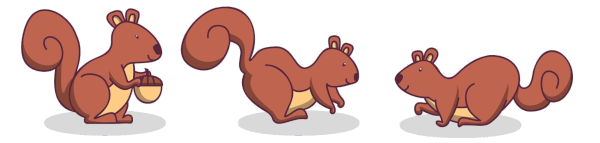
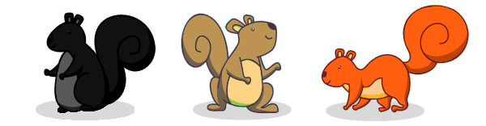

# p**A**rdillas [por Gwannon](https://gwannon.com/)

«pArdillas» es un **juego de rol de una hoja** donde serás una alocada ardilla que vive en un parque de una gran ciudad. Tus aventuras consistirán en conseguir comida de les paseantes del parque y evitar los peligros como perros, gatos o el fuego.

## El parque de tus pArdillas

En este juego interpretarás a una pArdilla (personaje Ardilla) que vive en un inmenso parque de una gran ciudad. El parque es inmenso, con caminos, praderas, jardines, lagos con botes, fuentes, invernaderos, puestos de comida ambulantes, campos de deporte, etc.

Las aventuras que se vivirán allí estarán casi siempre basadas en conseguir comida, muchas veces robándola a les paseantes (las personas que vagan por el parque). Otras veces a escapar de peligros como gatos domésticos o perros o incluso evitar incendios. Por último, podrían tener que enfrentarse a las cosas raras y locas que a veces hacen la gente que visita el parque. 

> Si quieres ambientar bien tu partida, puedes buscar algún mapa de un parque famoso como el Retiro de Madrid, el parque Güell de Barcelona, Central Park de Nueva York o Hyde Park en Londres y usarlo en tus aventuras. 

## Sistema de juego

Cuando se diga «cacahuete», se hace referencia a una vaina de cacahuete y cuando se habla de «semillas», se refiere a cada semilla que hay dentro de cada cacahuete.

Para jugar a pArdillas solo necesitas **lápiz, papel y una bolsa de cacahuetes**.

### Tiradas

Cuando empiece la partida, debéis meter en un cuenco profundo o algún tipo de saco un buen puñado de cacahuetes (15 o 20 cacahuetes). Cada vez que haya que hacer una tirada, le jugadore/directore deberá coger un cacahuete al azar y abrirlo. El número de semillas que haya dentro dictará el valor de la tirada.

|Semillas|Resultado|
|---|---|
|1|**Fallo:** Lo que intentabas hacer falla y ese fallo tiene consecuencias.|
|2|**Éxito con consecuencia:** Lo que intentabas hacer tiene éxito, pero tiene consecuencias.|
|3|**Éxito sin consecuencias:** Lo que intentabas hacer tiene éxito.|
|4 o más|**Éxito crítico:** Lo que intentabas hacer tiene éxito excepcional y deberías obtener alguna ventaja. Si consigues 5 semillas puedes guardar 1 y sigue siendo un crítico.|

\sc

Les jugadores pueden modificar cualquiera de sus tiradas, si se meten las semillas que no necesitan en el papo como las ardillas y lo sacan cuando les convenga. Esto no está permitido a le directore.

Si entre las semillas hay alguna pocha, es siempre una pifia. Puedes evitar la pifia comiéndotela junto a todas las semillas que tengas en los papos o abazones. Recuerda que las ardillas hacen estas cosas. Una **pifia supone que todo lo que pudiera ir mal irá mal**, así que sé creativo con lo que le pasa a la desgraciada pArdilla.

Cuando se acaben los cacahuetes del cuenco se mete un nuevo puñado. Claramente, se pueden hacer trampas tratando de coger los cacahuetes más grandes, pero recuerda que a medida que avance la partida solo quedarán cacahuetes más pequeños y por extensión con menos semillas. 

> Las semillas que sobren de las tiradas y no estén chupadas podéis dejarlas en otro cuenco para que se las coma le directore de juego. 

### Consecuencias, miedo y daño

Cuando una pArdilla recibe una consecuencia, esta puede tener varias formas, desde perder algo importante o que la detecten depredadores hasta recibir daño o ser asustado. Las consecuencias deben tener lógica dentro de la acción que se ha intentado. 

Las ardillas son criaturas asustadizas y frágiles, así que cuando le directore decida que **las consecuencias que reciben es que se asustan o que sufran daño**, salen corriendo y se ocultan en su madriguera hasta pasada una escena completa. Durante esa **escena perdida** se tranquilizarán o se curarán de sus heridas y estarán preparadas para la siguiente escena.

Es decir, si un gato casero, asusta a tu pArdilla, no podrás actuar en la siguiente escena donde tratan de robar las llaves del puesto de snacks del parque, pero volverá para la siguiente escena cuando intenten usar la llave para birlar las nueces pecanas del puesto.

> Mientras tu pArdilla descansa en su madriguera se come todas las semillas que tenga en el papo. Así que tendrá sus abazones cuando empiece en la siguiente escena.

### Chasquidos, silbidos y chillidos

Tu mesa no puede hablar normalmente cuando interpreten a sus pArdillas y hablen entre ellas, **solo podrán chasquear la lengua, silbar y emitir pequeños chillidos**. Pero si podrán hablar normal cuando se dirijan a le directore y le expliquen qué quieren hacer.

El lenguaje de las ardillas es muy sencillo. Aquí tienes sus bases principales.

* **1 chasquido:** Sí
* **2 chasquidos:** No
* **1 chillido:** Peligro
* **2 chillidos:** Comida
* **1 silbido:** ¿Estudias o trabajas?
* **2 silbidos:** Voulez-vous coucher avec moi (ce soir) ?
* **1 chasquido + 1 chillido:** Subir al árbol
* **1 chillido + 1 silbido:** Bajar del árbol
* **1 silbido + 1 chasquido:** No te muevas

Si mientras chasquean, silban o chillan pierden semillas de tus abazones, perdidos están.

Podrán **hacer mímica para comunicar ideas más complejas** como hacen las ardillas de dibujos animados. Tienes como dos o tres intentos para hacerte entender y si no lo has conseguido, deberás parar tu mímica y dejar hablar a tus compañeras.

\sp

## Creando tu pArdilla

A la hora de crear tu pArdilla, debes elegir simplemente el color del pelaje del cuerpo (cabeza y espalda), de las orejas, de la tripa y de la cola. Solo se puede repetir un color una vez. Esto te dará una serie de ventajas en juego.

|&nbsp;|Blanco|Negro|Rojo|Gris|
|---|---|---|---|---|
|**Cuerpo:** Puedes devolver un cacahuete que acabas de coger antes de abrirlo al …|esquivar depredadores|moverte sin ser visto.|tratar de entender lo que hacen les paseantes.|saltar y trepar|
|**Orejas:** Puedes conseguir un éxito sin consecuencias sin coger un cacahuete al …|seducir a otros roedores.|mentir a otros roedores.|escuchar.| negociar con otros roedores.|
|**Tripa:** Si te tragas todos los cacahuetes de tus abazones (mínimo uno), hasta el final de la escena puedes …|hablar normal al resto de tu mesa.|entender los símbolos que ponen les paseantes en el parque.|comunicarte con no roedores.|usar algún artilugio sencillo de les paseantes que hayas visto usar.|
|**Cola:** Si consigues una tirada exitosa, …|les paseantes no pueden apartar la vista de ti de lo adorable que eres.|los depredadores creen que eres una especie de mofeta raquítica y huyen.|puedes nadar grandes distancias e incluso sumergirte para recuperar objetos bajo el agua.|puedes acercarte al fuego, incluso coger algún rescoldo o atravesar una llama.|

> No puede haber nunca dos pArdillas con la misma combinación de colores y partes del cuerpo.

## Peligros del parque

Estos son algunos de los desafíos que puedes encontrar en el parque.

### Cuervos

Estas negras aves son realmente sabias, sobre todo cuantas más se reúnen. Saben hablar con todo tipo de criaturas.

> Siempre piden algo a cambio por sus servicios, comida, cosas brillantes, etc.

### Fuego y electricidad

Las pArdillas no se acercan a estos peligros. Hablamos desde barbacoas a espectáculos de tragafuegos y cables tirados por el viento.

> Siempre que se enfrenten al fuego y/o la electricidad, las consecuencias serán que recibirán daño o serán asustadas.

### Gatos

Cazadores letales y nocturnos, pero pierden el interés rápido.

> Siempre que se enfrenten a gatos, las consecuencias serán que recibirán daño o serán asustadas.

### Otros roedores

Hablamos de ratas, ratones, hámster e incluso conejos.

> Considéralos como ardillas que no se suben a los árboles.

### Paseantes

Estas gigantescas criaturas se mueven erráticamente por el parque haciendo sus cosas raras. No trates de comprender lo que hacen, no tiene mucho sentido.

> Las consecuencias de tratar con paseantes no tienen por qué tener ninguna lógica.

### Perros

Estos cazadores diurnos con excelente olfato se vuelven locos por las ardillas y casi siempre van atados a une paseante.

> Si están sueltos, no dejarán de perseguir a la pArdilla que detecten.

## Semillas de aventuras

Este listado de semillas de aventuras pueden servirte como base para tus aventuras.

* No sabéis por qué, pero, desde que pusieron unas placas metálicas en el parque, les paseantes os dan menos comida. Quizás el consejo de cuervos de la gran pradera de pícnics sepan qué pasa.
* Una prima del bosque ha venido para pasar unos días, pero no está preparada para la vida en el parque y no deja de meterse en problemas.
* Hay un montón de paseantes con ropas raras, peleándose por unas nueces blancas gigantes (una pachanga dominguera del deporte que quieras). Si tus pArdillas roban una de esas nueces, tendrán comida durante semanas.

## Licencia

pArdillas está hecho bajo licencia [CC BY 4.0](https://creativecommons.org/licenses/by/4.0/legalcode.es). Se han usado imágenes y fuentes libres de derecho y pasamos a atribuirlas.

* Set of cute squirrels with various pose and emotion cartoon vector by [johnstocker](https://www.freepik.com/free-vector/set-cute-squirrels-with-various-pose-emotion-cartoon-vector_33905925.htm)
* City park with wooden picnic table and firework display at night. Vector cartoon illustration of holiday celebration with summer landscape of public garden, town buildings and firecrackers by [upklyak](https://www.freepik.com/free-vector/city-park-with-wooden-picnic-table-firework-display-night-vector-cartoon-illustration-holiday-celebration-with-summer-landscape-public-garden-town-buildings-firecrackers_23356526.htm)
* Peanut icon by [Freepik](https://www.freepik.com/icon/peanut_1412557)
* Top view artificial grass soccer field background texture by [jcomp](https://www.freepik.com/free-photo/top-view-artificial-grass-soccer-field-background-texture_7810030.htm)
* Set of seamless border old gray rock and grass by [valadzionak_volha](https://www.freepik.com/free-vector/set-seamless-border-old-gray-rock-grass_15754394.htm)
* Realistic bushes green hedges set isolated on white background vector illustration by [macrovector](https://www.freepik.com/free-vector/realistic-bushes-green-hedges-set-isolated-white-background-vector-illustration_58574804.htm)
* Fuente Logger por [Typographer Mediengestaltung](https://www.1001fonts.com/logger-font.html)

> **AVISO DE SEGURIDAD.** Antes de proponer jugar a este JdR, asegúrate de que no haya alérgicos a los cacahuetes entre las personas de tu mesa.